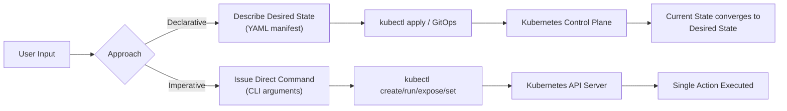

# Declarative vs Imperative - In-Depth Mechanics

## Core Definitions

| Approach | Philosophy | Tool | Primary File |
| :--- | :--- | :--- | :--- |
| **Declarative** | Describe the desired end state; K8s figures out how to get there. | `kubectl apply`, GitOps (ArgoCD, Flux) | YAML/JSON manifest |
| **Imperative** | Issue direct commands to K8s to perform specific actions. | `kubectl create`, `kubectl run`, `kubectl expose`, `kubectl set` | CLI flags/arguments |

## Conceptual Comparison



## Concrete Examples

### Declarative Approach

```bash
# 1. Write desired state to a file
cat <<'EOF' > deployment.yaml
apiVersion: apps/v1
kind: Deployment
metadata:
  name: nginx
  labels:
    app: nginx
spec:
  replicas: 3
  selector:
    matchLabels:
      app: nginx
  template:
    metadata:
      labels:
        app: nginx
    spec:
      containers:
      - name: nginx
        image: nginx:1.25
        ports:
        - containerPort: 80
        resources:
          requests:
            cpu: "100m"
            memory: "128Mi"
          limits:
            cpu: "500m"
            memory: "256Mi"
EOF

# 2. Apply the manifest - K8s figures out how to achieve 3 replicas
kubectl apply -f deployment.yaml

# 3. Git commits the manifest for audit trail and GitOps
git add deployment.yaml && git commit -m "Add nginx deployment with 3 replicas"
```

### Imperative Approach

```bash
# 1. Create directly via CLI flags - no manifest file
kubectl create deployment nginx --image=nginx:1.25 --replicas=3

# 2. Expose via CLI
kubectl expose deployment nginx --port=80 --type=ClusterIP

# 3. Update image directly
kubectl set image deployment/nginx nginx=nginx:1.26

# 4. Scale directly
kubectl scale deployment nginx --replicas=5
```

## How They Differ in Practice

| Scenario | Declarative Result | Imperative Result |
| :--- | :--- | :--- |
| Re-run the same command | No change, K8s reports "unchanged" | Fails with "already exists" error |
| Audit trail | Manifest in Git, full history | CLI history only, no centralized record |
| Drift detection | `kubectl diff` compares manifest vs live | No built-in mechanism |
| Reproducibility | Re-apply same manifest anywhere | Must remember exact CLI flags |
| Complex changes | Update manifest, apply once | Chain multiple CLI commands |
| State tracking | `last-applied-configuration` annotation | No server-side state tracking |

## Best Practices

1. **Prefer declarative for production** - manifests belong in Git, enabling code review, audit trails, and GitOps workflows.
2. **Use imperative for debugging and ad-hoc tasks** - quick experiments, temporary pods (`kubectl run`), or one-off debugging.
3. **Never mix approaches on the same object** - applying a manifest after imperative changes can revert manual edits if `kubectl apply` uses last-applied-configuration for conflict resolution.
4. **Version control all manifests** - even if you use `kubectl apply`, store the YAML in Git.
5. **Use `kubectl create --save-config`** when you must use imperative but want server-side apply tracking: this saves the initial config as an annotation so subsequent `apply` operations can diff properly.

## Common Pitfalls

### Pitfall 1: Imperative commands leave no trace

```bash
# This creates a deployment with no record of intent
kubectl create deployment nginx --image=nginx:1.25 --replicas=3

# Six months later, nobody knows why replicas=3 was chosen
# No PR, no design doc, no Git history
```

### Pitfall 2: Mixing declarative and imperative on the same object

```bash
# Imperative change
kubectl set env deployment/nginx ENV=prod

# Later, declarative apply without env in manifest
kubectl apply -f deployment.yaml

# The env var may persist or be removed depending on field management
# This is unpredictable and dangerous in production
```

### Pitfall 3: `kubectl create --dry-run=client` is not the same as declarative

```bash
# This only validates locally, it does not store anything server-side
kubectl create deployment nginx --image=nginx --dry-run=client -o yaml

# Compare to declarative which tracks fields via annotations
kubectl apply --dry-run=server -f deployment.yaml
```

## Community Knowledge

- **CNCF surveys** consistently show declarative (GitOps) as the dominant pattern for production clusters.
- **Kubernetes Enhancement Proposals (KEPs)**: Server-side apply (KEP 2875) was introduced to solve field ownership conflicts in collaborative environments.
- **Google SRE book** emphasizes that declarative configuration enables automation, which is essential for managing large fleets.
- **ArgoCD and Flux** have become the de facto GitOps tools because they continuously reconcile cluster state with Git, making declarative management scalable.
