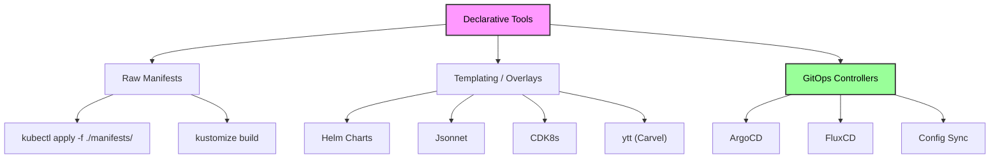
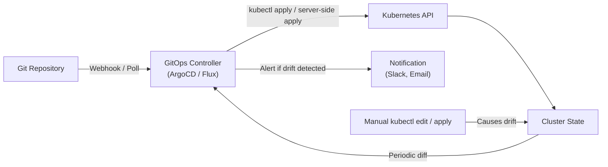

# Declarative vs Imperative - In-Depth Mechanics

## Declarative Tools Beyond `kubectl apply`

The Kubernetes ecosystem offers multiple tools for managing declarative state, each with distinct trade-offs. Understanding when to use which tool is critical for maintainable operations.

## Tool Landscape



## Detailed Tool Breakdown

### 1. `kubectl apply` (Raw Manifests)

The simplest declarative tool. You write YAML/JSON and apply it directly.

```bash
# Apply a single file
kubectl apply -f deployment.yaml

# Apply an entire directory
kubectl apply -f ./manifests/

# Prune resources that exist in the cluster but not in the manifest directory
kubectl apply -f ./manifests/ --prune
```

**When to use**: Small clusters, learning, CI/CD pipelines that deploy directly from manifests.

**Limitations**:
- No templating (environment variables, version placeholders require manual editing or `envsubst`)
- No dependency management between manifests
- No built-in rollback mechanism (unless you use `kubectl rollout undo` per resource)

### 2. Kustomize

Built into `kubectl` (v1.14+). Allows overlays without templating.

```bash
# Base configuration
cat <<'EOF' > base/deployment.yaml
apiVersion: apps/v1
kind: Deployment
metadata:
  name: myapp
spec:
  replicas: 1
  template:
    spec:
      containers:
      - name: app
        image: myapp:latest
EOF

# Overlay for production
cat <<'EOF' > overlays/production/kustomization.yaml
resources:
- ../../base

replicas:
- name: myapp
  count: 5

images:
- name: myapp:latest
  newName: myapp
  newTag: v1.2.3

patchesStrategicMerge:
- env-prod.yaml
EOF

# Build and apply
kubectl apply -k overlays/production/
```

**When to use**: You want environment-specific variations (dev/staging/prod) without full templating. Great for GitOps workflows.

**Community knowledge**: Kustomize is preferred by teams that want to keep manifests as pure Kubernetes API objects without introducing a templating language.

### 3. Helm

The Kubernetes package manager. Uses Go templates with values overlays.

```bash
# Add a repo
helm repo add bitnami https://charts.bitnami.com/bitnami

# Install with custom values
helm install my-nginx bitnami/nginx --set replicaCount=3 --set service.type=NodePort

# Upgrade
helm upgrade my-nginx bitnami/nginx --set replicaCount=5

# Rollback
helm rollback my-nginx 1
```

**When to use**: Complex applications with many configurable parameters, or when you need a standard packaging format.

**Limitations**:
- Template logic can become complex and hard to debug
- Two-way merge conflicts are common when upgrading
- Not pure YAML (harder to validate with standard K8s tools)

**Community knowledge**: The Helm community recommends keeping charts simple. Over-engineering templates leads to "chart hell" where debugging production issues requires understanding the templating layer. Use `helm template` to preview rendered manifests before applying.

### 4. GitOps Controllers (ArgoCD, FluxCD)

These continuously reconcile cluster state with a Git repository.



**ArgoCD example**:

```yaml
# Application manifest
apiVersion: argoproj.io/v1alpha1
kind: Application
metadata:
  name: myapp
  namespace: argocd
spec:
  project: default
  source:
    repoURL: https://github.com/org/k8s-manifests.git
    targetRevision: HEAD
    path: overlays/production
  destination:
    server: https://kubernetes.default.svc
    namespace: production
  syncPolicy:
    automated:
      prune: true
      selfHeal: true
```

**FluxCD example**:

```bash
# Bootstrap Flux with GitHub
flux bootstrap github \
  --owner=org \
  --repository=k8s-manifests \
  --branch=main \
  --path=./clusters/production \
  --personal
```

**When to use**: Multi-cluster environments, strict compliance requirements, teams that need automated drift correction.

**Community knowledge**:
- ArgoCD is widely adopted for its UI and RBAC model.
- FluxCD is preferred for GitOps Toolkit architecture and tighter integration with Helm/ Kustomize.
- Both support progressive delivery (ArgoCD Rollouts, Flagger) for canary and blue-green deployments.

## Comparison Matrix

| Feature | kubectl apply | Kustomize | Helm | ArgoCD/Flux |
| :--- | :--- | :--- | :--- | :--- |
| **Templating** | No | No | Yes (Go templates) | Via underlying tool |
| **Overlays/Environments** | Manual | Native | Values files | Native |
| **Versioning** | Git only | Git only | Helm releases | Git + controller |
| **Drift Detection** | `kubectl diff` | `kubectl diff` | `helm diff` plugin | Built-in, continuous |
| **Auto-remediation** | No | No | No | Yes (`selfHeal`) |
| **Multi-cluster** | Manual | Manual | Manual | Native |
| **Learning Curve** | Low | Medium | Medium-High | High |
| **Package Registry** | No | No | Helm Hub/OCI | OCI support in both |

## Best Practices

1. **Standardize on one tool per team** - mixing Helm and Kustomize in the same repo creates confusion.
2. **Use GitOps for production** - even if you use Helm or Kustomize locally, GitOps controllers provide continuous reconciliation and audit trails.
3. **Validate renders before apply** - always run `helm template` or `kustomize build` in CI to catch syntax errors before they reach the cluster.
4. **Lock dependency versions** - use `helm dependency lock` or pin base images in Kustomize overlays.
5. **Separate base from overlay** - keep environment-agnostic config in base, environment-specific in overlays.

## Common Pitfalls

### Pitfall 1: Helm template complexity

```yaml
# Bad: deeply nested template logic
{{- if and .Values.global.enabled (eq .Values.env "prod") (not (empty .Values.secrets)) }}
{{- range $key, $value := .Values.secrets }}
apiVersion: v1
kind: Secret
metadata:
  name: {{ $key }}
type: Opaque
data:
  {{- range $k, $v := $value }}
  {{ $k }}: {{ $v | b64enc }}
  {{- end }}
{{- end }}
{{- end }}

# Good: keep templates simple, use `helm template` output for inspection
```

### Pitfall 2: Kustomize without bases

```bash
# Bad: overlay depends on base that was modified
git checkout base/
kubectl apply -k overlays/production/  # Works locally
# In CI, base was changed -> production gets unintended changes
```

### Pitfall 3: Ignoring Helm release history

```bash
# Bad: delete and recreate instead of rollback
helm uninstall my-nginx
helm install my-nginx bitnami/nginx --set ...

# Good: use Helm's built-in revision history
helm rollback my-nginx 2
```

### Pitfall 4: GitOps without sync policy

```yaml
# Bad: manual sync only
# If someone manually changes cluster state, drift is permanent until manual intervention
# Good: enable selfHeal
syncPolicy:
  automated:
    prune: true
    selfHeal: true
```

## Community Knowledge

- **CNCF Landscape** lists over 30 GitOps tools, but ArgoCD and Flux dominate production usage (2024 CNCF survey).
- **OpenGitOps** (founded by Weaveworks, Codefresh, and others) defines five core principles: declarative, versioned, automatically pulled, continuously reconciled, and immutable.
- **Helm Security**: Always run `helm template` through a linter (e.g., `helm lint`, `kubeval`, `kube-linter`) before installation. Never install untrusted charts without review.
- **OCI support**: Helm 3.8+ and Flux 0.15+ support OCI registries for chart distribution, replacing the traditional Helm repository model.
