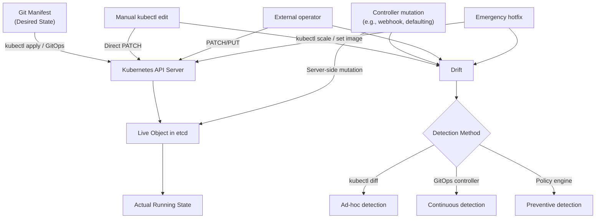
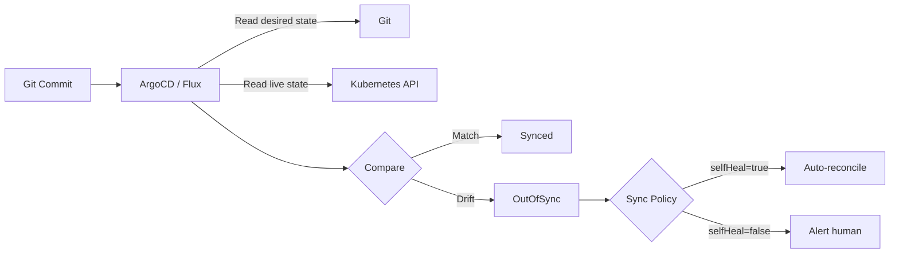

# Declarative vs Imperative - In-Depth Mechanics

## Drift Detection

Configuration drift occurs when the live state of a Kubernetes object diverges from its declared intent. Detecting and remediating drift is essential for reliable operations, especially in GitOps environments.

## How Drift Occurs



## Detection Methods

### 1. `kubectl diff` (Server-Side Dry-Run)

```bash
# Compare local manifest against live cluster object
kubectl diff -f deployment.yaml

# Diff specific namespace
kubectl diff -f deployment.yaml -n production

# Diff with server-side apply field management
kubectl diff -f deployment.yaml --field-manager=my-manager
```

**What it does**: Sends the manifest to the API server with `dryRun=All`. The server performs the same three-way merge as `apply`, but returns the result instead of persisting it.

**Output**: Unified diff showing additions (`+`) and removals (`-`). Zero output means no drift.

**Limitations**:
- Requires local manifests to compare against
- Only detects drift for objects you have manifests for
- Does not detect drift caused by other managers (unless using server-side apply with multiple field managers)

### 2. GitOps Controllers (Continuous Reconciliation)



```bash
# ArgoCD: check application sync status
argocd app get myapp

# Output includes:
# Sync Status: OutOfSync
# Differences:
#   Deployment/nginx: nginx:1.25 -> nginx:1.26

# Flux: check reconciliation status
flux get all -n production
```

**Advantages**:
- Continuous detection (polling or webhook-based)
- Automatic remediation with `selfHeal`
- Centralized view across multiple clusters
- Audit trail in Git

### 3. Policy Engines (Preventive)

Tools like OPA/Gatekeeper or Kyverno can prevent unauthorized changes before they reach the cluster.

```yaml
# Gatekeeper constraint: prevent image tag changes outside GitOps
apiVersion: constraints.gatekeeper.sh/v1beta1
kind: K8sRequiredLabels
metadata:
  name: require-gitops-label
spec:
  match:
    kinds:
      - apiGroups: ["apps"]
        kinds: ["Deployment"]
  parameters:
    message: "Deployments must have app-version-release label set by GitOps"
    labels: ["app-version-release"]
```

```bash
# Kyverno policy: block manual image updates
apiVersion: kyverno.io/v1
kind: Policy
metadata:
  name: check-gitops
spec:
  validationFailureAction: Enforce
  rules:
  - name: check-image-tag
    match:
      any:
      - resources:
          kinds:
          - Deployment
    validate:
      message: "Image changes must go through GitOps pipeline"
      pattern:
        metadata:
          annotations:
            gitops-managed: "true"
```

### 4. `kubectl get` with Timestamps

```bash
# Check if an object was modified outside Git
kubectl get deployment nginx -o jsonpath='{.metadata.annotations.kubectl\.kubernetes\.io/last-applied-configuration}'
kubectl get deployment nginx -o json | jq '.metadata.annotations'

# Compare timestamps
kubectl get deployment nginx -o jsonpath='{.metadata.annotations.deployment\.kubernetes\.io/revision}'
kubectl get deployment nginx -o jsonpath='{.metadata.creationTimestamp}'
```

## Detailed Drift Scenarios

| Scenario | Cause | Detection Method | Remediation |
| :--- | :--- | :--- | :--- |
| Image tag changed manually | `kubectl set image` | `kubectl diff`, GitOps | `kubectl rollout undo` or GitOps selfHeal |
| Replicas scaled manually | `kubectl scale` | `kubectl diff`, GitOps | `kubectl scale` back or GitOps selfHeal |
| Resource limits removed | `kubectl edit` | `kubectl diff` | Re-apply manifest |
| ConfigMap updated directly | `kubectl edit configmap` | GitOps (checksum diff) | GitOps selfHeal |
| New object created manually | `kubectl create` | GitOps `prune` | GitOps deletes object on sync |
| Annotations/labels changed | Manual edit or controller | `kubectl diff` | Re-apply manifest with correct labels |

## Best Practices

1. **Run `kubectl diff` in CI/CD** - before merging any manifest change, verify it produces the expected diff.
2. **Enable GitOps selfHeal in production** - automatic remediation reduces mean time to recovery (MTTR).
3. **Use server-side apply with multiple field managers** - this allows multiple actors (GitOps + human) to manage different fields without constant conflict.
4. **Tag Git commits with deployed SHA** - use `app-version-release` annotation or similar to correlate cluster state with Git history.
5. **Audit with Kubernetes Audit Logging** - enable `--audit-log-path` and `--audit-policy-file` on the API server to track who made manual changes.

## Common Pitfalls

### Pitfall 1: `kubectl diff` with local-only manifests

```bash
# You deleted your local deployment.yaml but forgot it was in the cluster
kubectl diff -f deployment.yaml
# Error: the path "deployment.yaml" does not exist

# The cluster has a deployment that is now "undetected" drift
# Solution: `kubectl get -o yaml > deployment.yaml` to recover
```

### Pitfall 2: Drift from controller mutations

```yaml
# A mutating webhook adds an annotation to all Pods
# Your manifest does not include it
# kubectl diff shows the annotation as drift
# But re-applying removes it, then the webhook adds it back
# This creates a loop in GitOps
```

**Solution**: Configure the webhook to add annotations via `kubectl.kubernetes.io/last-applied-configuration` or use a separate label to distinguish webhook-managed fields.

### Pitfall 3: Ignoring system-managed fields

```bash
# status, resourceVersion, uid, and other system fields
# should not be in your manifests
# kubectl diff may show these as drift if you accidentally captured them
kubectl get deployment nginx -o yaml | grep resourceVersion
# Remove system fields from your manifests
```

### Pitfall 4: `kubectl apply --prune` without label selectors

```bash
# Prunes ALL resources in namespace not in manifest
# Dangerous if you have other workloads in the same namespace
kubectl apply -f ./manifests/ --prune --all

# Good: use label selectors to limit prune scope
kubectl apply -f ./manifests/ --prune -l app=myapp
```

## Community Knowledge

- **CNCF SIG Instrumentation** recommends `kubectl diff` as the standard for ad-hoc drift detection, with GitOps for continuous detection.
- **ArgoCD Notifications** can send drift alerts to Slack, PagerDuty, or email. The `OutOfSync` status is the primary signal for operations teams.
- **SUSE/Rancher** research (2023) found that 78% of production incidents involve some form of configuration drift, making drift detection a top reliability practice.
- **The Kubernetes Book** (Nigel Poulton) emphasizes: "If you cannot reproduce your cluster state from Git, you do not have a declarative system."
