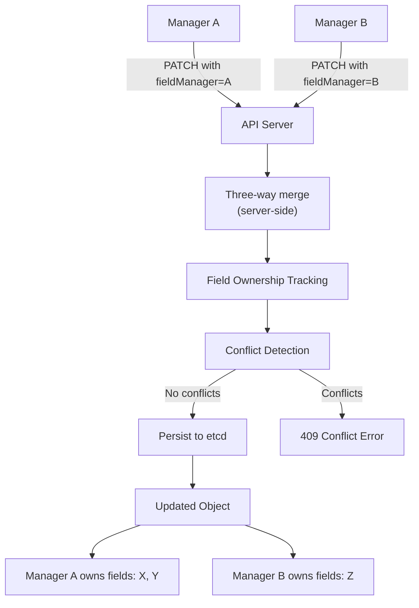
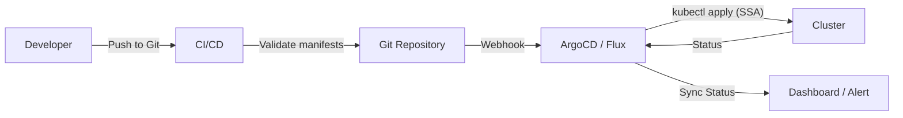

# Declarative vs Imperative - In-Depth Mechanics

## History

Kubernetes' preference for declarative management is not accidental. It emerged from Google's internal cluster management experience and was formalized through years of community evolution.

## Historical Timeline

```mermaid
timeline
    title Kubernetes Declarative vs Imperative Evolution
    section 2014-2015 : Borg Omega : K8s v1.0 Release
        : kubectl create (imperative)
        : kubectl run (imperative)
        : ReplicationController (declarative controller)
    section 2016 : kubectl expose : Services via CLI
        : kubectl expose (imperative)
        : ReplicaSet introduced
    section 2017 : Server-Side Apply Proposal
        : KEP 2875 proposed
        : `kubectl apply` improvements
    section 2018 : K8s 1.14
        : Server-side apply beta
        : Kustomize built into kubectl
    section 2019 : K8s 1.18
        : Server-side apply GA
        : Field ownership / multiple managers
        : CustomResourceDefinition maturity
    section 2020+ : GitOps Era
        : ArgoCD / FluxCD mainstream adoption
        : OCI support for Helm
        : Progressive delivery (Argo Rollouts, Flagger)
```

## Detailed History

### The Borg and Omega Influence

Google's internal systems (Borg and Omega) heavily influenced Kubernetes design philosophy.

- **Borg**: Mostly imperative. Operators submitted jobs via RPC calls.
- **Omega**: More declarative, using a centralized scheduler with persistent state.
- **Kubernetes**: Adopted Omega's declarative control loop while keeping Borg's operational simplicity.

This heritage explains why Kubernetes favors declarative APIs (objects as desired state) with controllers that continuously reconcile.

### Early Kubernetes (v1.0 - v1.9)

The initial CLI was heavily imperative:

```bash
# The original "quick start" commands
kubectl run nginx --image=nginx --port=80
kubectl expose deployment nginx --port=80 --target-port=80
kubectl scale deployment nginx --replicas=3
```

These commands were designed for convenience, not production management. They:
- Do not persist any configuration locally
- Cannot be version-controlled
- Do not track field ownership
- Are idempotent only by accident (some fail on second run)

### The `kubectl apply` Era (v1.5 - v1.16)

`kubectl apply` was introduced to address the limitations of imperative commands. It used a client-side three-way merge algorithm:

1. Read the live object from the cluster
2. Read the last-applied-configuration annotation from the live object
3. Merge with the new manifest
4. Send the merged result to the API server

**Problems with client-side apply**:
- Race conditions: if the live object changed between read and apply, the merge could be stale
- The `kubectl` client had to understand all API types to perform merging
- Multiple users applying the same object caused conflicts

### Server-Side Apply (SSA) Revolution (v1.16 - v1.18+)

Server-side apply moved the merge logic to the API server:



```yaml
# Server-side apply request
apiVersion: apps/v1
kind: Deployment
metadata:
  name: nginx
spec:
  replicas: 3  # Manager A claims this
  template:
    spec:
      containers:
      - name: nginx
        resources:
          requests:
            cpu: "100m"  # Manager B claims this
```

**Key advantages**:
- Multiple managers can coexist on the same object
- Conflicts are detected server-side, not client-side
- Field ownership is tracked in the object's metadata
- `kubectl apply` became a special case of a broader SSA API

**KEP 2875** formalized this change and is considered one of the most important Kubernetes enhancements for collaborative environments.

### The GitOps Era (2020 - Present)

With SSA stable, GitOps controllers became practical at scale:



Tools like **ArgoCD** (2017, CNCF 2020) and **FluxCD** (originally Weaveworks Flux, donated to CNCF) made declarative management the default for enterprises.

## Why Declarative Won

1. **Reproducibility**: A Git repository is a complete record of intent. Imperative commands leave no trace.
2. **Automation**: Controllers can reconcile continuously. Imperative commands require external schedulers.
3. **Collaboration**: Multiple teams can manage different fields of the same object via SSA. Imperative commands overwrite entire objects.
4. **Auditability**: Every change is a Git commit with a PR, review, and approval trail.
5. **Disaster Recovery**: Restoring a cluster from Git is deterministic. Replaying imperative commands is fragile.

## The Persistence of Imperative Commands

Despite the declarative focus, imperative commands remain essential:

```bash
# Debugging: quickly test if a container image works
kubectl run debug --image=busybox --rm -it -- sh

# Emergency ops: recover from a broken state
kubectl rollout undo deployment/nginx

# Exploration: inspect cluster state
kubectl get pods -o wide
kubectl top nodes
```

**Rule of thumb**: Use imperative for exploration, debugging, and emergency operations. Use declarative for everything that defines "how the cluster should look."

## Best Practices

1. **Learn the history to understand the design** - SSA exists because client-side apply had race conditions. Understanding this helps you use field ownership correctly.
2. **Use `kubectl apply` for production workloads** - it is the standard interface for declarative management.
3. **Use server-side apply for multi-team objects** - if multiple teams manage the same Deployment, SSA prevents conflicts.
4. **Adopt GitOps for continuous reconciliation** - manual `apply` is error-prone at scale.
5. **Document exceptions** - if you use imperative commands for production changes, require a follow-up manifest commit within 24 hours.

## Common Pitfalls

### Pitfall 1: Believing `kubectl create` is safe to re-run

```bash
# First run succeeds
kubectl create deployment nginx --image=nginx

# Second run fails
kubectl create deployment nginx --image=nginx
# Error: deployments.apps "nginx" already exists

# But the image might be different if you changed the CLI flag
# No mechanism exists to detect or correct this
```

### Pitfall 2: `kubectl apply` overwriting server-side changes

```bash
# Someone manually scaled a Deployment for an incident
kubectl scale deployment nginx --replicas=10

# Later, CI applies the old manifest with replicas=3
kubectl apply -f deployment.yaml

# The manual scale is reverted, potentially causing an outage
# Solution: use GitOps with selfHeal disabled during incidents,
# or update the manifest first, then apply
```

### Pitfall 3: Ignoring the annotation

```bash
# last-applied-configuration annotation is the source of truth
# for client-side apply. If it gets corrupted or deleted,
# kubectl apply behaves unpredictably.
kubectl get deployment nginx -o jsonpath='{.metadata.annotations.kubectl\.kubernetes\.io/last-applied-configuration}'

# If missing, delete and re-create the object with apply
```

### Pitfall 4: Not pinning `kubectl` versions

```bash
# Client-side apply behavior changed significantly between versions
# kubectl v1.17 vs v1.18 have different merge strategies
# Pin kubectl in CI/CD pipelines
kubectl version --client
```

## Community Knowledge

- **Kubernetes Enhancement Proposals (KEPs)**: KEP 2875 (SSA) and KEP 3221 (kubectl apply pruning) represent major architectural shifts.
- **Kubernetes the Hard Way** (Kelsey Hightower) teaches imperative commands first to understand the API, then declarative for production.
- **ArgoCD Creator** (Intiaz Saeed) has stated that GitOps adoption correlates strongly with declarative maturity: teams that master `kubectl apply` adopt GitOps faster.
- **CNCF Annual Survey 2023**: 78% of respondents use GitOps in production, up from 55% in 2021.
