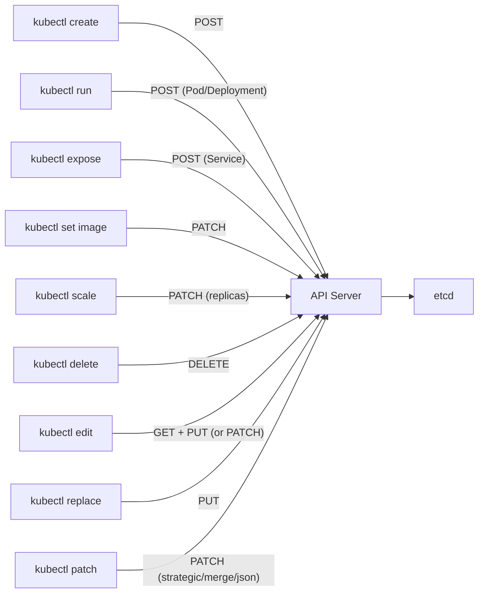
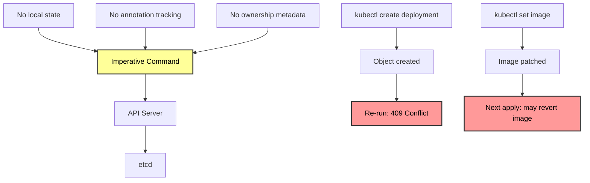

# Declarative vs Imperative - In-Depth Mechanics

## How Imperative Commands Work

Imperative commands are direct instructions to the Kubernetes API server. Each command maps to a single API operation, making them predictable but stateless.

## Command-to-API Mapping



### HTTP Method Reference

| kubectl Command | HTTP Method | API Path Pattern |
| :--- | :--- | :--- |
| `kubectl create` | `POST` | `/apis/<group>/<version>/namespaces/<ns>/<resource>` |
| `kubectl run` | `POST` | `/api/v1/namespaces/<ns>/pods` (or `/apis/apps/v1/.../deployments`) |
| `kubectl expose` | `POST` | `/api/v1/namespaces/<ns>/services` |
| `kubectl set image` | `PATCH` | `/apis/apps/v1/namespaces/<ns>/deployments/<name>` |
| `kubectl scale` | `PATCH` | `/apis/apps/v1/namespaces/<ns>/deployments/<name>` |
| `kubectl delete` | `DELETE` | `/apis/<group>/<version>/namespaces/<ns>/<resource>/<name>` |
| `kubectl edit` | `GET` then `PUT` | Same as create, but fetched first |
| `kubectl replace` | `PUT` | `/apis/<group>/<version>/namespaces/<ns>/<resource>/<name>` |

## Concrete Examples

### `kubectl create`

```bash
# Creates a new Deployment via POST
kubectl create deployment nginx --image=nginx:1.25 --replicas=3

# Equivalent API call (for understanding)
curl -X POST https://kubernetes.default.svc/apis/apps/v1/namespaces/default/deployments \
  -H "Content-Type: application/json" \
  -d '{
    "apiVersion": "apps/v1",
    "kind": "Deployment",
    "metadata": {"name": "nginx"},
    "spec": {"replicas": 3, "selector": {"matchLabels": {"app": "nginx"}}, "template": {"metadata": {"labels": {"app": "nginx"}}, "spec": {"containers": [{"name": "nginx", "image": "nginx:1.25"}]}}}
  }' \
  --header "Authorization: Bearer $TOKEN"
```

**Key behavior**: If the object already exists, the API server returns `409 Conflict`. There is no merge or update logic.

### `kubectl run`

```bash
# Creates a Pod directly (legacy behavior)
kubectl run nginx --image=nginx:1.25 --port=80 --restart=Never

# Creates a Deployment (modern behavior, default since 1.18)
kubectl run nginx --image=nginx:1.25 --port=80 --restart=Always

# Dry run to see what would be created
kubectl run nginx --image=nginx:1.25 --dry-run=client -o yaml
```

**Key behavior**: `kubectl run` is a convenience wrapper. It constructs a manifest in memory and POSTs it. The `--restart` flag determines whether a Pod or Deployment is created.

### `kubectl expose`

```bash
# Creates a Service from a Deployment
kubectl expose deployment nginx --port=80 --target-port=80 --type=ClusterIP

# Equivalent to this manifest
cat <<'EOF' > service.yaml
apiVersion: v1
kind: Service
metadata:
  name: nginx
  labels:
    app: nginx
spec:
  selector:
    app: nginx
  ports:
  - port: 80
    targetPort: 80
  type: ClusterIP
EOF
```

**Key behavior**: Expose generates a Service manifest with selectors matching the Deployment's Pod labels. If the labels change later, the Service selectors do not update automatically.

### `kubectl set image`

```bash
# Updates the container image via PATCH
kubectl set image deployment/nginx nginx=nginx:1.26

# You can see the exact JSON patch with --output=patch
kubectl set image deployment/nginx nginx=nginx:1.26 --output=patch

# Output:
# {"/spec/template/spec/containers/0/image": ["nginx:1.25", "nginx:1.26"]}
```

**Key behavior**: `set image` uses strategic merge patch. It only touches the specified container's image field, leaving other fields untouched. But it does not use `last-applied-configuration`, so if the image is later managed by `kubectl apply`, the apply operation may revert this change.

### `kubectl scale`

```bash
# Updates replicas via PATCH
kubectl scale deployment nginx --replicas=5

# Equivalent to:
kubectl patch deployment nginx --type='merge' -p '{"spec":{"replicas":5}}'

# Scale based on current CPU utilization (VPA integration)
kubectl autoscale deployment nginx --cpu-percent=50 --min=1 --max=10
```

**Key behavior**: Scale is a simple PATCH on `spec.replicas`. It is often used for emergency scaling but creates drift against any declarative manifest.

### `kubectl edit`

```bash
# Opens the current object in $EDITOR (default: vi)
kubectl edit deployment nginx

# What happens:
# 1. GET the current object
# 2. Write it to a temp file
# 3. Open $EDITOR
# 4. On save, PUT the modified object
# 5. If PUT fails (conflict), you get the object again to resolve
```

**Key behavior**: Edit performs a full object replacement (PUT), not a patch. If another actor modified the object between your GET and PUT, you may overwrite their changes.

## State Tracking Differences



## Best Practices

1. **Use for ad-hoc tasks only** - imperative commands are perfect for debugging, quick tests, and one-off operations.
2. **Never use imperative commands for production changes** - always follow up with a manifest commit to Git.
3. **Prefer `kubectl create --save-config` when you must use create** - this saves the initial config as an annotation, making the object compatible with future `apply` operations.
4. **Use `kubectl replace` over `kubectl edit` in scripts** - `replace` is deterministic; `edit` depends on human input and is non-idempotent.
5. **Understand the HTTP method** - `create` is POST (never idempotent), `replace` is PUT (idempotent but requires full object), `patch` is PATCH (partial updates, best for automation).

## Common Pitfalls

### Pitfall 1: The `create` trap

```bash
# Developer runs this in dev
kubectl create deployment nginx --image=nginx:1.25 --replicas=3

# Two weeks later, another developer runs the same command
kubectl create deployment nginx --image=nginx:1.26 --replicas=5
# Error: deployments.apps "nginx" already exists

# The cluster still runs nginx:1.25 with 3 replicas
# Nobody knows the intended state is nginx:1.26 with 5 replicas
```

### Pitfall 2: `kubectl edit` overwrites concurrent changes

```bash
# Alice runs kubectl edit deployment nginx
# Bob runs kubectl set image deployment/nginx nginx=nginx:1.26
# Alice saves her edit
# Alice's PUT overwrites Bob's change
# The deployment now runs nginx:1.25 again
```

### Pitfall 3: `kubectl run` deprecation confusion

```bash
# kubectl run behavior changed between versions
# v1.18+: default is to create a Deployment
# v1.17 and earlier: default was a Pod (unless --restart=Always)

# Always specify --restart explicitly
kubectl run nginx --image=nginx --restart=Always
# or use kubectl create deployment
kubectl create deployment nginx --image=nginx
```

### Pitfall 4: `kubectl expose` with wrong selector

```bash
# Create deployment
kubectl create deployment nginx --image=nginx

# Expose it
kubectl expose deployment nginx --port=80

# Later, someone updates the deployment labels
kubectl label deployment nginx app=new-nginx --overwrite

# The Service selector still points to app=nginx
# Traffic stops flowing
kubectl describe svc nginx
# Selector: app=nginx
kubectl get pods -l app=new-nginx
# No pods match the service selector
```

## Community Knowledge

- **Kubernetes CLI (kubectl) conventions**: Imperative commands are explicitly designed for "getting started" and "interactive use", not production management (source: kubectl reference docs).
- **Kubernetes Blog**: "Kubernetes Patterns" (Brendan Burns) describes declarative configuration as the foundation for operators and controllers.
- **SIG CLI** maintains `kubectl`. Their 2023 roadmap emphasizes improving `kubectl apply` and deprecating confusing imperative commands (e.g., `kubectl run` changing behavior across versions).
- **Production incident patterns**: Google SRE teams report that imperative command history (bash history) is often incomplete, leading to "mysterious" production state that cannot be reproduced.
