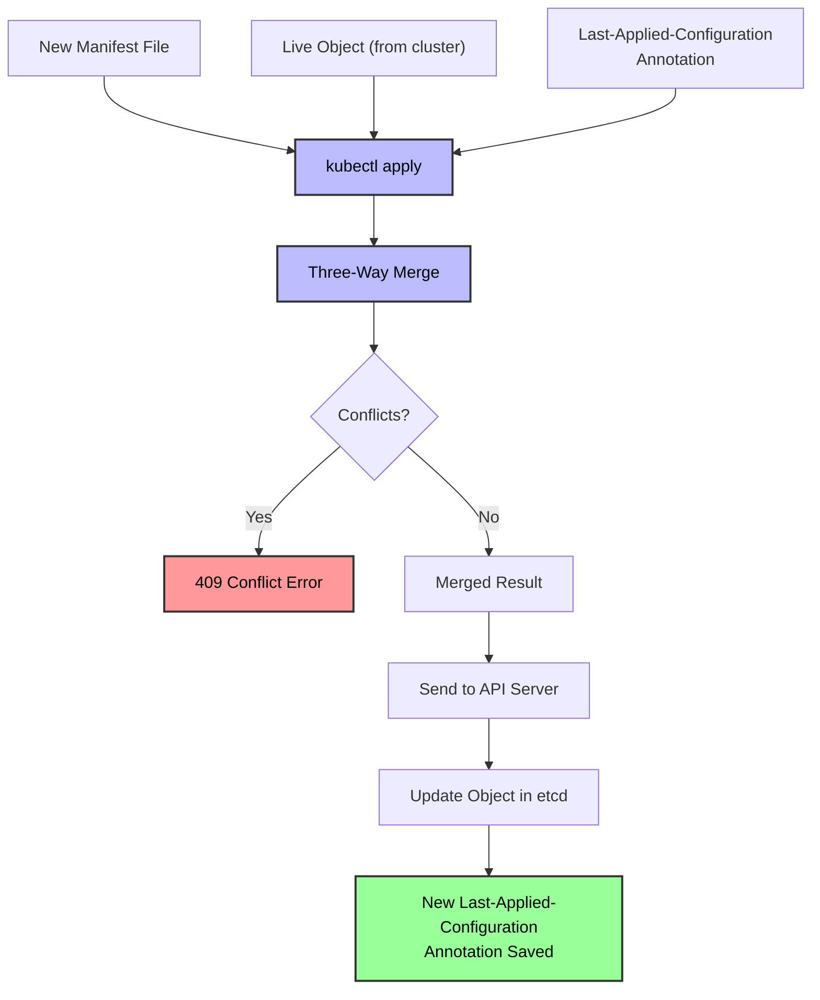

# Declarative vs Imperative - In-Depth Mechanics

## How `kubectl apply` Works (Declarative)

`kubectl apply` is the primary tool for declarative Kubernetes management. It uses a sophisticated three-way merge algorithm and server-side field tracking to reconcile desired state with live state.

## The Three-Way Merge Process



### Step-by-Step Breakdown

1. **Read the live object** from the Kubernetes API server.
2. **Extract the `last-applied-configuration` annotation** from the live object (this was saved during the previous `apply`).
3. **Perform a three-way merge** between:
   - The new manifest file (what you want now)
   - The live object (what is currently running)
   - The last-applied-configuration (what you last explicitly wanted)
4. **Resolve conflicts**: If the new manifest and the live object both modify the same field (and neither matches the last-applied-configuration), it is a conflict.
5. **Update the object**: Send the merged result to the API server.
6. **Save the new annotation**: Update `last-applied-configuration` to the new manifest.

## Concrete Example

### Initial Apply

```bash
cat <<'EOF' > deployment.yaml
apiVersion: apps/v1
kind: Deployment
metadata:
  name: nginx
spec:
  replicas: 3
  selector:
    matchLabels:
      app: nginx
  template:
    metadata:
      labels:
        app: nginx
      annotations:
        sidecar.istio.io/inject: "false"
    spec:
      containers:
      - name: nginx
        image: nginx:1.25
        ports:
        - containerPort: 80
EOF

kubectl apply -f deployment.yaml
```

After this, the live object has an annotation:

```yaml
metadata:
  annotations:
    kubectl.kubernetes.io/last-applied-configuration: |
      {"apiVersion":"apps/v1","kind":"Deployment",...}
```

### Manual Mutation (Drift)

```bash
# Someone scales the deployment manually
kubectl scale deployment nginx --replicas=5

# Someone updates the image manually
kubectl set image deployment/nginx nginx=nginx:1.26
```

The live object is now:
- `replicas: 5` (changed by `kubectl scale`)
- `image: nginx:1.26` (changed by `kubectl set image`)

### Re-applying the Manifest

```bash
# Re-apply the original manifest (replicas=3, image=nginx:1.25)
kubectl apply -f deployment.yaml
```

**What happens in the three-way merge**:

| Field | Last Applied | Live | New Manifest | Result |
| :--- | :--- | :--- | :--- | :--- |
| `replicas` | `3` | `5` | `3` | `3` (new manifest wins over live, matches last applied) |
| `image` | `nginx:1.25` | `nginx:1.26` | `nginx:1.25` | `nginx:1.25` (new manifest wins over live, matches last applied) |
| `annotations.sidecar.istio.io/inject` | `false` | `false` | `false` | `false` (unchanged) |

The deployment reverts to `replicas=3` and `image=nginx:1.25` because the new manifest explicitly declares those values.

## Server-Side Apply (SSA)

Since Kubernetes 1.18, server-side apply is the preferred method. It changes the fundamental mechanics:

### Key Differences from Client-Side Apply

| Aspect | Client-Side Apply | Server-Side Apply |
| :--- | :--- | :--- |
| **Merge location** | `kubectl` client | API server |
| **Field tracking** | Single `last-applied-configuration` annotation | `kubectl.kubernetes.io/last-applied-configuration` + `fieldManager` metadata |
| **Multiple managers** | Conflicts with other appliers | Different managers can own different fields |
| **Conflict detection** | Client-side (may be stale) | Server-side (always current) |
| **Dry run** | `--dry-run=client` | `--dry-run=server` |

### Server-Side Apply Example

```bash
# Manager A applies replicas
kubectl apply --field-manager=manager-a -f deployment.yaml --server-side

# Manager B applies resource limits
kubectl apply --field-manager=manager-b -f resources.yaml --server-side

# Both succeed without conflict because they manage different fields
```

```yaml
# Manager A's manifest
apiVersion: apps/v1
kind: Deployment
metadata:
  name: nginx
spec:
  replicas: 3
  selector:
    matchLabels:
      app: nginx
  template:
    metadata:
      labels:
        app: nginx
    spec:
      containers:
      - name: nginx
        image: nginx:1.25

---
# Manager B's manifest
apiVersion: apps/v1
kind: Deployment
metadata:
  name: nginx
spec:
  template:
    spec:
      containers:
      - name: nginx
        resources:
          requests:
            cpu: "100m"
            memory: "128Mi"
          limits:
            cpu: "500m"
            memory: "256Mi"
```

**Result**: The Deployment has `replicas=3` (from manager-a) and resource limits (from manager-b). Neither manager can accidentally overwrite the other's fields.

### Inspecting Field Ownership

```bash
# See which fields are managed by whom
kubectl get deployment nginx -o yaml | grep -A 10 "managedFields"

# Output:
# managedFields:
# - manager: manager-a
#   operation: Apply
#   fieldsV1:
#     f:spec:
#       f:replicas: {}
#       f:selector: {}
# - manager: manager-b
#   operation: Apply
#   fieldsV1:
#     f:spec:
#       f:template:
#         f:spec:
#           f:containers:
#             k:{"name":"nginx"}:
#               f:resources: {}
```

## Pruning

`kubectl apply` can optionally delete objects that exist in the cluster but not in the manifest set:

```bash
# Apply a directory and prune objects not in it
kubectl apply -f ./manifests/ --prune

# Prune only objects with a specific label
kubectl apply -f ./manifests/ --prune -l app=myapp

# Prune with a specific namespace
kubectl apply -f ./manifests/ --prune -n production
```

**Important**: Pruning is dangerous if you use shared namespaces. Always use label selectors to limit the prune scope.

## Best Practices

1. **Prefer server-side apply** - it is the future of Kubernetes management and supports multi-team ownership.
2. **Use consistent field managers** - name your field manager after your team or tool (e.g., `argocd/nginx`, `flux/myapp`).
3. **Run `kubectl diff` before applying** - see exactly what will change.
4. **Never edit live objects directly** if they are managed by `apply` - use manifests instead.
5. **Use `--prune` carefully** - only prune within well-scoped label selectors.

## Common Pitfalls

### Pitfall 1: Last-applied-configuration drift

```bash
# The last-applied-configuration annotation becomes stale if:
# - The object was created by something other than kubectl apply
# - The annotation was manually deleted
# - Server-side apply was used (which does not update last-applied-configuration by default)

# Check if it exists
kubectl get deployment nginx -o jsonpath='{.metadata.annotations.kubectl\.kubernetes\.io/last-applied-configuration}'

# If missing, client-side apply cannot perform three-way merge
# It falls back to a simpler merge strategy
```

### Pitfall 2: Server-side apply with client-side apply

```bash
# Someone applied server-side
kubectl apply --server-side -f deployment.yaml

# Later, someone applies client-side
kubectl apply -f deployment.yaml

# The client-side apply sees the managedFields metadata
# and may behave differently than expected
# Solution: standardize on one method per object
```

### Pitfall 3: `--prune` deleting critical objects

```bash
# Scenario: You have a namespace with multiple teams
kubectl apply -f ./myapp-manifests/ --prune -n shared-ns

# If --prune runs without -l, it will delete ALL objects not in ./myapp-manifests/
# including other teams' deployments, services, configmaps

# Always use label selectors:
kubectl apply -f ./myapp-manifests/ --prune -l app=myapp -n shared-ns
```

### Pitfall 4: Merging with `null` values

```yaml
# In YAML, null and missing are different
# This removes an env var:
spec:
  containers:
  - name: nginx
    env:
    - name: OLD_VAR
      value: null

# This does NOT remove it (it is not specified):
spec:
  containers:
  - name: nginx
    env:
    - name: NEW_VAR
      value: "new"
```

## Community Knowledge

- **KEP 2875** (Server-Side Apply): Introduced the field ownership model. The KEP explicitly states that SSA is designed for "multiple actors managing the same object."
- **Kubernetes Blog** (2020): "Server-side apply in Kubernetes 1.18" explains why client-side apply was insufficient for GitOps.
- **ArgoCD** uses server-side apply by default (since v2.0), which is why it plays well with multiple field managers.
- **FluxCD** supports both client-side and server-side apply. The `--ssa` flag enables SSA for Flux's apply operations.
- **Testing**: The Kubernetes conformance test suite (`e2e.test`) includes extensive tests for SSA behavior, ensuring consistent implementation across Kubernetes distributions.
