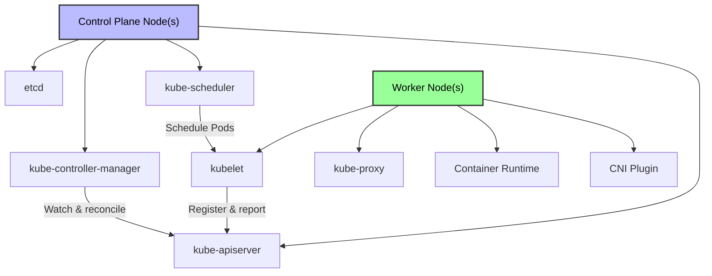

# Kubernetes Nodes - In-Depth Mechanics

## Node Setup & Control Plane

A Kubernetes cluster consists of nodes with specific roles. Understanding how to provision these roles and connect them is fundamental to operating a cluster.

## Node Roles

Kubernetes nodes serve one of two roles:

| Role | Components | Purpose |
| :--- | :--- | :--- |
| **Control Plane** | kube-apiserver, etcd, kube-scheduler, kube-controller-manager, kube-controller-manager, cloud-controller-manager (optional) | Makes global decisions, detects and responds to cluster events |
| **Worker** | kubelet, kube-proxy, container runtime, CNI plugin | Runs Pod workloads |



**High Availability (HA)**: Production clusters run 3 or more control plane nodes. etcd uses the Raft consensus algorithm, requiring a quorum (majority) of control plane members.

## Identifying the Control Plane

### On the control plane node:

```bash
# Check which components are running as static pods
ls /etc/kubernetes/manifests/
# kube-apiserver.yaml
# kube-controller-manager.yaml
# kube-scheduler.yaml
# etcd.yaml

# Check etcd cluster health
ETCDCTL_API=3 etcdctl \
  --endpoints=https://127.0.0.1:2379 \
  --cacert=/etc/kubernetes/pki/etcd/ca.crt \
  --cert=/etc/kubernetes/pki/etcd/server.crt \
  --key=/etc/kubernetes/pki/etcd/server.key \
  endpoint health
# https://127.0.0.1:2379 is healthy

# Check kube-apiserver health
kubectl get componentstatuses
# NAME                 STATUS    MESSAGE   ERROR
# scheduler            Healthy   ok
# controller-manager   Healthy   ok
# etcd-0               Healthy   ok

# View node roles
kubectl get nodes -o wide
# NAME     STATUS   ROLES           AGE   VERSION   INTERNAL-IP
# cp-1     Ready    control-plane   10d   v1.28.0   10.0.0.1
# worker-1 Ready    <none>          10d   v1.28.0   10.0.0.2
# worker-2 Ready    <none>          10d   v1.28.0   10.0.0.3

# The control plane node has the role "control-plane"
kubectl get nodes -l node-role.kubernetes.io/control-plane
```

### From any node:

```bash
# Find the API server endpoint
cat /etc/kubernetes/kubelet.conf | grep server
# server: https://<control-plane-ip>:6443

# Check cluster info
kubectl cluster-info
# Kubernetes control plane is running at https://<cp-ip>:6443
```

## Bootstrapping a Control Plane Node

### Option 1: kubeadm (Production Standard)

```bash
# Prerequisites on all control plane nodes:
# - 2 CPU / 2 GB RAM / 20 GB disk
# - Swap disabled
# - Unique hostname, MAC, product_uuid
# - Required ports open (6443, 2379-2380, 10250, 10259, 10257)

# 1. Install container runtime (containerd example)
cat <<EOF | sudo tee /etc/modules-load.d/containerd.conf
overlay
br_netfilter
EOF

sudo modprobe overlay
sudo modprobe br_netfilter

cat <<EOF | sudo tee /etc/sysctl.d/99-kubernetes-cri.conf
net.bridge.bridge-nf-call-iptables = 1
net.bridge.bridge-nf-call-ip6tables = 1
net.ipv4.ip_forward = 1
EOF

sudo sysctl --system

sudo apt-get update
sudo apt-get install -y containerd
sudo systemctl enable --now containerd

# 2. Install kubeadm, kubelet, kubectl
sudo apt-get install -y apt-transport-https ca-certificates curl
curl -fsSL https://pkgs.k8s.io/core:/stable:/v1.28/deb/Release.key | sudo gpg --dearmor -o /etc/apt/keyrings/kubernetes-apt-keyring.gpg
echo "deb [signed-by=/etc/apt/keyrings/kubernetes-apt-keyring.gpg] https://pkgs.k8s.io/core:/stable:/v1.28/deb/ /" | sudo tee /etc/apt/sources.list.d/kubernetes.list
sudo apt-get update
sudo apt-get install -y kubelet kubeadm kubectl
sudo apt-mark hold kubelet kubeadm kubectl

# 3. Initialize the control plane
sudo kubeadm init \
  --apiserver-advertise-address=10.0.0.1 \
  --pod-network-cidr=10.244.0.0/16 \
  --service-cidr=10.96.0.0/12 \
  --upload-certs

# 4. Configure kubectl access
mkdir -p $HOME/.kube
sudo cp -i /etc/kubernetes/admin.conf $HOME/.kube/config
sudo chown $(id -u):$(id -g) $HOME/.kube/config

# 5. Install a CNI plugin (Calico example)
kubectl apply -f https://docs.projectcalico.org/manifests/calico.yaml

# Output shows the worker join command:
# kubeadm join <control-plane-ip>:6443 --token <token> \
#   --discovery-token-ca-cert-hash sha256:<hash>
```

### Option 2: k3s (Lightweight, Edge, IoT)

```bash
# Install k3s server (control plane + embedded worker)
curl -sfL https://get.k3s.io | sh -

# Get the node token for joining workers
sudo cat /var/lib/rancher/k3s/server/node-token

# kubectl config
mkdir -p ~/.kube
sudo cp /etc/rancher/k3s/k3s.yaml ~/.kube/config
chmod 600 ~/.kube/config

# Verify
kubectl get nodes
# NAME    STATUS   ROLES                  AGE   VERSION
# server  Ready    control-plane,master   1m    v1.28.3+k3s1
```

### Option 3: kind (Local Development)

```bash
# Create a single-node cluster (control plane + worker combined)
kind create cluster --name dev

# Create a multi-node cluster with HA control plane
cat <<EOF | kind create cluster --name ha --config=-
kind: Cluster
apiVersion: kind.x-k8s.io/v1alpha4
nodes:
  - role: control-plane
    kubeadmConfigPatches:
      - |
        kind: InitConfiguration
        nodeRegistration:
          kubeletExtraArgs:
            node-labels: "ingress-ready=true"
  - role: worker
  - role: worker
EOF

# Get kubeconfig
kind get kubeconfig --name dev
```

## Attaching Worker Nodes

Workers join the cluster by running the `kubeadm join` command (or equivalent for other distributions).

### kubeadm Join

```bash
# On the control plane, generate a join command:
kubeadm token create --print-join-command
# kubeadm join 10.0.0.1:6443 --token abcdef.0123456789abcdef \
#   --discovery-token-ca-cert-hash sha256:0123456789abcdef0123456789abcdef0123456789abcdef0123456789abcdef

# On the worker node:
# 1. Install container runtime (same as control plane)
# 2. Install kubeadm and kubelet (same versions as control plane)
# 3. Join the cluster

sudo kubeadm join 10.0.0.1:6443 --token abcdef.0123456789abcdef \
  --discovery-token-ca-cert-hash sha256:0123456789abcdef0123456789abcdef0123456789abcdef

# Verify from control plane
kubectl get nodes
# NAME     STATUS   ROLES    AGE   VERSION
# cp-1     Ready    control-plane   10d   v1.28.0
# worker-1 Ready    <none>          5s    v1.28.0
```

### k3s Agent Join

```bash
# On the worker node:
curl -sfL https://get.k3s.io | K3S_URL=https://<server-ip>:6443 K3S_TOKEN=<node-token> sh -

# Verify from server
kubectl get nodes
# NAME    STATUS   ROLES                  AGE   VERSION
# server  Ready    control-plane,master   5m    v1.28.3+k3s1
# agent   Ready    <none>                 10s   v1.28.3+k3s1
```

### Post-Join Configuration

```bash
# Workers should NOT have the control-plane role by default.
# If needed, label a worker for dedicated workloads:

kubectl label node worker-1 node-role.kubernetes.io/worker=

# Taint the control plane to prevent user workloads from landing there
kubectl taint nodes cp-1 node-role.kubernetes.io/control-plane:NoSchedule

# Verify node roles
kubectl get nodes -o jsonpath='{range .items[*]}{.metadata.name}{"\t"}{range .metadata.labels}{.}{"\n"}{end}{end}'
```

## Cluster Verification Checklist

```bash
# 1. All nodes Ready
kubectl get nodes
# All nodes should show STATUS=Ready

# 2. System pods running on control plane
kubectl get pods -n kube-system -o wide
# coredns, etcd, kube-apiserver, kube-controller-manager, kube-scheduler, kube-proxy, calico-node

# 3. Worker nodes have no control-plane pods
kubectl get pods -n kube-system -o wide --field-selector spec.nodeName=worker-1

# 4. Test scheduling a workload on a worker
kubectl run test --image=busybox --rm -it --restart=Never -- sh -c "hostname && uname -a"
```

## Node Isolation and Specialization

```yaml
# Dedicate a worker for GPU workloads
kubectl label node gpu-worker-1 hardware-type=NVIDIA-GPU

# Taint a node for specific workloads only
kubectl taint node gpu-worker-1 hardware-type=NVIDIA-GPU:NoSchedule

# Pod tolerates the taint
apiVersion: v1
kind: Pod
metadata:
  name: gpu-task
spec:
  tolerations:
    - key: "hardware-type"
      operator: "Equal"
      value: "NVIDIA-GPU"
      effect: "NoSchedule"
  nodeSelector:
    hardware-type: "NVIDIA-GPU"
  containers:
    - name: cuda-container
      image: nvidia/cuda:11.0.3-runtime-ubuntu20.04
      resources:
        limits:
          nvidia.com/gpu: 1
```

## Best Practices

1. **Separate control plane and workers** — never run user workloads on control plane nodes in production.
2. **Use kubeadm for production** — it provides standardized, reproducible cluster lifecycle management.
3. **Match versions** — kubelet, kubeadm, and kubectl must be the same minor version across nodes.
4. **Rotate tokens** — kubeadm tokens expire after 24 hours. Use `kubeadm token create` for long-lived tokens.
5. **Secure worker joins** — use `--certificate-key` with kubeadm for encrypted certificate sharing during join.
6. **Run HA control plane** — use 3 or 5 control plane nodes for production to tolerate node failures.

## Common Pitfalls

### Pitfall 1: Version mismatch between control plane and workers

```bash
# Symptom: worker fails to join with cert errors
# kubelet: certificate has expired or is invalid

# Check versions
kubeadm version
kubelet --version
kubectl version --short

# Fix: align versions across all nodes
apt-mark hold kubelet kubeadm kubectl
```

### Pitfall 2: Worker lands on control plane

```bash
# Symptom: user pods scheduled on cp-1
# Cause: control plane node lacks the NoSchedule taint (older k8s versions)

# Check taints
kubectl describe node cp-1 | grep Taint

# Apply taint if missing
kubectl taint nodes cp-1 node-role.kubernetes.io/control-plane:NoSchedule
```

### Pitfall 3: CNI not installed on workers

```bash
# Symptom: pods stuck in ContainerCreating on workers
# kubectl get events --field-selector reason=FailedCreatePodSandBox

# Fix: ensure CNI DaemonSet is running
kubectl get daemonset -n kube-system calico-node
kubectl rollout restart daemonset -n kube-system calico-node
```

### Pitfall 4: Firewall blocking control plane communication

```bash
# Symptom: node registers but cannot pull images or reach API
# Required ports on control plane: 6443, 2379-2380, 10250, 10259, 10257
# Required ports on workers: 10250, 30000-32767 (NodePort)

# Check connectivity from worker
nc -zv <cp-ip> 6443
nc -zv <cp-ip> 2379
```
