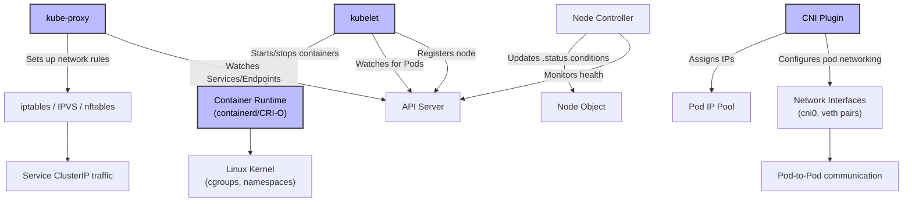
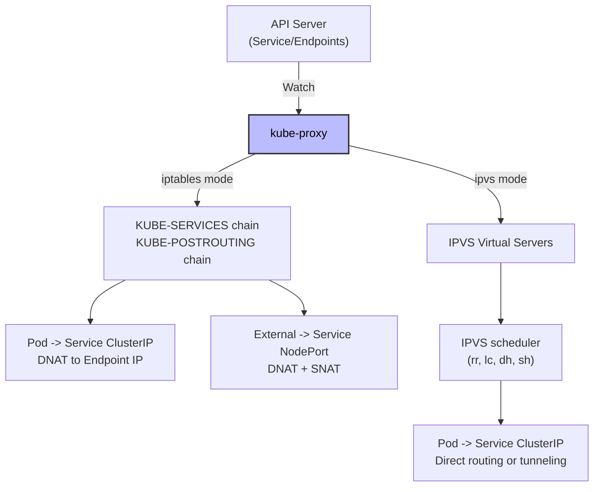

# Kubernetes Nodes - In-Depth Mechanics

## Node Components

Every Kubernetes node runs a set of components that enable it to participate in the cluster. Understanding these components is essential for debugging node-level issues.

## Component Architecture



## Detailed Component Breakdown

### 1. kubelet

The kubelet is the primary node agent. It is responsible for:

```bash
# Check kubelet status
systemctl status kubelet

# View kubelet logs (systemd)
journalctl -u kubelet -f

# View kubelet configuration
cat /var/lib/kubelet/config.yaml
# or
ps aux | grep kubelet | grep config
```

**Key responsibilities**:
- **Node registration**: Registers the node with the cluster via `--register-node=true` (default).
- **Pod assignment**: Watches the API server for Pods bound to this node via the `nodeName` field.
- **Container lifecycle**: Uses the CRI (Container Runtime Interface) to pull images and start/stop containers.
- **Health reporting**: Updates `NodeStatus` and `PodStatus` conditions on the node and pod objects.
- **Resource enforcement**: Enforces `PodSpec` resource requests and limits via cgroups.
- **Volume management**: Mounts volumes specified in the Pod spec (ConfigMap, Secret, PersistentVolumeClaim, etc.).
- **Eviction**: Monitors node resource pressure and evicts pods when thresholds are breached.

**Important kubelet configuration flags**:

| Flag | Default | Purpose |
| :--- | :--- | :--- |
| `--kubeconfig` | `/etc/kubernetes/kubelet.conf` | Path to kubelet's client credentials (see [`06-kubeconfig.md`](../06-kubeconfig.md) for full kubeconfig reference) |
| `--feature-gates` | (empty) | Comma-separated list of feature gates to enable/disable (e.g., `GracefulNodeShutdown=true`, `CSIMigration=true`) |
| `--runtime-config` | (empty) | Comma-separated list of API versions to enable/disable (e.g., `api/all=true`, `apps/v1beta1=true`, `api/v1=false`). Deprecated in 1.20; use `--feature-gates` instead |
| `--container-runtime` | `remote` | CRI socket endpoint |
| `--container-runtime-endpoint` | `unix:///var/run/containerd/containerd.sock` | CRI socket |
| `--image-service-endpoint` | `unix:///var/run/containerd/containerd.sock` | Image service socket |
| `--register-node` | `true` | Auto-register node with cluster |
| `--node-status-update-frequency` | `10s` | How often to post node status |
| `--network-plugin` | `cni` | CNI plugin to use |
| `--cgroup-driver` | `systemd` (recommended) | Cgroup driver for containers |
| `--eviction-hard` | `memory.available<100Mi,nodefs.available<10%,nodefs.inodesFree<5%` | Hard eviction thresholds |
| `--eviction-soft` | (empty) | Soft eviction thresholds with grace period |
| `--kube-reserved` | (empty) | Resources reserved for kube system |
| `--system-reserved` | (empty) | Resources reserved for OS/system |

**Checking kubelet health**:

```bash
# Verify kubelet is running and healthy
kubectl get nodes
# NAME     STATUS   ROLES    AGE   VERSION
# node-1   Ready    <none>   10d   v1.28.0

# Check kubelet metrics (if metrics-server is installed)
kubectl top node node-1

# Check kubelet metrics endpoint (if exposed)
curl -k https://localhost:10250/metrics

# Check kubelet readiness probe
curl -k https://localhost:10248/healthz
# ok
```

### 2. kube-proxy

kube-proxy maintains network rules on nodes so that Pods can communicate with each other and with external services.

```bash
# Check kube-proxy mode
ps aux | grep kube-proxy
# --proxy-mode=iptables
# or
# --proxy-mode=ipvs
# or
# --proxy-mode=nftables

# Check iptables rules (iptables mode)
iptables -t nat -L -v -n | grep -E "KUBE|CNI"

# Check IPVS rules (IPVS mode)
ipvsadm -Ln
```

**Modes of operation**:

| Mode | Description | Pros | Cons |
| :--- | :--- | :--- | :--- |
| **iptables** | Random NAT rules in iptables chains | Simple, widely supported | Performance degrades with many services (O(n) lookup) |
| **ipvs** | IP Virtual Server with scheduling algorithms | Better performance (O(1) lookup), load balancing algorithms | More complex, requires ipvsadm |
| **nftables** | Modern replacement for iptables | Cleaner syntax, better performance | Newer, less battle-tested |

**How kube-proxy works**:



**iptables mode example**:

```bash
# When you create a Service, kube-proxy adds rules
kubectl expose deployment nginx --port=80 --type=ClusterIP

# Inspect the rules
iptables -t nat -L KUBE-SERVICES -v -n

# Output (simplified):
# Chain KUBE-SERVICES (2 references)
# target     prot opt source               destination
# KUBE-SVC-XXXX  tcp  --  0.0.0.0/0            10.96.0.1
# KUBE-SVC-XXXX  tcp  --  10.0.0.0/8            10.96.0.1
# ...
# Chain KUBE-SVC-XXXX (1 references)
# target     prot opt source               destination
# KUBE-SEP-YYYY  all  --  0.0.0.0/0            0.0.0.0/0
```

### 3. Container Runtime (CRI)

The container runtime runs the containers. Kubernetes uses the CRI (Container Runtime Interface) to abstract the runtime.

```bash
# Check which runtime is in use
crictl info | grep runtimeName
# runtimeName: containerd

# List running containers
crictl ps

# List images
crictl images

# Inspect a container
crictl inspect <container-id>

# Check runtime version
containerd --version
# or
crio --version
```

**Supported runtimes**:

| Runtime | Description | Use Case |
| :--- | :--- | :--- |
| **containerd** | CNCF graduated, lightweight | Default in most distros (Ubuntu, Flatcar, RHEL) |
| **CRI-O** | CNCF graduated, OCI-focused | Preferred for OpenShift, minimal footprint |
| **Docker Engine** | Legacy (dockershim removed in 1.24) | Only if using Mirantis cri-dockerd |

**Important**: `dockershim` was removed in Kubernetes 1.24. If you see Docker references in node components, it is likely running via `cri-dockerd` (Mirantis) or the node is pre-1.24.

### 4. CNI Plugin

The CNI (Container Network Interface) plugin sets up networking for Pods.

```bash
# Check CNI configuration
ls /etc/cni/net.d/
# 10-calico.conflist
# 87-podman.conflist

# Check network interfaces created by CNI
ip addr show cni0
# or
ip addr show flannel.1
# or
ip addr show cali...

# Verify pod networking
kubectl run test --image=busybox --rm -it --restart=Never -- wget -O- http://10.244.0.2
```

**Common CNI plugins**:

| Plugin | Type | Notable Features |
| :--- | :--- | :--- |
| **Calico** | Policy + routing | BGP, network policy, eBPF dataplane (optional) |
| **Cilium** | eBPF-based | Hubble observability, network policy, service mesh |
| **Flannel** | Simple overlay | VXLAN, host-gw, UDP (legacy) |
| **Weave Net** | Overlay + encryption | Encrypted mesh by default |
| **Antrea** | OVS-based | Open vSwitch, flow-based policy |

## Node-Level Troubleshooting

```bash
# 1. Check node status and conditions
kubectl describe node <node-name>

# 2. Check component logs
journalctl -u kubelet -f
journalctl -u kube-proxy -f

# 3. Check CNI plugin logs
journalctl -u calico-node -f
# or
journalctl -u kube-flannel-ds -f

# 4. Verify container runtime
crictl ps -a
crictl info

# 5. Check network connectivity between nodes
kubectl run net-test --image=busybox --rm -it --restart=Never -- ping <other-node-ip>

# 6. Check if kube-proxy rules are working
kubectl run net-test --image=busybox --rm -it --restart=Never -- wget -O- <service-cluster-ip>
```

## Best Practices

1. **Run kubelet with systemd cgroup driver** - mismatch between kubelet and runtime cgroup drivers causes resource accounting issues.
2. **Pin component versions** - keep kubelet, kube-proxy, and container runtime versions consistent across nodes.
3. **Enable kubelet authentication and authorization** - the kubelet API (port 10250) should be restricted.
4. **Monitor kubelet metrics** - key metrics include `kubelet_running_pods`, `kubelet_node_name`, `kubelet_volume_stats_*`.
5. **Use IPVS for large clusters** - if you have more than 1000 Services, IPVS significantly outperforms iptables.

## Common Pitfalls

### Pitfall 1: Cgroup driver mismatch

```bash
# Symptoms: Pods show incorrect resource usage, OOMKilled unexpectedly
# kubelet uses cgroupfs but containerd uses systemd

# Check kubelet cgroup driver
ps aux | grep kubelet | grep cgroup-driver

# Check containerd cgroup driver
cat /etc/containerd/config.toml | grep cgroup
# [plugins."io.containerd.grpc.v1.cri".cgroup]
#   systemd_cgroup = true

# Fix: make them match
# In /etc/default/kubelet:
KUBELET_CGROUP_ARGS="--cgroup-driver=systemd"
```

### Pitfall 2: kube-proxy iptables rules blocking traffic

```bash
# Symptoms: Pods cannot reach Services, but direct pod IP works
# kube-proxy rules may be stale or incorrect

# Flush iptables rules and restart kube-proxy
iptables -F
iptables -t nat -F
iptables -t mangle -F
systemctl restart kube-proxy

# For IPVS:
ipvsadm -C
systemctl restart kube-proxy
```

### Pitfall 3: CNI plugin not initializing

```bash
# Symptoms: Pods stuck in ContainerCreating with CNI events
# Check CNI logs
journalctl -u kubelet -f | grep CNI
# Error: cni config "calico" not found

# Fix: ensure CNI config exists
ls /etc/cni/net.d/
# If missing, reinstall CNI plugin or restart its DaemonSet
kubectl rollout restart daemonset -n kube-system calico-node
```

### Pitfall 4: kubelet not reporting node status

```bash
# Symptoms: Node shows NotReady, but kubelet is running
# kubelet cannot reach API server

# Check kubelet logs for auth errors
journalctl -u kubelet -f | grep -i "forbidden\|unauthorized\|connection refused"

# Common cause: kubeconfig expired or rotated (see [`06-kubeconfig.md`](../06-kubeconfig.md) for kubeconfig reference)
# Check kubelet.conf validity
openssl x509 -in /var/lib/kubelet/kubelet.conf -text -noout | grep Not
```

## Community Knowledge

- **Kubernetes Node Design**: The kubelet is intentionally minimal. It does not manage pods across nodes (that is the scheduler's job) and does not make cluster-wide decisions (that is the controller manager's job).
- **CRI standardization**: Kubernetes 1.20+ requires a CRI-compliant runtime. Docker Engine is no longer supported directly.
- **eBPF and kube-proxy**: Cilium and other eBPF-based CNIs can replace kube-proxy entirely (kube-proxy replacement mode), eliminating iptables/IPVS overhead.
- **Kubelet graceful shutdown**: Since 1.20, kubelet supports `--feature-gates=GracefulNodeShutdown=true`, which respects systemd shutdown ordering for pods.
