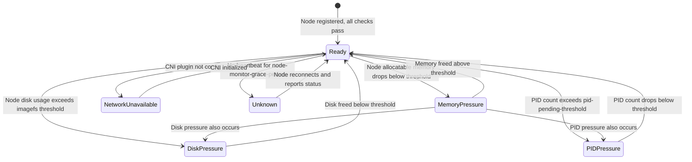
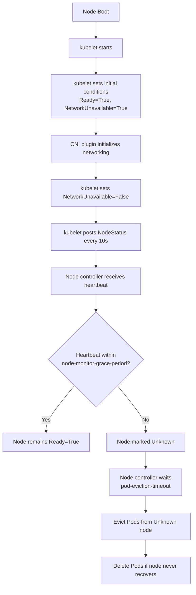
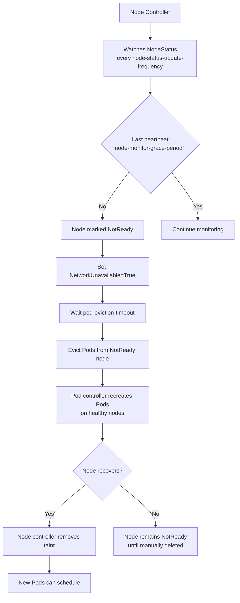

# Kubernetes Nodes - In-Depth Mechanics

## Node Conditions

### The Five Built-in Conditions

Every Node has a `.status.conditions` array containing up to five standard conditions. Each condition has a `type`, `status`, `lastHeartbeatTime`, `lastTransitionTime`, `reason`, and `message`. The kubelet and node controller collaborate to maintain these.



| Condition | Meaning | Typical Cause |
|-----------|---------|---------------|
| `Ready` | Node is healthy and accepting Pods. `status` is `True`. | Normal operation. |
| `MemoryPressure` | Node memory is low; eviction thresholds have been breached. `status` is `True`. | Memory pressure triggers eviction of BestEffort Pods first, then Burstable. |
| `DiskPressure` | Node root filesystem or image filesystem is nearly full. `status` is `True`. | Prevents scheduling of new Pods that need ephemeral storage. |
| `PIDPressure` | Too many processes on the node (exceeds `--pod-max-pids` or system PID limit). `status` is `True`. | Process leaks or runaway containers spawning threads. |
| `NetworkUnavailable` | CNI plugin has not configured the node's network. `status` is `True` or `False`. | Should become `False` once CNI is ready. Stuck `True` indicates CNI failure. |

### How Conditions Are Set and Monitored



### Inspecting Node Conditions

```bash
# 1. Describe the node for full condition details
kubectl describe node <node-name> | grep -A10 "Conditions:"

# Output shows:
# Status:    True
# Type:      Ready
# LastHeartbeatTime:   Sun, 26 Jul 2026 ...
# LastTransitionTime: Sun, 26 Jul 2026 ...

# 2. JSONPath for machine-readable output
kubectl get node <node-name> -o jsonpath='{.status.conditions[?(@.type=="Ready")].status}'

# 3. Custom columns for quick overview across all nodes
kubectl get nodes -o custom-columns=\
NAME:.metadata.name,\
READY:.status.conditions[?(@.type=='Ready')].status,\
MEMORY_PRESSURE:.status.conditions[?(@.type=='MemoryPressure')].status,\
DISK_PRESSURE:.status.conditions[?(@.type=='DiskPressure')].status,\
PID_PRESSURE:.status.conditions[?(@.type=='PIDPressure')].status,\
NETWORK_UNAVAILABLE:.status.conditions[?(@.type=='NetworkUnavailable')].status
```

### Kubelet Configuration Flags

| Flag | Default | Purpose |
|------|---------|---------|
| `--node-status-update-frequency` | `10s` | How often kubelet posts NodeStatus |
| `--node-monitor-grace-period` | `50s` | Duration after which node is marked NotReady if no heartbeat |
| `--node-status-report-frequency` | `5m` | Frequency of status updates from kubelet |
| `--pod-eviction-timeout` | `5m` | How long node controller waits before evicting Pods from Unknown node |
| `--eviction-pressure-transition-period` | `5m` | How long a pressure condition must persist before triggering eviction |
| `--kube-reserved` / `--system-reserved` | `""` | Resources reserved for system, affecting pressure thresholds |
| `--eviction-hard` | `memory.available<100Mi,nodefs.available<10%,nodefs.inodesFree<5%` | Hard eviction thresholds |
| `--eviction-soft` | `""` | Soft eviction thresholds (with grace period) |

### Eviction Behavior by Condition

When a pressure condition is `True`, the node controller evicts Pods in a specific order:

| Pressure Condition | Eviction Order |
|-------------------|----------------|
| `MemoryPressure` | BestEffort → Burstable (highest usage first) → Guaranteed (last) |
| `DiskPressure` | BestEffort → Burstable → Guaranteed, prioritizing Pods using the most ephemeral storage |
| `PIDPressure` | BestEffort → Burstable → Guaranteed, based on PID usage |

**Note:** DaemonSet Pods and mirror Pods (static Pods) are not evicted under normal pressure conditions. Critical Pods (`priorityClassName: system-cluster-critical`) are evicted only as a last resort.

### Node Controller Monitoring and Recovery



### Best Practices

1. **Monitor condition transitions**: Set up alerts for `Ready=False` transitions, as they indicate node failures that may require action.
2. **Configure appropriate grace periods**: Tune `node-monitor-grace-period` and `pod-eviction-timeout` based on your workload's tolerance for disruption. Too aggressive eviction causes cascading failures; too lenient leaves workloads stuck.
3. **Use taints to prevent scheduling during issues**: When a node enters a pressure condition, the node controller applies taints automatically. Ensure your workloads tolerate or avoid these taints as appropriate.
4. **Keep CNI lightweight**: `NetworkUnavailable=True` is expected briefly during boot. If it persists, investigate CNI plugin health.
5. **Monitor system resources proactively**: Use the `--eviction-soft` flag to get early warnings before hard eviction triggers.
6. **Verify `kube-reserved` and `system-reserved`**: Without these, the kubelet sees all node memory as allocatable, causing false MemoryPressure triggers.

### Common Pitfalls

1. **NetworkUnavailable stuck as True**: The CNI plugin failed to initialize. Check CNI pod logs and network interface configuration.
   ```bash
   kubectl -n kube-system logs -l k8s-app=calico-node --tail=100
   ```

2. **MemoryPressure from system processes**: If `kube-reserved` is not set, system daemons consume memory counted against the node's allocatable total.
   ```bash
   # Check current eviction thresholds
   kubectl describe node <node-name> | grep -A5 "Allocatable"
   ```

3. **Clock skew causing false NotReady**: If the node's clock is significantly off from the control plane, heartbeats appear stale.
   ```bash
   # Check NTP sync status on the node
   timedatectl status
   chronyc tracking
   ```

4. **PIDPressure from leaked processes**: A single container can spawn thousands of threads, exhausting the PID limit.
   ```bash
   # Count PIDs in a container
   kubectl exec <pod-name> -- ls /proc | wc -l
   ```

5. **DiskPressure from container images**: Docker/containerd image cache can consume significant disk. Configure image garbage collection.
   ```bash
   # Check image disk usage on the node
   docker system df
   ```

### Community Knowledge

- **Node Lifecycle Controller**: Part of the kube-controller-manager, it is responsible for updating node conditions and taints. Source code is in `pkg/controller/nodelifecycle`.
- **Node Problem Detector**: An open-source project (SIG Node) that runs on nodes and reports hardware, kernel, and runtime problems as node conditions.
- **Cluster Autoscaler**: Depends on `Ready=False` to decide which nodes are unsafe to scale down. False positives (clock skew, network blips) can cause unwanted scale-up.
- **Graceful Node Shutdown (KEP 2008)**: Since K8s 1.20, the kubelet can detect system shutdown and gracefully terminate Pods, improving condition transitions during maintenance. The feature was alpha at introduction and requires `--feature-gates=GracefulNodeShutdown=true` to be enabled.
