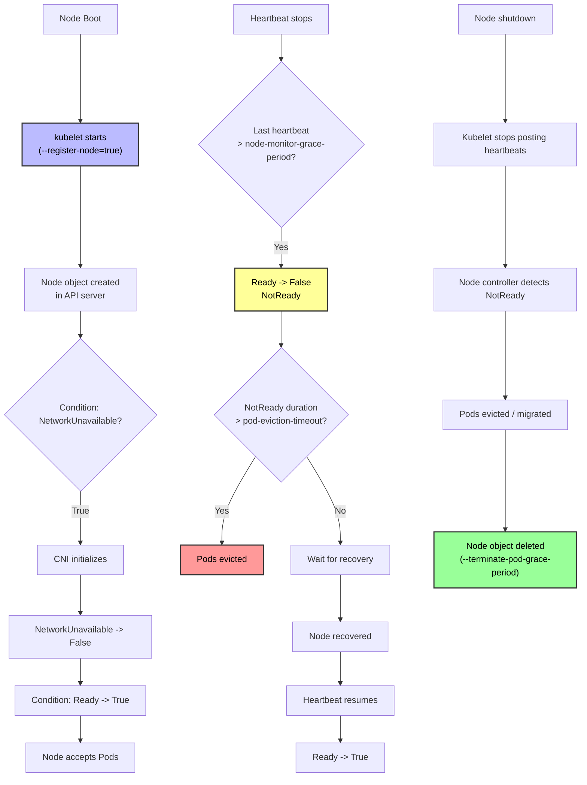
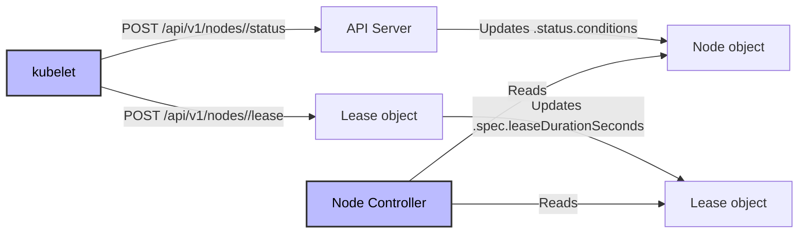
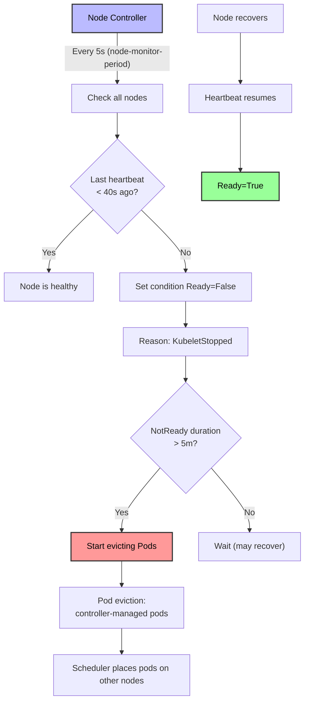
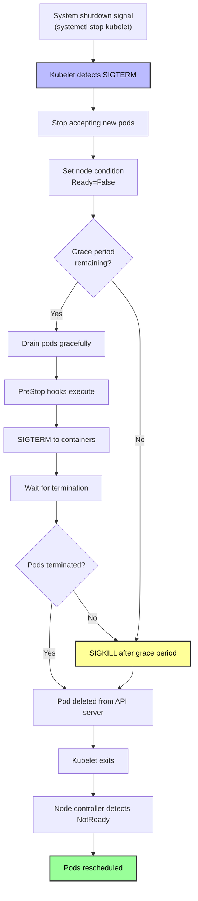

# Kubernetes Nodes - In-Depth Mechanics

## Node Lifecycle & Registration

Node lifecycle in Kubernetes is a state machine managed by the kubelet (on the node) and the node controller (in the control plane). Understanding this lifecycle is critical for diagnosing node-related issues.

## Node Lifecycle Flow



## Detailed Lifecycle Stages

### 1. Node Registration

When a node boots, the kubelet registers it with the cluster:

```bash
# On the node, check kubelet configuration
cat /etc/kubernetes/kubelet.conf
# or
ps aux | grep kubelet | grep register-node

# Default behavior: --register-node=true
# Kubelet creates a Node object via POST /api/v1/nodes
```

**Node object creation**:

```yaml
# The initial Node object looks like:
apiVersion: v1
kind: Node
metadata:
  name: node-1
  labels:
    kubernetes.io/hostname: node-1
    beta.kubernetes.io/arch: amd64
    beta.kubernetes.io/os: linux
spec:
  taints:
  - effect: NoSchedule
    key: node.kubernetes.io/not-ready
status:
  conditions:
  - type: NetworkUnavailable
    status: "True"
    reason: "RouteCreated"
  - type: Ready
    status: "Unknown"
    reason: "KubeletReady"
```

**Key flags**:

| Flag | Default | Description |
| :--- | :--- | :--- |
| `--register-node` | `true` | Register node with API server |
| `--node-labels` | (empty) | Labels to apply to the Node object |
| `--node-taints` | (empty) | Taints to apply to the Node object |
| `--register-with-taints` | (empty) | Taints applied at registration |
| `--register-synchronously` | `false` | Wait for node registration before starting kubelet |
| `--node-status-update-frequency` | `10s` | How often to post node status |
| `--node-status-report-frequency` | `5m` | How often to report status if unchanged |

### 2. CNI Initialization

The `NetworkUnavailable` condition starts as `True`. Once the CNI plugin initializes:

```bash
# Check CNI configuration on the node
ls /etc/cni/net.d/

# Example for Calico:
cat /etc/cni/net.d/10-calico.conflist

# Check network interfaces
ip addr show cni0
# 3: cni0: <NO-CARRIER,BROADCAST,MULTICAST,UP,LOWER_UP> mtu 1450
#     inet 10.244.0.1/24 scope global cni0

# Check routes
ip route show
# default via 192.168.1.1 dev ens18
# 10.244.0.0/24 via 10.244.0.0 dev cni0
```

The CNI plugin:
1. Creates a bridge or interface (e.g., `cni0`, `flannel.1`, `cali...`)
2. Assigns pod CIDR to the node
3. Sets up masquerade / NAT rules for outbound traffic
4. Configures IP forwarding

Once ready, the kubelet updates the node condition:

```yaml
status:
  conditions:
  - type: NetworkUnavailable
    status: "False"  # CNI is ready
    reason: "NetworkPluginReady"
```

### 3. Heartbeat Mechanism

The kubelet sends heartbeats via two mechanisms:



**Two heartbeat mechanisms**:

| Mechanism | Object | Update Frequency | Purpose |
| :--- | :--- | :--- | :--- |
| **NodeStatus** | `Node.status.conditions` | `node-status-update-frequency` (default `10s`) | Full node status, conditions, capacity, allocatable |
| **Lease** | `Node Lease` object | `lease-duration` (default `40s`) | Lightweight heartbeat for node liveness |

```bash
# Check lease object
kubectl get lease node-1 -n kube-system

# NAME     HOLDER                         AGE     DURATION
# node-1   node-1                        10d     40s

# Check node status
kubectl get node node-1 -o jsonpath='{.status.conditions[?(@.type=="Ready")].lastHeartbeatTime}'
# 2024-01-15T10:00:00Z
```

### 4. Node Controller Monitoring

The node controller runs in the `kube-controller-manager` and monitors node health:

```bash
# Controller manager flags (on control plane nodes):
--node-monitor-grace-period=40s       # Duration after which unreachable node is marked NotReady
--node-monitor-period=5s              # How often node controller checks all nodes
--pod-eviction-timeout=5m             # Duration after which pods are evicted from NotReady node
--node-eviction-rate=0.1              # Number of nodes per second that can be evicted (0.1 = 1 per 10s)
--secondary-node-eviction-rate=0.01   # Rate for nodes in multiple-zone failure
--large-cluster-size-threshold=50     # Nodes threshold for large cluster eviction rate
```

**Monitoring flow**:



### 5. Pod Eviction on Node Failure

When a node is evicted, the controller handles different pod types differently:

| Pod Type | Behavior |
| :--- | :--- |
| **Mirror pods** (static pods) | Deleted by the node controller |
| **Standalone pods** (no controller) | Deleted immediately |
| **ReplicaSet/Deployment pods** | Deleted, then recreated by the controller on another node |
| **DaemonSet pods** | May be recreated on another node if `node-affinity` allows |
| **Critical pods** (priorityClassName: system-node-critical) | Not evicted by default, but may be killed if node shuts down |

**Eviction process**:

```bash
# 1. Node controller sets Ready=False
kubectl get node node-2
# NAME     STATUS     ROLES    AGE   VERSION
# node-2   NotReady   <none>   10d   v1.28.0

# 2. After 5 minutes, pods are evicted
kubectl get pods -o wide
# NAME                    READY   STATUS        RESTARTS   AGE   IP           NODE
# nginx-5d4f6b8c9-x2abc   1/1     Terminating   0          5m    10.244.1.5   node-2

# 3. New pod scheduled on healthy node
kubectl get pods -o wide
# NAME                    READY   STATUS        RESTARTS   AGE   IP           NODE
# nginx-5d4f6b8c9-x2def   1/1     Running       0          10s   10.244.0.8   node-1
```

### 6. Node Shutdown Graceful Handling

Since Kubernetes 1.20, nodes can gracefully shut down:

```bash
# Enable graceful shutdown (kubelet flag)
--feature-gates=GracefulNodeShutdown=true

# Or via kubelet config
# /var/lib/kubelet/config.yaml:
featureGates:
  GracefulNodeShutdown: true
```

**Graceful shutdown flow**:



## Configuring Node Controller Parameters

### On Control Plane Nodes

```bash
# Edit kube-controller-manager manifest (static pod)
kubectl edit -n kube-system pod kube-controller-manager-<node-name>

# Example flags:
spec:
  containers:
  - command:
    - kube-controller-manager
    - --node-monitor-grace-period=40s
    - --pod-eviction-timeout=5m
    - --node-eviction-rate=0.1
    - --secondary-node-eviction-rate=0.01
    - --large-cluster-size-threshold=50
```

### On Worker Nodes

```bash
# /etc/default/kubelet or /etc/sysconfig/kubelet
KUBELET_KUBEADM_ARGS="--node-status-update-frequency=10s --node-status-report-frequency=5m"

# Or via kubelet config
# /var/lib/kubelet/config.yaml:
nodeStatusUpdateFrequency: 10s
nodeStatusReportFrequency: 5m
```

## Best Practices

1. **Tune eviction thresholds for your workload** - default 5-minute eviction timeout may be too aggressive for stateful workloads that need graceful migration.
2. **Use pod disruption budgets (PDBs)** - prevent too many pods from being evicted simultaneously during node failures.
3. **Monitor node controller metrics** - `node_collector_evictions_total`, `node_collector_zone_health`.
4. **Set appropriate `node-monitor-grace-period`** - shorter values detect failures faster but increase false positives from transient network issues.
5. **Use node taints to prevent scheduling during issues** - if a node is degraded but NotReady, taint it to prevent pods from being scheduled there even if Ready flips back to True.

## Common Pitfalls

### Pitfall 1: Clock skew causing false NotReady

```bash
# Symptoms: Nodes randomly go NotReady and come back
# Cause: Clock drift between node and API server (> 5 minutes)

# Check clock sync
timedatectl status
# Check NTP
chronyc tracking
# or
ntpq -p

# Fix: enable and configure NTP
timedatectl set-ntp true
```

### Pitfall 2: Network partition masquerading as node failure

```bash
# Symptoms: Node shows NotReady, but the node itself is healthy
# kubectl describe node shows last heartbeat time is recent

# Cause: Node can reach API server, but API server cannot reach node (or vice versa)
# The node controller is on the control plane, so if the control plane cannot reach the node,
# it marks it NotReady even if the node is fine

# Check connectivity from control plane to node
kubectl debug node/node-2 -it --image=busybox -- sh
# nc -zv node-2 10250

# Check from node to API server
kubectl run debug --image=busybox --rm -it --restart=Never -- sh
# wget -O- https://kubernetes.default.svc/healthz
```

### Pitfall 3: `--register-with-taints` applied twice

```bash
# If you register a node with taints via kubelet flag:
# --register-with-taints=node-role.kubernetes.io/worker=:NoSchedule

# And also add taints manually:
kubectl taint node node-1 dedicated=worker:NoSchedule

# The node gets BOTH taints, which may make it unschedulable

# Check current taints
kubectl describe node node-1 | grep -A 5 Taints
```

### Pitfall 4: Eviction timeout too short for stateful workloads

```bash
# Default pod-eviction-timeout is 5 minutes
# For a database with 100GB of data, 5 minutes may not be enough for graceful shutdown
# The pod gets SIGKILL and may corrupt data

# Fix: increase the timeout on the controller manager
# --pod-eviction-timeout=10m
# Or use PodDisruptionBudget to control eviction rate
apiVersion: policy/v1
kind: PodDisruptionBudget
metadata:
  name: myapp-pdb
spec:
  minAvailable: 2
  selector:
    matchLabels:
      app: myapp
```

### Pitfall 5: Static pod manifests not updating

```bash
# Static pods are managed by kubelet directly, not the API server
# /etc/kubernetes/manifests/kube-apiserver.yaml

# If you edit the file, kubelet detects the change and restarts the pod
# But the API server pod object is not updatable via kubectl

# Verify static pod status
kubectl get pods -n kube-system
# NAME                     READY   STATUS    RESTARTS   AGE
# kube-apiserver-node-1    1/1     Running   0          10d
# Note the node name appended
```

## Community Knowledge

- **Node Lifecycle Controller**: Part of the `kube-controller-manager`, not a separate process. It handles registration, heartbeats, and evictions.
- **Lease API**: Introduced in Kubernetes 1.17 to reduce API server load from node status updates. The lease object is smaller and updated more frequently.
- **Node Problem Detector**: A community project that monitors kernel logs, systemd, and other sources to detect node-level issues (hardware, kernel panic, etc.) and report them as node conditions.
- **Cluster Autoscaler**: Depends on node conditions. If a node is NotReady, the cluster autoscaler may choose to delete it rather than fix it.
- **Graceful Node Shutdown**: KEP 1875 introduced this feature to handle cloud provider preemption (spot instance termination) and planned maintenance.
