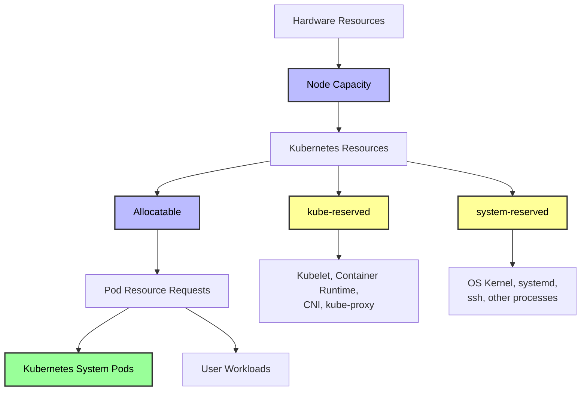
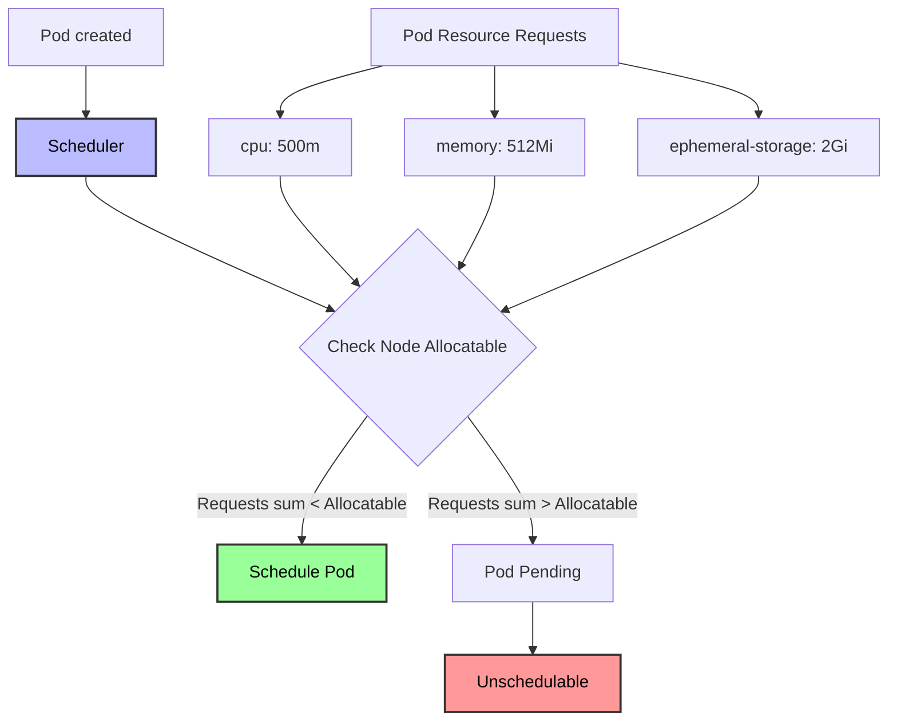
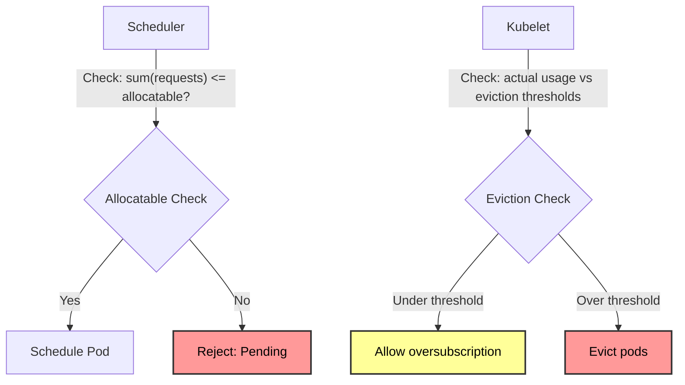

# Kubernetes Nodes - In-Depth Mechanics

## Resource Accounting

Kubernetes nodes have finite hardware resources. The scheduler uses node resource capacity and allocatable values to decide where to place Pods. Understanding these accounting mechanisms prevents scheduling failures and resource contention.

## Resource Hierarchy



## Detailed Definitions

### Capacity

Capacity is the total hardware resources visible to the kubelet.

```bash
# View node capacity
kubectl describe node node-1 | grep -A 10 "Capacity"
# Capacity:
#   cpu:                4
#   ephemeral-storage:  16434924Ki
#   hugepages-1Gi:      0
#   hugepages-2Mi:      0
#   memory:             16314200Ki
#   pods:               110
```

**How capacity is determined**:
- **CPU**: Number of cores as reported by the OS (including hyper-threading).
- **Memory**: Total physical RAM as reported by the OS.
- **Pods**: Maximum number of pods the kubelet can manage (derived from `--max-pods`, default is `110` for Docker, calculated from IP addresses for other runtimes).
- **Ephemeral storage**: Total disk space on the node (excluding mounted volumes).

```bash
# On the node itself, check hardware
lscpu | grep -E "CPU\(s\)|Model name"
free -h
df -h /
cat /proc/sys/kernel/pid_max
# or
sysctl kernel.pid_max
```

### Allocatable

Allocatable is the resources available for Pods.

```bash
# View node allocatable
kubectl describe node node-1 | grep -A 10 "Allocatable"
# Allocatable:
#   cpu:                3
#   ephemeral-storage:  14567538Ki
#   hugepages-1Gi:      0
#   hugepages-2Mi:      0
#   memory:             15032600Ki
#   pods:               100
```

**Formula**:

```
Allocatable = Capacity - kube-reserved - system-reserved - eviction-threshold
```

**Note**: The eviction threshold is NOT subtracted from allocatable for scheduling purposes. It is only used by the kubelet's eviction manager. This is a common point of confusion.

### kube-reserved

Resources reserved for Kubernetes system daemons running on the node.

```bash
# Configure kube-reserved (kubelet flag or kubelet config)
# /var/lib/kubelet/config.yaml:
kubeReserved:
  cpu: "500m"
  memory: "1Gi"
  ephemeral-storage: "10Gi"
  pid: "1000"

# Or via kubelet command line flags:
# --kube-reserved=cpu=500m,memory=1Gi,ephemeral-storage=10Gi,pid=1000
```

**What it covers**:
- kubelet itself
- container runtime (containerd/CRI-O)
- kube-proxy
- CNI plugin (if running as a DaemonSet or host process)

**Common kube-reserved values**:

| Node Size | CPU | Memory |
| :--- | :--- | :--- |
| Small (2 cores, 4GB) | 500m | 1Gi |
| Medium (4 cores, 8GB) | 1000m | 2Gi |
| Large (8 cores, 16GB) | 1000m | 4Gi |
| Extra Large (16 cores, 32GB) | 2000m | 8Gi |

### system-reserved

Resources reserved for OS and non-Kubernetes system processes.

```bash
# /var/lib/kubelet/config.yaml:
systemReserved:
  cpu: "500m"
  memory: "1Gi"
  ephemeral-storage: "10Gi"
  pid: "1000"
```

**What it covers**:
- OS kernel and systemd
- sshd, journald, system monitoring
- logging agents (fluentd, promtail)
- security agents (falco, sysdig)
- any other non-containerized system processes

## How the Scheduler Uses Allocatable



**Scheduling decision**:

```bash
# Example: Node with 4 cores, 16GB RAM
# kube-reserved: 1 core, 4GB
# system-reserved: 1 core, 2GB

# Capacity:
#   cpu: 4000m
#   memory: 16384Mi

# Allocatable:
#   cpu: 4000m - 1000m - 1000m = 2000m
#   memory: 16384Mi - 4096Mi - 2048Mi = 10240Mi

# Scheduler will only place Pods if total requests < Allocatable
# If Pods request 2500m CPU, scheduling fails (pending)
```

## Oversubscription

Oversubscription occurs when Pod resource requests exceed node allocatable. By default, Kubernetes prevents this, but it can be enabled.

```bash
# Enable oversubscription (kubelet flag)
--kubelet-config={"evictionHard":{"memory.available":"100Mi"},"systemReserved":{"cpu":"200m","memory":"300Mi"},"kubeReserved":{"cpu":"200m","memory":"300Mi"}}
```

**When oversubscription happens**:



**Important**: The scheduler checks requests against allocatable. The kubelet checks actual usage against eviction thresholds. These are independent checks.

## Inspecting Resource Usage

### Using kubectl top

```bash
# Install metrics-server first
kubectl top nodes

# NAME     CPU(cores)   CPU%   MEMORY(bytes)   MEMORY%
# node-1   850m         21%    6024Mi          38%
# node-2   1200m        30%    8192Mi          52%

# Check pod resource usage
kubectl top pods -n production

# NAME                    CPU(cores)   MEMORY(bytes)
# nginx-5d4f6b8c9-x2abc   50m          128Mi
```

### Using kubectl describe

```bash
# View resource requests and limits for all pods on a node
kubectl describe node node-1 | grep -A 50 "Allocated resources"

# Output:
# Allocated resources:
#   (Total limits may be over 100 percent, i.e., overcommit exists.)
#   Resource                    Requests    Limits
#   --------                    --------    ------
#   cpu                         1400m (70%) 2800m (140%)
#   memory                      4096Mi (40%) 8192Mi (80%)
#   ephemeral-storage           0 (0%)      0 (0%)
#   hugepages-1Gi               0 (0%)      0 (0%)
#   hugepages-2Mi               0 (0%)      0 (0%)
```

### Using kubectl get with custom columns

```bash
# Get node capacity and allocatable in table format
kubectl get nodes -o custom-columns=\
NAME:.metadata.name,\
CPU_CAP:.status.capacity.cpu,\
CPU_ALLOC:.status.allocatable.cpu,\
MEM_CAP:.status.capacity.memory,\
MEM_ALLOC:.status.allocatable.memory,\
POD_CAP:.status.capacity.pods,\
POD_ALLOC:.status.allocatable.pods
```

## Best Practices

1. **Always set kube-reserved and system-reserved** - without these, the scheduler may overcommit, leading to OOM kills of system processes.
2. **Set requests and limits for all containers** - limits prevent one pod from starving others.
3. **Monitor allocatable utilization** - aim for 70-80% CPU and memory utilization to leave headroom for spikes.
4. **Use LimitRange for default values** - ensure all pods in a namespace have requests/limits.
5. **Use ResourceQuota for namespace limits** - prevent a single namespace from consuming all cluster resources.
6. **Consider Quality of Service (QoS)** - Guaranteed pods (requests == limits) are last to be evicted; BestEffort pods are first.

## Quality of Service (QoS) Classes

Kubernetes assigns QoS classes based on resource requests and limits:

| QoS Class | Criteria | Eviction Priority |
| :--- | :--- | :--- |
| **Guaranteed** | Every container has requests == limits for CPU and memory | Lowest (evicted last) |
| **Burstable** | At least one container has a request or limit | Medium |
| **BestEffort** | No container has requests or limits | Highest (evicted first) |

```bash
# Check QoS class for a pod
kubectl get pod nginx -o jsonpath='{.status.qosClass}'
# Guaranteed

# Verify why it is Guaranteed
kubectl get pod nginx -o yaml | grep -E "limits|requests"
# resources:
#   limits:
#     cpu: "1"
#     memory: 1Gi
#   requests:
#     cpu: "1"
#     memory: 1Gi
```

## Common Pitfalls

### Pitfall 1: No kube-reserved / system-reserved

```bash
# Symptoms: Kubernetes system pods (kubelet, containerd) get OOM killed
# Node becomes NotReady

# Cause: User workloads consumed all memory, leaving nothing for system

# Fix: set kube-reserved and system-reserved
# In kubelet config:
kubeReserved:
  cpu: "500m"
  memory: "1Gi"
systemReserved:
  cpu: "500m"
  memory: "1Gi"
```

### Pitfall 2: Ignoring eviction thresholds

```bash
# Symptoms: Node shows MemoryPressure or DiskPressure
# Pods are being evicted unexpectedly

# Check eviction thresholds
kubectl get node node-1 -o jsonpath='{.status.allocatable.memory}'
# 15032600Ki
# If actual usage is 14.5GB, eviction may trigger

# View kubelet eviction configuration
ps aux | grep kubelet | grep eviction
# --eviction-hard=memory.available<100Mi,nodefs.available<10%,nodefs.inodesFree<5%
```

### Pitfall 3: Oversubscription without monitoring

```bash
# Symptoms: Pods are scheduled but performance is terrible
# Multiple pods compete for CPU time

# Check if oversubscription is happening
kubectl describe node node-1 | grep -A 20 "Allocated resources"
# cpu: 3500m / 2000m allocatable  (175% - heavily oversubscribed)

# Fix: either add nodes or set requests closer to actual usage
```

### Pitfall 4: PID pressure

```bash
# Symptoms: Pods fail to start with "cannot create new process" errors
# Node shows PIDPressure=True

# Check PID usage
kubectl get node node-1 -o jsonpath='{.status.allocatable.pods}'   # max pods
# 100
kubectl get pods --all-namespaces | wc -l
# 95

# But actual PIDs used may be higher:
# Each container uses PIDs, plus kubelet and system processes
# Check on the node:
ps aux | wc -l
# or
cat /proc/sys/kernel/pid_max
# 4194304

# Increase max pods or PID limits
kubelet --max-pods=150
```

### Pitfall 5: Ephemeral storage miscalculation

```bash
# Symptoms: Pods evicted with "Evicted" reason, insufficient ephemeral storage

# Check ephemeral storage allocatable
kubectl describe node node-1 | grep -A 2 "ephemeral-storage"
# Capacity: 16434924Ki
# Allocatable: 14567538Ki

# Docker overlay filesystem may report different sizes than actual
# Check actual disk usage on node
df -h /var/lib/kubelet

# Fix: configure eviction thresholds explicitly
kubelet --eviction-hard=nodefs.available<10%
```

## Community Knowledge

- **Scheduler Framework**: The scheduler uses `allocatable` for its Filter and Score plugins. The `NodeResourcesFit` plugin checks if pod requests fit within allocatable.
- **Kubelet eviction vs Scheduler**: A common misconception is that the scheduler prevents overcommit. It does not prevent oversubscription of actual usage, only of declared requests.
- **Node Allocatable Enforcer**: The kubelet's `Device Manager` (for GPUs, etc.) also uses allocatable as the upper bound.
- **Vertical Pod Autoscaler (VPA)**: VPA recommends resource requests based on actual usage, but it cannot exceed allocatable.
- **Production guidelines**: Kubernetes SIG Node recommends setting kube-reserved to at least the resource usage of the kubelet + container runtime + CNI plugin. Measure actual usage on a running node to calibrate values.
