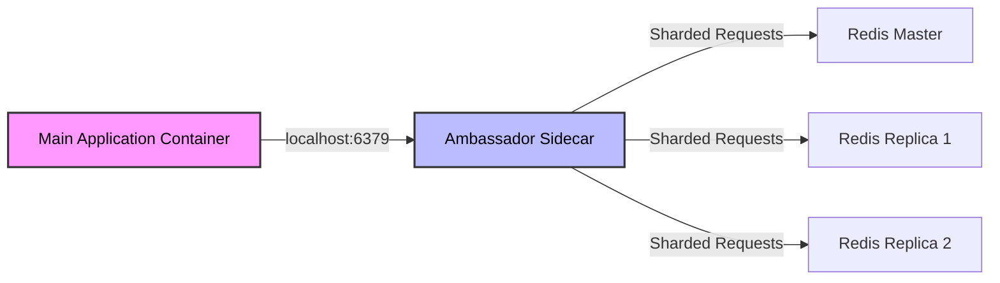

# Multi-Container Pods - In-Depth Mechanics

## Ambassador Pattern

### Concept

The **Ambassador Pattern** uses a sidecar container to proxy connections to the main application, abstracting away details of external services. The main application communicates with a local endpoint (the ambassador), and the ambassador handles routing, retries, or protocol translation to the real destination.

This pattern enables the **hexagonal architecture (ports and adapters)** approach within a Kubernetes Pod, allowing the main container to remain unaware of the production environment's topology.

### Architecture



### Real-World Example: Database Connection Broker

In a sharded database environment, application code should not contain sharding logic. Instead, run a connection broker (like `twemproxy` or a custom proxy) as an ambassador.

**Kubernetes Manifest:**

```yaml
apiVersion: v1
kind: Pod
metadata:
  name: app-with-ambassador
spec:
  containers:
  - name: main-app
    image: myapp:1.0
    env:
    - name: REDIS_HOST
      value: "127.0.0.1"
    - name: REDIS_PORT
      value: "6379"
    # Application thinks it connects to a single Redis instance
  - name: redis-ambassador
    image: twemproxy:latest
    args:
    - "-c"
    - "/etc/twemproxy/config.yaml"
    ports:
    - containerPort: 6379
      name: redis
```

The main app uses `localhost:6379`. The ambassador intercepts and routes to the correct shard, handles connection pooling, or applies retries without application code changes.

### Common Use Cases

| Use Case | Ambassador Technology | Benefit |
|----------|----------------------|---------|
| Sharded databases | Custom proxy, Twemproxy | Application remains shard-agnostic |
| Service mesh sidecar proxying | Envoy, Istio | Automatic mTLS, retries, telemetry |
| External API versioning | Custom proxy | Redirect v1 API calls to v2 backend transparently |
| Local development vs production abstraction | Skaffold/Skaffold alternatives, custom proxy | Same binary runs locally and in-cluster |

### When to Use

- You need to change the destination of network traffic without rebuilding the main application.
- The same application binary must run locally and in production with different backends.
- You want to inject resilience patterns (retries, circuit breaking) transparently.

### When NOT to Use

- If the overhead of maintaining an ambassador outweighs the benefit.
- When a service mesh (like Istio) already provides these capabilities at the cluster level.
- For simple, stable endpoints that rarely change.

### Best Practices

1. **Use localhost for communication**: The ambassador should always listen on `127.0.0.1` so traffic never leaves the node, minimizing latency and avoiding network policy overhead.
2. **Keep the ambassador lightweight**: Ambassadors are typically I/O bound. Use small images (Alpine, distroless) to reduce Pod resource footprint.
3. **Manage ambassador lifecycle**: If the ambassador crashes, the main app loses connectivity. Ensure the Pod's `restartPolicy` and ambassador health checks are appropriate.
4. **Log both sides**: Log requests in the ambassador so you can debug routing issues without touching the main app.

### Common Pitfalls

1. **Port conflicts**: If the main app also wants to use the same port, the ambassador must come first in the Pod's container list and bind to `127.0.0.1`. Kubernetes does not prevent port conflicts between containers in the same Pod.
2. **Silent failures**: If the ambassador misroutes or drops traffic, the main app may not report errors. Monitor ambassador health independently.
3. **Resource contention**: Both containers share the Pod's cgroup resource limits. An ambassador that leaks memory can starve the main app.

### Community Knowledge

- **Twemproxy** (Twitter): Proven at massive scale for sharded Redis/Memcached deployments.
- **Envoy**: The de facto data plane for service meshes. When you need the full feature set (mTLS, observability), an Istio-managed Envoy sidecar acts as a powerful ambassador.
- **Cloud Native Ambassador**: Some teams run a small Go/Python proxy to handle rotating credentials (database passwords, API tokens) so the main app never needs restart on credential rotation.
