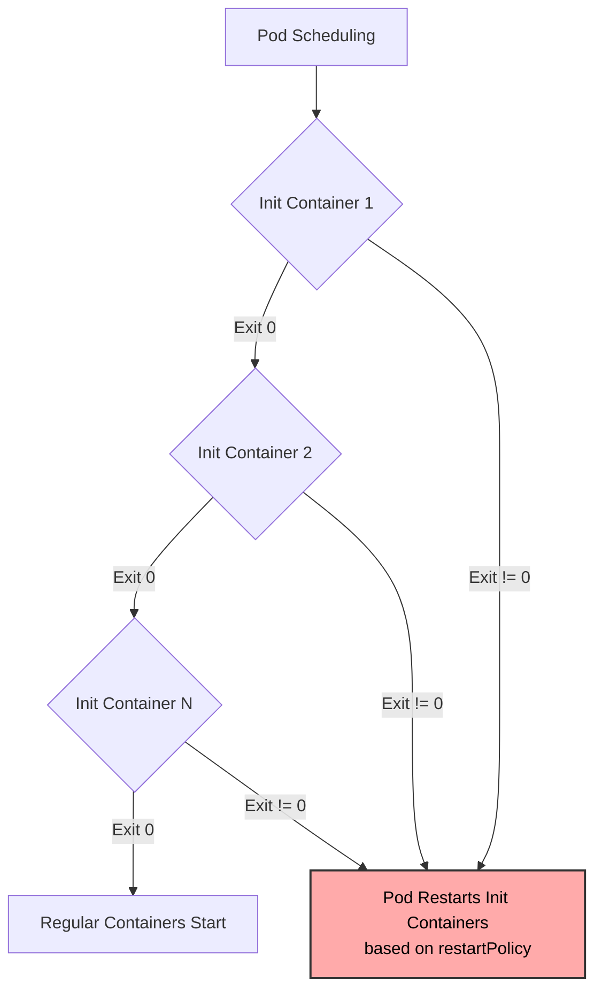

# Multi-Container Pods - In-Depth Mechanics

## Init Containers

### Concept

**Init containers** are specialized containers that run to completion **before** any regular application containers in a Pod start. They allow Pods to contain setup code that must execute in a specific order, or to wait for preconditions to be met.

Key difference from regular containers: init containers run sequentially, not in parallel, and they must each succeed (exit 0) before the next begins.

### Execution Model



### Key Characteristics

1. **Sequential Execution**: Init containers run one at a time in the order defined in the Pod spec. There is no built-in parallel init container execution (future Kubernetes versions may add this).

2. **Failure & Restart Behavior**:
   - If an init container fails, the entire Pod is restarted and the init container is retried.
   - This follows the Pod's `restartPolicy`:
     - `Always` or `OnFailure`: Init container is retried indefinitely (with exponential backoff).
     - `Never`: Pod enters `Failed` state after init container failure and does not restart.
   - **Caveat**: A Pod stuck in `Init:0/1` with `CrashLoopBackOff` is an init container failing repeatedly.

3. **Resource Scheduling**:
   - The scheduler uses the **highest request** among all init containers and regular containers for Pod placement.
   - This means an init container requesting more resources than the app container can cause over-provisioning.
   - Limts are not considered for scheduling; only requests matter.

4. **Filesystem Isolation**:
   - Init containers share the same `emptyDir` volumes as regular containers.
   - Init containers can write to a shared volume, and the main container reads it after init completes.
   - Image layer filesystems are separate: binaries or configs written in an init container are **not** visible to the next init container or main container unless stored in a volume.

### Resource Handling Details

The scheduler makes placement decisions based on the maximum of:

- Sum of all regular container requests
- Maximum of any single init container request

```yaml
# Example: Scheduler sees max(500m, 250m, 100m) = 500m for CPU
# Even though regular containers only need 250m + 100m = 350m total
containers:
- name: main
  resources:
    requests:
      cpu: "250m"
      memory: "256Mi"
- name: helper
  resources:
    requests:
      cpu: "100m"
      memory: "128Mi"
initContainers:
- name: heavy-setup
  resources:
    requests:
      cpu: "500m"
      memory: "512Mi"
```

### Common Use Cases

| Use Case | Implementation |
|----------|---------------|
| Wait for service dependencies | Loop until DNS resolves, port is open, or HTTP endpoint returns 200 OK. |
| Clone repos or download artifacts | Git clone into an `emptyDir` volume for the app to use. |
| Register with service discovery | Call Consul or etcd API before the app starts. |
| Data migrations or schema setup | Run a database migration script before the app connects. |
| Warm caches | Preload configuration or certificates into a shared volume. |
| Permission setup | Change ownership of a volume mount if the app runs as a non-root user. |

### Concrete Example: Wait for Database

```yaml
apiVersion: v1
kind: Pod
metadata:
  name: app-with-db-wait
spec:
  restartPolicy: OnFailure
  initContainers:
  - name: wait-for-db
    image: busybox:1.36
    command:
    - sh
    - -c
    - |
      until nslookup mysql-service.default.svc.cluster.local; do
        echo "Waiting for DNS..."
        sleep 2
      done
      until nc -z mysql-service.default.svc.cluster.local 3306; do
        echo "Waiting for MySQL..."
        sleep 2
      done
      echo "MySQL is ready"
  containers:
  - name: app
    image: myapp:1.0
    env:
    - name: DATABASE_HOST
      value: mysql-service.default.svc.cluster.local
```

### Best Practices

1. **Set explicit resource requests** on init containers. This prevents the scheduler from placing the Pod on an undersized node.
2. **Use minimal images** like `busybox` or `alpine` for simple wait scripts. Larger images increase Pod startup time.
3. **Avoid side effects**: Init containers should be idempotent since they may run multiple times due to restarts.
4. **Use `restartPolicy: OnFailure`** for Jobs with init containers so failed init containers are retried without manual intervention.
5. **Limit init container complexity**: If your init logic exceeds ~50 lines of shell, consider packaging it as a proper binary or using a Job instead.

### Common Pitfalls & Troubleshooting

1. **Pod stuck in `Init:0/1`**:
   - Run `kubectl describe pod <name>` and look at the `Init Containers` section.
   - Check container logs with `kubectl logs <pod> -c <init-container-name>`.
   - If no logs are available, check if the container is still starting or pulling an image.

2. **OOM during init**:
   - Init containers share the Pod's memory limit if set. If the regular container has a low memory limit, an init container may be OOMKilled.
   - Fix by either increasing the memory limit or using separate resource constraints.

3. **Init container can't mount volume**:
   - Verify the volume is defined at the Pod level and both containers mount it correctly.
   - Check if a `PersistentVolumeClaim` is still `Pending` -- init containers will wait for it.

4. **Init container succeeds but app fails**:
   - This is not an init container problem. The init container only prepares the environment. Check the main container's logs and events.

5. **Using init containers for long-running tasks**:
   - Init containers are not designed for daemons. If your "init" step needs to stay running, make it a regular container or a host-level service.

### Event Observation

```bash
# Check Pod phase and init container status
kubectl get pod <pod-name> -o wide

# Describe to see init container transitions
kubectl describe pod <pod-name>

# View init container logs (remember to specify -c)
kubectl logs <pod-name> -c <init-container-name>
```
