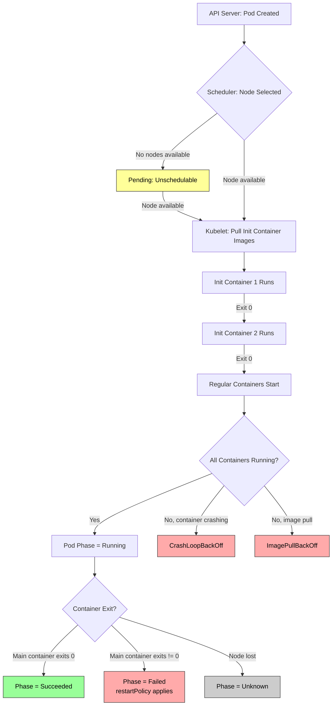
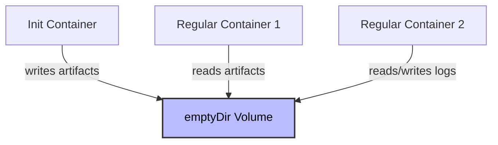

# Multi-Container Pods - In-Depth Mechanics

## Pod Lifecycle with Containers

### Full Lifecycle Flow

When Kubernetes creates a Pod, it follows a deterministic sequence involving init containers and regular containers. Understanding this flow is essential for debugging startup issues and designing complex Pods.



### The Init -> Regular Container Handoff

Init containers are not just "containers that run first." They provide a distinct execution environment for dependent setup tasks:

| Aspect | Init Containers | Regular Containers |
|--------|----------------|-------------------|
| Execution | Sequential | Parallel (default) |
| Restart | Pod-level restartPolicy | Pod-level restartPolicy |
| Visibility | Cannot read other init containers' changes unless in shared volume | Cannot read other regular containers' data unless in shared volume |
| Health Probes | Not supported | Liveness, readiness, and startup probes supported |
| Resource Guarantees | Requests considered for scheduling | Requests/limits enforced at runtime |

### Volume Sharing: emptyDir

The most common interaction between containers within a Pod is through a shared `emptyDir` volume. An `emptyDir` volume is created when the Pod is assigned to a node and exists as long as the Pod is running on that node.

**Data flow with shared volumes:**



**Example: Git clone and serve**

```yaml
apiVersion: v1
kind: Pod
metadata:
  name: static-site
spec:
  volumes:
  - name: site-content
    emptyDir: {}
  initContainers:
  - name: git-clone
    image: alpine/git:latest
    command:
    - /bin/sh
    - -c
    - |
      git clone https://github.com/example/site.git /repo
      cp -r /repo/* /repo/.* /site/
    volumeMounts:
    - name: site-content
      mountPath: /site
  containers:
  - name: nginx
    image: nginx:alpine
    volumeMounts:
    - name: site-content
      mountPath: /usr/share/nginx/html
    ports:
    - containerPort: 80
```

The `git-clone` init container populates `/site`. When it exits successfully, the `nginx` container starts and finds the cloned content at `/usr/share/nginx/html`.

### Shared Volume for Log Aggregation

When multiple containers share an `emptyDir` volume, they can read/write to the same physical directory on the node. This is commonly used for log aggregation.

```yaml
apiVersion: v1
kind: Pod
metadata:
  name: app-with-log-collection
spec:
  volumes:
  - name: shared-logs
    emptyDir: {}
  containers:
  - name: main-app
    image: myapp:1.0
    volumeMounts:
    - name: shared-logs
      mountPath: /var/log/app
  - name: log-shipper
    image: fluent/fluent-bit:latest
    volumeMounts:
    - name: shared-logs
      mountPath: /var/log/app
      readOnly: true
    # fluent-bit tails /var/log/app/*.log and ships to external storage
```

### Inter-Container Communication

Besides volumes, containers in the same Pod communicate via:

1. **localhost networking**: All containers in a Pod share the same network namespace. They can reach each other on `localhost:<port>`. However, they must not use the same port.
2. **Shared Process ID space**: Containers share the same network namespace and IP address. Each container has its own process namespace, but they can see each other's processes via host PID if configured (rare and security-sensitive).
3. **Inter-process communication (IPC)**: Containers can use System V IPC or POSIX message queues if they share the same PID namespace or use host IPC.

### Common Pitfalls

1. **Assuming containers start simultaneously**:
   - Regular containers in the same Pod start in parallel. There is no guaranteed start order.
   - If Container B depends on Container A's state, use a readiness probe on A or an init container to ensure ordering.

2. **Race conditions on shared volumes**:
   - Container A may attempt to read a file that Container B is still writing. Use file locks or explicit handoff files.

3. **emptyDir data loss on eviction**:
   - `emptyDir` volumes are deleted when the Pod is removed from the node (eviction, node failure, deployment update). Do not store persistent data in `emptyDir`.
   - For persistence across Pod restarts or node changes, use `PersistentVolumeClaim` or a StatefulSet.

4. **Resource limits affecting init and regular containers together**:
   - If `limits.memory` is set on the Pod, all containers (init and regular) share that limit. The sum of all container memory usage must stay under the Pod limit.

### Observability Commands

```bash
# View container states and restart counts per container
kubectl get pod <pod-name> -o jsonpath='{range .status.containerStatuses[*]}{.name}{"\t"}{.state}{"\n"}{end}'

# Check init container status
kubectl get pod <pod-name> -o jsonpath='{range .status.initContainerStatuses[*]}{.name}{"\t"}{.state}{"\n"}{end}'

# See which containers are in CrashLoopBackOff
kubectl get pod <pod-name>
kubectl describe pod <pod-name> | grep -A5 "Containers:"

# Monitor all events for a pod
kubectl get events --field-selector involvedObject.name=<pod-name> --sort-by='.lastTimestamp'

# Check if emptyDir volume has expected files
kubectl exec <pod-name> -c <container-name> -- ls /path/to/shared
```
