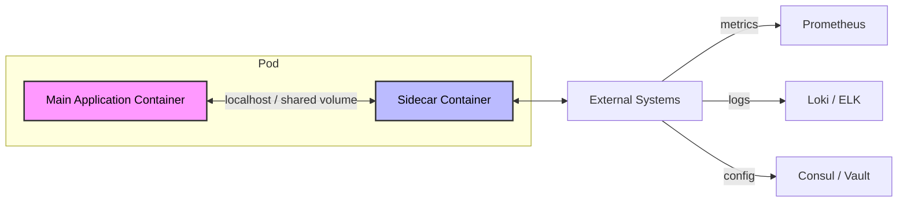

# Multi-Container Pods - In-Depth Mechanics

## Sidecar Pattern

### Concept

The **Sidecar Pattern** extends a primary application container by attaching an auxiliary "sidecar" container that provides additional functionality. The sidecar runs alongside the main container within the same Pod, sharing the Pod's network namespace, IPC namespace, and volumes.

Unlike the Ambassador or Adapter patterns, the Sidecar is a broad architectural concept. It is not defined by proxying (Ambassador) or transforming (Adapter), but by its role as a **companion service** to the main application.

### Architecture



### Concrete Examples

#### 1. Log Shipping with Fluentd / Fluent Bit

The sidecar tails log files and forwards them to a centralized logging backend.

```yaml
apiVersion: v1
kind: Pod
metadata:
  name: app-with-log-sidecar
spec:
  containers:
  - name: main-app
    image: myapp:1.0
    volumeMounts:
    - name: log-volume
      mountPath: /var/log/app
  - name: log-sidecar
    image: fluent/fluent-bit:latest
    args: ["-c", "/etc/fluent-bit/fluent-bit.conf"]
    volumeMounts:
    - name: log-volume
      mountPath: /var/log/app
      readOnly: true
    resources:
      requests:
        cpu: "10m"
        memory: "64Mi"
      limits:
        cpu: "100m"
        memory: "128Mi"
  volumes:
  - name: log-volume
    emptyDir: {}
```

#### 2. Configuration Polling with Consul

A sidecar polls Consul for configuration changes and writes them to a shared volume. The main app reads the updated config without implementing Consul logic.

```yaml
apiVersion: v1
kind: Pod
metadata:
  name: config-aware-app
spec:
  containers:
  - name: main-app
    image: myapp:1.0
    volumeMounts:
    - name: config-volume
      mountPath: /etc/config
  - name: consul-config-watcher
    image: consul:latest
    command: ["/bin/sh", "-c"]
    args:
    - consul-template -consul-addr consul-service:8500 \
      -template "/consul/template/app.hcl:/etc/config/app.conf"
    volumeMounts:
    - name: config-volume
      mountPath: /etc/config
  volumes:
  - name: config-volume
    emptyDir: {}
```

#### 3. Service Mesh Proxy (Envoy / Istio)

In a service mesh, every Pod gets an Envoy proxy sidecar that intercepts all inbound and outbound traffic. This enables mTLS, telemetry, and traffic routing without application changes.

```yaml
# Conceptual: Istio injects this sidecar automatically
containers:
- name: main-app
  image: myapp:1.0
- name: envoy
  image: envoyproxy/envoy:v1.28-latest
  args:
  - proxy
  - sidecar
  - --configPath /etc/istio/proxy
  - --drainDuration 45s
  ports:
  - containerPort: 15001
    name: http-proxy
```

### Sidecar Patterns in Practice

| Pattern | Sidecar Role | Technology Examples |
|---------|-------------|---------------------|
| Log aggregation | Tail logs, parse, ship | Fluentd, Fluent Bit, Filebeat |
| Configuration management | Poll for updates, write to shared volume | Consul Template, Vault Agent |
| Service mesh | Proxy all network traffic, mTLS, telemetry | Envoy, Linkerd proxy |
| Credential rotation | Fetch secrets, refresh credentials on disk | Vault Agent Sidecar |
| Custom metrics | Scrape app-specific metrics, expose to Prometheus | JMX exporter, StatsD exporter |
| Certificate management | Request certs from CA, write to shared volume | cert-manager (when run as sidecar) |

### When to Use

- You cannot modify the main application but need to add functionality.
- Multiple applications need the same auxiliary functionality (log shipping, config management).
- You want to keep concerns separated: business logic vs. operational concerns.

### When NOT to Use

- If a DaemonSet achieves the same goal with less overhead (e.g., node-level log shipping with Filebeat).
- If the sidecar introduces unacceptable resource overhead or startup latency.
- When Kubernetes primitives (service accounts, projected volumes, CSI drivers) can solve the problem natively.

### Best Practices

1. **Monitor the sidecar independently**: Alert on sidecar crashes, log queue depths, and file descriptor exhaustion.
2. **Use `emptyDir` for temporary data**: Sidecars often need scratch space.
3. **Set explicit resources**: Sidecars run on the same node and compete for resources. Always set `requests` and `limits`.
4. **Avoid sidecar explosion**: Running 5 sidecars per Pod multiplies resource usage across a cluster. Use DaemonSets or init containers where possible.
5. **Prefer shared process model where possible**: If the sidecar and main app share a network namespace, use `localhost` for communication rather than Pod IP.
6. **Keep sidecars stateless or ephemeral**: Sidecars should not hold state that must survive Pod restarts.

### Common Pitfalls

1. **Pod startup latency**: Each sidecar adds seconds to startup. A Pod with 6 sidecars may take 30+ seconds to become Ready.
2. **CPU starvation**: Service mesh sidecars add 1-5ms latency per request and consume CPU. Under heavy load, this can cause throttling.
3. **Log loss during shutdown**: If the sidecar cannot drain its buffer before the main app exits, log data is lost. Use lifecycle hooks or preStop hooks.
4. **Port conflicts**: Sidecars must not use ports the main app needs. Use explicit container ports and verify no overlap.
5. **Memory bloat**: Sidecars with large internal buffers (log shippers, telemetry agents) can push the Pod toward memory limits. Use bounded buffers.

### Community Knowledge

- **Vault Agent Sidecar**: Vault's recommended pattern for Kubernetes. The sidecar handles token renewal and secret injection into shared memory or a shared volume.
- **istioctl proxy-status**: When using Istio, the sidecar is transparent but complex. Use `istioctl proxy-status` and `istioctl proxy-config` to debug Envoy configuration.
- **Inline vs. Init Sidecars**: Some teams use init containers as "sidecars that lead and remember" and regular sidecars as "sidecars that accompany for the lifetime." Choose the right model for your use case.
