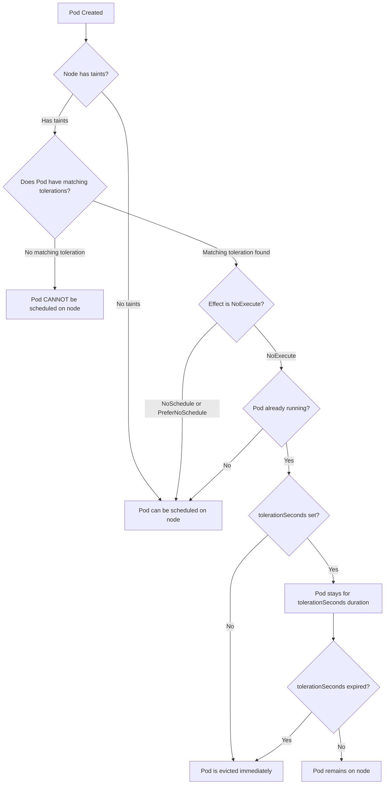

# Pods - Taints & Tolerations - Common Exam Patterns

This document covers the most frequently tested patterns involving taints and tolerations in Kubernetes exams and production scenarios.

## Control-Plane Node Taints

Control-plane (master) nodes are tainted by default to prevent user workloads from being scheduled on them. The default taint is:

```
node-role.kubernetes.io/control-plane:NoSchedule
```

On older clusters (pre-1.24), the taint key was `node-role.kubernetes.io/master`. The `NoSchedule` effect means that Pods without a matching toleration will not be scheduled onto the node, but already-running Pods are not evicted.

### Verifying Control-Plane Taints

```bash
kubectl describe node <control-plane-node-name> | grep -A5 Taints
```

### Toleration for Control-Plane Scheduling

If you need to schedule a Pod on a control-plane node (e.g., for monitoring or logging agents), add this toleration to the Pod spec:

```yaml
tolerations:
  - key: node-role.kubernetes.io/control-plane
    operator: Exists
    effect: NoSchedule
```

## Dedicated Node Taints

Administrators use custom taints to dedicate nodes to specific workloads. For example, a GPU node group might be tainted so that only GPU-enabled Pods are scheduled there.

```bash
kubectl taint nodes gpu-node-1 gpu=true:NoSchedule
```

A Pod that needs to run on GPU nodes must tolerate this taint:

```yaml
tolerations:
  - key: gpu
    operator: Equal
    value: "true"
    effect: NoSchedule
```

### Multiple Dedicated Taints

A node can have multiple taints, and a Pod must tolerate all of them (or use a wildcard) to be scheduled:

```bash
kubectl taint nodes dedicated-node env=prod:NoSchedule
kubectl taint nodes dedicated-node tier=frontend:NoSchedule
```

```yaml
tolerations:
  - key: env
    operator: Equal
    value: "prod"
    effect: NoSchedule
  - key: tier
    operator: Equal
    value: "frontend"
    effect: NoSchedule
```

## NoExecute Eviction Patterns

The `NoExecute` effect is the most disruptive. It not only prevents scheduling but also evicts already-running Pods that do not tolerate the taint.

### Automatic Node Controller Evictions

The node controller automatically adds `NoExecute` taints when a node becomes unreachable or not ready:

- `node.kubernetes.io/unreachable:NoExecute`
- `node.kubernetes.io/not-ready:NoExecute`

These taints are added by the node controller and removed automatically when the node recovers. Pods without tolerations for these taints are evicted after a default grace period (300 seconds for unreachable, 60 seconds for not-ready, configurable via `--pod-monitor-grace-period` and `--pod-eviction-timeout`).

### Graceful Handling with tolerationSeconds

The `tolerationSeconds` field allows a Pod to remain on a tainted node for a specified duration before being evicted. This is critical for stateful workloads that need time to drain gracefully.

```yaml
tolerations:
  - key: node.kubernetes.io/unreachable
    operator: Exists
    effect: NoExecute
    tolerationSeconds: 120
```

In this example, the Pod stays on the node for up to 120 seconds after the taint is applied before eviction begins. After `tolerationSeconds` expires, eviction proceeds normally.

### Toleration for All NoExecute Taints

Using an empty key with `operator: Exists` and `effect: NoExecute` tolerates all `NoExecute` taints, including those added by the node controller:

```yaml
tolerations:
  - operator: Exists
    effect: NoExecute
```

## Scheduling Decision Flow



## Common Exam Scenarios

### Scenario 1: Pod Won't Schedule to a Dedicated Node

**Symptom**: Pod remains in `Pending` state. `kubectl describe pod` shows `1 node(s) had taints that the pod didn't tolerate`.

**Diagnosis**: The target node has a taint, and the Pod lacks a matching toleration.

**Fix**: Add the appropriate toleration to the Pod spec, or remove the taint from the node.

### Scenario 2: Pod Evicted After Node Becomes Unreachable

**Symptom**: Pod was running, then moved to `Failed` or `Unknown` state after a network partition.

**Diagnosis**: The node controller added a `NoExecute` taint (`node.kubernetes.io/unreachable`), and the Pod had no toleration for it.

**Fix**: Add a toleration for `node.kubernetes.io/unreachable` with `operator: Exists` and `effect: NoExecute`. Consider adding `tolerationSeconds` for graceful handling.

### Scenario 3: PreferNoSchedule Not Working as Expected

**Symptom**: Pod is scheduled to a tainted node even though it doesn't tolerate the taint.

**Diagnosis**: `PreferNoSchedule` is a soft constraint. If no untainted nodes are available, the scheduler will place the Pod on the tainted node.

**Fix**: If strict avoidance is needed, change the taint effect to `NoSchedule`. Alternatively, use `preferredDuringSchedulingIgnoredDuringExecution` in node affinity for finer control.

## Best Practices

- **Use `NoSchedule` for dedicated nodes** when you want to prevent scheduling but not evict existing Pods. Use `NoExecute` only when eviction is intentional.
- **Always add `tolerationSeconds` for `NoExecute` taints** in stateful workloads to allow graceful shutdown and data integrity.
- **Use `operator: Exists` with an empty key** to tolerate all taints of a given effect, but be deliberate — this is a broad match that can mask misconfigurations.
- **Document your taints** with clear key-value naming conventions (e.g., `purpose=monitoring`, `workload=batch`) so that other teams understand the intent.
- **Combine taints with node labels** for a complete picture: labels describe what a node *is*, taints describe what a node *rejects*.

## Common Pitfalls

- **Forgetting that tolerations are additive**: A Pod can have multiple tolerations. It does NOT need to tolerate every taint on a node — only the taints it encounters during scheduling. However, if a node has multiple taints, the Pod must tolerate each one it encounters.
- **Confusing `operator: Equal` with `operator: Exists`**: `Equal` requires an exact match on key, value, and effect. `Exists` only requires the key (and optionally effect) to exist, regardless of value.
- **Assuming `PreferNoSchedule` is a hard constraint**: It is soft. The scheduler will still place Pods on `PreferNoSchedule`-tainted nodes if no better option exists.
- **Not accounting for node controller taints**: The node controller automatically adds `NoExecute` taints when nodes become not-ready or unreachable. Pods that don't tolerate these will be evicted.
- **Using `tolerationSeconds` without a timeout**: If `tolerationSeconds` is omitted for a `NoExecute` toleration, the Pod is evicted immediately when the taint is added.

## Troubleshooting Checklist

1. Check node taints: `kubectl describe node <node> | grep Taints`
2. Check Pod events: `kubectl describe pod <pod> | grep -i taint`
3. Verify toleration keys, values, and effects match the taint exactly
4. Confirm `operator` is set correctly (`Equal` vs `Exists`)
5. For `NoExecute`, check if `tolerationSeconds` is set and sufficient
6. Check if the node controller has added automatic `NoExecute` taints
7. Use `kubectl get events --field-selector type=Warning` to find scheduling failures