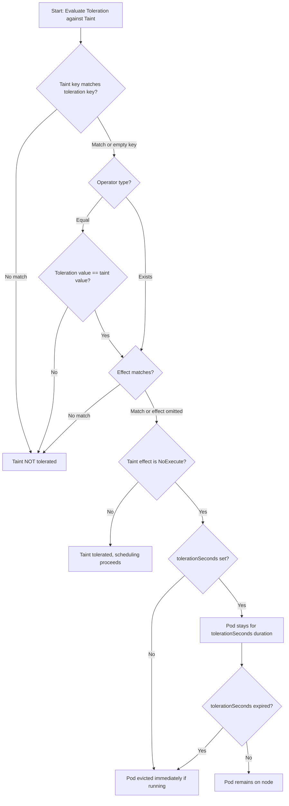

# Pods - Taints & Tolerations - Toleration Logic

This document covers how Kubernetes matches tolerations on Pods to taints on Nodes, including the `Equal` and `Exists` operators, empty-key matching, and the `tolerationSeconds` grace period for `NoExecute` taints.

## How Toleration Matching Works

A toleration on a Pod is evaluated against each taint on a candidate node. A toleration matches a taint when all specified fields in the toleration are compatible with the taint. The matching logic proceeds as follows:

1. **Check the key**: If the toleration specifies a key, it must match the taint's key exactly. If the toleration has an empty key, it matches any taint key.
2. **Check the operator**: Determines how the value is compared.
   - `Equal`: The toleration's value must exactly match the taint's value. If the taint has no value, the toleration must also have no value.
   - `Exists`: The toleration matches any taint with the same key, regardless of the taint's value. The value field in the toleration is ignored.
3. **Check the effect**: If the toleration specifies an effect, it must match the taint's effect exactly. If the toleration omits the effect, it matches taints with any effect.
4. **If all checks pass**, the taint is considered tolerated.

## The `Equal` Operator

The `Equal` operator requires an exact match on key, value, and effect. This is the most precise matching mode.

### Exact Match Example

Taint on node:
```
dedicated=special:NoSchedule
```

Toleration in Pod:
```yaml
tolerations:
  - key: "dedicated"
    operator: "Equal"
    value: "special"
    effect: "NoSchedule"
```

This toleration matches the taint because all three fields match exactly.

### Mismatch Example

If the Pod's toleration has a different value:
```yaml
tolerations:
  - key: "dedicated"
    operator: "Equal"
    value: "general"
    effect: "NoSchedule"
```

This does NOT match the taint `dedicated=special:NoSchedule` because the values differ (`special` vs `general`). The Pod will not be scheduled on the node.

### Effect Mismatch

If the toleration specifies `NoSchedule` but the taint has `NoExecute`:
```yaml
tolerations:
  - key: "dedicated"
    operator: "Equal"
    value: "special"
    effect: "NoSchedule"
```

This does NOT tolerate the taint `dedicated=special:NoExecute`. The effect must match exactly.

## The `Exists` Operator

The `Exists` operator matches any taint with the specified key, regardless of the taint's value. The `value` field in the toleration is ignored when `operator` is `Exists`.

### Match Any Value

Taint on node:
```
gpu=true:NoSchedule
```

Toleration in Pod:
```yaml
tolerations:
  - key: "gpu"
    operator: "Exists"
    effect: "NoSchedule"
```

This matches the taint regardless of the taint's value (`true`, `false`, or any other string). The key `gpu` exists and the effect `NoSchedule` matches.

### Omitting the Effect

If the toleration omits the `effect` field, it matches taints with any effect:

```yaml
tolerations:
  - key: "gpu"
    operator: "Exists"
```

This toleration matches `gpu=true:NoSchedule`, `gpu=true:NoExecute`, and `gpu=true:PreferNoSchedule`.

## Empty Key with `Exists`

A toleration with an empty key and `operator: Exists` matches **all taints** on a node, regardless of key, value, or effect. This is the most permissive toleration.

```yaml
tolerations:
  - operator: Exists
```

This is equivalent to saying "I tolerate every taint on this node." It is commonly used in two scenarios:

1. **DaemonSet Pods**: DaemonSets often use empty-key tolerations so that their Pods can run on any node, including control-plane nodes with taints.
2. **Pods that must run everywhere**: Workloads that need to run on all nodes regardless of taints.

### DaemonSet Example

```yaml
apiVersion: apps/v1
kind: DaemonSet
metadata:
  name: node-monitor
spec:
  selector:
    matchLabels:
      app: node-monitor
  template:
    metadata:
      labels:
        app: node-monitor
    spec:
      tolerations:
        - operator: Exists
      containers:
        - name: monitor
          image: node-monitor:latest
```

This DaemonSet Pod will be scheduled on every node, including those with `NoSchedule` and `NoExecute` taints.

## Toleration Seconds for NoExecute

The `tolerationSeconds` field is only valid when the toleration's `effect` is `NoExecute`. It specifies how long the Pod should remain on the node after the `NoExecute` taint is added before being evicted.

### How tolerationSeconds Works

1. A `NoExecute` taint is added to a node (either manually or by the node controller).
2. The scheduler checks tolerations. A Pod with a matching `NoExecute` toleration and `tolerationSeconds` is not immediately evicted.
3. The Pod remains on the node for the duration specified in `tolerationSeconds`.
4. After `tolerationSeconds` expires, the Pod begins the eviction process.
5. If the taint is removed before `tolerationSeconds` expires, the Pod is not evicted.

### Example: Graceful Eviction Window

```yaml
tolerations:
  - key: "node.kubernetes.io/unreachable"
    operator: "Exists"
    effect: "NoExecute"
    tolerationSeconds: 120
```

In this example, if the node becomes unreachable, the Pod stays for up to 120 seconds before eviction begins. This gives the application time to finish in-flight requests and flush state.

### Tolerance for All NoExecute Taints with Timeout

```yaml
tolerations:
  - operator: Exists
    effect: NoExecute
    tolerationSeconds: 300
```

This tolerates every `NoExecute` taint on any node and provides a 5-minute grace period before eviction.

## Toleration Matching Flowchart



## Multiple Tolerations on a Single Pod

A Pod can have multiple tolerations. Each toleration is evaluated independently against each taint on the node. A taint is tolerated if at least one toleration matches it.

### Example: Tolerating Multiple Taints

Node has three taints:
```
dedicated=special:NoSchedule
env=prod:NoExecute
gpu=true:NoSchedule
```

Pod spec:
```yaml
tolerations:
  - key: "dedicated"
    operator: "Equal"
    value: "special"
    effect: "NoSchedule"
  - key: "env"
    operator: "Equal"
    value: "prod"
    effect: "NoExecute"
    tolerationSeconds: 60
  - key: "gpu"
    operator: "Equal"
    value: "true"
    effect: "NoSchedule"
```

Each toleration matches one taint. The Pod can be scheduled on this node.

### Example: One Toleration Matching Multiple Taints

A single toleration with an empty key and `operator: Exists` matches all taints:

```yaml
tolerations:
  - operator: Exists
```

This single toleration is sufficient to tolerate every taint on any node.

## Best Practices

- **Use `Exists` with an empty key sparingly.** It tolerates every taint, including taints added by the node controller for node problems. This can cause Pods to remain on unhealthy nodes.
- **Always specify the effect** when using `operator: Equal`. Omitting the effect causes the toleration to match all effects, which may be broader than intended.
- **Use `tolerationSeconds` for stateful workloads** on nodes that might receive `NoExecute` taints. This provides a grace period for graceful shutdown.
- **Match the operator to the use case**: Use `Equal` when you need precise control over the value. Use `Exists` when the value doesn't matter or when you want to match a taint regardless of its value.
- **Combine tolerations with node affinity** for fine-grained scheduling control. Tolerations open the door; node affinity selects the right door.

## Common Pitfalls

- **Using `operator: Equal` without a value**: When `operator` is `Equal`, the `value` field is required. Omitting it causes a validation error.
- **Using `operator: Exists` with a value**: The `value` field is ignored when `operator` is `Exists`. Including a value does not cause an error but has no effect and can be confusing.
- **Assuming `tolerationSeconds` applies to all effects**: `tolerationSeconds` is only meaningful for `NoExecute`. It is silently ignored for `NoSchedule` and `PreferNoSchedule`.
- **Not tolerating node controller taints**: When a node becomes unreachable, the node controller adds `node.kubernetes.io/unreachable:NoExecute`. If your Pod doesn't tolerate this, it will be evicted.
- **Over-tolerating with empty-key `Exists`**: A Pod that tolerates all taints can end up on nodes that are cordoned, not-ready, or dedicated to other workloads. This can cause resource contention and scheduling conflicts.
- **Confusing toleration matching with label selectors**: Tolerations do not use label selector syntax. They use exact key-value matching or existence checks, not set-based matching.

## Troubleshooting

### Pod Won't Schedule Despite Having a Toleration

```bash
# Check the taint on the node
kubectl describe node <node-name> | grep -i taint

# Check the Pod's tolerations
kubectl get pod <pod-name> -o jsonpath='{.spec.tolerations}'

# Compare key, value, operator, and effect carefully
# A mismatch in any field causes the toleration to not match
```

### Pod Evicted Immediately After Node Taint

```bash
# Check if the taint is NoExecute
kubectl describe node <node-name> | grep Taints

# Check if tolerationSeconds is set
kubectl get pod <pod-name> -o jsonpath='{.spec.tolerations}'

# If tolerationSeconds is missing for a NoExecute taint, eviction is immediate
```

### Toleration Not Working for Node Controller Taints

```bash
# Check for automatic node controller taints
kubectl describe node <node-name> | grep -i "unreachable\|not-ready"

# Ensure the toleration uses operator: Exists and effect: NoExecute
# Example:
# tolerations:
#   - operator: Exists
#     effect: NoExecute
```

### Verify Toleration Matching Programmatically

```bash
# Get all nodes and their taints in JSON
kubectl get nodes -o json | jq '.items[].spec.taints'

# Get a specific Pod's tolerations
kubectl get pod <pod-name> -o jsonpath='{.spec.tolerations[*].key}'
kubectl get pod <pod-name> -o jsonpath='{.spec.tolerations[*].operator}'
kubectl get pod <pod-name> -o jsonpath='{.spec.tolerations[*].effect}'
```