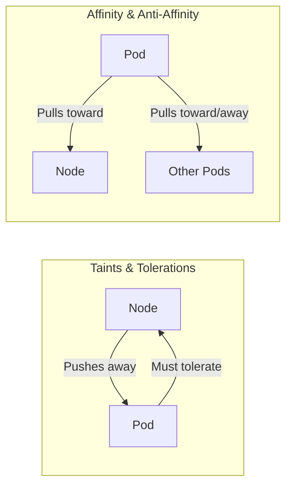
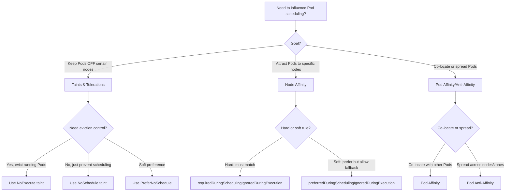

# Pods - Scheduling Affinity - Taints/Tolerations vs Affinity Comparison

This document provides a detailed comparison between taints/tolerations and node affinity/pod affinity, explaining when to use each mechanism and how they differ in behavior.

## Fundamental Difference

Taints and tolerations and affinity/anti-affinity both influence Pod scheduling, but they operate in opposite directions:

- **Taints and tolerations**: The **node pushes** Pods away. A taint on a node repels Pods that don't tolerate it. The Pod must opt in to be scheduled on a tainted node.
- **Affinity and anti-affinity**: The **Pod pulls** itself toward or away from nodes or other Pods. A Pod with affinity rules actively seeks out matching nodes or co-located Pods.



## Side-by-Side Comparison

| Feature | Taints & Tolerations | Node Affinity | Pod Affinity / Anti-Affinity |
|---------|---------------------|---------------|------------------------------|
| **Direction** | Node pushes Pod away | Pod pulls toward node | Pod pulls toward/away from Pods |
| **Applied to** | Node (taint) + Pod (toleration) | Node (labels) | Pod (labels on other Pods) |
| **Hard constraint** | `NoSchedule` / `NoExecute` | `requiredDuringSchedulingIgnoredDuringExecution` | `requiredDuringSchedulingIgnoredDuringExecution` |
| **Soft constraint** | `PreferNoSchedule` | `preferredDuringSchedulingIgnoredDuringExecution` | `preferredDuringSchedulingIgnoredDuringExecution` |
| **Eviction** | `NoExecute` evicts running Pods | No eviction | No eviction |
| **Scope** | Node-level only | Node-level only | Pod-to-Pod or Pod-to-node |
| **Matching** | Key-value-effect + operator | Label selector on nodes | Label selector on Pods |
| **Scheduling time** | Only at scheduling | Only at scheduling | Only at scheduling |
| **Execution time** | No (except eviction) | No | No |

## When to Use Taints and Tolerations

Use taints and tolerations when:

1. **Reserving nodes for specific workloads**: Taint dedicated nodes and give only the intended workload a toleration.
2. **Preventing system Pods from running on user nodes**: Taint user nodes to keep them clean.
3. **Handling node problems gracefully**: The node controller adds `NoExecute` taints automatically; tolerations allow critical Pods to stay.
4. **Dedicated GPU/FPGA/NUMA nodes**: Taint hardware-specific nodes so only Pods requesting that hardware are scheduled.
5. **Cordoning nodes for maintenance**: Taint a node with `NoExecute` to evict all non-tolerating Pods before maintenance.

### Example: GPU Node Reservation

```bash
# Taint GPU nodes
kubectl taint nodes gpu-1 gpu=true:NoSchedule
kubectl taint nodes gpu-2 gpu=true:NoSchedule
```

```yaml
# Pod that requires GPU
apiVersion: v1
kind: Pod
metadata:
  name: gpu-workload
spec:
  tolerations:
    - key: "gpu"
      operator: "Equal"
      value: "true"
      effect: "NoSchedule"
  containers:
    - name: gpu-container
      image: nvidia/cuda:12.0-base
      resources:
        limits:
          nvidia.com/gpu: 1
```

## When to Use Node Affinity

Use node affinity when:

1. **Scheduling Pods to nodes with specific characteristics**: E.g., nodes in a specific region, zone, or with a certain instance type.
2. **Preferring certain nodes but allowing fallback**: Use `preferredDuringSchedulingIgnoredDuringExecution` for soft preferences.
3. **Grouping Pods by node characteristics**: E.g., high-memory nodes, SSD-backed nodes, or nodes with a specific hardware feature.

### Example: Zone-Based Scheduling

```yaml
apiVersion: v1
kind: Pod
metadata:
  name: zone-aware-app
spec:
  affinity:
    nodeAffinity:
      requiredDuringSchedulingIgnoredDuringExecution:
        nodeSelectorTerms:
          - matchExpressions:
              - key: topology.kubernetes.io/zone
                operator: In
                values:
                  - us-east-1a
                  - us-east-1b
  containers:
    - name: app
      image: myapp:latest
```

## When to Use Pod Affinity and Anti-Affinity

Use pod affinity when you want Pods to be co-located (e.g., for low-latency communication). Use pod anti-affinity when you want Pods spread across nodes (e.g., for high availability).

### Example: Co-locate Frontend and Backend

```yaml
apiVersion: v1
kind: Pod
metadata:
  name: frontend
spec:
  affinity:
    podAffinity:
      requiredDuringSchedulingIgnoredDuringExecution:
        labelSelector:
          matchExpressions:
            - key: app
              operator: In
              values:
                - backend
        topologyKey: kubernetes.io/hostname
  containers:
    - name: frontend
      image: frontend:latest
```

### Example: Spread Replicas Across Nodes

```yaml
apiVersion: v1
kind: Pod
metadata:
  name: replica
spec:
  affinity:
    podAntiAffinity:
      requiredDuringSchedulingIgnoredDuringExecution:
        labelSelector:
          matchExpressions:
            - key: app
              operator: In
              values:
                - replica
        topologyKey: kubernetes.io/hostname
  containers:
    - name: replica
      image: replica:latest
```

## Combining Mechanisms

In practice, taints/tolerations and affinity are often used together:

1. **Taint nodes to reserve them** → Use tolerations to allow specific Pods onto those nodes.
2. **Use node affinity to further refine placement** within the tolerated nodes.
3. **Use pod anti-affinity to spread replicas** across different nodes or zones.

### Combined Example

```yaml
apiVersion: v1
kind: Pod
metadata:
  name: combined-example
spec:
  tolerations:
    - key: "dedicated"
      operator: "Equal"
      value: "ml"
      effect: "NoSchedule"
  affinity:
    nodeAffinity:
      requiredDuringSchedulingIgnoredDuringExecution:
        nodeSelectorTerms:
          - matchExpressions:
              - key: node-type
                operator: In
                values:
                  - gpu
    podAntiAffinity:
      preferredDuringSchedulingIgnoredDuringExecution:
        - weight: 100
          podAffinityTerm:
            labelSelector:
              matchExpressions:
                - key: app
                  operator: In
                  values:
                    - training
            topologyKey: kubernetes.io/hostname
  containers:
    - name: ml-trainer
      image: ml-trainer:latest
```

In this example:
- The toleration allows the Pod onto `dedicated=ml:NoSchedule` nodes.
- Node affinity restricts placement to `node-type=gpu` nodes.
- Pod anti-affinity spreads training Pods across different hosts.

## Decision Flowchart



## Best Practices

- **Use taints for exclusion and affinity for inclusion**. Taints are the right tool when you want to say "don't put Pods here unless they explicitly opt in." Affinity is the right tool when you want to say "put Pods here because they match these criteria."
- **Combine taints with node labels** for maximum flexibility. Labels describe what a node offers; taints describe what a node rejects.
- **Prefer `requiredDuringSchedulingIgnoredDuringExecution` for hard constraints** and `preferredDuringSchedulingIgnoredDuringExecution` for soft preferences in affinity rules.
- **Use topology keys to control spreading granularity**. `kubernetes.io/hostname` spreads across nodes; `topology.kubernetes.io/zone` spreads across availability zones.
- **Test affinity rules in a non-production environment first**. Misconfigured affinity can cause scheduling loops or unexpected Pod placement.

## Common Pitfalls

- **Using affinity when taints are more appropriate**: If you want to prevent Pods from running on a node, taints are simpler and more explicit than using anti-affinity with a negative selector.
- **Assuming affinity rules are enforced at runtime**: Affinity rules are only evaluated at scheduling time. If a node's labels change after scheduling, the Pod is NOT evicted.
- **Forgetting that `preferredDuringSchedulingIgnoredDuringExecution` is advisory**: The scheduler will try to satisfy the preference but will fall back to unsatisfied placement if no matching node is available.
- **Using `requiredDuringSchedulingIgnoredDuringExecution` with no matching nodes**: This causes the Pod to remain in `Pending` indefinitely with no eviction or retry logic.
- **Over-constraining with both taints and affinity**: If a Pod tolerates a taint but its affinity rules don't match any node, the Pod will still be `Pending`. Check both constraints.

## Troubleshooting

### Pod Stuck in Pending

```bash
# Check scheduling events
kubectl describe pod <pod-name> | grep -A20 Events

# Check if taints are blocking
kubectl describe pod <pod-name> | grep -i taint

# Check if affinity rules are too restrictive
kubectl get pods <pod-name> -o jsonpath='{.spec.affinity}'

# Check node labels
kubectl get nodes --show-labels
```

### Pod Scheduled to Unexpected Node

```bash
# Check node taints
kubectl describe node <node-name> | grep Taints

# Check Pod tolerations
kubectl get pod <pod-name> -o jsonpath='{.spec.tolerations}'

# Check node affinity rules in Pod spec
kubectl get pod <pod-name> -o jsonpath='{.spec.affinity.nodeAffinity}'
```

### Pod Evicted After Node Taint Added

```bash
# Check if taint is NoExecute
kubectl describe node <node-name> | grep Taints

# Check if Pod has NoExecute toleration
kubectl get pod <pod-name> -o jsonpath='{.spec.tolerations[?@.effect=="NoExecute"]}'

# Check if tolerationSeconds was set
kubectl get pod <pod-name> -o jsonpath='{.spec.tolerations[].tolerationSeconds}'
```