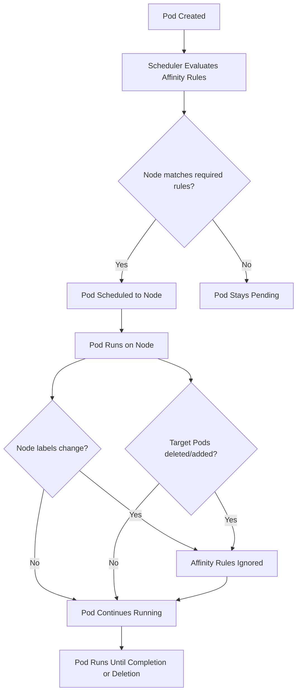

# Pods - Scheduling Affinity - Ignored During Execution

This document explains the "Ignored During Execution" behavior of Kubernetes scheduling affinity rules, including what it means, why it exists, and how it impacts cluster operations.

## What Does "Ignored During Execution" Mean?

In Kubernetes scheduling, the terms `requiredDuringSchedulingIgnoredDuringExecution` and `preferredDuringSchedulingIgnoredDuringExecution` explicitly state that affinity rules are **only enforced at scheduling time**. Once a Pod is successfully placed on a node, the rules are no longer evaluated or enforced.

This is a deliberate design choice with important implications:

- **Scheduling is a one-time decision.** The scheduler picks a node for a Pod when it is created or rescheduled (e.g., after a node failure). After that decision, the Pod stays on that node.
- **Runtime changes do not trigger re-scheduling.** If node labels change, if the affinity target Pods are deleted, or if the cluster topology changes, already-running Pods are not moved.
- **Affinity is not a runtime constraint.** It does not act like a network policy or a security context that is continuously enforced.

## Why "Ignored During Execution" Exists

### 1. Performance and Scalability

Re-evaluating affinity rules continuously would impose significant overhead on the scheduler and the API server. The scheduler would need to watch for every label change on every node and every Pod, then re-evaluate placement for every affected Pod. This would not scale to large clusters.

### 2. Stability

Moving Pods after they are running could disrupt active connections, cause data loss, or violate application-level assumptions about co-location. Keeping Pods on their originally scheduled nodes provides stability.

### 3. Separation of Concerns

Scheduling decisions are made once. Runtime behavior (networking, resource usage, health) is managed by other controllers (kubelet, services, endpoints). Mixing scheduling logic with runtime logic would create a complex and error-prone system.

## How Ignored During Execution Affects Different Affinity Types

### Node Affinity

Node affinity rules are evaluated when a Pod is scheduled. If a node's labels change after the Pod is running, the Pod is not affected.

```yaml
apiVersion: v1
kind: Pod
metadata:
  name: node-affinity-example
spec:
  affinity:
    nodeAffinity:
      requiredDuringSchedulingIgnoredDuringExecution:
        nodeSelectorTerms:
          - matchExpressions:
              - key: environment
                operator: In
                values:
                  - production
  containers:
    - name: app
      image: myapp:latest
```

If this Pod is scheduled to a node with `environment=production`, and the label is later changed to `environment=staging`, the Pod remains on the node. The affinity rule is ignored at this point.

### Pod Affinity

Pod affinity rules are evaluated based on the labels of other Pods at scheduling time. If a target Pod is deleted after scheduling, the scheduled Pod is not evicted.

```yaml
apiVersion: v1
kind: Pod
metadata:
  name: pod-affinity-example
spec:
  affinity:
    podAffinity:
      requiredDuringSchedulingIgnoredDuringExecution:
        labelSelector:
          matchExpressions:
            - key: app
              operator: In
              values:
                - database
        topologyKey: kubernetes.io/hostname
  containers:
    - name: app
      image: myapp:latest
```

If the `database` Pod is deleted after this Pod is scheduled, the `pod-affinity-example` Pod stays on its node. The affinity rule is no longer checked.

### Pod Anti-Affinity

Similarly, pod anti-affinity rules are only checked at scheduling time. If a new Pod with a matching label is created after the scheduled Pod is already running, the scheduled Pod is not evicted.

```yaml
apiVersion: v1
kind: Pod
metadata:
  name: anti-affinity-example
spec:
  affinity:
    podAntiAffinity:
      requiredDuringSchedulingIgnoredDuringExecution:
        labelSelector:
          matchExpressions:
            - key: app
              operator: In
              values:
                - frontend
        topologyKey: kubernetes.io/hostname
  containers:
    - name: app
      image: myapp:latest
```

If a new `frontend` Pod is created on the same node after `anti-affinity-example` is already running, the existing Pod is not evicted.

## Scheduling vs Execution Timeline



## Practical Implications

### Scenario 1: Node Relabeled After Scheduling

A cluster administrator relabels nodes to reflect new capacity pools. Pods that were scheduled before the relabeling are not affected by the new labels. They continue running on their original nodes.

**Impact**: New Pods will use the updated labels for scheduling, but existing Pods are unaffected.

### Scenario 2: Target Pod Deleted After Scheduling

A Pod with pod affinity to a `cache` Pod is scheduled. The `cache` Pod is then deleted and recreated with a different label. The original Pod stays on its node and is not re-evaluated for affinity.

**Impact**: The Pod that relied on co-location with the `cache` Pod is now potentially isolated from it, but it is not moved.

### Scenario 3: Node Becomes Unsuitable at Runtime

A node is tainted or its labels change to indicate it is no longer suitable for a workload. Pods already running on that node are not evicted by affinity rules. They continue running until they are explicitly deleted, the node is drained, or the node fails.

**Impact**: Affinity rules do not serve as a runtime safety mechanism. Use taints and tolerations for runtime enforcement.

## Comparison with Taints and Tolerations

Unlike affinity rules, taints with `NoExecute` effect DO cause runtime eviction:

| Mechanism | Evaluated at Scheduling | Evaluated at Runtime | Causes Eviction |
|-----------|------------------------|---------------------|-----------------|
| Node Affinity (required) | Yes | No | No |
| Node Affinity (preferred) | Yes | No | No |
| Pod Affinity | Yes | No | No |
| Pod Anti-Affinity | Yes | No | No |
| Taint `NoSchedule` | Yes | No | No |
| Taint `PreferNoSchedule` | Yes | No | No |
| Taint `NoExecute` | Yes | Yes | Yes |

The key distinction is that `NoExecute` taints are the only mechanism that has a runtime enforcement component (via the node controller).

## Best Practices

- **Do not rely on affinity for runtime enforcement.** If you need Pods to be moved or evicted based on changing conditions, use taints with `NoExecute` and appropriate tolerations.
- **Design for label changes.** Since affinity is ignored at runtime, ensure your application can function even if it ends up on a node that no longer matches its affinity rules.
- **Use DaemonSets for runtime enforcement.** If you need a Pod to always run on nodes with specific labels, use a DaemonSet rather than affinity rules. DaemonSets ensure one Pod per node regardless of label changes.
- **Monitor label changes.** Use tools like Prometheus with the `kube_node_labels` metric to detect when node labels change and assess the impact on future scheduling.
- **Document affinity rules clearly.** Since they are one-time decisions, it is important that operators understand that affinity rules do not provide ongoing guarantees.

## Common Pitfalls

- **Assuming affinity rules are continuously enforced**: This is the most common misunderstanding. Affinity rules are evaluated once at scheduling time and then ignored.
- **Deleting a target Pod and expecting eviction**: If a Pod with pod affinity to a `database` Pod is running, deleting the `database` Pod does not evict the affinity Pod.
- **Relabeling nodes and expecting Pods to move**: Changing node labels does not cause already-scheduled Pods to be evicted or rescheduled.
- **Using affinity to enforce security boundaries**: Affinity rules are not a security mechanism. A Pod with `requiredDuringSchedulingIgnoredDuringExecution` for a specific zone will stay on that zone even if the zone becomes compromised.
- **Expecting anti-affinity to prevent co-location at runtime**: If two Pods with mutual anti-affinity are scheduled on different nodes, and one node fails, the recreated Pod may end up on the same node as the surviving Pod. Anti-affinity is not re-evaluated.

## Troubleshooting

### Pod Not Moving After Node Label Change

```bash
# Verify the Pod is still on the original node
kubectl get pod <pod-name> -o wide

# Check node labels
kubectl get node <node-name> --show-labels

# Affinity rules are ignored at runtime; the Pod will not move
# To move the Pod, delete it and let the scheduler re-evaluate
kubectl delete pod <pod-name>
```

### Pod Not Co-Located Despite Pod Affinity

```bash
# Check if the target Pod exists and is running
kubectl get pods -l app=backend

# Check if the target Pod is on the same node (same topologyKey domain)
kubectl get pods -l app=backend -o wide

# Pod affinity only matches Pods that are already running at scheduling time
# If the target Pod is Pending, the affinity rule cannot be satisfied
```

### Pod Co-Located Despite Pod Anti-Affinity

```bash
# Check if the anti-affinity Pod was already running on the node
# before the new Pod was scheduled
kubectl get pods -l app=frontend -o wide

# Anti-affinity is only checked at scheduling time
# If no matching Pod was on the node when the new Pod was scheduled, it can be placed there
```

### Verifying Affinity Rules Are Ignored at Runtime

```bash
# Get the Pod's affinity configuration
kubectl get pod <pod-name> -o jsonpath='{.spec.affinity}'

# Change a node label and observe that the Pod stays put
kubectl label nodes <node-name> environment=staging
kubectl get pod <pod-name> -o wide
# Pod remains on the original node