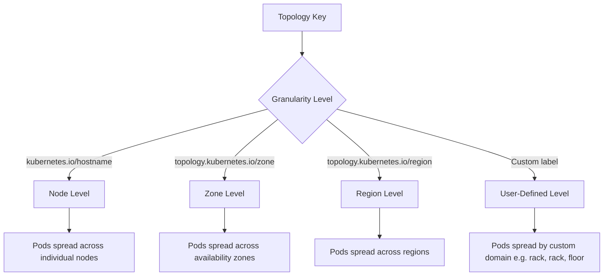

# Pods - Scheduling Affinity - Topology Keys

This document explains topology keys in Kubernetes scheduling affinity, including built-in topology keys, custom topology keys, and how they control the granularity of Pod placement constraints.

## What Are Topology Keys?

A topology key is a label key that defines the domain of a scheduling constraint. It tells the scheduler how to group nodes for the purpose of affinity and anti-affinity rules. The value of the topology key on a node determines which "group" or "domain" that node belongs to.

When a Pod specifies a `topologyKey` in its affinity or anti-affinity rules, the scheduler uses that key to determine which nodes are in the same topology domain. This controls whether Pods are co-located on the same node, spread across different nodes, or distributed across availability zones.

## Built-In Topology Keys

Kubernetes provides several well-known topology keys that are automatically set on nodes:

### `kubernetes.io/hostname`

This key has the value of the node's hostname. It represents the individual node level — the finest granularity for spreading.

**Use case**: Spread Pods across different nodes to maximize availability.

```bash
# Check hostname topology key on nodes
kubectl get nodes -l kubernetes.io/hostname

# Each node has a unique hostname value
kubectl get nodes -o jsonpath='{range .items[*]}{.metadata.name} = {.metadata.labels.kubernetes\.io/hostname}{"\n"}{end}'
```

### `topology.kubernetes.io/zone`

This key has the value of the node's availability zone (e.g., `us-east-1a`, `us-east-1b`). It represents the zone level — a coarser granularity than hostname.

**Use case**: Spread Pods across availability zones for zone-level fault tolerance.

```bash
# Check zone topology key on nodes
kubectl get nodes -o jsonpath='{range .items[*]}{.metadata.name} = {.metadata.labels.topology\.kubernetes\.io/zone}{"\n"}{end}'
```

### `topology.kubernetes.io/region`

This key has the value of the node's region (e.g., `us-east-1`). It represents the region level — the coarsest built-in granularity.

**Use case**: Spread Pods across regions for disaster recovery.

```bash
# Check region topology key on nodes
kubectl get nodes -o jsonpath='{range .items[*]}{.metadata.name} = {.metadata.labels.topology\.kubernetes\.io/region}{"\n"}{end}'
```

## Custom Topology Keys

You can define custom topology keys using any node label. This allows you to create scheduling domains based on your own infrastructure topology.

### Creating a Custom Topology Key

```bash
# Label nodes with a custom topology key
kubectl label nodes node-1 topology.kubernetes.io/rack=rack-a
kubectl label nodes node-2 topology.kubernetes.io/rack=rack-a
kubectl label nodes node-3 topology.kubernetes.io/rack=rack-b
kubectl label nodes node-4 topology.kubernetes.io/rack=rack-b
```

### Using a Custom Topology Key in Pod Affinity

```yaml
apiVersion: v1
kind: Pod
metadata:
  name: rack-aware-pod
spec:
  affinity:
    podAntiAffinity:
      requiredDuringSchedulingIgnoredDuringExecution:
        labelSelector:
          matchExpressions:
            - key: app
              operator: In
              values:
                - api-server
        topologyKey: topology.kubernetes.io/rack
  containers:
    - name: api
      image: api-server:latest
```

This Pod will not be scheduled on a node in the same rack as another `api-server` Pod. It spreads across racks for rack-level fault tolerance.

## Topology Key Granularity Comparison



## How Topology Keys Affect Scheduling

### Same Topology Domain (Co-location)

When using `podAffinity` with a topology key, the scheduler looks for nodes in the same topology domain as existing matching Pods.

```yaml
podAffinity:
  requiredDuringSchedulingIgnoredDuringExecution:
    labelSelector:
      matchExpressions:
        - key: app
          operator: In
          values:
            - cache
    topologyKey: kubernetes.io/hostname
```

This means the new Pod must be on the **same node** as an existing `cache` Pod. The `topologyKey` defines what "same" means.

### Different Topology Domain (Spreading)

When using `podAntiAffinity` with a topology key, the scheduler ensures the new Pod is in a **different** topology domain from existing matching Pods.

```yaml
podAntiAffinity:
  requiredDuringSchedulingIgnoredDuringExecution:
    labelSelector:
      matchExpressions:
        - key: app
          operator: In
          values:
            - frontend
    topologyKey: topology.kubernetes.io/zone
```

This means the new Pod must be in a **different zone** from any existing `frontend` Pod. If all zones already have a `frontend` Pod, the Pod remains `Pending`.

## Topology Key Selection Guide

| Goal | Topology Key | Effect |
|------|-------------|--------|
| Spread across nodes | `kubernetes.io/hostname` | Each Pod on a different node |
| Spread across zones | `topology.kubernetes.io/zone` | Each Pod in a different AZ |
| Spread across regions | `topology.kubernetes.io/region` | Each Pod in a different region |
| Co-locate on same node | `kubernetes.io/hostname` | Pods on the same node |
| Co-locate in same zone | `topology.kubernetes.io/zone` | Pods in the same AZ |
| Spread by custom domain | Custom label (e.g., `rack`) | Pods in different racks |

## Practical Examples

### Example 1: Spread Database Replicas Across Zones

```yaml
apiVersion: apps/v1
kind: StatefulSet
metadata:
  name: database
spec:
  serviceName: database
  replicas: 3
  selector:
    matchLabels:
      app: database
  template:
    metadata:
      labels:
        app: database
    spec:
      affinity:
        podAntiAffinity:
          requiredDuringSchedulingIgnoredDuringExecution:
            labelSelector:
              matchExpressions:
                - key: app
                  operator: In
                  values:
                    - database
            topologyKey: topology.kubernetes.io/zone
      containers:
        - name: db
          image: postgres:15
```

This ensures each database replica is in a different availability zone.

### Example 2: Co-locate API with Cache on the Same Node

```yaml
apiVersion: v1
kind: Pod
metadata:
  name: api-server
spec:
  affinity:
    podAffinity:
      requiredDuringSchedulingIgnoredDuringExecution:
        labelSelector:
          matchExpressions:
            - key: app
              operator: In
              values:
                - cache
        topologyKey: kubernetes.io/hostname
  containers:
    - name: api
      image: api-server:latest
```

This ensures the API server is scheduled on the same node as the cache Pod, reducing network latency.

### Example 3: Spread Across Racks Using Custom Topology

```yaml
apiVersion: v1
kind: Pod
metadata:
  name: worker
spec:
  affinity:
    podAntiAffinity:
      preferredDuringSchedulingIgnoredDuringExecution:
        - weight: 100
          podAffinityTerm:
            labelSelector:
              matchExpressions:
                - key: app
                  operator: In
                  values:
                    - worker
            topologyKey: topology.kubernetes.io/rack
  containers:
    - name: worker
      image: worker:latest
```

This prefers spreading worker Pods across different racks, but allows co-location if no other option exists.

## Topology Keys and Node Labels

Topology keys are node labels. The scheduler reads the value of the topology key label on each node to determine which topology domain it belongs to.

```bash
# List all topology-related labels on nodes
kubectl get nodes --show-labels | grep -E "hostname|zone|region|rack"

# Get the topology key value for a specific node
kubectl get node <node-name> -o jsonpath='{.metadata.labels.topology\.kubernetes\.io/zone}'
```

## Best Practices

- **Use `topology.kubernetes.io/zone` for multi-zone clusters.** This is the most common topology key for production clusters and provides zone-level fault tolerance.
- **Use `kubernetes.io/hostname` for node-level spreading.** This is the finest granularity and ensures maximum distribution.
- **Use custom topology keys for infrastructure-specific domains.** If your cluster spans racks, floors, or network segments, define custom topology keys.
- **Combine topology keys with preferred anti-affinity for soft spreading.** Use `preferredDuringSchedulingIgnoredDuringExecution` with a weight to spread Pods without making it a hard requirement.
- **Ensure topology labels are consistently applied.** If zone labels are missing on some nodes, the scheduler cannot use them for topology-aware spreading.
- **Use `topology.kubernetes.io/hostname` for DaemonSet anti-affinity.** This ensures DaemonSet Pods are spread across nodes.

## Common Pitfalls

- **Using a topology key that no node has**: If no node has the specified topology key label, `podAntiAffinity` rules will block all scheduling. The Pod will be stuck in `Pending`.
- **Using `requiredDuringSchedulingIgnoredDuringExecution` with too restrictive a topology**: If you require anti-affinity across zones but your cluster has only one zone, no Pod can be scheduled.
- **Confusing topology key with label selector**: The topology key defines the grouping dimension. The label selector defines which Pods to consider for co-location or spreading. They serve different purposes.
- **Using hostname topology for zone-level spreading**: `kubernetes.io/hostname` spreads across nodes, not zones. Use `topology.kubernetes.io/zone` for zone-level spreading.
- **Assuming topology keys are automatically populated**: While Kubernetes automatically sets `topology.kubernetes.io/hostname`, `topology.kubernetes.io/zone`, and `topology.kubernetes.io/region` on most cloud-provisioned nodes, custom topology keys must be manually applied.
- **Over-constraining with multiple anti-affinity rules**: If multiple anti-affinity rules use different topology keys, the intersection of constraints may leave no valid nodes.

## Troubleshooting

### Pods Not Spreading Across Zones

```bash
# Check if nodes have zone labels
kubectl get nodes -o jsonpath='{range .items[*]}{.metadata.name} {.metadata.labels.topology\.kubernetes\.io/zone}{"\n"}{end}'

# If zone labels are missing, the scheduler cannot spread by zone
# Add zone labels to nodes
kubectl label nodes <node-name> topology.kubernetes.io/zone=<zone-name>
```

### Pod Stuck in Pending with Anti-Affinity

```bash
# Check if all topology domains already have a matching Pod
kubectl get pods -l app=<label> -o wide

# If every zone/hostname already has a matching Pod, anti-affinity blocks scheduling
# Consider using preferred (soft) anti-affinity instead of required (hard)
```

### Co-location Not Working

```bash
# Check if the target Pod exists and is running
kubectl get pods -l app=<target-label> -o wide

# Verify the topologyKey matches the domain where co-location is desired
# If topologyKey is hostname, both Pods must be on the same node
# If topologyKey is zone, both Pods must be in the same zone
```

### Custom Topology Key Not Working

```bash
# Verify the custom label is applied to nodes
kubectl get nodes --show-labels | grep rack

# Verify the topologyKey in the Pod spec matches the node label key exactly
kubectl get pod <pod-name> -o jsonpath='{.spec.affinity.podAntiAffinity}'
```