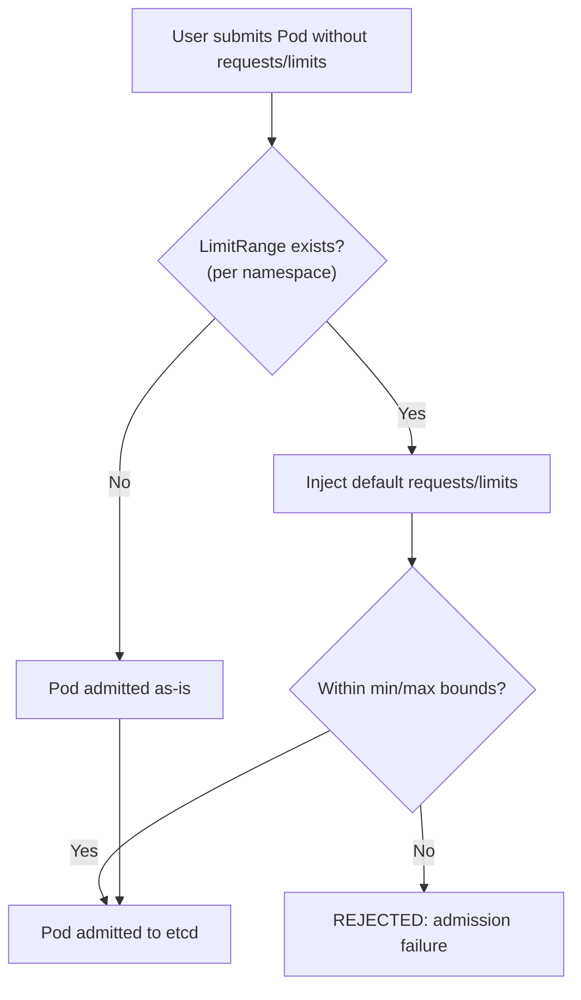

# Resource Management - In-Depth Mechanics

## LimitRange Behavior

A `LimitRange` (or `limits`) is a namespace-scoped admission controller that enforces **defaults and bounds** on CPU and memory requests/limits for Pods and Containers (and PersistentVolumeClaim sizes). It runs **before** a Pod is admitted to etcd.

### Why It Exists

Without a LimitRange:
- Developers might not set requests/limits at all, leading to BestEffort QoS and unpredictable scheduling.
- A single container could request the entire capacity of a node and starve others.

### LimitRange Types

| Type | Applies To | What It Does |
|------|-----------|--------------|
| `Container` | Each container in a Pod | Sets min/max/default for requests and limits |
| `Pod` | The Pod as a whole | Sets min/max for aggregate CPU/memory across all containers |
| `PersistentVolumeClaim` | PVC objects | Enforces min/max storage sizes |

### How Defaults Work

When a Pod spec is submitted **without** requests or limits for a container, the LimitRange injects the default values **before** scheduling.

```yaml
# LimitRange that provides defaults
apiVersion: v1
kind: LimitRange
metadata:
  name: default-limits
  namespace: dev
spec:
  limits:
    - type: Container
      default:
        cpu: "500m"
        memory: "256Mi"
      defaultRequest:
        cpu: "250m"
        memory: "128Mi"
      max:
        cpu: "2"
        memory: "2Gi"
      min:
        cpu: "50m"
        memory: "64Mi"
```

```bash
# Apply the LimitRange
kubectl apply -f limitrange.yaml

# Submit a pod WITHOUT requests/limits
cat <<'EOF' | kubectl apply -f -
apiVersion: v1
kind: Pod
metadata:
  name: no-resources
  namespace: dev
spec:
  containers:
  - name: app
    image: nginx
EOF

# Verify the injected defaults
kubectl get pod no-resources -n dev -o yaml | grep -A5 resources
```

### Mermaid: LimitRange Admission Flow



### Limits on Pod Level

```yaml
type: Pod
  max:
    cpu: "4"
    memory: "8Gi"
```

This constraint applies to the **sum** of all containers' requests in the Pod:

```bash
# This pod would be REJECTED because requests.sum memory (750Mi) > max (512Mi)
cat <<'EOF' | kubectl apply -f -
apiVersion: v1
kind: Pod
metadata:
  name: toobig
  namespace: dev
spec:
  containers:
  - name: a
    image: nginx
    resources:
      requests:
        memory: "400Mi"
  - name: b
    image: nginx
    resources:
      requests:
        memory: "400Mi"
EOF
# Error: pod cpu/requests: Forbidden!
```

### Best Practices

- **Pair LimitRange with ResourceQuota**: LimitRange handles per-object defaults, ResourceQuota handles namespace-wide budgets.
- **Deploy a `default` LimitRange in every namespace** via a namespace provisioning pipeline or a helm hook.
- **Use `min` values to prevent accidental zero-request Pods**: `min: cpu: 50m` blocks containers with no CPU request.
- **Use `max` values to prevent noisy neighbors**: a single container cannot consume the whole node.
- **Set distinct LimitRanges for different workload tiers** (production vs. dev) using separate namespaces or multiple LimitRange objects (they merge).

### Common Pitfalls

- **LimitRange does not retroactively fix existing Pods**: it only affects Pods submitted after it is created.
- **Pod-level limits apply to requests, not usage**: a container can consume more than the Pod max request if it is under its own limit and the node has capacity.
- **Multiple LimitRanges in one namespace merge their constraints**: the most restrictive `min` wins, the most generous `max` wins.
