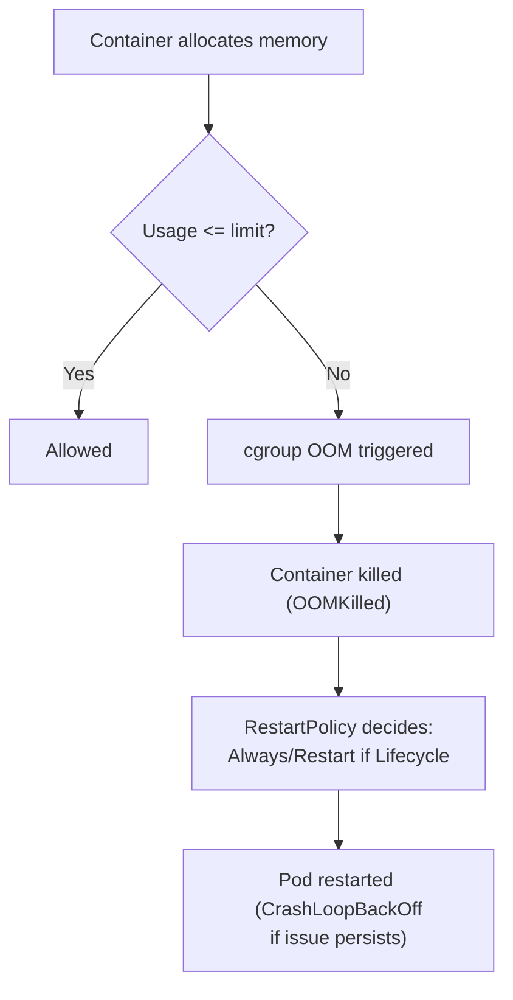

# Resource Management - In-Depth Mechanics

## Memory Units

Kubernetes uses **binary (IEC) units** for memory, matching the underlying cgroup values. Using the wrong unit type leads to **10x or 1024x misconfigurations**.

### Supported Units

- **`Ki`** (kibibyte) = 2^10 = 1,024 bytes
- **`Mi`** (mebibyte) = 2^20 = 1,024 KiB
- **`Gi`** (gibibyte) = 2^30 = 1,024 MiB

**Decimal versions (also accepted but NOT recommended):**

- **`K`**, **`M`**, **`G`** = powers of 10. `1K = 1000`, `1M = 1000K`, `1G = 1000M`.

### Common Values

| Value | Exact Bytes |
|-------|-------------|
| `64Mi` | 67,108,864 B |
| `128Mi` | 134,217,728 B |
| `256Mi` | 268,435,456 B |
| `512Mi` | 536,870,912 B |
| `1Gi` | 1,073,741,824 B |

### The Dangers of Decimal Units

```yaml
# WARNING: This asks for 1,048,576 bytes because M = 10^6
resources:
  requests:
    memory: "1M"    # means 1,000,000 bytes

# CORRECT: This asks for 1,048,576 bytes (1 MiB)
resources:
  requests:
    memory: "1Mi"   # means 1,048,576 bytes
```

On large values, the difference compounds. A service requesting `2G` gets 2,000,000,000 bytes (~1.86 GiB), which may cause OOMKill under the same conditions as if you had requested `2Gi`.

### How Memory Is Enforced

Unlike CPU (which is throttled), memory is enforced via **OOM killer** within the container's cgroup.



### kubectl Examples

```bash
# Set memory request and limit in a pod
kubectl run mem-demo --image=polinux/stress --restart=Never \
  --limits=memory=256Mi --requests=memory=128Mi \
  -- stress --vm 1 --vm-bytes 200M --vm-hang 0 --timeout 600s

# Simulate OOMKill
kubectl run oom-demo --image=polinux/stress --restart=Never \
  --limits=memory=64Mi --requests=memory=32Mi \
  -- stress --vm 1 --vm-bytes 200M --vm-hang 0 --timeout 600s

# Check exit reason
kubectl get pod oom-demo -o jsonpath='{.status.containerStatuses[0].state.terminated.reason}'
# OOMKilled

# Check previous container log (available after restart)
kubectl logs oom-demo --previous
```

### Viewing Node Memory Capacity

```bash
# Check actual allocatable memory on nodes
kubectl describe nodes | grep -A10 "Allocatable:"

# Example output:
# cpu:             4
# memory:          16Gi
# pods:            110
```

### Best Practices

- **Always use `Mi` and `Gi`** in Kubernetes manifests. Reserve `M` and `G` for applications that expect SI units.
- **Set memory requests close to typical observed usage** to allow bin-packing. Use `request = limit` only for `Guaranteed` QoS.
- **Align application memory config with container limits**: if Java has `-Xmx768m` and the container limit is `1Gi`, the JVM might not detect the cgroup limit unless you pass `-XX:+UseContainerSupport`.
- **Headroom is essential**: set container memory limits to 10-30% above your application's configured max heap to cover metaspace, thread stacks, and native allocations.

### Common Pitfalls

- **Confusing `Mi` with `MB`**: Java's `-Xmx768MB` uses megabytes, while `768Mi` is ~806MB. A mismatch causes OOM even when the number looks safe.
- **Node allocatable is NOT the raw node memory**: the kubelet reserves memory for the OS, kubelet itself, and eviction thresholds. Use `kubectl describe node` to get the actual allocatable number.
- **Memory increases in StatefulSets are not automatically relocated**: if you raise a StatefulSet Pod's memory limit, the Pod stays on its current node and will only OOMKill if that node cannot provide the new limit (actually, limits aren't capacity checks at runtime from node perspective — the cgroup enforces regardless).
