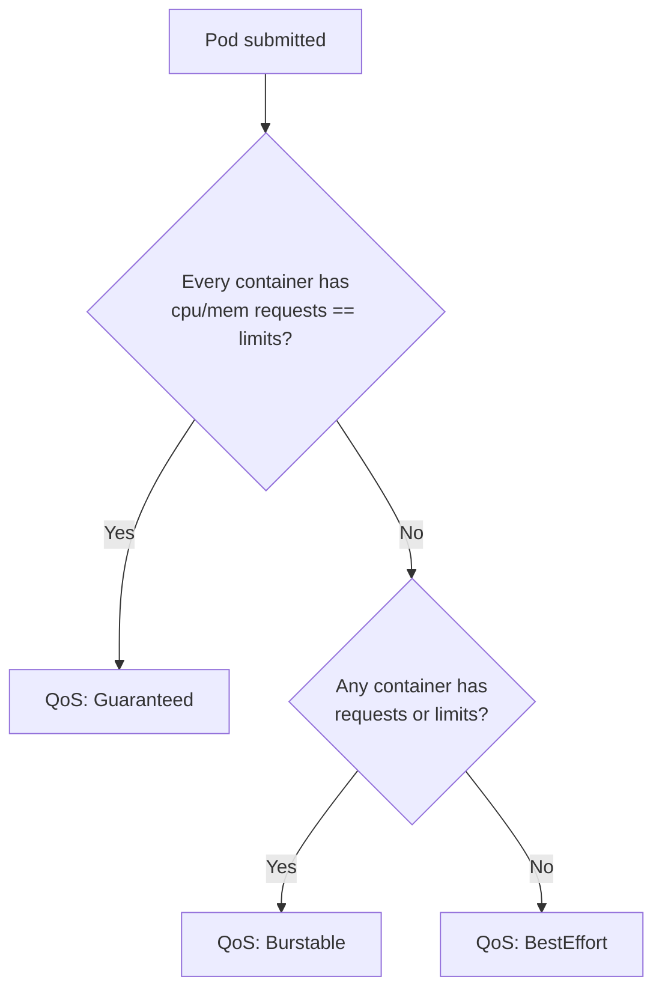
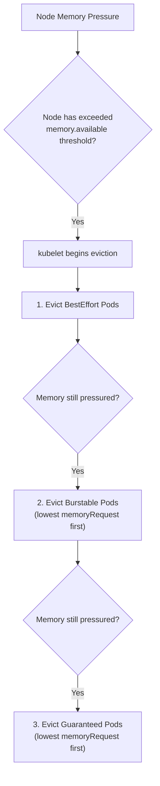

# Resource Management - In-Depth Mechanics

## QoS Classes

Kubernetes assigns a **Quality of Service (QoS) class** to each Pod based on its CPU and memory requests/limits. The QoS class determines the Pod's **eviction priority** when the node comes under memory pressure.

### The Three QoS Classes

| Class | Criteria | Eviction Priority |
|-------|----------|-------------------|
| **Guaranteed** | Every container in the Pod has **identical** `requests` and `limits` for **both** CPU and memory | Last (most protected) |
| **Burstable** | At least one container has a request or limit set, but not all meet Guaranteed criteria | Middle |
| **BestEffort** | No container in the Pod has any requests or limits defined | First (least protected) |

### How QoS Is Computed



### Detailed Class Breakdown

#### Guaranteed

```yaml
resources:
  requests:
    cpu: "500m"
    memory: "512Mi"
  limits:
    cpu: "500m"
    memory: "512Mi"
```

- The Pod is **least likely to be evicted** under memory pressure.
- Even if a container exceeds its memory, it is not killed for node-level eviction (though it may be OOMKilled by the kernel if it hits the cgroup limit).
- The kubelet sets cgroup `oom_score_adj` to `-997` for Guaranteed Pods.

#### Burstable

```yaml
resources:
  requests:
    cpu: "100m"
    memory: "256Mi"
  limits:
    cpu: "1000m"
    memory: "1Gi"
```

- The most common QoS class in production.
- `oom_score_adj` is set to `min(max(2, 1000 - (1000 * memoryRequest) / nodeAllocatableMemory), 999)`
- Pods with **larger memory requests** are evicted **later** (have higher protection) than those with smaller requests.

#### BestEffort

```yaml
# No resources section at all
resources: {}
```

- Most aggressive eviction target.
- Containers can use unlimited node memory and CPU, starving others.
- `oom_score_adj` is set to `1000` — the kernel considers these processes first in OOM situations.

### Eviction Order Under Memory Pressure



### Inspecting QoS Class

```bash
# Check the QoS class of running pods
kubectl get pods --all-namespaces -o jsonpath='{range .items[*]}{.metadata.namespace}{"\t"}{.metadata.name}{"\t"}{.status.qosClass}{"\n"}{end}' | sort -t$'\t' -k3

# Current node eviction status
kubectl describe node <node-name> | grep -A5 "Allocated resources"
```

### Best Practices

- **Make critical system Pods Guaranteed**: DNS (CoreDNS), CNI plugins, and monitoring agents should have `requests == limits`.
- **Use Burstable for most application Pods**: it gives a balance between scheduling guarantees and burst capability.
- **Never leave production Pods as BestEffort**: no scheduler hint, evicted first, worst latency behavior.
- **Understand that QoS is derived, not configured**: you cannot explicitly set QoS. You control it by choosing the right requests/limits combination.
- **A Pod is ALL Guaranteed or nothing**: if even one container in a multi-container Pod is missing a matching request/limit pair, the entire Pod drops to Burstable.

### Common Pitfalls

- **Adding an init container without matching requests/limits** downgrades an otherwise Guaranteed Pod to Burstable.
- **The QoS class applies at the Pod level, not container level**: this surprises people with sidecar patterns.
- **Guaranteed does NOT mean "never killed"**: the kernel OOM killer can still terminate containers that exceed their cgroup memory limit regardless of QoS class.
- **CPU QoS is proactive (throttling), memory QoS is reactive (eviction)**: a Burstable Pod hitting its CPU limit gets throttled; it does not get evicted based on CPU alone.
