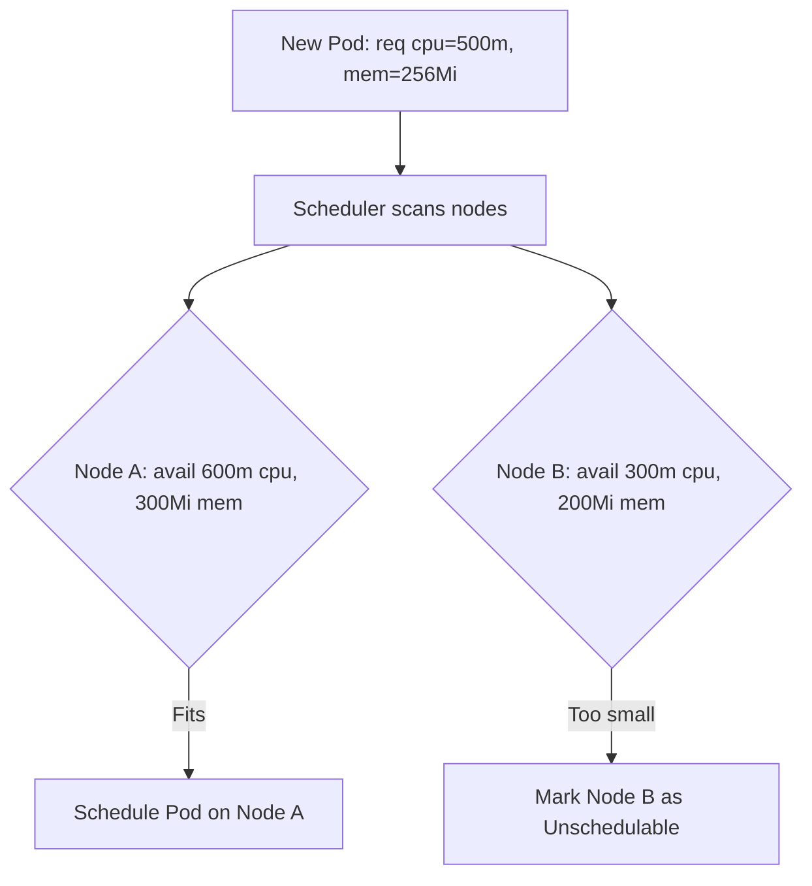

# Resource Management - In-Depth Mechanics

## Requests vs Limits

Resource **requests** and **limits** serve fundamentally different purposes in Kubernetes, and confusing them is one of the most common sources of production incidents.

### Requests: The Scheduling Hint

- **Used by the scheduler** to decide which node a Pod can run on.
- The scheduler checks: `node.allocatable - sum(existing requests)` >= `new pod's requests`.
- If a node cannot satisfy the request, the Pod stays in `Pending` state with a `Unschedulable` event.
- Requests represent a **guarantee**: the node commits to providing at least this capacity.



### Limits: The Runtime Guardrail

- **Enforced by the kubelet via cgroups** at runtime.
- **CPU**: hard limit on CPU time. Containers exceeding their limit are **throttled**.
- **Memory**: hard cap on RSS + cache. Containers exceeding their limit trigger **OOMKill**.

### Detailed Behavior Comparison

| Aspect | Requests | Limits |
|--------|----------|--------|
| Enforced when | Scheduling time | Runtime (kubelet/cgroup) |
| CPU behavior | Minimum guaranteed | Hard cap (throttling above) |
| Memory behavior | Minimum guaranteed | Hard cap (OOMKill above) |
| Affects QoS class | Yes (eviction order) | Yes (Guaranteed vs Burstable) |
| Default if unset | 0 (BestEffort) | Infinite (BestEffort) |

### CPU: Throttling Deep Dive

When a container exceeds its CPU limit over the CFS period (`cpu.cfs_period_us`, default 100ms):

```bash
# Check CFS period and quota for a container cgroup
cat /sys/fs/cgroup/cpu/kubepods.slice/.../cpu.cfs_period_us
cat /sys/fs/cgroup/cpu/kubepods.slice/.../cpu.cfs_quota_us

# CPU throttle percentage = (period - quota) / period * 100
# Example: period=100000us, quota=50000us => 50% limit => 50% throttling
```

At `cpu.cfs_quota_us = 0`, the container has **no CPU limit** and runs unbounded.

### Memory: OOMKill Deep Dive

When a container exceeds its memory limit:

```bash
# Check OOMKill reason in pod status
kubectl get pod <name> -o jsonpath='{.status.containerStatuses[0].lastState.terminated.reason}'
# OOMKilled

# Check OOM events
kubectl describe pod <name> | grep -A5 "Last State"
# State:          Terminated
# Reason:       OOMKilled
# Exit Code:    137
```

Exit code `137` = `128 + 9` (SIGKILL). This is also returned for `kubectl kill`, so combine with the reason field.

### kubectl Examples

```bash
# Pod with requests == limits => Guaranteed QoS
kubectl run gq-demo --image=nginx --restart=Deployment --replicas=1 \
  --limits=cpu=500m,memory=512Mi --requests=cpu=500m,memory=512Mi

# Pod with requests < limits => Burstable QoS
kubectl run burst-demo --image=nginx --restart=Deployment --replicas=1 \
  --limits=cpu=1000m,memory=1Gi --requests=cpu=250m,memory=256Mi

# Pod with no resources => BestEffort QoS
kubectl run be-demo --image=nginx --restart=Deployment --replicas=1

# Verify QoS class
kubectl get pods -l app=burst-demo -o wide
kubectl describe pod <pod-name> | grep -i qos
```

### Best Practices

- **Always set both requests and limits for production workloads**: unattended BestEffort Pods are unpredictable and unsafe.
- **Set requests based on utilization, limits based on SLO headroom**: if a service normally uses 200m CPU and you set limits to 2000m, draining node capacity is safe and burst behavior is flexible.
- **Use Vertical Pod Autoscaler (VPA)** to automatically recommend or enforce right-sized requests/limits based on historical usage.
- **Memory requests should equal memory limits for latency-sensitive workloads (Guaranteed)** to avoid any chance of OOM during garbage collection pauses.
- **CPU requests should be set conservatively** to allow many Pods on a node; leave burst room via limit >> request.

### Common Pitfalls

- **Requests = 0 in BestEffort Pods**: the scheduler treats the request as "0", meaning many BestEffort Pods can stack on one node until resources are exhausted, causing cascading OOM.
- **Setting limits lower than the application needs**: JVM apps, databases, and anything with internal thread pools can behave badly when memory-limited. Always test limits in staging.
- **No limit does not mean "infinite" in a meaningful sense**: without a limit, the container can exhaust node memory and cause other Pods to be evicted.
- **Misunderstanding limit range defaults**: if a LimitRange injects defaults, your explicit values may be overridden (for default) or capped (for max).
