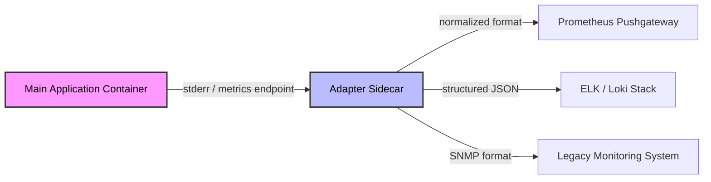

# Multi-Container Pods - In-Depth Mechanics

## Adapter Pattern

### Concept
@comment explain better that a container cannot read another container stdout, (stdout is read by kubectl logs...). option 1 (better for logs and files) they talk through a shared mounted volume, explain why emptydir, option 2 (api trans,ation and metrics) container on the same pod share the network namespace so they can talk on localhost, eg main output on 7000 while adapter listens 7000 translates and output on 9000, then the outside world can read from 9000.
The **Adapter Pattern** uses a sidecar container to transform the main application's output, metrics, or monitoring interface into a format consumable by external systems. The adapter "wraps" the application to make it compatible with the surrounding ecosystem without modifying the application itself.

This pattern embodies the **separation of concerns**: the application focuses on business logic, while the adapter handles external integration details.

### Architecture



### Real-World Example: Legacy Log Adapter

Many legacy applications write logs in a custom binary format or a non-standard text format that the logging stack cannot ingest. Instead of rewriting the application, run an adapter that tails the log file, transforms it, and writes to stdout or a shared volume.

**Kubernetes Manifest:**

```yaml
apiVersion: v1
kind: Pod
metadata:
  name: legacy-app-with-adapter
spec:
  containers:
  - name: legacy-app
    image: legacy-java-app:1.0
    volumeMounts:
    - name: log-volume
      mountPath: /var/log/app
  - name: log-adapter
    image: fluentd-embeddable:latest
    volumeMounts:
    - name: log-volume
      mountPath: /var/log/app
      readOnly: true
    env:
    - name: FLUENTD_ARGS
      value: "-c /etc/fluentd/config/transform.conf"
```
@comment probavly missing a volume here

The `log-adapter` tail `/var/log/app/app.log`, applies regex transformations or field extractions, and forwards the result to the logging infrastructure.

### Common Adapter Scenarios

| Scenario | What the App Produces | What the Adapter Produces | Adapter Example |
|----------|----------------------|---------------------------|-----------------|
| Custom metrics | `/metrics` in Prometheus format | StatsD, Graphite, or CloudWatch format | `statsd-exporter` wrapping a JMX-only app |
| Legacy logs | COBOL-style fixed-width records | JSON for Loki/Elasticsearch | Custom Fluentd filter |
| SNMP monitoring | Standard HTTP health endpoint | SNMP trap or MIB data | `snmp-exporter` with custom rules |
| Health checks | App outputs CSV diagnostics | Prometheus exporter format | Custom health-to-metrics bridge |

### When to Use

- You cannot modify the main application (legacy code, third-party binary, or vendor constraints).
- You need to bridge between two incompatible monitoring or logging ecosystems.
- You want to decouple the application's internal representation from what the platform expects.

### When NOT to Use

- If you can modify the application to expose the desired format natively (the adapter adds operational overhead).
- If a DaemonSet or cluster-wide agent already handles the transformation for all Pods.

### Best Practices

1. **Share volumes, not networks**: For log adapters, share an `emptyDir` volume rather than relying on stdout capture. EmptyDir gives you durability and file-based streaming semantics.
2. **Use one adapter per concern**: Don't build a "kitchen sink" adapter that transforms logs AND metrics. Keep adapters focused.
3. **Set resource requests**: Adapters are typically I/O bound but may buffer. Set requests to prevent eviction.
4. **Monitor the adapter**: If the adapter crashes, the external system stops receiving data. Alert on adapter health independently.

### Community Knowledge

- **Prometheus Exporters**: The `*-exporter` pattern (e.g., `node_exporter`, `redis_exporter`, `mongodb_exporter`) is the canonical adapter pattern. They scrape a target and re-expose metrics in Prometheus format.
- **OpenTelemetry Collector**: Running the OTel Collector as an adapter allows you to process, filter, and route telemetry from any application before exporting to any backend.
- **CloudWatch Embedded Metric Format (EMF)**: Applications can push JSON to stdout, and a Fluent Bit sidecar extracts structured metrics.

### Common Pitfalls

1. **Adapter becomes the single point of failure**: If the adapter is not robust, data loss occurs. Consider retention logic or retry capabilities in the adapter.
2. **Volume permission mismatches**: The adapter container must have read (or write) permissions on the shared volume. Ensure `fsGroup` or container `securityContext` settings allow access.
3. **Temporal desynchronization**: Logs may arrive at the destination out of order if the adapter buffers. Use sequence numbers or timestamps in transformations.
