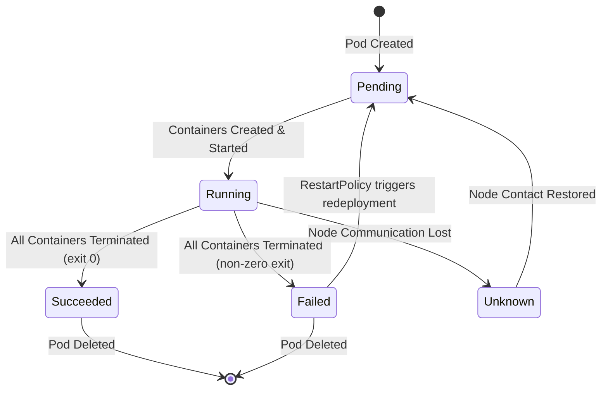

# Pods - In-Depth Runtime Mechanics

## Core Mechanics & Lifecycle

### Pod Phase Transitions

A Pod's `status.phase` is the highest-level summary of its lifecycle. The kubelet and control plane manage transitions between these phases. Understanding them is critical for debugging and building reliable workloads.



| Phase | Description | Common Causes |
|-------|-------------|---------------|
| `Pending` | Pod accepted by API server, but not yet scheduled or still pulling images. | Image pull delays, scheduler backlog, PVC binding pending. |
| `Running` | Pod bound to a node. At least one container is running, starting, or restarting. | Normal steady state. |
| `Succeeded` | All containers terminated with exit code 0. Pod will not restart. | Completed Jobs (CronJob, batch workloads). |
| `Failed` | All containers terminated, at least one with non-zero exit code. | Application crash, OOMKill, liveness probe failure after restart exhaustion. |
| `Unknown` | Control plane cannot determine state (usually node unreachable). | Network partition, node power loss, kubelet unresponsive. |

### Container State Within Pods

While `status.phase` describes the Pod overall, `status.containerStatuses` gives per-container detail:

- **Waiting**: Container cannot run (ImagePullBackOff, CrashLoopBackOff, waiting for init container).
- **Running**: Container executing normally. Check `state.running.startedAt` to know when it began.
- **Terminated**: Container finished or was killed. Check `state.terminated.exitCode`, `reason`, and `signal` to understand why.

### Restart Policies

Restart policies are set at the **Pod spec level**, not per-container. They govern how the kubelet handles container exits.

| Policy | Behavior | Typical Use Case |
|--------|----------|------------------|
| `Always` | Restart regardless of exit code | Long-running services, web servers |
| `OnFailure` | Restart only if exit code != 0 | Batch jobs, worker processes |
| `Never` | Never restart; Pod remains in `Failed` phase after termination | One-shot scripts, cleanup tasks |

**Important**: A Pod with `restartPolicy: Never` that fails will stay in `Failed` indefinitely. This is a common source of stuck workloads in Jobs when the application has a bug.

### Container Command & Argument Overrides

Kubernetes separates the image entrypoint into two fields:

| Docker Field | Kubernetes Field | Override Behavior |
|-------------|------------------|-------------------|
| `ENTRYPOINT` | `command` | Replaces Docker `ENTRYPOINT` entirely |
| `CMD` | `args` | Replaces Docker `CMD` entirely |

**Key rule**: If you specify `command`, you must provide the full command. There is no "partial override" -- `args` only applies to the default command, and `command` only applies to the default entrypoint. Mixing them predictably requires knowing the image's original Dockerfile.

```yaml
# Example: Override both command and args
containers:
- name: nginx
  image: nginx
  command: ["/usr/bin/dumb-init", "--"]
  args: ["nginx", "-g", "daemon off;"]
```

### Resource Requests and Limits

Resources are defined per-container, not per-Pod. The scheduler uses requests, while the container runtime enforces limits via cgroups.

| Parameter | Used By | Behavior |
|-----------|---------|----------|
| `requests.cpu` | Scheduler, Kubelet (guaranteed QoS) | Minimum CPU share allocated. Used for bin-packing decisions. |
| `requests.memory` | Scheduler, Kubelet (guaranteed QoS) | Minimum memory guaranteed. If node is under memory pressure, Pods with only requests may be evicted before those with matching limits. |
| `limits.cpu` | Cgroup | Throttled when exceeded. `cpu` is a compressible resource -- the container slows down but continues running. |
| `limits.memory` | Cgroup | Hard limit. If exceeded, container is **OOMKilled** (`exit code 137`). |

#### QoS Classes

Kubernetes assigns a Quality of Service class based on resource configuration:

| QoS Class | Condition | Eviction Priority |
|-----------|-----------|-------------------|
| `Guaranteed` | `limits == requests` for both CPU and memory, and every container has them set. | Last to be evicted. |
| `Burstable` | At least one container has a request or limit set (but not Guaranteed). | Evicted before Guaranteed, after BestEffort. |
| `BestEffort` | No requests or limits set on any container. | First to be evicted under pressure. |

```yaml
# Guaranteed QoS example
containers:
- name: app
  resources:
    requests:
      cpu: "100m"
      memory: "256Mi"
    limits:
      cpu: "100m"
      memory: "256Mi"
```

**Best Practice**: Always set requests for both CPU and memory on production workloads. BestEffort Pods are the first to be killed during node pressure.

### Common Pitfalls & Troubleshooting

1. **OOMKill (Exit Code 137)**:
   - Check: `kubectl describe pod <name>` for `OOMKilled` reason.
   - Fix: Increase memory limit or fix memory leak. Use `kubectl top pod <name>` to see live memory usage.

2. **CrashLoopBackOff**:
   - Check: `kubectl logs <pod> --previous` to see logs from the previous crashed container.
   - Common causes: Missing env vars, failed health checks, dependency unavailable.

3. **ImagePullBackOff / ErrImagePull**:
   - Check: `kubectl describe pod <name>` for image pull errors.
   - Fix: Verify image name/tag, check registry credentials (ImagePullSecrets), ensure network egress is allowed.

4. **Pending Pods that Won't Schedule**:
   - Check: `kubectl describe pod <name>` for scheduler events.
   - Common cause: Insufficient CPU/memory requests, node affinity mismatch, taints/tolerations, PVC pending.

5. **Throttling Without Limits**:
   - Without CPU limits, containers can consume all available CPU on a node, starving co-located workloads. Always set limits.

6. **Setting Limits Without Requests**:
   - If only limits are set, Kubernetes uses the limit value as the request. This can lead to poor scheduling decisions. Always set requests explicitly.

### Monitoring Events

Use these commands to observe lifecycle events:

```bash
# Watch events in real-time for a namespace
kubectl get events --watch --sort-by='.lastTimestamp'

# Describe a pod to see exit reasons and restart counts
kubectl describe pod <pod-name>

# Check current resource usage vs limits
kubectl top pod <pod-name>

# View previous container logs after a crash
kubectl logs <pod-name> --previous
```
