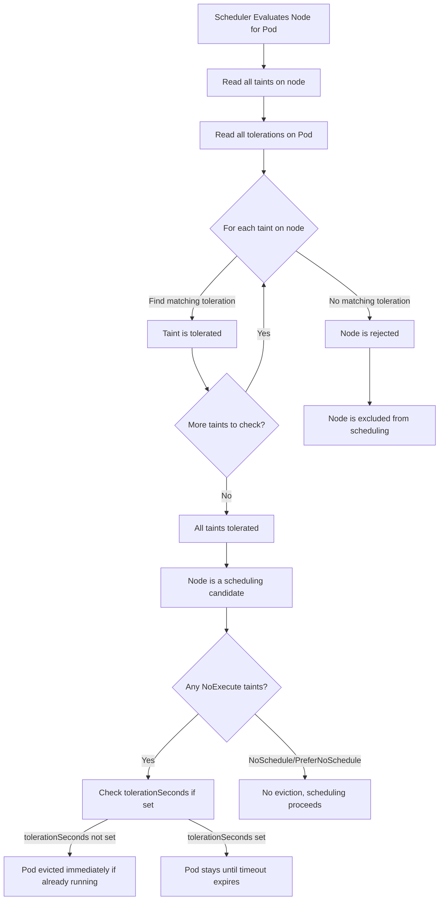

# Pods - Taints & Tolerations - Core Concepts

This document explains the fundamental concepts behind taints and tolerations in Kubernetes scheduling, including how they interact with the scheduler and the scheduler's decision-making process.

## What Are Taints and Tolerations?

Taints and tolerations work together to prevent Pods from being placed on inappropriate nodes. A **taint** is applied to a node and acts as a repulsion signal — it tells the scheduler that Pods without a matching toleration should not be placed on that node. A **toleration** is applied to a Pod and gives it permission to be scheduled onto nodes with matching taints.

Think of it as a two-sided contract:
- The **node** says "I don't want certain Pods here" via taints.
- The **Pod** says "I'm okay with this node's restrictions" via tolerations.

## The Three Taint Effects

Each taint has an **effect** that determines how the scheduler and node controller respond to it. There are three possible effects:

### `NoSchedule`

The scheduler will not place new Pods on the node unless they tolerate the taint. Already-running Pods are **not** affected. This is the most common effect for dedicated or reserved nodes.

```bash
kubectl taint nodes node1 dedicated=special:NoSchedule
```

### `PreferNoSchedule`

A soft constraint. The scheduler will try to avoid placing Pods on the node, but if no other nodes are suitable, it may schedule the Pod there anyway. This is useful when you want to discourage placement but not strictly forbid it.

```bash
kubectl taint nodes node1 dedicated=special:PreferNoSchedule
```

### `NoExecute`

The most restrictive effect. Like `NoSchedule`, the scheduler will not place new Pods on the node unless they tolerate the taint. Additionally, **already-running Pods that do not tolerate the taint will be evicted**. The node controller manages this eviction and can apply a `tolerationSeconds` grace period.

```bash
kubectl taint nodes node1 dedicated=special:NoExecute
```

## How the Scheduler Evaluates Taints and Tolerations

When the scheduler considers a node for a Pod, it performs the following evaluation:

1. **List all taints on the node.**
2. **Check each toleration in the Pod spec.**
3. **For each taint, determine if the Pod has a toleration that matches it.**
4. **If any taint has no matching toleration, the node is rejected for scheduling.**
5. **If all taints are tolerated, the node is a candidate for scheduling.**

A toleration matches a taint when:
- The **key** matches, OR the toleration has an empty key with `operator: Exists`.
- The **effect** matches, OR the toleration's effect is empty (which matches all effects).
- The **value** matches (for `operator: Equal`) — this is only checked when `operator` is `Equal`.

## Scheduling Decision Flow



## Taint Key and Value Semantics

 - **Key**: A string label for the taint. Must be a valid Kubernetes label key (max 253 characters, alphanumeric, hyphens, underscores, dots).
- **Value**: An optional string associated with the key. If no value is provided, the taint is still valid but tolerations using `operator: Equal` must also omit the value.
- **Effect**: One of `NoSchedule`, `PreferNoSchedule`, or `NoExecute`.

### Taint Without a Value

```bash
kubectl taint nodes node1 dedicated:NoSchedule
```

This creates a taint with key `dedicated`, no value, and effect `NoSchedule`. A matching toleration would be:

```yaml
tolerations:
  - key: dedicated
    operator: Exists
    effect: NoSchedule
```

Note that `operator: Equal` with an empty value also works in this case, but `Exists` is the idiomatic approach.

## Interaction with Other Scheduling Constraints

Taints and tolerations interact with other scheduling mechanisms:

- **Node Affinity**: A Pod must satisfy both its node affinity rules AND tolerate all node taints. Taints are evaluated first; if a node is rejected due to taints, affinity rules are never checked for that node.
- **Node Selector**: Similar to node affinity — the Pod must pass both the node selector and taint checks.
- **Pod Affinity/Anti-Affinity**: These are evaluated after taint filtering. A node that passes taint checks is then evaluated for pod affinity rules.

## Priority and Preemption

When a high-priority Pod cannot be scheduled because all nodes are tainted, the scheduler may **preempt** lower-priority Pods. Preemption works as follows:

1. The scheduler identifies nodes where the high-priority Pod would fit if certain lower-priority Pods were removed.
2. It checks whether those lower-priority Pods have tolerations for the node's taints.
3. If a lower-priority Pod does NOT tolerate the taint, it is a candidate for eviction.
4. The scheduler evicts the candidate Pod(s) and attempts to schedule the high-priority Pod.

This means that a `NoExecute` taint can protect a node from being preempted by lower-priority Pods that don't tolerate it.

## Best Practices

- **Use `NoSchedule` for most dedicated-node scenarios.** It prevents scheduling without evicting running Pods, giving operators time to migrate workloads gracefully.
- **Reserve `NoExecute` for nodes that are genuinely unavailable** (e.g., maintenance, failure, or resource exhaustion).
- **Use `PreferNoSchedule` only when you want soft guidance**, such as preferring a node group but not strictly requiring it.
- **Always pair taints with descriptive keys** that communicate the purpose (e.g., `dedicated`, `workload-type`, `env`).
- **Test tolerations before applying taints in production.** Apply the taint, observe scheduling behavior, then roll back if needed.

## Common Pitfalls

- **Applying a taint without adding tolerations**: If you taint a node and no Pod tolerates it, no new Pods can be scheduled there. Existing Pods without tolerations for `NoExecute` will be evicted.
- **Using `NoExecute` on nodes with system daemons**: DaemonSets do not automatically tolerate all taints. If you add a `NoExecute` taint to a node, DaemonSet Pods without tolerations will be evicted. Ensure critical DaemonSet Pods have appropriate tolerations.
- **Forgetting that `PreferNoSchedule` is advisory**: In a cluster with few nodes, `PreferNoSchedule` may have no practical effect because the scheduler has no alternative nodes.
- **Mismatched effect in toleration**: A toleration with `effect: NoSchedule` will NOT match a taint with `effect: NoExecute`, even if the key and value match. The effect must match exactly (or be omitted in the toleration to match all effects).
- **Empty key with `operator: Exists` tolerates ALL taints**: This is powerful but dangerous. Use it only when you intentionally want a Pod to tolerate every taint on a node.

## Troubleshooting

### Pod Stuck in Pending

```bash
# Check events for scheduling failure reason
kubectl describe pod <pod-name> | grep -A10 Events

# Check taints on all nodes
kubectl get nodes -o json | jq '.items[].spec.taints'
```

### Pod Evicted Unexpectedly

```bash
# Check if the node has NoExecute taints
kubectl describe node <node-name> | grep -i taint

# Check Pod tolerations
kubectl get pod <pod-name> -o jsonpath='{.spec.tolerations}'

# Check node controller logs for eviction reason
kubectl logs -n kube-system kube-controller-manager | grep -i "evict\|taint"
```