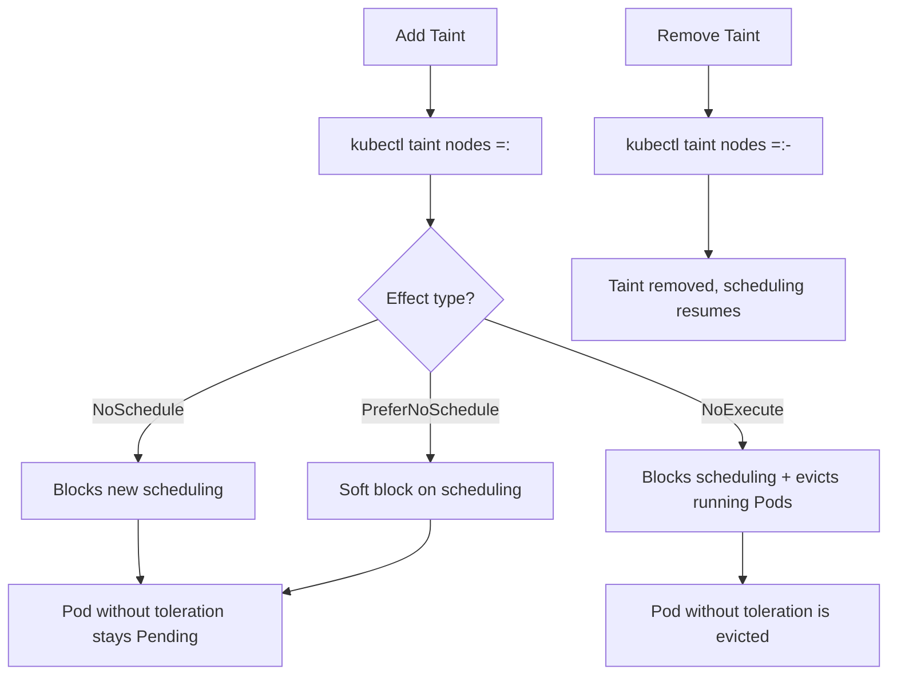

# Pods - Taints & Tolerations - Taint Format

This document covers the syntax and format of taints in Kubernetes, including how to create, modify, and remove taints using `kubectl`.

## Taint Syntax

A taint is defined by three components: `key`, `value`, and `effect`. The full format is:

```
<key>=<value>:<effect>
```

When using `kubectl taint`, the format is:

```
kubectl taint nodes <node-name> <key>=<value>:<effect>
```

### Components Breakdown

| Component | Required | Description | Example |
|-----------|----------|-------------|---------|
| `key` | Yes | A label-like identifier for the taint | `dedicated` |
| `value` | No | A string value associated with the key | `gpu` |
| `effect` | Yes | How the scheduler/node controller responds | `NoSchedule` |

## The Three Effects

### `NoSchedule`

Prevents the scheduler from placing new Pods on the node unless they tolerate the taint. Does not affect running Pods.

```bash
kubectl taint nodes node1 disktype=ssd:NoSchedule
```

### `PreferNoSchedule`

A soft preference that the scheduler tries to honor but will override if no other nodes are available.

```bash
kubectl taint nodes node1 disktype=ssd:PreferNoSchedule
```

### `NoExecute`

Prevents scheduling AND evicts running Pods that do not tolerate the taint. The node controller manages eviction timing.

```bash
kubectl taint nodes node1 disktype=ssd:NoExecute
```

## Taint Operations with kubectl

### Adding a Taint

```bash
# Basic taint with key, value, and effect
kubectl taint nodes node1 dedicated=special:NoSchedule

# Taint with no value
kubectl taint nodes node1 dedicated:NoSchedule

# Taint with NoExecute effect
kubectl taint nodes node1 env=prod:NoExecute

# Taint with PreferNoSchedule effect
kubectl taint nodes node1 workload=batch:PreferNoSchedule
```

### Removing a Taint

To remove a taint, use the `-` suffix and omit the effect (or specify it — both work, but omitting is more common):

```bash
# Remove by key (and value if specified)
kubectl taint nodes node1 dedicated=special:NoSchedule-

# Remove by key only (the - suffix without value removes any taint with that key)
kubectl taint nodes node1 dedicated:NoSchedule-

# Remove a taint with no value
kubectl taint nodes node1 dedicated:NoSchedule-
```

**Important**: When removing a taint, you must include the effect in the command. The `-` suffix replaces the effect in the command syntax.

### Listing Taints on a Node

```bash
# Describe node and grep for taints
kubectl describe node node1 | grep Taints

# JSON output for programmatic use
kubectl get node node1 -o jsonpath='{.spec.taints}'

# List all nodes and their taints
kubectl get nodes -o json | jq '.items[] | {name: .metadata.name, taints: .spec.taints}'
```

### Updating a Taint

There is no direct "update" command for taints. To change a taint, remove the old one and add the new one:

```bash
# Remove old taint
kubectl taint nodes node1 dedicated=special:NoSchedule-

# Add new taint with different effect
kubectl taint nodes node1 dedicated=special:NoExecute
```

## Taint Format Examples

### Key-Only Taint

```bash
kubectl taint nodes node1 dedicated:NoSchedule
```

Resulting taint object:
```json
{
  "key": "dedicated",
  "effect": "NoSchedule"
}
```

### Key-Value Taint

```bash
kubectl taint nodes node1 gpu=true:NoSchedule
```

Resulting taint object:
```json
{
  "key": "gpu",
  "value": "true",
  "effect": "NoSchedule"
}
```

### Multiple Taints on One Node

```bash
kubectl taint nodes node1 dedicated=special:NoSchedule
kubectl taint nodes node1 env=prod:NoExecute
kubectl taint nodes node1 gpu=true:NoSchedule
```

The node now has three taints. A Pod must tolerate all three to be scheduled on this node.

### Removing All Taints from a Node

```bash
# Remove specific taints one by one
kubectl taint nodes node1 dedicated:NoSchedule-
kubectl taint nodes node1 env:NoExecute-

# Or remove all taints by editing the node directly (not recommended in production)
kubectl patch node node1 -p '{"spec":{"taints":null}}'
```

## Taint Format in Pod Specs

In a Pod spec, tolerations reference taints using a similar structure:

```yaml
tolerations:
  - key: "dedicated"
    operator: "Equal"
    value: "special"
    effect: "NoSchedule"
    tolerationSeconds: 3600
```

The toleration fields mirror the taint fields:
- `key`: Must match the taint key.
- `operator`: `Equal` (exact match) or `Exists` (key exists, value irrelevant).
- `value`: Required when `operator` is `Equal`; must match the taint value exactly.
- `effect`: Must match the taint effect. Omitting it matches all effects.
- `tolerationSeconds`: Only valid with `NoExecute` effect. Defines how long the Pod stays on the node after the taint is added before eviction.

## Taint Format Validation

Kubernetes validates taint keys and values against label constraints:
- Keys must be a valid label key (max 253 characters for the DNS subdomain prefix, name part must be 63 characters or less, must be a qualified name or have a DNS subdomain prefix).
- Values must be valid label values (max 63 characters, alphanumeric with hyphens, underscores, and dots).
- Effects must be one of the three valid values: `NoSchedule`, `PreferNoSchedule`, `NoExecute`.

## Common Exam Patterns



## Best Practices

- **Use consistent naming conventions** for taint keys across your cluster (e.g., `dedicated`, `env`, `workload-type`).
- **Include values in taints** when the distinction matters (e.g., `gpu=true` vs `gpu=false`). Use key-only taints when the presence of the key alone is meaningful.
- **Prefer `NoSchedule` over `NoExecute`** for planned maintenance or node dedications, as it avoids unexpected evictions.
- **Always document taints** in your cluster runbooks so that other operators understand why a node is tainted.
- **Use `kubectl taint` with the `-` suffix** for removal — it is idempotent and safe to run even if the taint doesn't exist (it will simply return a "not found" message).

## Common Pitfalls

- **Omitting the effect when removing a taint**: The command `kubectl taint nodes node1 dedicated:NoSchedule-` is correct. Omitting the `-` suffix will try to add a taint instead of removing it.
- **Mismatching the value when removing**: If the taint was added with a value (`dedicated=special`), you must include the value in the removal command. Using just `dedicated:NoSchedule-` will not match and will fail.
- **Using `=` instead of `=` in the taint command**: The format uses `=` between key and value, and `:` between value and effect. Using `:` for the key-value separator is a common syntax error.
- **Forgetting that `PreferNoSchedule` is advisory**: In exam questions, students often assume `PreferNoSchedule` prevents scheduling entirely. It only prefers to avoid the node.
- **Applying `tolerationSeconds` to non-NoExecute effects**: `tolerationSeconds` is only meaningful with `NoExecute`. It is silently ignored for `NoSchedule` and `PreferNoSchedule`.

## Troubleshooting

### Taint Not Being Applied

```bash
# Check if the node exists
kubectl get node <node-name>

# Verify the taint was applied
kubectl describe node <node-name> | grep Taints

# Check for typos in the key-value-effect format
# The format is key=value:effect — note the colon, not a space
```

### Taint Not Being Removed

```bash
# List current taints to verify exact format
kubectl get node <node-name> -o jsonpath='{.spec.taints}'

# Remove with exact matching key, value, and effect
kubectl taint nodes <node-name> <key>=<value>:<effect>-

# If value was empty, use key-only format
kubectl taint nodes <node-name> <key>:<effect>-
```