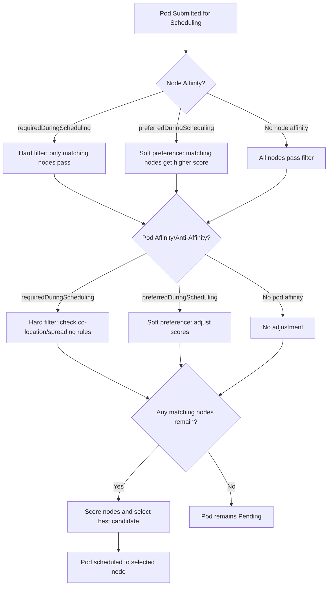

# Pods - Scheduling Affinity - Core Concepts

This document covers the core concepts of Kubernetes scheduling affinity, including node affinity, pod affinity, and pod anti-affinity, with detailed explanations of each mechanism and how they influence the scheduler.

## Node Affinity

Node affinity allows you to constrain which nodes a Pod can be scheduled on based on labels on those nodes. It is the successor to the older `nodeSelector` field and provides more expressive matching capabilities.

### How Node Affinity Works

The scheduler evaluates node affinity rules when selecting a node for a Pod. Each rule contains a label selector that matches against the labels on candidate nodes. If a node's labels satisfy the rule, the node is a valid candidate.

Node affinity has two modes:

1. **`requiredDuringSchedulingIgnoredDuringExecution`**: A hard constraint. The Pod will only be scheduled onto nodes whose labels match the selector. If no nodes match, the Pod remains in `Pending` state.
2. **`preferredDuringSchedulingIgnoredDuringExecution`**: A soft constraint. The scheduler tries to prefer nodes that match the selector, but it will schedule the Pod on a non-matching node if no matching nodes are available.

### Hard Node Affinity

```yaml
apiVersion: v1
kind: Pod
metadata:
  name: hard-affinity-pod
spec:
  affinity:
    nodeAffinity:
      requiredDuringSchedulingIgnoredDuringExecution:
        nodeSelectorTerms:
          - matchExpressions:
              - key: kubernetes.io/os
                operator: In
                values:
                  - linux
              - key: node-type
                operator: In
                values:
                  - frontend
  containers:
    - name: app
      image: myapp:latest
```

In this example, the Pod can only be scheduled on nodes that have both `kubernetes.io/os=linux` AND `node-type=frontend`. The `nodeSelectorTerms` field is a list of terms; the Pod must match at least one term. Within a term, all `matchExpressions` must be satisfied (AND logic).

### Soft Node Affinity

```yaml
apiVersion: v1
kind: Pod
metadata:
  name: soft-affinity-pod
spec:
  affinity:
    nodeAffinity:
      preferredDuringSchedulingIgnoredDuringExecution:
        - weight: 1
          preference:
            matchExpressions:
              - key: topology.kubernetes.io/zone
                operator: In
                values:
                  - us-east-1a
  containers:
    - name: app
      image: myapp:latest
```

The `weight` field (1-100) determines how much the scheduler prefers this rule relative to other preferred rules. Higher weights are stronger preferences. The scheduler calculates a score for each node based on how many preferred rules it satisfies, weighted by each rule's weight.

### Node Affinity Operators

| Operator | Description |
|----------|-------------|
| `In` | The node's label value must be in the specified list |
| `NotIn` | The node's label value must NOT be in the specified list |
| `Exists` | The node must have the label key, regardless of value |
| `DoesNotExist` | The node must NOT have the label key |
| `Gt` | The node's label value must be greater than the specified value (numeric) |
| `Lt` | The node's label value must be less than the specified value (numeric) |

### Node Affinity vs Node Selector

`nodeSelector` is a simpler, older mechanism that uses direct key-value matching:

```yaml
spec:
  nodeSelector:
    disktype: ssd
```

Node affinity is preferred because it supports:
- Multiple terms with OR logic (`nodeSelectorTerms`)
- Set-based operators (`In`, `NotIn`, `Exists`, `DoesNotExist`, `Gt`, `Lt`)
- Soft preferences (`preferredDuringSchedulingIgnoredDuringExecution`)

## Pod Affinity

Pod affinity allows you to schedule a Pod on a node that already has other Pods matching a label selector. This is useful for co-locating Pods that communicate frequently, reducing network latency.

### How Pod Affinity Works

When evaluating a node for a Pod with pod affinity, the scheduler checks whether other Pods already running on that node match the affinity's label selector. If they do, the node receives a higher scheduling score.

### Hard Pod Affinity

```yaml
apiVersion: v1
kind: Pod
metadata:
  name: co-located-pod
spec:
  affinity:
    podAffinity:
      requiredDuringSchedulingIgnoredDuringExecution:
        labelSelector:
          matchExpressions:
            - key: app
              operator: In
              values:
                - backend
        topologyKey: kubernetes.io/hostname
  containers:
    - name: app
      image: myapp:latest
```

This Pod must be scheduled on a node that already has a running Pod with `app=backend`. The `topologyKey` defines the domain of co-location — `kubernetes.io/hostname` means the Pods must be on the same node.

### Soft Pod Affinity

```yaml
apiVersion: v1
kind: Pod
metadata:
  name: preferred-co-located-pod
spec:
  affinity:
    podAffinity:
      preferredDuringSchedulingIgnoredDuringExecution:
        - weight: 100
          podAffinityTerm:
            labelSelector:
              matchExpressions:
                - key: app
                  operator: In
                  values:
                    - backend
            topologyKey: topology.kubernetes.io/zone
  containers:
    - name: app
      image: myapp:latest
```

This Pod prefers to be in the same zone as a `backend` Pod, but will be scheduled elsewhere if necessary.

## Pod Anti-Affinity

Pod anti-affinity does the opposite of pod affinity: it prevents Pods from being scheduled on nodes that already have matching Pods. This is commonly used to spread replicas across nodes or zones for high availability.

### Hard Pod Anti-Affinity

```yaml
apiVersion: v1
kind: Pod
metadata:
  name: spread-pod
spec:
  affinity:
    podAntiAffinity:
      requiredDuringSchedulingIgnoredDuringExecution:
        labelSelector:
          matchExpressions:
            - key: app
              operator: In
              values:
                - frontend
        topologyKey: kubernetes.io/hostname
  containers:
    - name: app
      image: myapp:latest
```

This Pod cannot be scheduled on a node that already has a Pod with `app=frontend`. Each `frontend` Pod will be placed on a different node.

### Soft Pod Anti-Affinity

```yaml
apiVersion: v1
kind: Pod
metadata:
  name: preferred-spread-pod
spec:
  affinity:
    podAntiAffinity:
      preferredDuringSchedulingIgnoredDuringExecution:
        - weight: 100
          podAffinityTerm:
            labelSelector:
              matchExpressions:
                - key: app
                  operator: In
                  values:
                    - frontend
            topologyKey: topology.kubernetes.io/zone
  containers:
    - name: app
      image: myapp:latest
```

This Pod prefers to be in a different zone from other `frontend` Pods but will be scheduled in the same zone if no other option exists.

## Scheduling Decision Flowchart



## Ignored During Execution

Both node affinity and pod affinity rules are **only evaluated at scheduling time**. Once a Pod is scheduled, changes to node labels or the labels on other Pods do not cause the Pod to be moved or evicted. The `IgnoredDuringExecution` suffix in the rule names explicitly calls this out.

This means:
- If a node's labels change after a Pod is scheduled, the Pod stays on that node.
- If a Pod that was used as an affinity target is deleted, the scheduled Pod is not affected.
- If a node is cordoned or drained, the Pod is evicted, but this is due to the cordon/drain operation, not affinity rules.

## Best Practices

- **Use `requiredDuringSchedulingIgnoredDuringExecution` for hard constraints** that must always be true (e.g., zone requirements, hardware requirements).
- **Use `preferredDuringSchedulingIgnoredDuringExecution` for soft preferences** that improve placement but are not mandatory (e.g., preferring a local zone).
- **Choose the right topologyKey**: Use `kubernetes.io/hostname` for node-level spreading, `topology.kubernetes.io/zone` for zone-level spreading, and custom labels for application-specific topologies.
- **Combine node affinity and pod anti-affinity** to achieve sophisticated scheduling policies (e.g., "schedule in zone A, but spread across nodes").
- **Use label selectors that are stable and meaningful**: Avoid selectors based on labels that change frequently or are not consistently applied.
- **Test affinity rules with `kubectl describe`**: After scheduling, verify that the Pod was placed according to the affinity rules by checking events.

## Common Pitfalls

- **Using `requiredDuringSchedulingIgnoredDuringExecution` with no matching nodes**: The Pod will be stuck in `Pending` forever. Always ensure that at least one node can satisfy the hard constraint.
- **Confusing `In` with `Exists`**: `In` checks both the key and value. `Exists` only checks that the key is present, regardless of value.
- **Using `NotIn` without a fallback**: If `NotIn` excludes all nodes (e.g., `NotIn: [value1, value2]` but all nodes have one of those values), the Pod cannot be scheduled.
- **Forgetting that pod affinity requires existing Pods**: Pod affinity matches against Pods that are already running. If no matching Pods exist yet, the affinity rule cannot be satisfied.
- **Misunderstanding topologyKey scope**: `topologyKey: kubernetes.io/hostname` means Pods must be on the same node. `topologyKey: topology.kubernetes.io/zone` means Pods must be in the same zone but can be on different nodes.
- **Assuming affinity rules are re-evaluated at runtime**: They are not. Once scheduled, a Pod stays on its node regardless of label changes.

## Troubleshooting

### Pod Stuck in Pending with Node Affinity

```bash
# Check Pod events for scheduling failure
kubectl describe pod <pod-name> | grep -A10 Events

# Look for messages like "0/3 nodes are available: 3 node(s) didn't match node affinity"

# Check node labels to see which nodes exist
kubectl get nodes --show-labels

# Verify the affinity selector matches at least one node's labels
```

### Pod Not Co-locating Despite Pod Affinity

```bash
# Check if matching Pods exist on any node
kubectl get pods -l app=backend -o wide

# Verify the topologyKey is correct
# If topologyKey is hostname, the matching Pod must be on the same node
# If topologyKey is zone, the matching Pod must be in the same zone

# Check if the matching Pod is running (not Pending)
kubectl get pod <backend-pod>
```

### Pod Anti-Affinity Not Spreading Pods

```bash
# Check if the anti-affinity rule is correctly configured
kubectl get pod <pod-name> -o jsonpath='{.spec.affinity.podAntiAffinity}'

# Verify the topologyKey is appropriate for spreading
# hostname = spread across nodes
# zone = spread across zones

# Check if all nodes already have a matching Pod (anti-affinity blocks all nodes)
kubectl get pods -l app=<label> -o wide
```
%comment add the following somewhere
**Question:** 
Why is `nodeSelectorTerms` a list in Node Affinity, while `labelSelector` is a single object in Pod Affinity?

**Answer:** 
The structural difference exists because of how Kubernetes handles logical **OR** conditions and how Pod Affinity relies on a `topologyKey`. In both features, you can create "OR" conditions using a list, but that list sits at a different level in the YAML hierarchy.

Here is the breakdown of why the APIs differ:

### 1. Node Affinity: The Selectors are the List
In Node Affinity, the `nodeSelectorTerms` field is an array. Kubernetes evaluates multiple terms in this list using **OR** logic. If a node matches *any* single term in the list, the Pod can be scheduled there. Inside each term, the expressions are evaluated using **AND**.

```yaml
nodeAffinity:
  requiredDuringSchedulingIgnoredDuringExecution:
    nodeSelectorTerms:
    - matchExpressions: # TERM 1: Schedule here...
      - key: gpu
        operator: Exists
    - matchExpressions: # OR TERM 2: ...or schedule here
      - key: disk
        operator: In
        values: [ssd]
```

### 2. Pod Affinity: The Terms are the List
In Pod Affinity, a `labelSelector` is a single object. To create an **OR** condition, the parent field (`requiredDuringSchedulingIgnoredDuringExecution`) acts as the list containing multiple `PodAffinityTerm` objects. 

This design is required because Pod Affinity also needs a **`topologyKey`** (which dictates if the rule applies to a node, a rack, or a zone). Kubernetes forces you to package the `labelSelector` and the `topologyKey` tightly together inside a single term. If you want an "OR" condition with different boundaries, you just add another term to the array.

```yaml
podAffinity:
  requiredDuringSchedulingIgnoredDuringExecution:
  - labelSelector: # TERM 1: Schedule near the web app on the same node...
      matchExpressions: 
      - key: app
        operator: In
        values: [web]
    topologyKey: kubernetes.io/hostname
  - labelSelector: # OR TERM 2: ...or schedule near the cache in the same zone.
      matchExpressions:
      - key: app
        operator: In
        values: [cache]
    topologyKey: topology.kubernetes.io/zone
```
