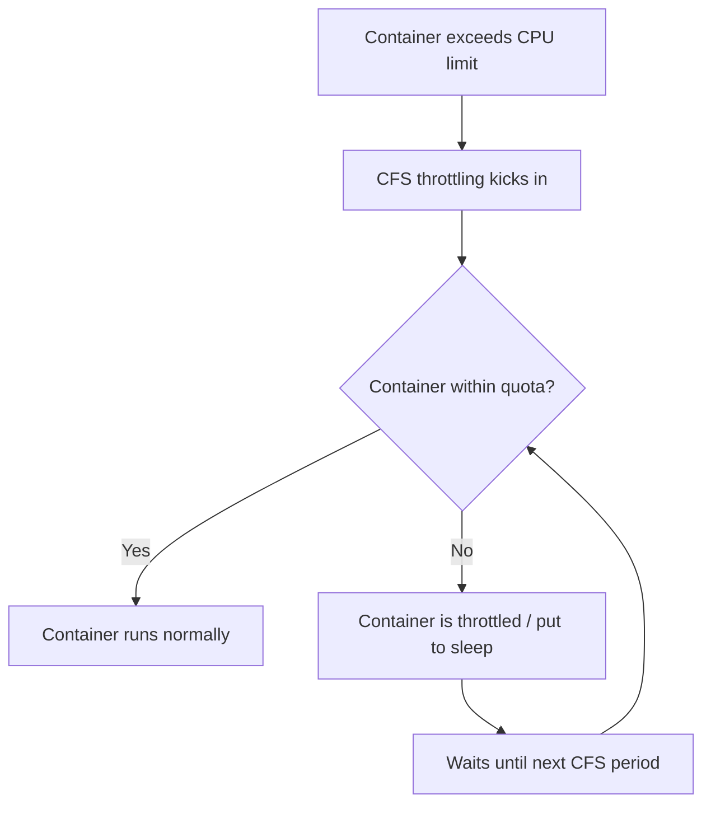
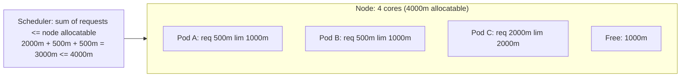

# Resource Management - In-Depth Mechanics

## CPU Units

### The CPU Unit System

Kubernetes expresses CPU resources in **CPU units**, where 1 CPU unit equals one physical or virtual core (or hyperthread) on the node the Pod runs on.

#### Unit Format

| Format | Value | Meaning |
|--------|-------|---------|
| `1` | 1.0 | One full CPU core |
| `1000m` | 1000 millicores | One full CPU core |
| `250m` | 0.25 cores | One quarter core |
| `2000m` | 2000 millicores | Two full CPU cores |
| `2` | 2.0 | Two full CPU cores |

**Key rules:**
- **Decimal values are valid**: The Kubernetes API accepts decimal notation like `0.1` for CPU requests/limits. However, `m` suffix notation (e.g., `100m`) is preferred for precision and clarity.
- **No restriction on decimal notation**: Both `0.1` and `100m` are valid CPU quantity expressions. The `m` suffix is preferred for sub-core values for clarity.
- **Maximum is the node's core count**: Requesting more CPUs than a node has will cause scheduling to fail.

### How CPU Is Enforced: The CFS

The Linux **Completely Fair Scheduler (CFS)** enforces CPU limits via cgroups. Kubernetes configures two key cgroup parameters:

- `cpu.cfs_quota_us`: Total CPU time allowed per period (in microseconds)
- `cpu.cfs_period_us`: Duration of the accounting period (default: 100,000us = 100ms)



**Example math:**
- Container with `limits.cpu: 500m`
  - `cfs_quota_us` = 50,000 (50% of one core)
  - `cfs_period_us` = 100,000
  - Every 100ms, the container can use 50ms of CPU time. The remaining 50ms it is throttled.

- Container with `limits.cpu: 2000m` on a 4-core node
  - `cfs_quota_us` = 200,000
  - Can use up to 2 full cores simultaneously.

### CPU Shares

For containers without CPU limits, the scheduler uses `cpu.shares` (derived from requests) to distribute CPU during contention:

| Request | cpu.shares Value | Relative Weight |
|---------|------------------|-----------------|
| `100m` | 102 | ~1 share |
| `250m` | 256 | ~2.5 shares |
| `500m` | 512 | ~5 shares |
| `1000m` | 1024 | ~10 shares |

When CPU is contested, shares determine the proportion of CPU time each container receives.

### Inspecting CPU Settings

```bash
# View CPU requests and limits on a running pod
kubectl get pod <pod-name> -o jsonpath='{.spec.containers[*].resources}'

# Check actual CPU throttling statistics (cgroup v1)
cat /sys/fs/cgroup/cpu/kubepods.slice/kubepods-besteffort.slice/.../cpu.stat
# nr_periods, nr_throttled, throttled_time

# Check cgroup v2
cat /sys/fs/cgroup/kubepods.slice/.../cpu.max
# Output: 50000 100000  (quota period)

# View real-time CPU usage
kubectl top pod <pod-name>
kubectl top node <node-name>
```

### Mermaid: CPU Share Distribution Across a Node



### kubectl Examples

```bash
# Create a pod requesting 250m CPU with a 500m limit
kubectl run cpu-demo --image=busybox --restart=Never \
  --limits=cpu=500m --requests=cpu=250m \
  -- sleep 3600

# Stress the container to trigger throttling
kubectl exec cpu-demo -- sh -c "while true; do :; done"

# In another terminal, observe throttling
kubectl top pod cpu-demo --containers

# Cleanup
kubectl delete pod cpu-demo
```

### Best Practices

1. **Right-size requests based on actual usage**: Run workloads in non-production first, collect metrics with Prometheus or `kubectl top`, then set requests accordingly.
2. **Set limits higher than requests for burstable workloads**: This allows containers to use idle capacity without preemption.
3. **Use Guaranteed QoS for latency-sensitive workloads**: Set `requests == limits` for both CPU and memory.
4. **Avoid CPU requests above node core count**: The scheduler will never place the Pod.
5. **Millicore granularity improves packing**: 50 replicas at `10m` each pack better than 50 replicas at `100m` each.
6. **Monitor `throttled_time` in cgroup metrics**: Throttling without saturation indicates the limit is too low for burst patterns.

### Common Pitfalls

1. **CPU throttling at the limit**: A container hitting its CPU limit gets throttled, causing latency spikes even if node capacity is idle. This is the most common surprise for new Kubernetes users.
   ```bash
   # Check throttled time (cgroup v2)
   cat /sys/fs/cgroup/kubepods.slice/.../cpu.stat
   # Look for: throttled_usec, throttled_periods
   ```

2. **Granularity of the CFS period**: The default CFS period is 100ms. A container with `10m` request gets only 1% of that slice. Short bursts are fine, but sustained usage gets capped.

3. **Misreading `kubectl top pod`**: It shows current usage, not requests/limits. A pod can show `400m` usage while limited to `250m` and be throttled.

4. **Setting limits without requests**: If only limits are set, Kubernetes uses the limit value as the request. This can lead to poor bin-packing and wasted capacity.

5. **Using `cpu: "1"` instead of `cpu: "1000m"`**: While both are valid for whole cores, `m` suffix is required for fractional values. Mixing styles in the same cluster causes confusion.
