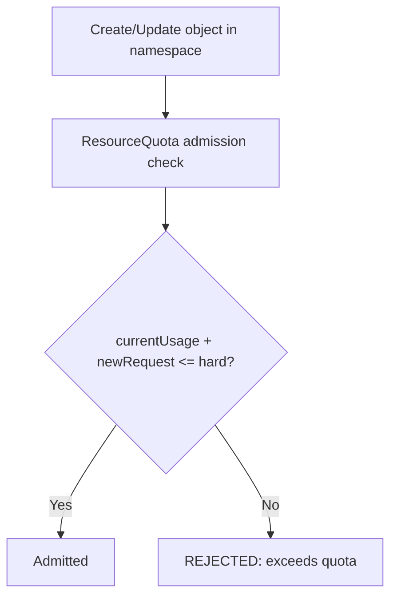

# Resource Management - In-Depth Mechanics

## ResourceQuota Behavior

> **See also**: [LimitRange and ResourceQuota](../../04-security/2-mechanics/03-limitrange-resourcequota.md) — covers the governance/security perspective alongside LimitRange.

A `ResourceQuota` limits the **aggregate resource consumption** of a namespace. It acts as the second line of defense (after LimitRange) to prevent a single project or team from consuming excessive cluster capacity.

### What ResourceQuota Can Limit

| Resource | Example |
|----------|---------|
| CPU | `requests.cpu: "10"`, `limits.cpu: "20"` |
| Memory | `requests.memory: 20Gi`, `limits.memory: 40Gi` |
| Storage | `requests.storage: 100Gi` (across PVCs) |
| Object counts | `pods: 20`, `secrets: 10`, `configmaps: 20`, `services: 10` |
| Ephemeral storage | `requests.ephemeral-storage`, `limits.ephemeral-storage` |

### How It Works

ResourceQuota evaluates the **current usage** in the namespace plus the **requested resources** for the new object. If the sum exceeds the hard limit, the API server rejects the request.



### ResourceQuota Example

```yaml
apiVersion: v1
kind: ResourceQuota
metadata:
  name: team-quota
  namespace: team-a
spec:
  hard:
    requests.cpu: "10"
    requests.memory: 20Gi
    limits.cpu: "20"
    limits.memory: 40Gi
    pods: "30"
    persistentvolumeclaims: "10"
    requests.storage: 500Gi
    count/deployments.apps: "10"
  scopes:
    - NotTerminating
```

```bash
# Apply the quota
kubectl apply -f quota.yaml

# Check current quota usage
kubectl describe resourcequota team-quota -n team-a

# Output:
# Name:                   team-quota
# Namespace:              team-a
# Resource                Used   Hard
# --------                ----   ----
# limits.cpu              2      20
# limits.memory           4Gi    40Gi
# pods                    5      30
# requests.cpu            1      10
# requests.memory         2Gi    20Gi
```

### Scope-Based Quotas

The `scopes` field lets you target a subset of Pods:

| Scope | Applies To |
|-------|-----------|
| `Terminating` | Pods with `restartPolicy: Always` (Deployments, ReplicaSets) |
| `NotTerminating` | Pods with `restartPolicy: Never` or `OnFailure` (Jobs, bare Pods) |
| `BestEffort` | Only BestEffort QoS Pods |
| `NotBestEffort` | Burstable + Guaranteed Pods |

```yaml
# Example: limit only terminating (long-running) workloads
spec:
  scopes:
    - Terminating
  hard:
    requests.cpu: "50"
    requests.memory: 100Gi
```

### Cross-Namespace Behavior

ResourceQuota is **strictly namespace-scoped**. Each namespace has its own independent quota budget:

```bash
# team-a namespace can use up to 10 CPU regardless of what team-b uses
kubectl get resourcequota -n team-a
kubectl get resourcequota -n team-b
```

### Best Practices

- **Pair with LimitRange**: ResourceQuota guards the ceiling, LimitRange provides per-container defaults. Together they provide full protection.
- **Create quotas during namespace provisioning**: automate this in your onboarding pipeline or use operators.
- **Monitor quota usage regularly**: a full quota blocks deployments. Set up alerts when usage exceeds 80%.
- **Use scope-based quotas to separate workloads**: e.g., allow development Jobs to consume a separate budget from production Deployments.
- **Document quota budgets per team** so teams know their capacity boundaries before designing systems.

### Common Pitfalls

- **ResourceQuota can block `kubectl rollout`**: if a Deployment rolls out a new ReplicaSet and the sum of old + new Pods exceeds the quota temporarily, the rollout fails.
- **ResourceQuota does not count node-local resources**: it cannot limit network bandwidth, I/O, or GPU count unless the cluster admin explicitly supports those extended resources.
- **Requests vs Limits in quotas**: ResourceQuota tracks both. If you only set `limits.memory`, you must also set `requests.memory` to avoid surprises when individual Pods avoid `requests.memory`.
- **Object count quotas are powerful but blunt**: `pods: 30` counts all Pods including Completed Jobs. Use scopes to differentiate.
- **PVC resource quotas require the storage class to support it**: some CSI drivers do not enforce `requests.storage` at provision time, making the quota advisory only.
