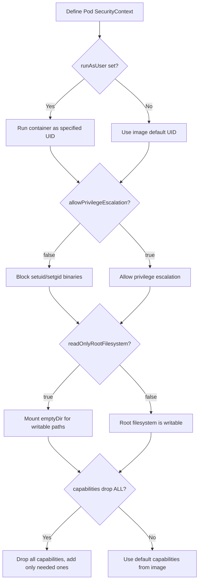

# Key Security Context Fields

Security contexts define privilege and access control settings for pods and containers. They are the primary mechanism for hardening workloads in Kubernetes and are a core CKAD/CKS topic.

## `runAsUser` and `runAsGroup`

- `runAsUser`: Sets the UID that the container process runs as. The container runtime (e.g., containerd) uses this to set the UID of the entrypoint process via `setuid()` or the OCI runtime config.
- `runAsGroup`: Sets the primary GID for the container process. This is the group ID used for file ownership checks and process group membership.
- If both are omitted, the container runtime defaults to the user specified in the image (often `root`/UID 0).

```yaml
spec:
  securityContext:
    runAsUser: 1000
    runAsGroup: 1000
  containers:
    - name: app
      image: myapp:1.0
```

> **Community knowledge**: Always pair `runAsUser` with a non-root UID. Many base images (e.g., `distroless`, `scratch`, `alpine`) run as root by default unless the image explicitly switches users. Check the image's `USER` directive with `docker inspect myapp:1.0 --format='{{.Config.User}}'`.

## `fsGroup`

- `fsGroup` sets a supplemental group ID that is applied to all volumes mounted by the pod.
- The container runtime ensures that the volume's group ownership and permissions are adjusted so that the `fsGroup` can read and write to the volume.
- This is critical for shared volumes (e.g., `emptyDir`, `persistentVolumeClaim`) where multiple containers or init containers need write access.

```yaml
spec:
  securityContext:
    fsGroup: 2000
  volumes:
    - name: data
      persistentVolumeClaim:
        claimName: my-pvc
```

> **Pitfall**: `fsGroup` only affects volumes that support ownership modification (e.g., `emptyDir`, `hostPath` with certain mount options). `nfs` or `cephFS` volumes may ignore `fsGroup` depending on the storage driver's configuration.

## `allowPrivilegeEscalation`

- Controls whether a process can gain more privileges than its parent process (via `setuid`/`setgid` binaries).
- Default value is `true` if not explicitly set. This is a common misconfiguration.
- Setting `allowPrivilegeEscalation: false` sets the `no_new_privs` flag on the container process, preventing `setuid`/`setgid` binaries from granting additional privileges.

```yaml
spec:
  containers:
    - name: app
      image: myapp:1.0
      securityContext:
        allowPrivilegeEscalation: false
```

> **Best practice**: Always set `allowPrivilegeEscalation: false` at the pod level unless you have a specific, justified need for privilege escalation. This is one of the most impactful security hardening steps.

## `readOnlyRootFilesystem`

- When set to `true`, the container's root filesystem is mounted as read-only.
- Any attempt to write to the root filesystem (e.g., writing logs to `/var/log/app`, temp files to `/tmp`, or modifying binaries) will fail with `Read-only file system`.
- Use `emptyDir` volumes mounted at writable paths (e.g., `/tmp`, `/var/log`) to allow necessary writes.

```yaml
spec:
  containers:
    - name: app
      image: myapp:1.0
      securityContext:
        readOnlyRootFilesystem: true
      volumeMounts:
        - name: tmp
          mountPath: /tmp
        - name: logs
          mountPath: /var/log/app
  volumes:
    - name: tmp
      emptyDir: {}
    - name: logs
      emptyDir: {}
```

> **Common pitfall**: Applications that write PID files to `/var/run/` or lock files to `/var/lock/` will fail on a read-only root filesystem. Mount `emptyDir` volumes at these paths or configure the application to use alternative writable locations.

## `privileged`

- Setting `privileged: true` grants the container full access to the host's kernel capabilities and devices, effectively disabling all container isolation.
- This is equivalent to running the container with `--privileged` flag in Docker.
- **Never use `privileged: true` in production workloads** unless the container needs direct access to host devices (e.g., CNI plugins, device managers).
- A privileged container can access all host devices, mount any filesystem, and modify kernel parameters.

```yaml
spec:
  containers:
    - name: privileged-app
      image: myapp:1.0
      securityContext:
        privileged: true
```

> **Pitfall**: `privileged: true` bypasses all container isolation. It is the equivalent of running the container as root on the host. Use only for system-level components that truly need host access.

### When Privileged Is Needed

- CNI plugins (e.g., Calico, Cilium) that need to manipulate network interfaces
- Device managers that need access to `/dev`
- Storage drivers that need direct block device access
- Performance monitoring tools that need access to hardware counters

### Security Best Practice

1. **Never use `privileged: true`** unless you have a documented, justified need.
2. **Use specific capabilities instead** — e.g., `NET_ADMIN` for network configuration instead of full privileged mode.
3. **Use PSA to enforce restrictions** — the `restricted` PSS policy forbids privileged containers.
4. **Audit regularly** — scan for privileged containers in your cluster:
   ```bash
   kubectl get pods -A -o json | jq -r '.items[] | select(.spec.containers[].securityContext.privileged == true) | .metadata.name + " " + .metadata.namespace'
   ```

### Pod Security Standards and Privileged Containers

Pod Security Standards (PSS) define three levels of security enforcement that directly restrict privileged containers:

| PSS Level | Effect on Privileged Containers |
|---|---|
| **Privileged** | No restrictions; any container can run as privileged |
| **Baseline** | Blocks privileged containers; restricts host namespaces and filesystem mounts |
| **Restricted** | Blocks privileged containers; enforces the strictest security hardening (non-root, read-only root filesystem, dropped capabilities) |

When a PSS policy is enforced via a Pod Security Admission (PSA) controller, any pod that violates the policy is rejected at admission time. In CKAD scenarios, the `restricted` policy is the most commonly tested configuration.

```yaml
apiVersion: v1
kind: Namespace
metadata:
  name: myns
  labels:
    pod-security.kubernetes.io/enforce: restricted
    pod-security.kubernetes.io/audit: restricted
    pod-security.kubernetes.io/warn: restricted
```

Under the `restricted` policy, the following are enforced:
- `privileged: true` is forbidden
- `runAsNonRoot: true` is required
- `readOnlyRootFilesystem: true` is required
- All capabilities must be dropped (`capabilities: { drop: ["ALL"] }`)
- `allowPrivilegeEscalation: false` is required

## Linux Capabilities

Linux capabilities divide the privileges of root into discrete units. Instead of running as full root, you can drop all capabilities and add back only the ones your application needs.

- `drop: ["ALL"]` removes all capabilities; `add` selectively grants specific ones.
- The `CAP_NET_BIND_SERVICE` capability is commonly needed for binding to privileged ports (1–1024).

```yaml
spec:
  containers:
    - name: app
      image: myapp:1.0
      securityContext:
        capabilities:
          drop: ["ALL"]
          add: ["NET_BIND_SERVICE"]
```

> **Best practice**: In CKAD scenarios, the expected answer is almost always `capabilities: { drop: ["ALL"] }`. Only add capabilities when you can articulate exactly why the application needs them.

### Common Capabilities and Their Uses

| Capability | Purpose |
|---|---|
| `NET_BIND_SERVICE` | Bind to ports < 1024 |
| `NET_RAW` | Use raw sockets (e.g., `ping`, `traceroute`) |
| `SYS_TIME` | Modify system clock |
| `CHOWN` | Change file ownership |
| `SETUID` | Execute setuid binaries |
| `DAC_OVERRIDE` | Bypass file read/write permission checks |
| `FOWNER` | Bypass permission checks for file operations based on owner |

> **Pitfall**: Adding `SYS_TIME` or `NET_RAW` is a common security risk. `SYS_TIME` allows an attacker to manipulate timestamps and bypass time-based auth tokens. `NET_RAW` enables packet sniffing and spoofing.

## Mermaid: Security Context Decision Flow



## Best Practices Summary

1. **Always run as non-root**: Set `runAsUser` to a UID >= 1000 and `runAsNonRoot: true` at the pod level.
2. **Drop all capabilities**: Use `capabilities: { drop: ["ALL"] }` as the baseline and add only what is needed.
3. **Disable privilege escalation**: `allowPrivilegeEscalation: false` should be the default.
4. **Make root filesystem read-only**: Use `readOnlyRootFilesystem: true` with `emptyDir` volumes for writable paths.
5. **Use `fsGroup` for shared volumes**: Ensures multi-container pods can access shared storage correctly.
6. **Scan images for setuid/setgid binaries**: Tools like `docker scan` or `trivy` can detect binaries that would require `CAP_SETUID`/`CAP_SETGID`.

## Troubleshooting

- **`Permission denied` on volume mount**: Check if `fsGroup` matches the volume's group ownership. Run `kubectl describe pod <name>` and look at the `Volumes` section for mount errors.
- **Container crashes with `setuid: operation not permitted`**: The container is trying to execute a setuid binary but `allowPrivilegeEscalation` is `false` or the capability is not added.
- **`Read-only file system` errors**: The application is writing to the root filesystem. Add `emptyDir` volume mounts at the paths the application writes to.
- **`cannot run as root`**: If `runAsNonRoot: true` is set but the image's default user is root (UID 0), the container will fail to start. Override with `runAsUser` or rebuild the image with a non-root user.