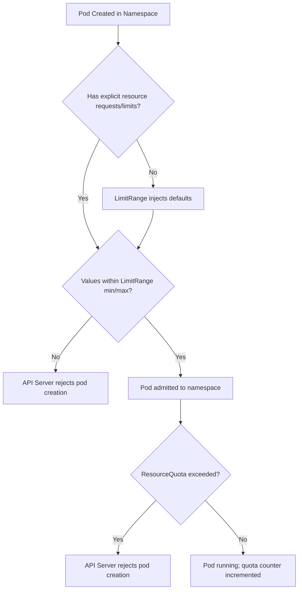

# LimitRange and ResourceQuota

> **See also**: [ResourceQuota Behavior](../../03-resource-management/2-mechanics/06-resourcequota-behavior.md) — covers the scheduling/placement perspective with quota scopes and cross-namespace behavior.

LimitRange and ResourceQuota are namespace-level mechanisms that constrain resource consumption. They prevent noisy-neighbor problems, enforce resource governance, and are essential for multi-tenant clusters.

## LimitRange

`LimitRange` defines default resource requests and limits for containers in a namespace, as well as minimum and maximum constraints. It applies to pods that do not explicitly specify their own resource requirements.

### How LimitRange Works

When a pod is created without specifying `resources.requests` or `resources.limits`, the LimitRange controller injects the default values into the pod spec. If a pod specifies values that violate the min/max constraints, the API server rejects the creation.

```yaml
apiVersion: v1
kind: LimitRange
metadata:
  name: mem-limit-range
  namespace: production
spec:
  limits:
    - type: Container
      default:
        memory: "512Mi"
        cpu: "500m"
      defaultRequest:
        memory: "256Mi"
        cpu: "250m"
      max:
        memory: "1Gi"
        cpu: "1"
      min:
        memory: "64Mi"
        cpu: "50m"
    - type: Pod
      max:
        memory: "2Gi"
        cpu: "2"
```

### Limit Types

- **Container**: Applies to individual containers within a pod.
- **Pod**: Applies to the pod as a whole (sum of all container resources).
- **PersistentVolumeClaim**: Applies to PVCs (limits storage requests).

### Parameter Effects

| Field | Effect |
|---|---|
| `default` | Injected when a container does not specify `resources.limits` |
| `defaultRequest` | Injected when a container does not specify `resources.requests` |
| `min` | Minimum allowed; requests below this are rejected |
| `max` | Maximum allowed; limits above this are rejected |
| `maxLimitRequestRatio` | Maximum ratio of limit to request (e.g., limits cannot exceed 10x requests) |

> **Best practice**: Always set `defaultRequest` alongside `default`. Without a default request, the scheduler cannot make bin-packing decisions, leading to poor resource utilization and potential OOM kills.

> **Pitfall**: A `LimitRange` with `default` but no `defaultRequest` means containers get a memory limit but no memory request. This causes the scheduler to treat the pod as having zero memory request, potentially overcommitting the node.

## ResourceQuota

`ResourceQuota` enforces hard limits on the total aggregate resource consumption within a namespace. Unlike LimitRange (which targets individual pods/containers), ResourceQuota targets the namespace as a whole.

```yaml
apiVersion: v1
kind: ResourceQuota
metadata:
  name: compute-resources
  namespace: production
spec:
  hard:
    requests.cpu: "10"
    requests.memory: 20Gi
    limits.cpu: "20"
    limits.memory: 40Gi
    pods: "50"
    services: "10"
    persistentvolumeclaims: "20"
    requests.storage: 100Gi
```

### Common Quota Scopes

| Scope | Description |
|---|---|
| `Terminating` | Quotas apply only to pods in terminating state |
| `NotTerminating` | Quotas apply only to pods not in terminating state |
| `BestEffort` | Quotas apply only to BestEffort QoS pods |
| `NotBestEffort` | Quotas apply to all pods except BestEffort |

```yaml
spec:
  scopeName: NotBestEffort
  hard:
    pods: "10"
    requests.cpu: "5"
    requests.memory: 10Gi
```

### Scope Behavior

- `Terminating`: Counts only pods with `deletionTimestamp` set (i.e., pods being deleted). Useful for preventing quota exhaustion during rolling restarts.
- `BestEffort`: Only applies to pods that have no resource requests or limits specified (QoS class BestEffort).
- `NotBestEffort`: Applies to all pods that have at least one resource request or limit (Guaranteed, Burstable).

## Mermaid: LimitRange vs ResourceQuota



## Best Practices

1. **Set both requests and limits**: Prevents resource starvation and ensures the scheduler can place pods correctly.
2. **Use LimitRange for defaults, ResourceQuota for caps**: LimitRange provides sensible defaults; ResourceQuota provides hard ceilings.
3. **Set `maxLimitRequestRatio`**: Prevents a single container from requesting minimal resources while consuming massive limits (a common DoS vector).
4. **Monitor quota usage**: Use `kubectl describe quota` to see current consumption vs. limits. Set up alerts when usage exceeds 80%.
5. **Use scopes to isolate workloads**: Apply `BestEffort` quotas to separate BestEffort pods from guaranteed pods.

## Troubleshooting

- **`exceeded quota` error**: The namespace has hit its ResourceQuota limit. Check current usage with `kubectl describe quota -n <namespace>`. Delete or scale down existing resources to free quota.
- **Pod stuck in `Pending` with no events**: Check if the scheduler is rejecting the pod due to insufficient quota. Run `kubectl describe pod <name> -n <namespace>` and look for quota-related events.
- **LimitRange defaults not applied**: LimitRange only applies to pods that do not explicitly set resource requirements. If a pod already specifies requests/limits, the LimitRange defaults are ignored.
- **`must be less than or equal to max limit`**: A container's limit exceeds the LimitRange max. Reduce the limit or update the LimitRange.
- **Quota counts differ from expected**: ResourceQuota counts resources by type. Some resources (e.g., `configmaps`, `secrets`) count toward quota even if you didn't expect them to. Check the quota's `used` field carefully.

## Commands

```bash
# View quota usage in a namespace
kubectl describe quota -n production

# View LimitRange in a namespace
kubectl get limitrange -n production -o yaml

# Create a LimitRange with defaults
kubectl apply -f - <<EOF
apiVersion: v1
kind: LimitRange
metadata:
  name: default-limits
  namespace: production
spec:
  limits:
    - type: Container
      default:
        memory: "512Mi"
        cpu: "500m"
      defaultRequest:
        memory: "256Mi"
        cpu: "250m"
EOF

# Create a ResourceQuota
kubectl apply -f - <<EOF
apiVersion: v1
kind: ResourceQuota
metadata:
  name: compute-quota
  namespace: production
spec:
  hard:
    requests.cpu: "10"
    requests.memory: 20Gi
    limits.cpu: "20"
    limits.memory: 40Gi
    pods: "50"
EOF
```