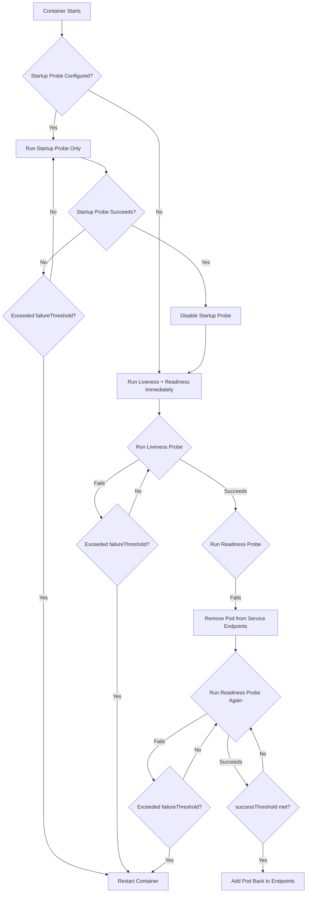

# Probe Behavior and Mechanics

Kubernetes probes are health-check mechanisms that determine whether a container is alive, ready to serve traffic, or has finished starting up. Understanding probe mechanics is critical for building reliable, self-healing workloads.

## Probe Types

### Startup Probe

The startup probe disables liveness and readiness probes until it succeeds. This is designed for applications with long initialization times (e.g., Java apps with large heap warmup, database connections, or loading ML models).

- Once the startup probe succeeds, Kubernetes stops running it and enables the liveness and readiness probes.
- If the startup probe fails, the container is restarted (as if the liveness probe failed).
- If neither `periodSeconds` nor `failureThreshold` is set, the startup probe uses defaults of `periodSeconds: 10` and `failureThreshold: 3`, giving a 30-second startup window.

```yaml
spec:
  containers:
    - name: java-app
      image: my-java-app:1.0
      startupProbe:
        httpGet:
          path: /actuator/health/readiness
          port: 8080
        failureThreshold: 30
        periodSeconds: 10
      livenessProbe:
        httpGet:
          path: /actuator/health/liveness
          port: 8080
        initialDelaySeconds: 30
        periodSeconds: 10
      readinessProbe:
        httpGet:
          path: /actuator/health/readiness
          port: 8080
        initialDelaySeconds: 5
        periodSeconds: 5
```

> **Best practice**: Use startup probes for any container that takes more than 10 seconds to become ready. Without a startup probe, the liveness probe may kill the container before it finishes initializing.

> **Pitfall**: Setting `failureThreshold` too low on a startup probe causes premature restarts. For a Java app that takes 60 seconds to start, `failureThreshold: 3` with `periodSeconds: 10` only gives 30 seconds. Use `failureThreshold: 6` or higher.

### Liveness Probe

The liveness probe determines whether the container is still running correctly. If it fails, Kubernetes kills the container and restarts it according to the pod's restart policy.

- **Use case**: Detecting deadlocks, infinite loops, or hung processes where the application is running but not making progress.
- **Action on failure**: Container is killed and restarted.
- **Does not**: Remove the pod from Service endpoints (that is the readiness probe's job).

```yaml
spec:
  containers:
    - name: app
      image: myapp:1.0
      livenessProbe:
        httpGet:
          path: /healthz
          port: 8080
        initialDelaySeconds: 15
        periodSeconds: 10
        timeoutSeconds: 5
        successThreshold: 1
        failureThreshold: 3
```

### Readiness Probe

The readiness probe determines whether the container is ready to serve traffic. If it fails, the pod is removed from all matching Service endpoints, and no new traffic is routed to it.

- **Use case**: Waiting for dependencies (databases, caches, configuration) to be ready before accepting traffic.
- **Action on failure**: Pod removed from Service endpoints. The pod continues running.
- **Recovery**: When the readiness probe succeeds again, the pod is added back to the endpoints.

```yaml
spec:
  containers:
    - name: app
      image: myapp:1.0
      readinessProbe:
        httpGet:
          path: /ready
          port: 8080
        initialDelaySeconds: 5
        periodSeconds: 5
        timeoutSeconds: 3
        successThreshold: 1
        failureThreshold: 3
```

> **Community knowledge**: A common pattern is to have the readiness probe check dependency health (e.g., database connection pool availability) while the liveness probe checks the application's internal state. This ensures that a temporarily unavailable dependency does not cause unnecessary restarts.

## Probe Actions

Probes can use four different mechanisms to check container health:

### `httpGet`
Sends an HTTP GET request to the specified path and port. The probe succeeds if the response status code is between 200 and 399.

```yaml
livenessProbe:
  httpGet:
    path: /healthz
    port: 8080
    scheme: HTTP
    httpHeaders:
      - name: X-Custom-Header
        value: OK
```

### `tcpSocket`
Opens a TCP connection to the specified port. The probe succeeds if the connection is established.

```yaml
livenessProbe:
  tcpSocket:
    port: 3306
```

### `exec`
Executes a command inside the container. The probe succeeds if the command exits with code 0.

```yaml
livenessProbe:
  exec:
    command:
      - sh
      - -c
      - "cat /tmp/healthy"
```

### `grpc`
Performs a gRPC health check using the `grpc.health.v1.Health/Check` service. The probe succeeds if the gRPC response status is `SERVING`.

```yaml
livenessProbe:
  grpc:
    port: 50051
```

> **Pitfall**: The `grpc` probe type requires the container to implement the gRPC health checking protocol. If the application does not register the health service, the probe will always fail.

## Probe Parameters

| Parameter | Default | Description |
|---|---|---|
| `initialDelaySeconds` | 0 | Seconds to wait after container start before the first probe |
| `periodSeconds` | 10 | Interval between probes |
| `timeoutSeconds` | 1 | Seconds before probe times out |
| `successThreshold` | 1 | Consecutive successes required for probe to be considered successful |
| `failureThreshold` | 3 | Consecutive failures before probe is considered failed |

### Parameter Interactions

- **`initialDelaySeconds` + `periodSeconds`**: The first probe fires at `initialDelaySeconds` after container start, then every `periodSeconds` thereafter.
- **`failureThreshold`**: For liveness, this is the number of consecutive failures before the container is killed. For readiness, this is the number of consecutive failures before the pod is removed from endpoints.
- **`successThreshold`**: Only relevant for readiness probes. A pod is added back to endpoints only after `successThreshold` consecutive successes. For liveness and startup probes, this is always 1.

## Mermaid: Probe Lifecycle Flow



## Best Practices

1. **Use startup probes for slow-starting apps**: Java, Go apps with large dependency graphs, and apps that load large datasets should use startup probes.
2. **Separate liveness and readiness checks**: Liveness should check internal health; readiness should check dependency health.
3. **Set appropriate `initialDelaySeconds`**: Too short causes false positives; too long delays detection of actual failures.
4. **Use `httpGet` for web services**: It is the most common and reliable probe type.
5. **Avoid heavy operations in probes**: Probes run on a timer; expensive checks can degrade application performance.
6. **Use `timeoutSeconds` aggressively**: A probe that hangs indefinitely blocks the kubelet from making progress. Set a short timeout (1-3 seconds).
7. **Monitor probe failure rates**: High failure rates on liveness probes indicate application instability. High failure rates on readiness probes indicate dependency issues.

## Troubleshooting

- **Container in `CrashLoopBackOff` with liveness probe failures**: The liveness probe is killing the container repeatedly. Check `kubectl describe pod <name>` for probe failure messages. Increase `initialDelaySeconds` or `failureThreshold`.
- **Pod not receiving traffic despite running**: The readiness probe is failing. Check `kubectl get pod <name>` for `READY` status (e.g., `1/0` means 0 of 1 containers are ready).
- **Probe timeout errors**: The application is not responding to the probe endpoint within `timeoutSeconds`. Increase the timeout or optimize the health endpoint.
- **Startup probe never succeeds**: The `failureThreshold` is too low or the startup endpoint is incorrect. Verify the endpoint returns HTTP 200.
- **`kubectl get pods` shows `0/1` containers ready**: The readiness probe is failing. Check the probe configuration and the application's dependency health.

## Commands

```bash
# Check probe status in pod description
kubectl describe pod myapp-abc123 -n production | grep -A 20 'Liveness\|Readiness\|Startup'

# Check probe results from kubelet logs (on the node)
journalctl -u kubelet | grep -i 'probe\|liveness\|readiness' | tail -50

# Test a probe endpoint manually from within the cluster
kubectl exec myapp-abc123 -n production -- curl -s http://localhost:8080/healthz

# Check events related to probe failures
kubectl get events -n production --field-selector reason=Unhealthy --sort-by='.lastTimestamp'
```