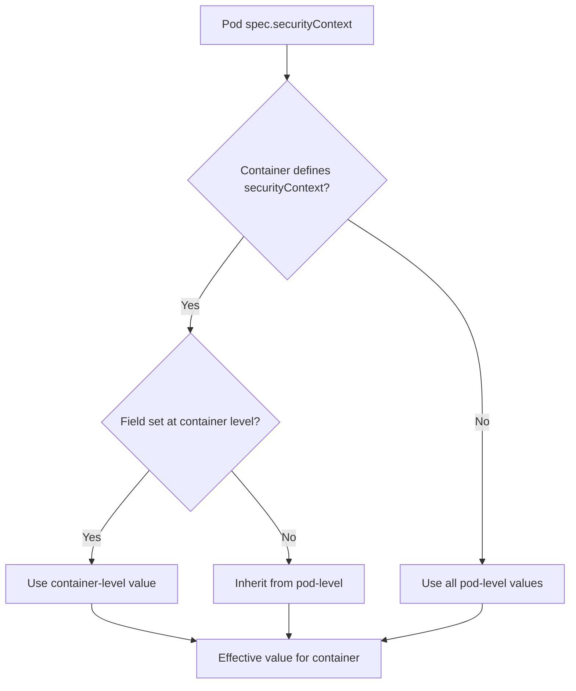

# SecurityContext Scoping Rules

Security contexts can be defined at two levels in a Kubernetes pod spec: the pod level and the container level. Understanding the scoping rules and precedence is essential for correctly hardening workloads.

## Pod-Level Security Context

The pod-level security context is defined at `spec.securityContext`. It applies to **all containers** in the pod unless a container-level security context overrides the setting.

```yaml
spec:
  securityContext:
    runAsUser: 1000
    runAsGroup: 1000
    fsGroup: 2000
    runAsNonRoot: true
    seccompProfile:
      type: RuntimeDefault
  containers:
    - name: app
      image: myapp:1.0
```

### Pod-Level Fields

| Field | Scope | Description |
|---|---|---|
| `runAsUser` | All containers | UID for all container processes |
| `runAsGroup` | All containers | Primary GID for all container processes |
| `runAsNonRoot` | All containers | Forces UID >= 1; rejects UID 0 |
| `fsGroup` | All volumes | Supplemental group for volume ownership |
| `seccompProfile` | All containers | Seccomp profile for all containers |
| `supplementalGroups` | All volumes | Additional supplemental groups for volumes |
| `sysctls` | Node-level | Kernel parameters for the pod's namespace |

## Container-Level Security Context

The container-level security context is defined at `spec.containers[*].securityContext`. It applies **only to that specific container** and overrides any pod-level settings for the same field.

```yaml
spec:
  securityContext:
    runAsUser: 1000
    runAsGroup: 1000
  containers:
    - name: app
      image: myapp:1.0
      securityContext:
        runAsUser: 2000
        allowPrivilegeEscalation: false
        readOnlyRootFilesystem: true
        capabilities:
          drop: ["ALL"]
    - name: sidecar
      image: sidecar:1.0
      securityContext:
        runAsUser: 3000
        readOnlyRootFilesystem: false
```

In this example:
- The `app` container runs as UID 2000 (overriding the pod-level 1000).
- The `sidecar` container runs as UID 3000 (overriding the pod-level 1000).
- Both containers inherit `fsGroup: 2000` from the pod level since neither overrides it.

## Precedence Rules

1. **Container-level overrides pod-level** for any field that is set at both levels.
2. **Pod-level is the fallback** for any field not set at the container level.
3. **Unset fields are not inherited** from the other level if the container explicitly sets a different value for that field.

### Example: Mixed Scoping

```yaml
spec:
  securityContext:
    runAsUser: 1000
    runAsGroup: 1000
    fsGroup: 2000
    allowPrivilegeEscalation: false
  containers:
    - name: app
      image: myapp:1.0
      securityContext:
        allowPrivilegeEscalation: true
```

Result for the `app` container:
- `runAsUser`: 1000 (inherited from pod)
- `runAsGroup`: 1000 (inherited from pod)
- `fsGroup`: 2000 (inherited from pod)
- `allowPrivilegeEscalation`: true (overridden at container level)

> **Pitfall**: Setting `allowPrivilegeEscalation: true` at the container level while having `false` at the pod level creates an inconsistency that is easy to miss during code review. Always audit both levels.

## Mermaid: Security Context Precedence



## Security Context and Pod Security Standards

Pod Security Standards (PSS) define three baseline policies that constrain security contexts:

### Privileged
No restrictions. Equivalent to running without any security policies.

### Baseline
Minimal restrictions that prevent known privilege escalations. Requires:
- `runAsNonRoot: true` (or `runAsUser` != 0)
- `allowPrivilegeEscalation: false`
- No privileged containers
- Read-only root filesystem recommended

### Restricted
Strongest restrictions. Requires:
- `runAsNonRoot: true`
- `runAsUser` must be non-zero
- `allowPrivilegeEscalation: false`
- `readOnlyRootFilesystem: true`
- `capabilities: { drop: ["ALL"] }`
- No privileged containers
- No `SYS_ADMIN`, `NET_ADMIN`, or other dangerous capabilities

```yaml
apiVersion: v1
kind: Pod
metadata:
  name: restricted-pod
  labels:
    pod-security.kubernetes.io/enforce: restricted
spec:
  securityContext:
    runAsNonRoot: true
    runAsUser: 1000
    runAsGroup: 1000
    fsGroup: 2000
  containers:
    - name: app
      image: myapp:1.0
      securityContext:
        allowPrivilegeEscalation: false
        readOnlyRootFilesystem: true
        capabilities:
          drop: ["ALL"]
```

## Best Practices

1. **Set security context at the pod level** for shared values (e.g., `runAsUser`, `runAsGroup`, `fsGroup`) to reduce duplication.
2. **Override at the container level only when necessary** (e.g., a sidecar that needs to write to the filesystem).
3. **Use Pod Security Admission (PSA)** to enforce PSS at the namespace or cluster level.
4. **Audit with `kubectl describe`**: Run `kubectl describe pod <name>` and check the `Security Context` section to verify effective values.
5. **Use OPA/Gatekeeper or Kyverno** for custom security policies that go beyond PSS.
6. **Never set `privileged: true`** in production workloads unless absolutely necessary (e.g., node-level device access).

## Troubleshooting

- **Pod fails to start with `must run as non-root`**: The container is trying to run as UID 0 but `runAsNonRoot: true` is set. Either change the container's user or remove the restriction.
- **`Permission denied` on volume mount**: The `fsGroup` may not match the volume's group ownership. Check the volume type and storage driver's support for `fsGroup`.
- **Container runs as root despite `runAsNonRoot: true`**: The container image's `USER` directive sets UID 0. `runAsNonRoot` only prevents UID 0 if the image does not explicitly set a user. Verify with `kubectl exec <pod> -- id`.
- **`seccomp` profile not applied**: The kubelet must be configured with a seccomp profile. The `RuntimeDefault` profile requires containerd or CRI-O with seccomp support enabled.
- **Pod Security Admission not enforcing**: Check that the namespace has the correct PSS label (`pod-security.kubernetes.io/enforce`). Verify that PSA is enabled in the kube-apiserver configuration.