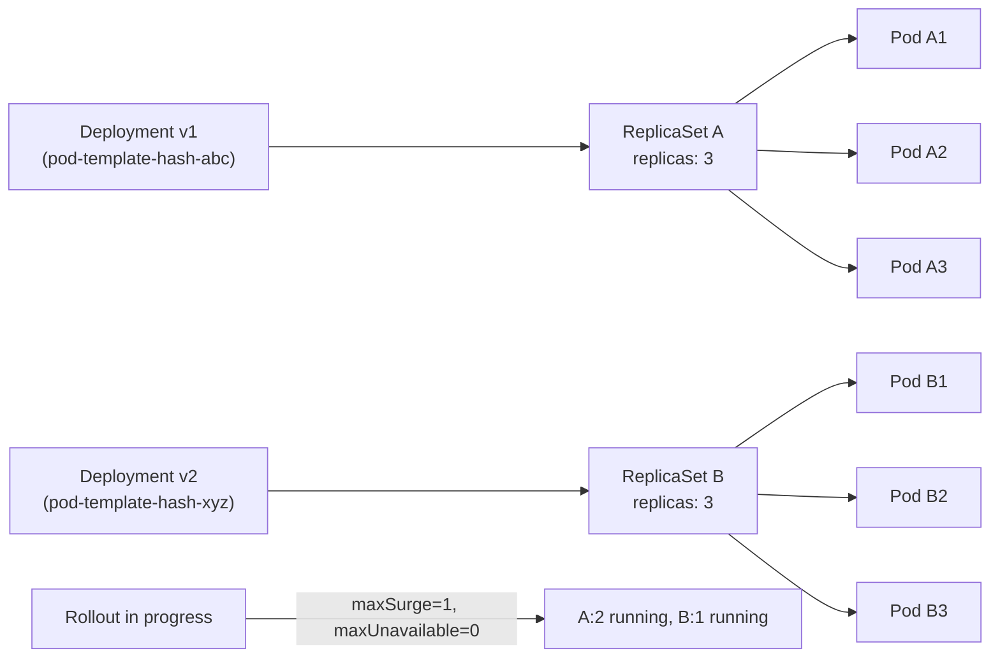
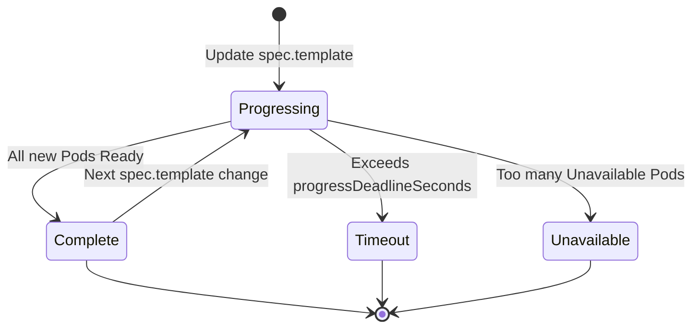

# Deployments & Workloads - In-Depth Mechanics

## Deployment Rollout & Revision Mechanics

A Kubernetes Deployment is a **controller** that manages a ReplicaSet. Understanding how rollouts and revisions work is critical for safe production deployments.

### Deployments Manage ReplicaSets, Not Pods Directly

When you create a Deployment, it creates a ReplicaSet, which then creates Pods. Every time the Deployment's `spec.template` changes, Kubernetes creates a **new ReplicaSet** and scales the old one to zero.



### What Triggers a Rollout

Only changes to `spec.template` trigger a new ReplicaSet:

```bash
# TRIGGERS rollout — spec.template changed
kubectl set image deployment/web nginx=nginx:1.26
kubectl patch deployment web --type='json' -p='[{"op":"replace","path":"/spec/template/spec/containers/0/resources","value":{"requests":{"cpu":"100m"}}}]'

# DOES NOT trigger rollout — metadata changed
kubectl label deployment/web env=prod
kubectl scale deployment web --replicas=5
kubectl annotate deployment web note="updated"
```

### Revision History

Kubernetes stores rollout history in the Deployment's annotations. The default `revisionHistoryLimit` is **10**.

```bash
# View rollout history
kubectl rollout history deployment/web

# Output:
# deployment.apps/web
# REVISION  CHANGE-CAUSE
# 1         kubectl apply --filename=deployment.yaml
# 2         kubectl set image deployment/web nginx=nginx:1.25
# 3         kubectl set image deployment/web nginx=nginx:1.26

# Detailed annotation for a specific revision
kubectl rollout history deployment/web --revision=2
```

### Rollback Mechanics

```bash
# Rollback to previous revision
kubectl rollout undo deployment/web

# Rollback to a specific revision
kubectl rollout undo deployment/web --to-revision=1

# Verify
kubectl rollout status deployment/web
kubectl describe deployment web | grep -A3 "NewReplicaSet"
```

### Controlling Revision History

```yaml
spec:
  revisionHistoryLimit: 5   # Keep only last 5 ReplicaSets
  progressDeadlineSeconds: 600  # Consider rollout failed if not done in 10 min
```

Setting `revisionHistoryLimit` to `0` disables rollback (and cleans up old ReplicaSets).

### Mermaid: Rollout Lifecycle



### kubectl Examples

```bash
# Pause a rollout to make multiple changes atomically
kubectl rollout pause deployment/web
kubectl set image deployment/web nginx=nginx:1.26
kubectl set env deployment/web LOG_LEVEL=debug
kubectl rollout resume deployment/web

# Check rollout status in real-time
kubectl rollout status deployment/web --timeout=5m

# Force a new rollout without changing the template (triggers a restart)
kubectl rollout restart deployment/web
```

### Best Practices

- **Use `kubectl rollout pause` before multi-step changes** to prevent intermediate ReplicaSets from being considered complete.
- **Set `progressDeadlineSeconds`** to catch stuck rollouts (e.g., image pull failures) before they affect production for hours.
- **Document change causes** using `CHANGE-CAUSE` annotation via `kubectl annotate` so revision history is meaningful.
- **Keep `revisionHistoryLimit` reasonable**: 5-10 is common. Setting it too low blocks rollbacks; setting it too high wastes etcd space.
- **Use `kubectl rollout restart` for mandatory Pod restarts** (e.g., ConfigMap secret rotation that cannot be tracked via template hash).

### Common Pitfalls

- **Changing `replicas` or `labels` does NOT create a revision**: if you change `spec.replicas` from 3 to 5 and then try to rollback to "revision 2" thinking it had 5 replicas, you will be surprised — revisions only track template changes.
- **Rollout history fills up etcd**: each revision record is stored as an annotation in the Deployment object. High-churn environments should set a lower limit.
- **`kubectl rollout restart` bypasses revision tracking**: it triggers a recreate via an annotation but is not visible as a template change in rollout history.
