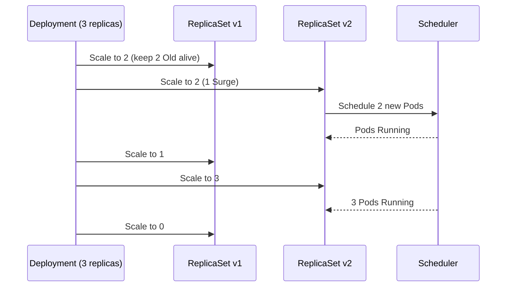
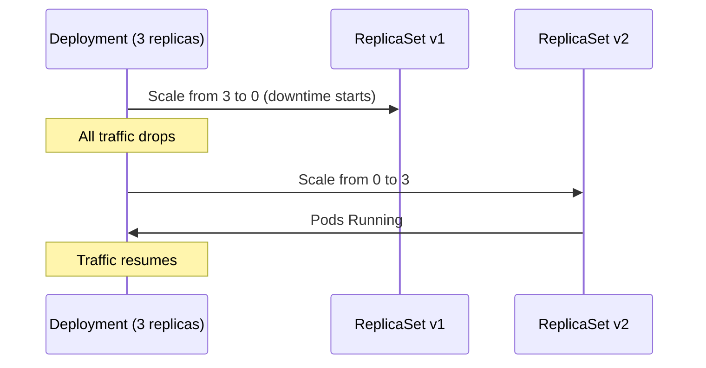

# Deployments & Workloads - In-Depth Mechanics

## Deployment Strategies

Kubernetes Deployments support two rollout strategies: **RollingUpdate** (default) and **Recreate**. Choosing the right strategy depends on your application's tolerance for parallel versions and downtime.

### RollingUpdate (Default)

Gradually replaces old Pods with new Pods by creating new ones before killing old ones. Supports two tuning knobs:

- **`maxSurge`**: Maximum number of Pods that can be created **above** `spec.replicas`.
- **`maxUnavailable`**: Maximum number of Pods that can be **unavailable** during the rollout.

```yaml
strategy:
  type: RollingUpdate
  rollingUpdate:
    maxSurge: 1
    maxUnavailable: 0
```

### How RollingUpdate Works

The Deployment controller calculates which ReplicaSet needs to be scaled up/down. It respects `maxSurge` and `maxUnavailable` as **upper bounds**, not exact counts.



### maxSurge vs maxUnavailable Explained

| Setting | Behavior | Use Case |
|---------|----------|----------|
| `maxSurge: 1, maxUnavailable: 0` | 1 extra Pod created; no downtime during rollout | **Default recommendation** for most services |
| `maxSurge: 0, maxUnavailable: 1` | 1 old Pod killed before 1 new Pod created | Resource-constrained nodes |
| `maxSurge: 25%, maxUnavailable: 25%` | Percentage-based — scales with replica count | High-replica Deployments (20+ replicas) |
| `maxSurge: 0, maxUnavailable: 0` | Deadlock — impossible to progress | **Never do this** (except with Recreate) |

> **Important**: `maxUnavailable: 0` means "zero Pods can be unavailable", i.e., the old ReplicaSet must keep running all current replicas while new ones start. Combined with `maxSurge: 1`, the deployment temporarily runs `replicas + 1` Pods.

### kubectl Examples

```bash
# Apply a RollingUpdate deployment
cat <<'EOF' | kubectl apply -f -
apiVersion: apps/v1
kind: Deployment
metadata:
  name: web
spec:
  replicas: 3
  strategy:
    type: RollingUpdate
    rollingUpdate:
      maxSurge: 1
      maxUnavailable: 0
  selector:
    matchLabels:
      app: web
  template:
    metadata:
      labels:
        app: web
    spec:
      containers:
      - name: nginx
        image: nginx:1.26
        ports:
        - containerPort: 80
EOF

# Trigger a rolling update by changing the image
kubectl set image deployment/web nginx=nginx:1.27

# Watch the rollout progress
kubectl rollout status deployment/web
```

### Recreate Strategy

Kills all existing Pods **before** creating new ones. Guarantees no parallel versions exist but causes **downtime** during the gap.

```yaml
strategy:
  type: Recreate
```



### When to Use Recreate

- **Stateful applications with no in-flight request tolerance**: legacy databases, monolithic apps with in-memory sessions.
- **When parallel versions cause data corruption**: if old and new versions cannot coexist safely.
- **Non-production or batch workloads** where brief downtime is acceptable.

### Alternative: Blue/Green via Separate Deployments

For full isolation (zero shared state, instant rollback), deploy two Deployments behind a Service:

```bash
# Create green deployment alongside blue
kubectl create deployment web-green --image=nginx:1.27 --replicas=3

# Mirror Selector on Service
# Then switch selector via kubectl patch or SMI traffic splitter
kubectl patch svc web -p '{"spec":{"selector":{"version":"green"}}}'
```

### Best Practices

- **Default to RollingUpdate with `maxSurge: 1, maxUnavailable: 0`** for stateless HTTP services. It provides zero-downtime rollout with minimal resource overhead.
- **Use `maxSurge: 25%, maxUnavailable: 25%`** for large replica counts (50+) to speed up rollouts while keeping disruption bounded.
- **Never use `maxSurge: 0, maxUnavailable: 0`** — it creates an impossible constraint that the Deployment controller cannot resolve.
- **Use Recreate only when necessary**: document the reason, test it in staging, and ensure readiness probes catch the "not yet ready" state.

### Common Pitfalls

- **RollingUpdate sends traffic to terminating Pods** unless you enable `terminationGracePeriodSeconds` and ensure readiness probes fail before shutdown.
- **Pod disruption budgets (PDB) interact with rollout strategies**: a PDB with `minAvailable: 3` forces maxUnavailable to 0 if you only have 3 replicas, causing a stuck rollout.
- **Recreate does not respect PDB**: because all Pods are killed first, a PDB cannot prevent the downtime.
- **PreStop hooks must be brief** if you want fast rollouts. A 30-second PreStop on every Pod means a 3-minute minimum rollout for 3 replicas.
