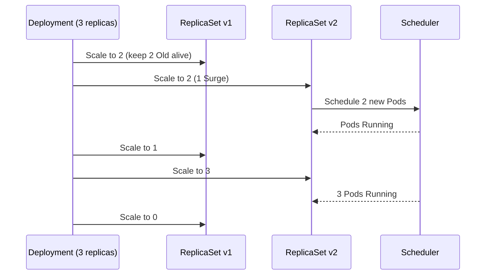
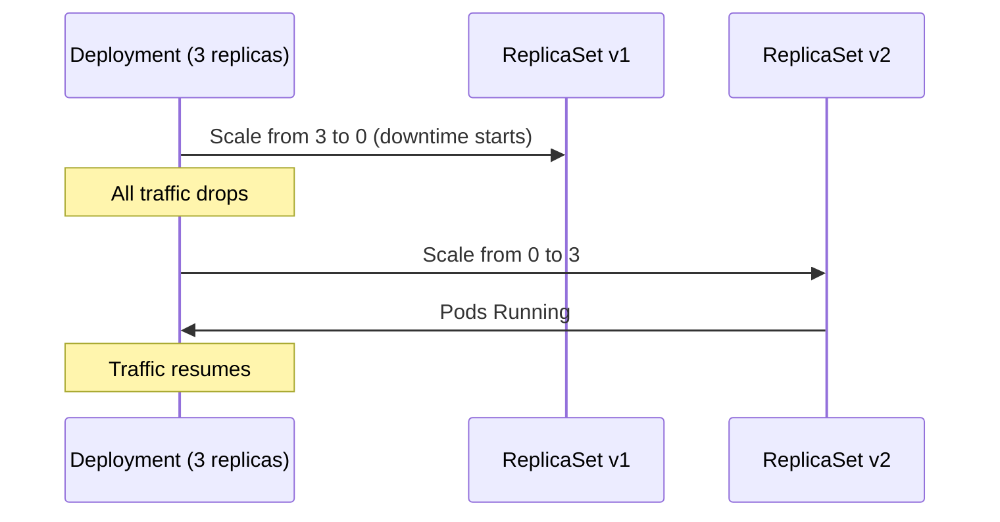

# Deployments & Workloads - In-Depth Mechanics

## Deployment Strategies

Kubernetes Deployments support two rollout strategies: **RollingUpdate** (default) and **Recreate**. Choosing the right strategy depends on your application's tolerance for parallel versions and downtime.

### RollingUpdate (Default)

Gradually replaces old Pods with new Pods by creating new ones before killing old ones. Supports two tuning knobs:

- **`maxSurge`**: Maximum number of Pods that can be created **above** `spec.replicas`.
- **`maxUnavailable`**: Maximum number of Pods that can be **unavailable** during the rollout.

```yaml
strategy:
  type: RollingUpdate
  rollingUpdate:
    maxSurge: 1
    maxUnavailable: 0
```

### How RollingUpdate Works

The Deployment controller manages the rollout by coordinating two ReplicaSets: the old (current) and the new (updated). It does not simply kill old Pods and create new ones in sequence. Instead, it calculates the desired number of replicas for each ReplicaSet based on `maxSurge` and `maxUnavailable`, treating them as **upper bounds** rather than exact targets.

The controller's decision process at each step:
1. **Calculate the desired number of new Pods**: `replicas + maxSurge` (capped at the total desired replicas).
2. **Calculate how many old Pods can be removed**: `replicas - maxUnavailable` (floored at 0).
3. **Scale the new ReplicaSet up** to the desired count.
4. **Wait for new Pods to become Ready** (passing readiness probes).
5. **Scale the old ReplicaSet down** by the allowed number of unavailable Pods.
6. **Repeat** until the old ReplicaSet reaches 0 replicas.

This means the controller always ensures at least `replicas - maxUnavailable` Pods are available during the rollout. With the default `maxSurge: 25%, maxUnavailable: 25%`, the total Pod count temporarily exceeds `replicas` by up to 25%.



> **Important**: The controller respects readiness probes. A new Pod is not counted as available until its readiness probe succeeds. If readiness probes fail, the rollout pauses and the old Pods continue serving traffic. This prevents routing traffic to Pods that are not yet ready to accept requests.

### maxSurge vs maxUnavailable Explained

| Setting | Behavior | Use Case |
|---------|----------|----------|
| `maxSurge: 1, maxUnavailable: 0` | 1 extra Pod created; no downtime during rollout | **Default recommendation** for most services |
| `maxSurge: 0, maxUnavailable: 1` | 1 old Pod killed before 1 new Pod created | Resource-constrained nodes |
| `maxSurge: 25%, maxUnavailable: 25%` | Percentage-based — scales with replica count | High-replica Deployments (20+ replicas) |
| `maxSurge: 0, maxUnavailable: 0` | Deadlock — impossible to progress | **Never do this** (except with Recreate) |

> **Important**: `maxUnavailable: 0` means "zero Pods can be unavailable", i.e., the old ReplicaSet must keep running all current replicas while new ones start. Combined with `maxSurge: 1`, the deployment temporarily runs `replicas + 1` Pods.

### kubectl Examples

```bash
# Apply a RollingUpdate deployment
cat <<'EOF' | kubectl apply -f -
apiVersion: apps/v1
kind: Deployment
metadata:
  name: web
spec:
  replicas: 3
  strategy:
    type: RollingUpdate
    rollingUpdate:
      maxSurge: 1
      maxUnavailable: 0
  selector:
    matchLabels:
      app: web
  template:
    metadata:
      labels:
        app: web
    spec:
      containers:
      - name: nginx
        image: nginx:1.26
        ports:
        - containerPort: 80
EOF

# Trigger a rolling update by changing the image
kubectl set image deployment/web nginx=nginx:1.27

# Watch the rollout progress
kubectl rollout status deployment/web
```

### Recreate Strategy

Kills all existing Pods **before** creating new ones. Guarantees no parallel versions exist but causes **downtime** during the gap.

```yaml
strategy:
  type: Recreate
```



### When to Use Recreate

- **Stateful applications with no in-flight request tolerance**: legacy databases, monolithic apps with in-memory sessions.
- **When parallel versions cause data corruption**: if old and new versions cannot coexist safely.
- **Non-production or batch workloads** where brief downtime is acceptable.

### Alternative: Blue/Green via Separate Deployments

For full isolation (zero shared state, instant rollback), deploy two Deployments behind a Service:

```bash
# Create green deployment alongside blue
kubectl create deployment web-green --image=nginx:1.27 --replicas=3

# Mirror Selector on Service
# Then switch selector via kubectl patch or SMI traffic splitter
kubectl patch svc web -p '{"spec":{"selector":{"version":"green"}}}'
```

#### Blue/Green Step-by-Step (Imperative)

```bash
# 1. Create the green deployment
kubectl create deployment web-green --image=nginx:1.27 --replicas=3 -n myns --dry-run=client -o yaml > web-green.yaml

# 2. Edit web-green.yaml to add the version label
#    Add label: version: green to metadata.labels and template.metadata.labels

# 3. Apply the green deployment
kubectl apply -f web-green.yaml -n myns

# 4. Verify green pods are running
kubectl get pods -n myns -l version=green

# 5. Switch the Service selector to point to green
kubectl patch svc web -n myns -p '{"spec":{"selector":{"version":"green"}}}'

# 6. Verify traffic is flowing to green pods
kubectl get pods -n myns -l version=green -o wide

# 7. If issues, switch back to blue
kubectl patch svc web -n myns -p '{"spec":{"selector":{"version":"blue"}}}'

# 8. Delete the green deployment after confirming stability
kubectl delete deployment web-green -n myns
```

#### Blue/Green YAML Pattern

```yaml
# Blue deployment
apiVersion: apps/v1
kind: Deployment
metadata:
  name: web-blue
  labels:
    app: web
    version: blue
spec:
  replicas: 3
  selector:
    matchLabels:
      app: web
      version: blue
  template:
    metadata:
      labels:
        app: web
        version: blue
    spec:
      containers:
      - name: nginx
        image: nginx:1.26
---
# Green deployment
apiVersion: apps/v1
kind: Deployment
metadata:
  name: web-green
  labels:
    app: web
    version: green
spec:
  replicas: 3
  selector:
    matchLabels:
      app: web
      version: green
  template:
    metadata:
      labels:
        app: web
        version: green
    spec:
      containers:
      - name: nginx
        image: nginx:1.27
---
# Service that switches between blue and green
apiVersion: v1
kind: Service
metadata:
  name: web
spec:
  selector:
    app: web
    version: blue  # Switch to "green" to route to green deployment
  ports:
  - port: 80
    targetPort: 8080
```

### Alternative: Canary via Weighted Traffic Splitting

Canary deployments route a percentage of traffic to the new version. Kubernetes does not have a built-in canary primitive, but you can implement it using multiple Deployments and a Service with weighted endpoints.

#### Canary Using Two Deployments and a Service

```bash
# 1. Deploy the stable (blue) version
kubectl create deployment web-blue --image=nginx:1.26 --replicas=3 -n myns

# 2. Deploy the canary (green) version with fewer replicas
kubectl create deployment web-green --image=nginx:1.27 --replicas=1 -n myns

# 3. Create a Service that selects both versions
cat <<'EOF' | kubectl apply -f -
apiVersion: v1
kind: Service
metadata:
  name: web-canary
spec:
  selector:
    app: web
  ports:
  - port: 80
    targetPort: 8080
EOF

# 4. Scale the canary up gradually while monitoring
kubectl scale deployment web-green --replicas=2 -n myns
# Monitor metrics and error rates
kubectl scale deployment web-green --replicas=3 -n myns
# Once stable, switch the Service selector to green only
kubectl patch svc web-canary -n myns -p '{"spec":{"selector":{"app":"web","version":"green"}}}'
# Delete the blue deployment
kubectl delete deployment web-blue -n myns
```

#### Canary Using kubectl patch for incremental rollout

```bash
# Start with 1 canary replica
kubectl scale deployment web-green --replicas=1 -n myns

# Monitor for issues
kubectl get pods -n myns -l version=green
kubectl logs -n myns -l version=green --tail=20

# If healthy, increase canary replicas
kubectl scale deployment web-green --replicas=2 -n myns

# Continue increasing until all traffic is on green
kubectl scale deployment web-green --replicas=3 -n myns

# Switch Service to green
kubectl patch svc web -n myns -p '{"spec":{"selector":{"version":"green"}}}'

# Rollback if needed: switch Service back to blue
kubectl patch svc web -n myns -p '{"spec":{"selector":{"version":"blue"}}}'
```

### Best Practices

- **Default to RollingUpdate with `maxSurge: 1, maxUnavailable: 0`** for stateless HTTP services. It provides zero-downtime rollout with minimal resource overhead.
- **Use `maxSurge: 25%, maxUnavailable: 25%`** for large replica counts (50+) to speed up rollouts while keeping disruption bounded.
- **Never use `maxSurge: 0, maxUnavailable: 0`** — it creates an impossible constraint that the Deployment controller cannot resolve.
- **Use Recreate only when necessary**: document the reason, test it in staging, and ensure readiness probes catch the "not yet ready" state.
- **For Blue/Green**: Use separate Deployments with distinct labels and switch the Service selector to route traffic.
- **For Canary**: Start with a small percentage of replicas on the new version, monitor metrics, and gradually increase. Use readiness probes to ensure the canary is healthy before scaling up.

### Common Pitfalls

- **RollingUpdate sends traffic to terminating Pods** unless you enable `terminationGracePeriodSeconds` and ensure readiness probes fail before shutdown.
- **PDBs do not constrain Deployment rolling updates**: the Deployment controller's `maxUnavailable` and `maxSurge` govern rollout behavior, not PDBs.
- **PreStop hooks must be brief** if you want fast rollouts. A 30-second PreStop on every Pod means a 3-minute minimum rollout for 3 replicas.
- **Blue/Green: forgetting to update the Service selector** after creating the green deployment — traffic still routes to blue.
- **Canary: not monitoring before scaling up** — always verify canary health before increasing traffic weight.
