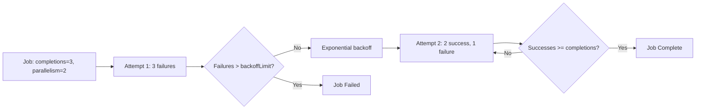
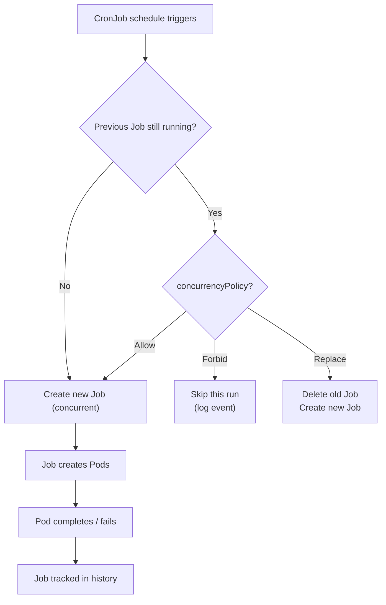

# Deployments & Workloads - In-Depth Mechanics

## Job & CronJob Behavior

Jobs and CronJobs handle **workloads that run to completion** (batch processing, data pipelines, scheduled tasks). They are distinctly different from Deployments, which manage long-running services.

### Job Behavior

A Job creates Pods and tracks them until a specified number of them **successfully complete**.

```yaml
apiVersion: batch/v1
kind: Job
metadata:
  name: backup
spec:
  completions: 3        # Total successful completions needed
  parallelism: 2        # Max concurrent Pods
  backoffLimit: 6       # Retries before marking failed
  activeDeadlineSeconds: 3600  # Hard timeout for the entire Job
  ttlSecondsAfterFinished: 86400  # Clean up after 24h
  template:
    spec:
      restartPolicy: OnFailure   # Required for Jobs
      containers:
      - name: backup
        image: backup-tool:1.0
        command: ["/bin/backup.sh"]
```

### Completions and Parallelism

| Field | Meaning |
|-------|---------|
| `completions: 1` | Default. One Pod must succeed. |
| `completions: 5` | Five Pods must succeed (serially or in parallel). |
| `parallelism: 1` | Run one Pod at a time. |
| `parallelism: 5` | Run up to 5 Pods at the same time. |



### Backoff Limit and Exponential Backoff

The Job controller retries Pods with exponential backoff:

- Delay = `10s, 20s, 40s, ...` doubling each time, capped at `6 minutes`.
- Retries continue until `backoffLimit` failures are reached.
- **BackoffLimit counts failures across all Pods**, not per Pod.

```bash
# View job status and retry count
kubectl get job backup
kubectl describe job backup

# Check which pods failed
kubectl get pods -l job-name=backup
kubectl logs job/backup --all-pods=true
```

### CronJob Behavior

A CronJob creates Jobs on a schedule using cron syntax.

```yaml
apiVersion: batch/v1
kind: CronJob
metadata:
  name: daily-cleanup
spec:
  schedule: "0 2 * * *"  # Daily at 02:00
  timeZone: "Europe/Helsinki"
  concurrencyPolicy: Forbid   # Never run concurrently
  successfulJobsHistoryLimit: 3
  failedJobsHistoryLimit: 1
  startingDeadlineSeconds: 300
  suspend: false
  jobTemplate:
    spec:
      backoffLimit: 1
      activeDeadlineSeconds: 600
      template:
        spec:
          restartPolicy: OnFailure
          containers:
          - name: cleanup
            image: cleanup:1.0
            command: ["/bin/cleanup.sh"]
```

### suspend

The `suspend` field controls whether the CronJob controller creates new Jobs. When `suspend` is `true`, the controller will not create new Jobs, but existing Jobs will continue to run.

```bash
# Suspend a CronJob
kubectl patch cronjob daily-cleanup -p '{"spec": {"suspend": true}}'

# Resume a CronJob
kubectl patch cronjob daily-cleanup -p '{"spec": {"suspend": false}}'

# Check if a CronJob is suspended
kubectl get cronjob daily-cleanup -o jsonpath='{.spec.suspend}'
```

**When to use `suspend`:**
- Temporarily pausing a CronJob without deleting it
- Preventing a CronJob from running during maintenance windows
- Debugging issues with a CronJob without it creating new Jobs

**Important:** `suspend` only affects the creation of new Jobs. Existing Jobs and their Pods continue to run.

### Cron Syntax Reference

```
┌───────────── minute       (0 - 59)
│ ┌───────────── hour       (0 - 23)
│ │ ┌───────────── day of month (1 - 31)
│ │ │ ┌───────────── month    (1 - 12)
│ │ │ │ ┌───────────── day of week (0 - 6, 0=Sunday)
│ │ │ │ │
* * * * *
```

| Expression | Meaning |
|------------|---------|
| `*/5 * * * *` | Every 5 minutes |
| `0 0 * * *` | Midnight |
| `30 9 * * 1-5` | 9:30 AM, Monday through Friday |
| `0 0 1 * *` | First day of every month |
| `0 */6 * * *` | Every 6 hours |

### Concurrency Policies

| Policy | Behavior |
|--------|----------|
| `Allow` (default) | Run concurrently if previous execution is still running |
| `Forbid` | Skip this execution if the previous Job is still running |
| `Replace` | Kill the running Job and start a new one |

### Mermaid: CronJob Lifecycle



### kubectl Examples

```bash
# Create a test job
cat <<'EOF' | kubectl apply -f -
apiVersion: batch/v1
kind: Job
metadata:
  name: pi
spec:
  backoffLimit: 3
  template:
    spec:
      restartPolicy: OnFailure
      containers:
      - name: pi
        image: perl
        command: ["perl", "-Mbignum=bpi", "-wle", "print bpi(2000)"]
EOF

# Wait for completion
kubectl wait --for=condition=complete job/pi --timeout=120s

# Get the output
kubectl logs job/pi

# Create a cronjob
kubectl create cronjob hello --image=busybox --schedule="*/1 * * * *" --restart=OnFailure -- /bin/sh -c "date; echo Hello from CronJob"

# List job executions
kubectl get jobs --watch
```

### Best Practices

- **Always set `activeDeadlineSeconds`** on Jobs and CronJobs to prevent a runaway task from consuming resources indefinitely.
- **Use `ttlSecondsAfterFinished`** on Jobs to automatically clean up completed resources.
- **Set `successfulJobsHistoryLimit`** on CronJobs to control how many Job records to retain (default 3).
- `restartPolicy: Never` is valid for Jobs. The Job controller creates new Pods to replace failed ones regardless of restartPolicy. With `OnFailure`, kubelet restarts the container within the same Pod; with `Never`, the Job controller creates a new Pod.
- **Use `concurrencyPolicy: Forbid`** for Jobs that must not overlap (e.g., backups to the same volume).
- **Prefer Jobs over imperative `kubectl run --restart=OnFailure`** in production: Jobs survive controller restarts and provide proper status tracking.

### Common Pitfalls

- **CronJobs do not guarantee exact execution times**: they are triggered when the schedule is evaluated, which can be delayed by up to a few minutes if the API server is busy.
- **`startingDeadlineSeconds` is for the whole CronJob, not each execution**: if a scheduled run cannot start by this deadline, it is skipped.
- **A Job marked as Failed is permanent**: `backoffLimit` counts pod failures (or container restarts with `OnFailure`). Once the limit is reached, the Job is marked Failed and will not be retried. The Job controller creates new Pods to replace failed ones until `backoffLimit` failures are reached, then the Job enters a terminal Failed state.
- **CronJob concurrency with Jobs in different namespaces**: concurrencyPolicy only tracks Jobs created by the same CronJob, not Jobs across the cluster.
- **Volume mounts with Jobs**: if a Job completes and the Pod is removed, any writes to `emptyDir` are lost. Use PVCs or external storage for data retention.
