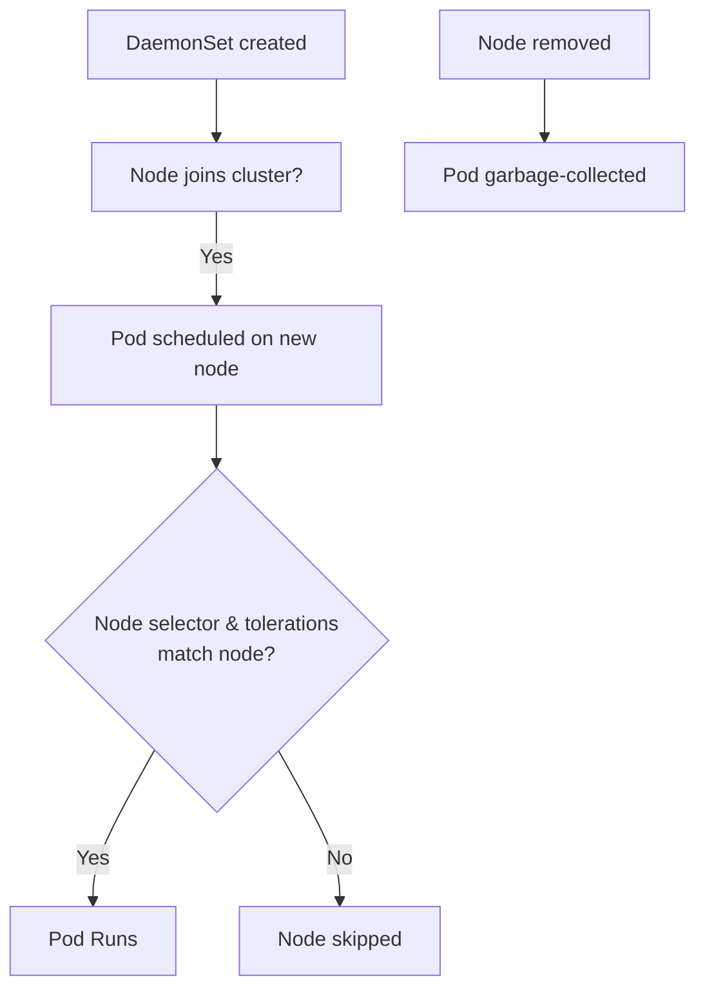
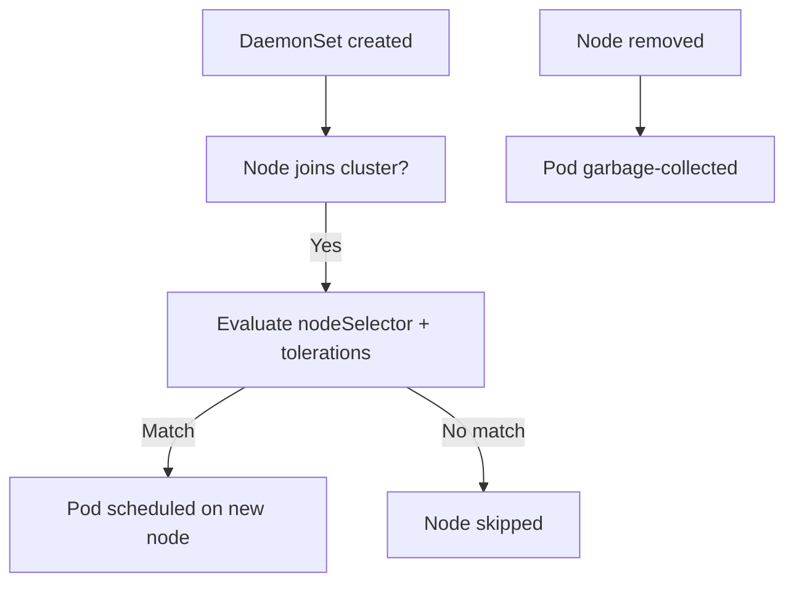

# DaemonSets - In-Depth Mechanics

## Core Behavior

A DaemonSet ensures that exactly **one Pod** runs on every (matching) node in the cluster. It is the primary mechanism for deploying cluster-wide infrastructure daemons.

### One Pod Per Node

When a node is added to the cluster, the DaemonSet creates a Pod on it. When a node is removed, the Pod is garbage-collected. This behavior makes DaemonSets ideal for infrastructure components.



### Node Selection

Node targeting is controlled by two mechanisms that work together:

| Mechanism | Purpose |
|-----------|---------|
| `spec.template.spec.nodeSelector` | Select nodes by label (e.g., `kubernetes.io/os: linux`) |
| `spec.template.spec.tolerations` | Allow Pods to run on tainted nodes |

```yaml
apiVersion: apps/v1
kind: DaemonSet
metadata:
  name: node-exporter
spec:
  selector:
    matchLabels:
      app: node-exporter
  template:
    metadata:
      labels:
        app: node-exporter
    spec:
      nodeSelector:
        kubernetes.io/os: linux
      tolerations:
      - key: node-role.kubernetes.io/control-plane
        operator: Exists
        effect: NoSchedule
      containers:
      - name: node-exporter
        image: prom/node-exporter:v1.8
```

### Selector Must Match Template Labels

This is a common and critical mistake:

```yaml
# WRONG — selector does NOT match template labels
spec:
  selector:
    matchLabels:
      app: monitoring     # template labels have "name: ..." instead
  template:
    metadata:
      labels:
        name: node-exporter

# CORRECT — selector and template labels must overlap
spec:
  selector:
    matchLabels:
      app: monitoring
  template:
    metadata:
      labels:
        app: monitoring
        component: node-exporter
```

```bash
# Verify selector/template labels match
kubectl get daemonset node-exporter -o yaml | grep -A10 "selector:"
kubectl get daemonset node-exporter -o yaml | grep -A5 "template:" | head -20

# Check if a DaemonSet controller found its pods
kubectl describe daemonset node-exporter | grep "Events"
```

### Taints and Tolerations

Control-plane nodes are tainted by default with `node-role.kubernetes.io/control-plane:NoSchedule` (or `node-role.kubernetes.io/master:NoSchedule` in older versions). DaemonSet Pods need a toleration to run on these nodes if the node selector includes them.

```bash
# Check current taints on nodes
kubectl describe nodes | grep -B1 "Taints:"

# View tolerations on a DaemonSet Pod
kubectl get pod -l app=node-exporter -o jsonpath='{.items[*].spec.tolerations}'
```

### Pod Management

By default, a DaemonSet creates exactly one Pod on every node that matches its `nodeSelector` and `tolerations`. There is no `podManagementPolicy` field on DaemonSets — that concept belongs to StatefulSets. DaemonSets always ensure one Pod per eligible node.



### Best Practices

- **DaemonSet Pods should be lightweight**: they run on every node, so resource consumption multiplies by node count.
- **Set explicit requests and limits** on DaemonSet containers to prevent node resource exhaustion.
- **Use Node Affinity + Taints strategically**: not every DaemonSet needs to run on control-plane nodes unless it is a control-plane component.
- **Separate DaemonSets by concern**: one for logging, one for monitoring, one for networking. This avoids a single failure domain.
- **Use `updateStrategy: RollingUpdate` with appropriate `maxUnavailable`** for controlled rollouts on large clusters.

### Common Pitfalls

- **Selector/template label mismatch** is the #1 cause of "DaemonSet creates 0 Pods". The controller silently waits because it cannot find matching Pods.
- **Forgetting tolerations** when targeting control-plane nodes: the Pods will never be scheduled on master nodes.
- **DaemonSets and static Pods conflict** on the same node: static Pods managed by kubelet directly (e.g., control-plane components) are outside the DaemonSet controller's scope.
