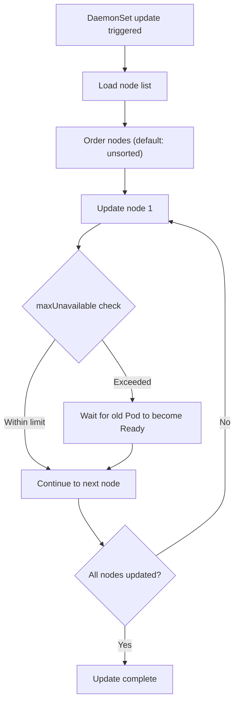
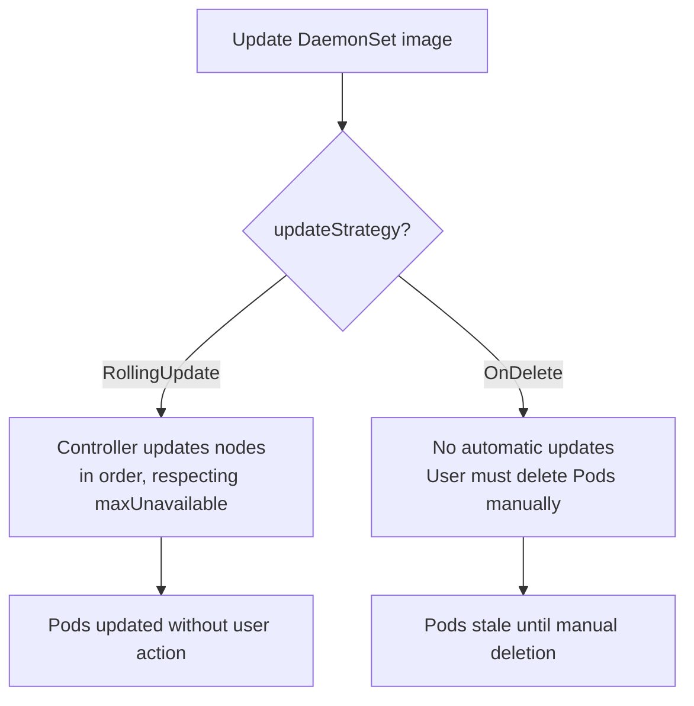

# DaemonSets - In-Depth Mechanics

## Rolling Update Strategies

DaemonSets support two update strategies: `RollingUpdate` (default) and `OnDelete`.

### RollingUpdate (Default)

Rolls out DaemonSet Pods incrementally, similar to Deployments, using:

- **`maxUnavailable`**: Maximum number of Pods that can be DOWN during the update.
- **`maxSurge`**: Maximum number of extra Pods above the desired count.

```yaml
spec:
  updateStrategy:
    type: RollingUpdate
    rollingUpdate:
      maxUnavailable: 1
      maxSurge: 0
```



### maxSurge and maxUnavailable for DaemonSets

Unlike Deployments, `maxSurge` creates a **temporary extra Pod** on the node (not on top of the replica count). This can be useful for draining nodes before updating them, but it consumes node resources.

| `maxSurge` | `maxUnavailable` | Effect |
|-----------|------------------|--------|
| `0` | `1` or percentage | Slow: old Pod deleted, new Pod created sequentially |
| `0` | `All` | All old Pods terminate, then new Pods create. Downtime if Pod collects logs |
| `1` | `0` | New Pod runs alongside old Pod during update. Zero disruption but doubles resource usage briefly |

### Specifying Node Order

Since K8s 1.21, the DaemonSet controller supports `nodeSelector` based ordering if `nodeSelector` is set. It also supports **alpha** features like `nodeAffinity` ordering.

```yaml
spec:
  updateStrategy:
    rollingUpdate:
      maxUnavailable: 1
```

### OnDelete (Legacy / Explicit)

`OnDelete` requires **manual Pod deletion** to trigger an update. The DaemonSet controller never updates existing Pods automatically.

```yaml
spec:
  updateStrategy:
    type: OnDelete
```

```bash
# Trigger update by deleting Pods manually
kubectl get pods -l app=fluentd -o wide
kubectl delete pod fluentd-abc123 fluentd-def456  # Controller recreates with new image

# Verify updated image
kubectl get pods -l app=fluentd -o wide
```

### Mermaid: UpdateStrategy Selection



### kubectl Examples

```bash
# Create a DaemonSet with RollingUpdate
cat <<'EOF' | kubectl apply -f -
apiVersion: apps/v1
kind: DaemonSet
metadata:
  name: node-exporter
spec:
  selector:
    matchLabels:
      app: node-exporter
  updateStrategy:
    type: RollingUpdate
    rollingUpdate:
      maxUnavailable: 1
  template:
    metadata:
      labels:
        app: node-exporter
    spec:
      nodeSelector:
        kubernetes.io/os: linux
      tolerations:
      - key: node-role.kubernetes.io/control-plane
        operator: Exists
        effect: NoSchedule
      containers:
      - name: node-exporter
        image: prom/node-exporter:v1.8
        ports:
        - containerPort: 9100
EOF

# Trigger a rollout by changing the image
kubectl set image daemonset/node-exporter node-exporter=prom/node-exporter:v1.9

# Watch rollout status (rolling updates show progress)
kubectl rollout status daemonset/node-exporter --timeout=5m
```

### Best Practices

- **Use RollingUpdate for production DaemonSets**: OnDelete is only appropriate for testing or highly controlled environments.
- **Start with `maxUnavailable: 1`** on clusters with 100+ nodes to prevent thundering-herd CPU usage during initial bootstrap.
- **Adjust `maxUnavailable` upward** for clusters with stateless, sidecar-free DaemonSets that can tolerate overlap.
- **Use `maxSurge: 1` only if the DaemonSet Pod is lightweight and the node has headroom**: it creates an extra Pod during transition.

### Common Pitfalls

- **`maxSurge` on DaemonSets is per-node, not cluster-wide**: a DaemonSet with `maxSurge: 1` and 100 nodes creates 100 extra Pods during rollout.
- **OnDelete requires you to know which Pods are stale**: without manual tracking, you might miss nodes that were added after the last OnDelete update.
- **RollingUpdate on a node that just rebooted** creates a new Pod immediately, potentially before the node is ready (ensure node readiness gates exist).
