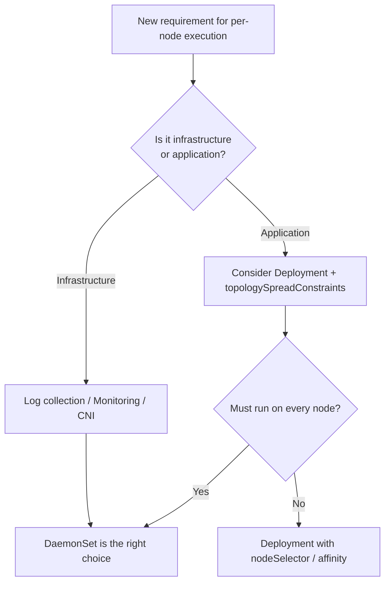
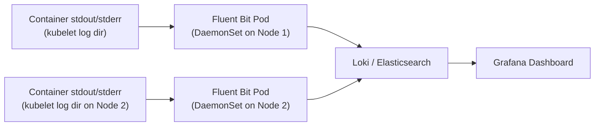

# DaemonSets - In-Depth Mechanics

## Typical Use Cases

DaemonSets are designed for workloads that require **a per-node presence**. Understanding the canonical patterns helps you avoid overusing or misusing DaemonSets.

### The Per-Node Requirement Checklist

A workload is a good DaemonSet candidate if:

1. It needs to run **exactly one instance per node** (or per matching node).
2. It benefits from **low-latency access to node-local resources** (filesystem, devices, network interface).
3. It provides a **cluster-wide service** (logging, metrics, network enforcement).
4. It must survive node churn and automatically deploy to new nodes.

### Common Patterns

#### 1. Log Collection (Fluentd, Fluent Bit, Vector)

Every node generates logs. A logging agent as a DaemonSet collects container stdout, journald, and node logs and ships them to a central store (Elasticsearch, Loki, Splunk).

```yaml
apiVersion: apps/v1
kind: DaemonSet
metadata:
  name: fluent-bit
  namespace: logging
spec:
  selector:
    matchLabels:
      app: fluent-bit
  template:
    metadata:
      labels:
        app: fluent-bit
    spec:
      containers:
      - name: fluent-bit
        image: fluent/fluent-bit:3.0
        volumeMounts:
        - name: varlog
          mountPath: /var/log
        - name: varlibdockercontainers
          mountPath: /var/lib/docker/containers:ro
      volumes:
      - name: varlog
        hostPath:
          path: /var/log
      - name: varlibdockercontainers
        hostPath:
          path: /var/lib/docker/containers
```

**Why DaemonSet?** Running the log collector as a Deployment would lose logs from nodes without the Pod. A DaemonSet guarantees coverage.

#### 2. Monitoring Agents (Prometheus Node Exporter)

Node Exporter exposes host-level metrics (CPU, memory, disk, network) to Prometheus. One instance per node is mandatory for accurate node-level dashboards.

```yaml
      containers:
      - name: node-exporter
        image: prom/node-exporter:v1.8
        args:
        - --path.rootfs=/host   # Mount host filesystem to see host metrics
        volumeMounts:
        - name: rootfs
          mountPath: /host
          readOnly: true
      volumes:
      - name: rootfs
        hostPath:
          path: /
```

#### 3. CNI / Network Plugins (Calico, Cilium)

CNI plugins often deploy a DaemonSet that runs on every node to configure network interfaces, iptables rules, and routing. This is typically managed by the CNI's installer, not manually.

#### 4. Storage Daemons (Local Path Provisioner, Longhorn Node Agent)

Storage solutions need per-node agents to manage disks, mount points, and volume lifecycle.

#### 5. Security / Compliance Agents (Falco, Sysdig, KubeArmor)

Runtime security agents monitor syscalls, network connections, and file access on each node for threat detection.

### Mermaid: DaemonSet Use Case Coverage



### Mermaid: Log Collection Data Flow



### When NOT to Use a DaemonSet

| Scenario | Use Instead |
|----------|-------------|
| Stateless web service with HA | Deployment + HPA |
| Job processing queue | Deployment + HPA |
| Application that needs N replicas across the cluster | Deployment |
| Per-user or per-tenant workload | Namespace + Deployment |
%comment try not to use acronims out of the blue like HPA 
### Best Practices

- **Run DaemonSet Pods with explicit resource requests/limits**: a misconfigured monitoring agent on 200 nodes can exhaust the cluster.
- **Use hostPath volumes sparingly**: they are required for log/monitoring access but bypass Kubernetes volume security constraints. Document each usage.
- **Use `updateStrategy: RollingUpdate` with appropriate `maxUnavailable`** for DaemonSets that benefit from fast rollout on large clusters (be mindful of API server / node burst).
- **Tag DaemonSet Pods with specific labels** and use a dedicated Service per DaemonSet type for clean service discovery.
- **Namespace your DaemonSets**: put `node-exporter` in `monitoring`, `fluentd` in `logging`, etc.

### Common Pitfalls

- **DaemonSets on tainted control-plane nodes**: without a matching toleration, the DaemonSet Pods will not schedule on master nodes. This is usually desired, but verify with `kubectl get pods -A -o wide`.
- **Host path permissions**: hostPath volumes may have permission issues if the container runs as non-root but the host directory is root-only.
- **Resource multiplication**: 200 nodes × 100m CPU request = 20 CPU of cluster capacity consumed by a single DaemonSet. Monitor DaemonSet resource usage at scale.
