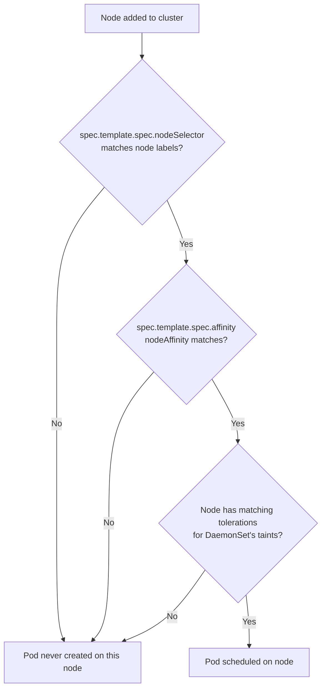
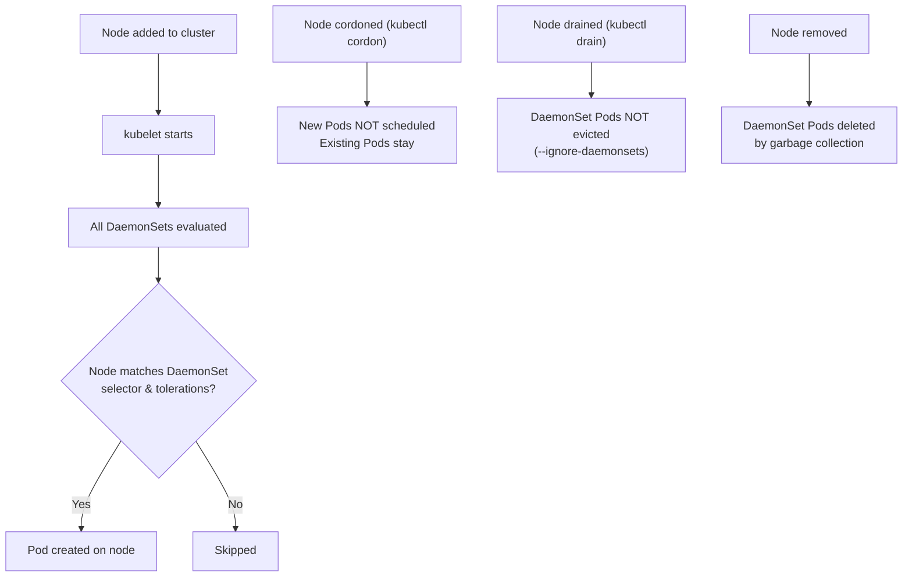

# DaemonSets - In-Depth Mechanics

## Update Behavior

Understanding how DaemonSet updates propagate across nodes is critical for zero-downtime cluster operations. The DaemonSet controller in the control plane manages this lifecycle.

### Controller Placement

The DaemonSet controller runs in the **control plane** (kube-controller-manager). It watches nodes and DaemonSet specs, and ensures the desired Pod count per node.

### Node Selection Pipeline

Node eligibility is determined by two filters applied in order:



### Force Updates

You can force immediate DaemonSet rollout by deleting Pods manually. The DaemonSet controller recreates them with the new template.

```bash
# Force update all DaemonSet Pods
kubectl delete pods --all -l app=node-exporter

# Or delete Pods on a specific node
kubectl get pods -l app=node-exporter --field-selector spec.nodeName=worker-1 -o name | xargs kubectl delete

# Verify new Pods have the new image
kubectl get pods -l app=node-exporter -o wide
```

### Rolling Update Order

By default, the DaemonSet controller updates nodes in an **undefined order** (the order it iterates the node cache). Do not rely on any specific order unless you explicitly configure it.

You can influence order using:

```yaml
spec:
  template:
    spec:
      nodeAffinity:
        requiredDuringSchedulingIgnoredDuringExecution:
          nodeSelectorTerms:
          - matchExpressions:
            - key: topology.kubernetes.io/zone
              operator: In
              values:
              - us-east-1a    # Nodes in zone 'a' are iterated first
```

### Status and Readiness

```bash
# Check DaemonSet desired, current, and ready counts
kubectl get daemonset -A

# Output columns: NAMESPACE, NAME, DESIRED, CURRENT, READY, UP-TO-DATE, AVAILABLE, AGE
# DESIRED  = number of nodes that match scheduling constraints
# CURRENT  = number of Pods currently running
# READY    = number of Pods passing readiness probe
# UP-TO-DATE = number of Pods running the latest template spec
# AVAILABLE = number of Pods that have been Ready for at least minReadySeconds

# Detailed status
kubectl describe daemonset node-exporter -n monitoring

# Check available node count (why DESIRED might be less than total nodes)
kubectl get nodes -L kubernetes.io/os
```

### Why DESIRED Might Not Equal Total Nodes

| Reason | Explanation |
|--------|-------------|
| `nodeSelector` excludes nodes | Nodes without the required labels are skipped |
| Node is unschedulable (`kubectl cordon`) | DaemonSet respects this |
| Node is not Ready | Pods are not placed on NotReady nodes by default |
| Taint without matching toleration | Node has a taint, Pod has no toleration for it |
| Custom controller or webhook admission | External admission controllers may reject DaemonSet Pods |

### Intersection with Node Lifecycle



### kubectl Examples

```bash
# Cordon a node (prevent new scheduling)
kubectl cordon worker-2

# DaemonSet will not place new Pods on worker-2
# but existing Pods remain running

# Drain a node (evicts Pods gracefully)
kubectl drain worker-2 --ignore-daemonsets --delete-emptydir-data

# --ignore-daemonsets: skip evicting DaemonSet Pods
# DaemonSet controller recreates them automatically

# Force delete a DaemonSet and recreate
kubectl delete daemonset fluentd --grace-period=0 --force
```

### Best Practices

- **Use RollingUpdate with `maxUnavailable: 1`** for clusters with sensitive workloads so DaemonSets update one node at a time.
- **Drain nodes intentionally** using `kubectl drain` with `--ignore-daemonsets` to avoid unnecessary DaemonSet churn during maintenance.
- **Monitor DESIRED vs. READY counts**: a gap indicates node exclusion, taints, or scheduling issues.
- **Use `kubectl get nodes` to verify node health** if DaemonSet Pods are not appearing on expected nodes.

### Common Pitfalls

- **DaemonSet Pods are NOT recreated during `kubectl drain` with `--ignore-daemonsets`**: the flag prevents eviction of DaemonSet Pods, so the controller does not create replacements.
- **Unschedulable nodes still have DaemonSet Pods running**: `cordon` does not remove DaemonSet Pods. Use `drain` if you want to remove Pods.
- **Node selector misconfiguration silently reduces DESIRED count**: a mismatched `nodeSelector` label means DESIRED drops without error.
