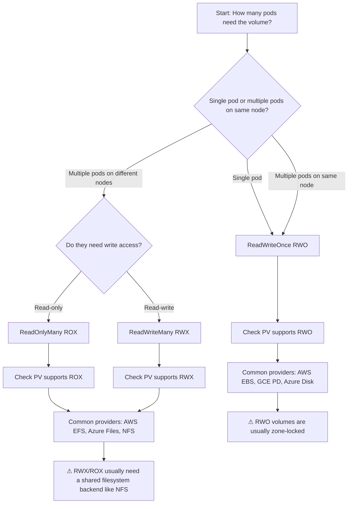
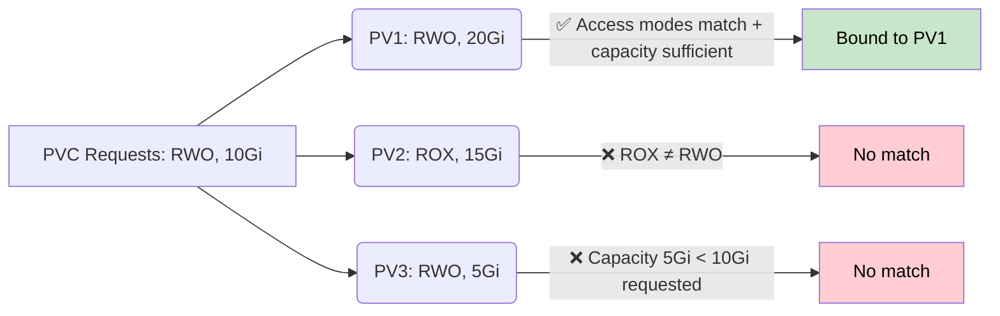

# Storage - Access Modes

## Overview

Access modes define how a volume can be mounted and accessed by pods. They are declared when a PersistentVolumeClaim (PVC) requests storage, and matched against the capabilities of available PersistentVolumes (PVs). The access mode is a fundamental constraint that determines which workloads can use a given volume and how many pods can share it simultaneously.

## The Four Access Modes

### ReadWriteOnce (RWO)

The volume can be mounted as read-write by a single node. A single pod can mount the volume per node, though that pod can have multiple containers that all access it.

```yaml
apiVersion: v1
kind: PersistentVolumeClaim
metadata:
  name: rwo-claim
spec:
  accessModes:
    - ReadWriteOnce
  resources:
    requests:
      storage: 10Gi
```

**Typical use cases:**
- Single-instance databases (MySQL, PostgreSQL) that need exclusive write access
- Application logs that must be written to by one process only
- Stateful workloads where concurrent writes would cause data corruption

### ReadOnlyMany (ROX)

The volume can be mounted as read-only by many nodes. Multiple pods across different nodes can mount the same volume simultaneously, but none can write to it.

```yaml
apiVersion: v1
kind: PersistentVolumeClaim
metadata:
  name: rox-claim
spec:
  accessModes:
    - ReadOnlyMany
  resources:
    requests:
      storage: 5Gi
```

**Typical use cases:**
- Shared configuration files or TLS certificates read by many pods
- Static asset serving (e.g., a shared read-only data set)
- Content that is populated once and broadcast to many consumers

### ReadWriteMany (RWX)

The volume can be mounted as read-write by many nodes. Multiple pods across different nodes can mount the volume and both read from and write to it concurrently.

```yaml
apiVersion: v1
kind: PersistentVolumeClaim
metadata:
  name: rwx-claim
spec:
  accessModes:
    - ReadWriteMany
  resources:
    requests:
      storage: 20Gi
```

**Typical use cases:**
- Shared home directories for collaborative development environments
- CMS or content platforms where multiple writers edit simultaneously
- NFS-backed shared storage for multi-replica stateless applications

## Access Modes Decision Flowchart



## How Access Modes Are Matched (Binding)

When a PVC is created, the Kubernetes storage subsystem iterates over available PVs and tries to find a match. A PV matches a PVC only when:

1. The PVC's requested `accessModes` are a subset of the PV's `accessModes`
2. The PVC's requested `storage` is less than or equal to the PV's `capacity`
3. The `storageClassName` matches (if specified)



## Important Gotchas

### RWO Does NOT Mean "One Pod Per Cluster"

A common misconception is that `ReadWriteOnce` means only one pod in the entire cluster can mount the volume. In reality, it means only one pod **per node** can mount it. If two pods scheduling on the same node both request RWO, both can mount the volume — but a third pod on a different node cannot.

### ROX and RWX Are Not Universally Supported

Not all storage providers support all access modes. For example:
- **AWS EBS CSI** supports `ReadWriteOnce` and `ReadWriteOncePod`
- **GCE PD CSI** supports `ReadWriteOnce` and `ReadOnlyMany` (ROX via snapshot/clone)
- **Azure Disk CSI** supports `ReadWriteOnce` only
- **NFS** supports all three modes (`RWO`, `ROX`, `RWX`)
- **AWS EFS** supports all three modes

If you request a mode your storage class does not support, the PVC will remain in `Pending` state indefinitely.

Note: For CSI drivers, access mode support depends on the driver. For example, the **GCE PD CSI driver** supports both `ReadWriteOnce` and `ReadOnlyMany` (the latter via snapshot/clone). The **AWS EBS CSI driver** supports `ReadWriteOnce` and `ReadWriteOncePod`, but not `ReadOnlyMany` or `ReadWriteMany`. For the CKAD exam, the common simplification is that block storage backends (EBS, GCE PD, Azure Disk) support `ReadWriteOnce` only, while file storage backends (NFS, EFS, Azure Files) support `ReadWriteMany`.

### Access Modes vs. Volume Mode

The `volumeMode` field on a PVC (default `Filesystem`) is orthogonal to access modes:
- `Filesystem`: The volume is mounted as a directory with a filesystem
- `Block`: The volume is exposed as a raw block device (no filesystem)

```yaml
apiVersion: v1
kind: PersistentVolumeClaim
metadata:
  name: block-claim
spec:
  volumeMode: Block
  accessModes:
    - ReadWriteOnce
  resources:
    requests:
      storage: 5Gi
```

## Best Practices

1. **Prefer `ReadWriteOnce` for most stateful workloads** — it's the most widely supported and avoids the complexity of shared filesystems.
2. **Use `ReadOnlyMany` for certificates and config** that many pods need to read but none should write to.
3. **If you need `ReadWriteMany`, verify your storage backend explicitly supports it** before designing your architecture around it.
4. **Always check PVC status** after creation:
   ```bash
   kubectl get pvc
   # Events: kubectl describe pvc <pvc-name>
   # If stuck in Pending: check PV availability and access mode compatibility
   ```
5. **Use `storageClassName` to narrow down which PVs are eligible** for binding. Different access modes often map to different storage classes.

## Troubleshooting

| Symptom | Likely Cause | Diagnosis |
|---------|-------------|-----------|
| PVC stuck in `Pending` | No matching PV available (wrong access mode, storage class, or capacity) | `kubectl describe pvc <name>` — check Events |
| Pod stuck in `ContainerCreating` | Volume mount failed (volume not yet bound) | `kubectl describe pod <pod>` — check conditions |
| Pod scheduled but volume not attached | Storage provider driver not installed or quota exceeded | Check node conditions and CSI driver logs |
| RWX PVC bound to ROX PV | Admin manually created a PV with wrong access mode | Verify PV `spec.accessModes` matches PVC requirements |

## Community Knowledge

- **EBS CSI Driver** (for AWS): Supports `ReadWriteOnce` and `ReadWriteOncePod`. If you need `ReadWriteMany` on AWS, use EFS with the EFS CSI driver.
- **NFS as a quick RWX solution**: For testing or small workloads, you can set up an NFS server and use the NFS plugin to expose RWX storage. Not recommended for production without proper hardening.
- **ReadWriteOncePod (RWOP)**: A newer access mode for volumes that should be mountable by only a single pod (regardless of node). This is more restrictive than RWO and is useful for volumes backed by local storage or when you want stronger guarantees. GA since v1.29. Supported by CSI drivers that implement the `SINGLE_NODE_MULTI_WRITER` capability.