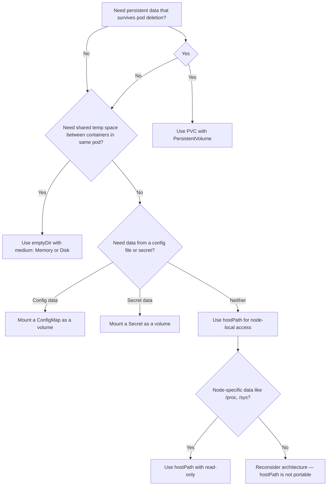

# Storage - Common CKAD Storage Types

## Overview

Kubernetes provides several volume types that serve different purposes in the lifecycle of a pod and the cluster. Understanding when to use each type — and how they behave during pod lifecycle events — is essential for the CKAD exam and for real-world cluster administration.

## Volume Type Decision Flowchart


%comment this marmaid is strange, like yes in the node?
## emptyDir

`emptyDir` is created when a pod is assigned to a node. It exists as long as the pod runs on that node. When the pod is removed, `emptyDir` is deleted permanently.

**Key characteristics:**
- Ephemeral — tied to pod lifecycle
- Backed by the node's disk (default) or `tmpfs` (RAM-backed)
- Shared between all containers in the same pod via the volume mount
- Not accessible across pods

### Example: Standard emptyDir

```yaml
apiVersion: v1
kind: Pod
metadata:
  name: shared-volume-pod
spec:
  containers:
    - name: producer
      image: alpine
      command: ['sh', '-c', 'echo "Hello from producer" > /shared/greeting.txt && sleep 3600']
      volumeMounts:
        - name: shared-cache
          mountPath: /shared
    - name: consumer
      image: alpine
      command: ['sh', '-c', 'cat /shared/greeting.txt && sleep 3600']
      volumeMounts:
        - name: shared-cache
          mountPath: /shared
  volumes:
    - name: shared-cache
      emptyDir: {}
```

### Example: RAM-backed emptyDir (tmpfs)

```yaml
  volumes:
    - name: ram-cache
      emptyDir:
        medium: Memory
        sizeLimit: 100Mi
```

**When to use:**
- Temporary scratch space for intermediate processing
- Shared data between init containers and app containers
- Caching frequently-recomputed data that does not need to survive pod restarts

**CKAD tip:** `emptyDir` is often used in multi-container pods where one container generates data and another consumes it (e.g., a log shipper + log producer).

## hostPath

`hostPath` mounts a file or directory from the node's filesystem into the pod. This is inherently node-specific and not portable.

### Example: Basic hostPath

```yaml
apiVersion: v1
kind: Pod
metadata:
  name: hostpath-demo
spec:
  containers:
    - name: debug
      image: alpine
      command: ['sh', '-c', 'ls -la /host-data && sleep 3600']
      volumeMounts:
        - name: host-vol
          mountPath: /host-data
  volumes:
    - name: host-vol
      hostPath:
        path: /data
        type: Directory  # or DirectoryOrCreate, File, FileOrCreate, Socket, CharDevice, BlockDevice, Unset
```

### hostPath Types

| Type | Behavior |
|------|----------|
 | `Directory` | Must exist on the node |
 | `DirectoryOrCreate` | Create directory if it does not exist |
 | `File` | Must exist on the node |
 | `FileOrCreate` | Create file if it does not exist |
 | `Socket` | Must exist on the node |
 | `CharDevice` | Must exist and be a character device (Linux nodes only) |
 | `BlockDevice` | Must exist and be a block device (Linux nodes only) |
 | `""` (empty) | Default — no validation performed |

**When to use:**
- Mounting `/proc` or `/sys` for debugging or monitoring tools
- Docker socket proxy (`/var/run/docker.sock`) for container runtime access
- Node-level logging agents that need access to host logs

**⚠ Pitfalls:**
- **Not portable**: A pod with `hostPath` will fail or behave incorrectly if moved to a different node (even if the path exists, the data may differ).
- **Security risk**: Mounting sensitive host paths can give containers access to the node.
- **Scheduling issues**: Pods using `hostPath` may not be schedulable in certain environments (e.g., restricted pod security policies).

**Best practice:** Avoid `hostPath` in production. Use it only for system daemons (e.g., node-level log collectors, monitoring agents) or in development/testing scenarios.

## ConfigMap Volumes

ConfigMaps can be mounted as volumes, exposing key-value data as files in the container's filesystem.

```yaml
apiVersion: v1
kind: ConfigMap
metadata:
  name: app-config
data:
  app.properties: |
    server.port=8080
    logging.level=INFO
---
apiVersion: v1
kind: Pod
metadata:
  name: configmap-pod
spec:
  containers:
    - name: app
      image: nginx
      volumeMounts:
        - name: config-volume
          mountPath: /etc/config
          readOnly: true
  volumes:
    - name: config-volume
      configMap:
        name: app-config
```

**Behavior notes:**
- Each key in `data` becomes a file (optionally under a `items` prefix)
- ConfigMap volumes are mounted `readOnly` by default if specified (the `readOnly: true` in `volumeMounts` prevents writes)
- Changes to the ConfigMap eventually propagate to mounted files (eventually consistent, typically within a minute)

## Secret Volumes

Secrets work identically to ConfigMaps as volumes but are intended for sensitive data.

```yaml
apiVersion: v1
kind: Secret
metadata:
  name: db-secret
type: Opaque
data:
  username: YWRtaW4=  # base64 of "admin"
  password: UEBzc3cwcmQh  # base64 of "P@ssw0rd!"
---
apiVersion: v1
kind: Pod
metadata:
  name: secret-pod
spec:
  containers:
    - name: app
      image: nginx
      volumeMounts:
        - name: secret-volume
          mountPath: /etc/secrets
          readOnly: true
  volumes:
    - name: secret-volume
      secret:
        secretName: db-secret
```

**Important:** The Secret data is base64-encoded in the API, but this is **not encryption**. Secrets are stored in `etcd` as plaintext unless etcd encryption at rest is enabled. For production, use an external secrets manager (e.g., HashiCorp Vault, AWS Secrets Manager via CSI driver) or enable Kubernetes encryption providers.

## PersistentVolumeClaim (PVC)

A PVC is a user's request for storage. It is a namespaced resource that abstracts away the underlying storage provisioner.

```yaml
apiVersion: v1
kind: PersistentVolumeClaim
metadata:
  name: app-data-pvc
spec:
  accessModes:
    - ReadWriteOnce
  storageClassName: gp2
  resources:
    requests:
      storage: 20Gi
---
apiVersion: v1
kind: Pod
metadata:
  name: pvc-pod
spec:
  containers:
    - name: app
      image: nginx
      volumeMounts:
        - name: data-volume
          mountPath: /usr/share/nginx/html
  volumes:
    - name: data-volume
      persistentVolumeClaim:
        claimName: app-data-pvc
```

**CKAD Exam Pattern:** When asked to "make data persist across pod restarts," the answer is almost always a PVC + PV combination, often with a `storageClassName` that enables dynamic provisioning.

## CSI Volumes (CKAD Relevance)

Container Storage Interface (CSI) volumes are the modern way to integrate third-party storage with Kubernetes. Many cloud providers use CSI drivers behind the scenes (e.g., AWS EBS CSI driver, Azure Disk CSI driver).

```yaml
# Example using a CSI driver (e.g., NFS)
apiVersion: v1
kind: Pod
metadata:
  name: csi-pod
spec:
  containers:
    - name: app
      image: nginx
      volumeMounts:
        - name: nfs-storage
          mountPath: /data
  volumes:
    - name: nfs-storage
      csi:
        driver: nfs.csi.k8s.io
        volumeHandle: unique-vol-id
        readOnly: false
        volumeAttributes:
          server: nfs-server.example.com
          share: /exports/data
```

## Summary Table

| Volume Type | Persistence | Shared Across Pods | Backing | CKAD Frequency |
|-------------|-------------|-------------------|---------|----------------|
| `emptyDir` | Pod lifetime only | Yes (same pod) | Node disk or RAM | High |
| `hostPath` | Node filesystem | No (node-specific) | Node | Medium |
| ConfigMap volume | ConfigMap changes propagate | Yes (same pod or across pods) | etcd | Medium |
| Secret volume | Same as ConfigMap | Yes | etcd (base64) | Medium |
| PVC | Survives pod deletion | Depends on PV access mode | Dynamic or static | **Very High** |
| CSI volume | Provider-dependent | Provider-dependent | External | Growing |

## Best Practices

1. **Prefer PVCs over hostPath** for any data that needs to survive pod restarts or scheduling changes.
2. **Use `emptyDir` for ephemeral inter-container communication** within a pod — it's the cleanest, most isolated mechanism.
3. **Never store secrets in ConfigMap volumes** — use Secret volumes or external secret injection (e.g., External Secrets Operator) instead.
4. **Set `sizeLimit` on `emptyDir` with `medium: Memory`** to prevent memory exhaustion of the node:
   ```yaml
   emptyDir:
     medium: Memory
     sizeLimit: 500Mi
   ```
5. **Use `readOnly: true` on volume mounts** whenever the container does not need to write, reducing attack surface.

## Troubleshooting

| Symptom | Likely Cause | Fix |
|---------|-------------|-----|
| Pod stuck in `Pending` with volume issue | No PV matches PVC requirements | Check `kubectl describe pvc`, verify storage class and access modes |
| Data lost after pod restart | Used `emptyDir` or `hostPath` without understanding lifecycle | Switch to PVC-backed storage |
| `Permission denied` on hostPath mount | SELinux or filesystem permissions block pod access | Set `securityContext` with `fsGroup` or use correct `hostPath.type` |
| ConfigMap changes not reflected | Volume mount is not automatically updated at runtime | Restart pods to pick up new ConfigMap data; use `subPath` mounts cautiously |
| PVC stuck in `Pending` | Storage class not found or provisioner not deployed | Verify storage class exists: `kubectl get storageclass` |
