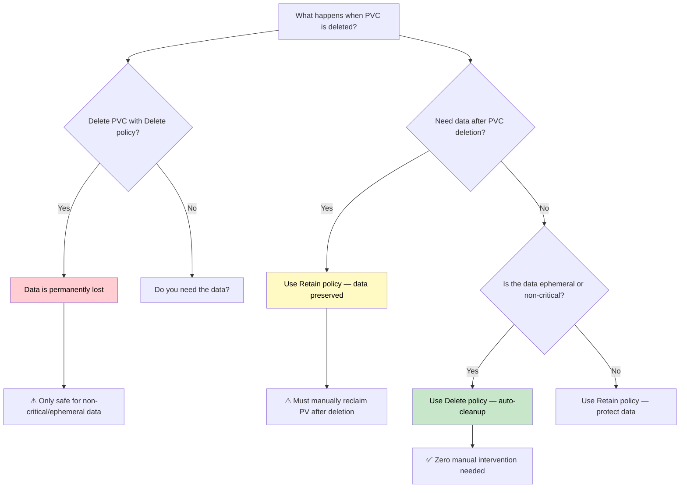
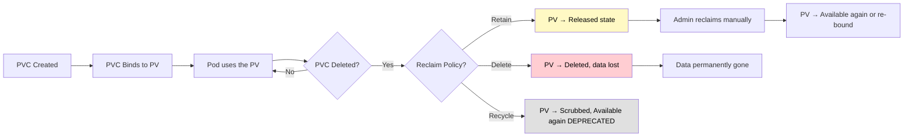

# Storage - Reclaim Policies

## Overview

Reclaim policies define what happens to a PersistentVolume (PV) when its bound PersistentVolumeClaim (PVC) is deleted. The reclaim policy is set on the PV itself (not the PVC) and determines whether data survives after the claim that used it is removed. Choosing the right reclaim policy is critical for both cost management and data protection.

## The Three Reclaim Policies

### Retain

When the PVC is deleted, the PV is not deleted and its data is preserved. The PV transitions to the `Released` state but is not available for binding to new PVCs until an administrator manually cleans up or reclaims it.

**Why use it:**
- You need to preserve data for audit, backup, or forensic purposes
- Data recovery: if a PVC was deleted accidentally, the data is still on the PV
- Multi-environment workflows: promotion between environments where data must survive the release phase

```yaml
apiVersion: v1
kind: PersistentVolume
metadata:
  name: pv-retain-example
spec:
  capacity:
    storage: 10Gi
  accessModes:
    - ReadWriteOnce
  persistentVolumeReclaimPolicy: Retain
  storageClassName: manual
  hostPath:
    path: /mnt/data
```

**After PVC deletion:**
```bash
kubectl get pv pv-retain-example
# NAME                CAPACITY   ACCESS MODES   RECLAIM POLICY   STATUS      CLAIM
# pv-retain-example    10Gi       RWO            Retain           Released    default/pvc-xxx
```

The PV is `Released` — the PVC is gone, but the data remains. To reuse this PV, you must manually remove or migrate the data and then either update the PV to bind to a new PVC or re-bind the existing PVC.

**Reclaiming a Retain PV:**
```bash
# 1. Edit the PV to remove the claimRef so it becomes Available again
kubectl patch pv pv-retain-example -p '{"spec": {"claimRef": null}}'

# 2. Create a new PVC that matches the PV's requirements
kubectl apply -f new-pvc.yaml
```

**Caution:** Manual reclamation is error-prone. Always back up data before clearing `claimRef`.

### Delete

When the PVC is deleted, the PV is also deleted, and **all data on the PV is permanently removed**. This is the default reclaim policy for most dynamically provisioned volumes (e.g., AWS EBS, GCE PD, Azure Disk).

```yaml
apiVersion: v1
kind: PersistentVolume
metadata:
  name: pv-delete-example
spec:
  capacity:
    storage: 10Gi
  accessModes:
    - ReadWriteOnce
  persistentVolumeReclaimPolicy: Delete
  storageClassName: gp2
  persistentVolumeSource:
    awsElasticBlockStore:
      volumeID: vol-0abc123
      fsType: ext4
```

**Why use it:**
- For non-critical or ephemeral data where you do not need to preserve data after the PVC is gone
- Reducing storage costs in dev/test environments
- Avoiding orphaned volumes that still incur charges

**⚠ Warning:** Deleting a PVC with a `Delete` reclaim policy is **irreversible**. There is no undo — the underlying cloud disk is destroyed and data is gone forever.

**CKAD Exam Tip:** If an exam question asks you to ensure data is preserved after PVC deletion, you must change the reclaim policy to `Retain`. Conversely, if the question asks you to clean up resources completely, ensure the policy is `Delete`.

### Recycle (Deprecated)

The `Recycle` policy was the original mechanism for reclaiming volumes. It would scrub the PV (e.g., run `rm -rf` on the volume) and make it available for re-binding. It has been **deprecated since Kubernetes 1.15** and is no longer supported by most CSI drivers and cloud provisioners.

**Why it was removed:**
- Scrubbing is slow and unreliable across different backends
- No consistency guarantees — different providers implemented scrubbing differently
- CSI drivers replaced much of the need for native recycling

**Do not use `Recycle` in any new deployment.** If you encounter it in older clusters, migrate to `Retain` or `Delete`.

## Reclaim Policy Decision Flowchart



## Dynamic Provisioning and Reclaim Policy

When a PVC requests dynamic provisioning via a `StorageClass`, the underlying provisioner determines the default reclaim policy. You can override it in the StorageClass:

```yaml
apiVersion: storage.k8s.io/v1
kind: StorageClass
metadata:
  name: fast-storage
provisioner: ebs.csi.aws.com
parameters:
  type: gp3
reclaimPolicy: Retain    # Override default (which is Delete for most CSI drivers)
allowVolumeExpansion: true
```

**StorageClass reclaim policy applies only to dynamically provisioned PVs.** Manually created PVs have their own `persistentVolumeReclaimPolicy` set at creation time.

### Checking the Effective Reclaim Policy

```bash
# List all PVs with their reclaim policies
kubectl get pv -o custom-columns=NAME:.metadata.name,RECLAIM:.spec.persistentVolumeReclaimPolicy,STATUS:.status.phase,SIZE:.spec.capacity.storage

# Describe a specific PV to see its reclaim policy
kubectl describe pv pv-retain-example
```

## Lifecycle with Reclaim Policies



## Best Practices

1. **Default to `Delete` for ephemeral workloads** (dev/test) and `Retain` for production data.
2. **Never use `Delete` with `Retain`-type data** in production — test this behavior in a non-production environment first.
3. **Set reclaim policy at the StorageClass level** for consistent behavior across all dynamically provisioned volumes:
   ```bash
   kubectl get storageclass
   kubectl edit storageclass <class-name>
   ```
4. **Audit orphaned Released PVs** regularly — they still consume storage and incur costs:
   ```bash
   kubectl get pv --field-selector status.phase=Released
   ```
5. **For stateful workloads (Databases, message queues), always use `Retain`** so that data can be recovered if the PVC is accidentally deleted.
6. **Use `volumeBindingMode: WaitForFirstConsumer`** with `Retain` policy — this prevents premature PV provisioning and allows topology-aware binding.

## Troubleshooting

| Symptom | Likely Cause | Resolution |
|---------|-------------|------------|
| PV stuck in `Released` state | Reclaim policy is `Retain` and `claimRef` not cleared | Manually edit PV to remove `claimRef` or create a matching PVC |
| Data lost after PVC deletion | Reclaim policy was `Delete` | Switch to `Retain` and back up data proactively |
| New PVC cannot bind to Released PV | PV `capacity`, `accessModes`, or `storageClassName` do not match the new PVC | Verify all PV spec fields match the PVC requirements |
| Dynamic provisioning always uses `Delete` | StorageClass default reclaim policy is `Delete` | Override in StorageClass or create PVs manually with `Retain` |
| Orphaned PVs accumulating | PVCs deleted but reclaim policy is `Retain` | Automate cleanup of Released PVs with a script or operator |

### Common Pitfall: Released PVs with `Retain` Policy

When a PVC is deleted and the PV is `Released`, the PV **cannot** be claimed by a new PVC that has different storage requirements (e.g., larger size, different access modes). You must manually edit the PV to match:

```bash
# Check the Released PV details
kubectl get pv pv-retain-example -o yaml

# You may need to:
# 1. Remove claimRef to make it Available again
# 2. Adjust capacity/accessModes to match the new PVC
kubectl patch pv pv-retain-example -p '{"spec": {"claimRef": null, "capacity": {"storage": "20Gi"}}}'
```

## Community Knowledge

- **EKS and GKE behave the same** for dynamic provisioning: the default reclaim policy for CSI-provisioned volumes is `Delete`. Always verify by checking the StorageClass.
- **On-premises clusters** (e.g., using NFS or Ceph RBD) often default to `Retain` because the admin controls the backend and wants to avoid accidental data loss.
- **Velero and other backup tools** work best with `Retain` policy because the PV data persists independently of the PVC lifecycle.
- **GitOps workflows** can be configured to automatically delete unreleased PVs after a grace period using custom controllers (e.g., `kube-reaper`) to reclaim storage costs.