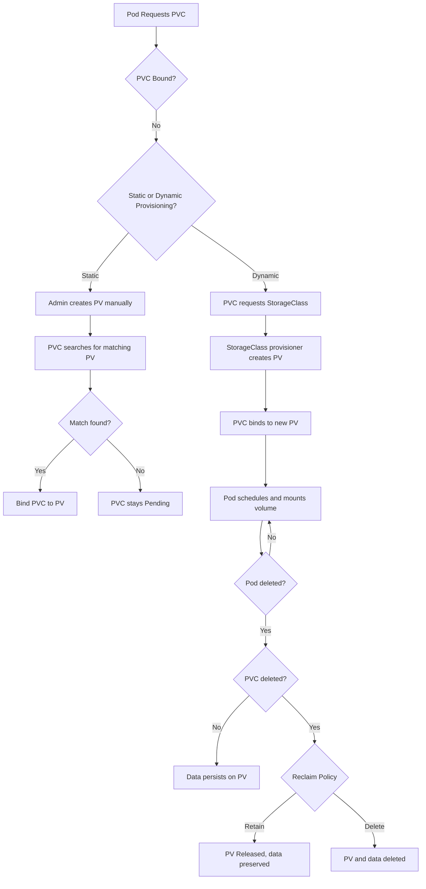
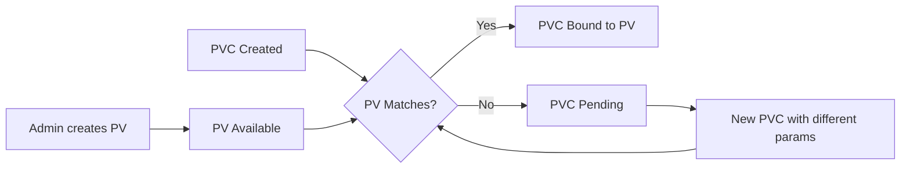
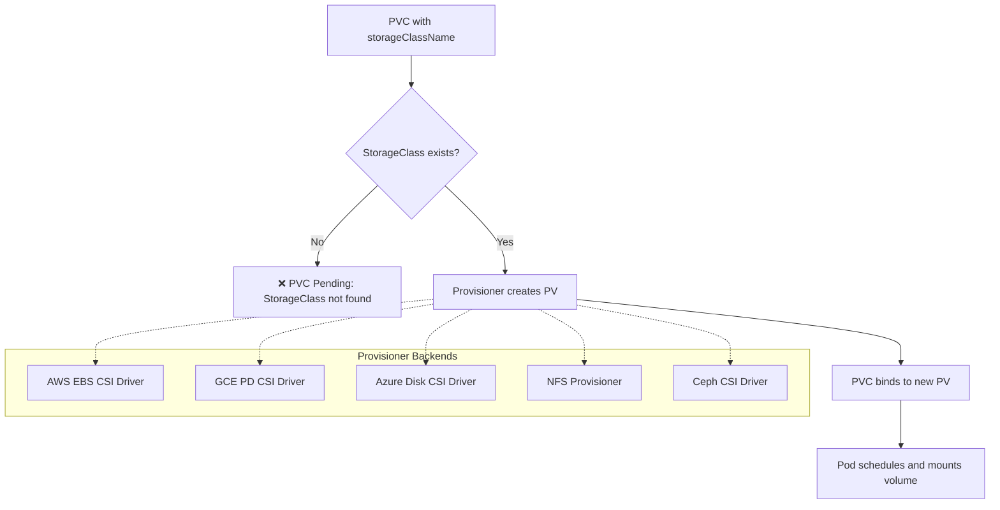
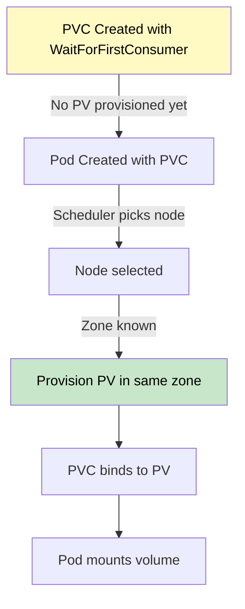
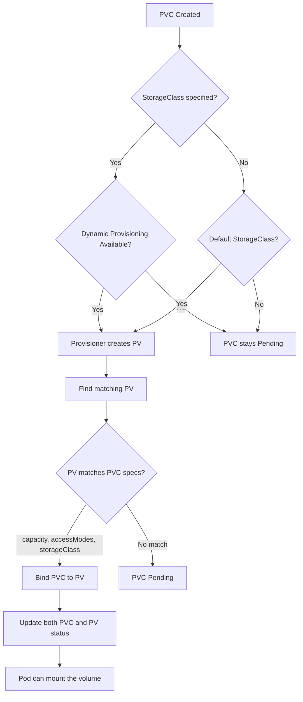

# Storage - Volume Lifecycle & Binding

## Overview

The volume lifecycle in Kubernetes describes how PersistentVolumes (PVs) are created, how PersistentVolumeClaims (PVCs) find and bind to them, and how data persists (or does not) through pod and PVC lifecycle events. Understanding this lifecycle is critical for data durability, scheduling decisions, and troubleshooting storage issues.

## Volume Lifecycle Stages



## Static Provisioning

In static provisioning, the cluster administrator manually creates PVs with specific capacity, access modes, and storage backends. PVCs then find and bind to matching PVs.

### Flowchart: Static Provisioning



### Example: Static PV and PVC

```yaml
apiVersion: v1
kind: PersistentVolume
metadata:
  name: pv-static-example
spec:
  capacity:
    storage: 10Gi
  accessModes:
    - ReadWriteOnce
  persistentVolumeReclaimPolicy: Retain
  storageClassName: manual
  hostPath:
    path: /mnt/data
---
apiVersion: v1
kind: PersistentVolumeClaim
metadata:
  name: pvc-static-example
spec:
  accessModes:
    - ReadWriteOnce
  resources:
    requests:
      storage: 10Gi
  storageClassName: manual
```

**Matching Rules for Static Binding:**
1. PVC `accessModes` must be a subset of PV `accessModes`
2. PVC requested `storage` must be ≤ PV `capacity`
3. PVC `storageClassName` must match PV `storageClassName`
4. PV must not already be bound to another PVC

### Why Use Static Provisioning?

- **Pre-provisioned storage**: When the underlying infrastructure has already allocated volumes (e.g., LUNs on a SAN)
- **Fine-grained control**: Administrators define exact PV properties before PVCs exist
- **Capacity planning**: Ensures specific storage tiers are reserved for specific workloads

## Dynamic Provisioning

Dynamic provisioning eliminates the need for administrators to manually create PVs. When a PVC requests a `StorageClass`, the provisioner automatically creates a matching PV.

### Flowchart: Dynamic Provisioning



### Example: Dynamic Provisioning with StorageClass

```yaml
apiVersion: storage.k8s.io/v1
kind: StorageClass
metadata:
  name: fast-ssd
provisioner: ebs.csi.aws.com
parameters:
  type: gp3
  encrypted: "true"
reclaimPolicy: Delete
allowVolumeExpansion: true
volumeBindingMode: Immediate
---
apiVersion: v1
kind: PersistentVolumeClaim
metadata:
  name: pvc-dynamic
spec:
  accessModes:
    - ReadWriteOnce
  storageClassName: fast-ssd
  resources:
    requests:
      storage: 20Gi
```

**What happens when this PVC is created:**
1. Kubernetes does not find a matching PV immediately
2. It detects the `storageClassName: fast-ssd` and finds the StorageClass
3. The `ebs.csi.aws.com` provisioner is invoked
4. A new EBS volume of 20Gi is created in the cluster's AZ
5. A PV is dynamically created referencing the EBS volume
6. The PVC binds to the new PV

### Setting a Default StorageClass

One StorageClass can be marked as the default so that PVCs without an explicit `storageClassName` still trigger dynamic provisioning:

```bash
# Mark a StorageClass as default
kubectl patch storageclass fast-ssd -p '{"metadata": {"annotations": {"storageclass.kubernetes.io/is-default-class": "true"}}}'
```

**Note:** Multiple default StorageClasses can coexist in a cluster. When more than one is marked as default, Kubernetes uses the most recently created default StorageClass for PVCs that do not specify a `storageClassName`.

## Volume Binding Modes

The `volumeBindingMode` in a StorageClass controls when PVs are provisioned and bound to PVCs.

### Immediate Binding (Default)

PV is provisioned and bound as soon as the PVC is created, regardless of whether a Pod is actually using it yet.

```yaml
apiVersion: storage.k8s.io/v1
kind: StorageClass
metadata:
  name: immediate-binding
provisioner: ebs.csi.aws.com
volumeBindingMode: Immediate  # This is the default
```

**Implications:**
- PV is created immediately — storage capacity is consumed right away
- Binding happens at PVC creation time
- Pod may be scheduled on any node — the PV might be in a different availability zone
- Works well for storage backends that do not care about topology (e.g., NFS)

### WaitForFirstConsumer Binding

PV is not provisioned until a Pod that uses the PVC is scheduled. This allows the scheduler to choose a node (and thus an availability zone) first, ensuring the PV is provisioned in the same zone.

```yaml
apiVersion: storage.k8s.io/v1
kind: StorageClass
metadata:
  name: zonal-binding
provisioner: ebs.csi.aws.com
volumeBindingMode: WaitForFirstConsumer
```

**Flowchart: WaitForFirstConsumer**



**Why WaitForFirstConsumer is recommended for zonal storage:**
- AWS EBS volumes are **zone-locked**. If you use `Immediate` binding, the PV might be created in `us-east-1a` but the Pod could be scheduled on a node in `us-east-1b`, causing the Pod to be stuck in `Pending`.
- `WaitForFirstConsumer` defers provisioning until scheduling, ensuring the zone matches.

**Example: Zonal StorageClass for AWS EBS**

```yaml
apiVersion: storage.k8s.io/v1
kind: StorageClass
metadata:
  name: zonal-ssd
provisioner: ebs.csi.aws.com
volumeBindingMode: WaitForFirstConsumer
parameters:
  type: gp3
  encrypted: "true"
```

**CKAD Exam Tip:** If a PVC is stuck in `Pending` and the StorageClass uses `Immediate` binding with a zonal provisioner (like EBS), check if the Pod's node is in a different availability zone than the PV.

## The Binding Process in Detail



## Pod Lifecycle and Volume Behavior

### When a Pod is Deleted

1. If the PVC is **not deleted**, the PV retains its data (subject to reclaim policy)
2. A new Pod using the same PVC can mount the same volume and access the data
3. If the PVC is deleted:
   - `Delete` policy: PV and data are removed
   - `Retain` policy: PV is released but data is preserved

### When a Pod is Rescheduled to a Different Node

1. The PV is unmounted from the old node
2. The PV is mounted on the new node (if the storage backend supports remote access, like NFS)
3. For zone-locked storage (EBS, GCE PD), the new Pod must be on the same node/zone as the PV — otherwise it will be stuck in `Pending`

```bash
# Check where a PV is currently mounted and on which node
kubectl get pv <pv-name> -o yaml | grep -A5 claimRef

# Check pod scheduling node
kubectl get pod <pod-name> -o wide

# Check if PV and Pod are in the same AZ (cloud-specific)
kubectl describe pv <pv-name> | grep -i zone
kubectl describe node <node-name> | grep -i zone
```

## Best Practices

1. **Always set `volumeBindingMode: WaitForFirstConsumer`** for zonal storage backends (AWS EBS, GCE PD, Azure Disk) to avoid zone mismatch issues.
2. **Use `allowVolumeExpansion: true`** in your StorageClass for workloads that may grow — you can then expand the PVC without deleting it:
   ```bash
   kubectl patch pvc my-pvc -p '{"spec": {"resources": {"requests": {"storage": "30Gi"}}}}'
   ```
3. **Default to `WaitForFirstConsumer`** unless you have a specific reason for `Immediate` (e.g., NFS-backed storage that is not zone-sensitive).
4. **Set appropriate `reclaimPolicy`** in your StorageClass to match your data retention requirements.
5. **Monitor PVC pending state** — a PVC stuck in `Pending` often means no matching PV is available or the StorageClass provisioner is not functioning.

## Troubleshooting

| Symptom | Likely Cause | Diagnosis |
|---------|-------------|-----------|
| PVC stuck in `Pending` | No matching PV available | `kubectl describe pvc` — check events; verify StorageClass exists |
| PVC stuck in `Pending` with ZoneMismatch | PV in different AZ than scheduled node | Use `WaitForFirstConsumer` binding mode |
| Pod stuck in `ContainerCreating` | PV not yet provisioned (dynamic) | Check provisioner logs; verify StorageClass provisioner is installed |
| Pod `Unhealthy` after reschedule | PV zone mismatch; Pod cannot mount | Ensure node and PV are in the same AZ |
| Expansion fails | StorageClass does not allow `allowVolumeExpansion` | Check StorageClass config; some backends do not support expansion |
| PV in `Released` after PVC deletion | Reclaim policy is `Retain` | Manually reclaim or delete PV if data is no longer needed |

### Debugging a Stuck PVC

```bash
# 1. Check PVC status and events
kubectl get pvc
kubectl describe pvc <pvc-name>

# 2. Check if StorageClass exists
kubectl get storageclass
kubectl describe storageclass <class-name>

# 3. Check PV availability
kubectl get pv

# 4. Check provisioner pod status
kubectl get pods -n kube-system | grep -i csi
kubectl logs -n kube-system <csi-provisioner-pod>

# 5. Check events for the PVC
kubectl get events --field-selector involvedObject.name=<pvc-name> --sort-by='.lastTimestamp'
```

## Community Knowledge

- **EKS `gp3` volumes default to `WaitForFirstConsumer`** when created via the EKS AMI CSI driver, but `Immediate` for manually created PVs.
- **GKE's PD CSI driver** also defaults to `WaitForFirstConsumer` for dynamically provisioned volumes.
- **On-premises with Rook/Ceph**: `WaitForFirstConsumer` is essential for Rook CephOSD pool topology; without it, Rook may create the CRUSH map in the wrong failure domain.
- **Azure Disk** is zone-locked: if your AKS cluster spans multiple zones, always use `WaitForFirstConsumer` with Azure Disk StorageClasses.
- **CSI drivers that support topology-aware provisioning** (e.g., local-path-provisioner) use `WaitForFirstConsumer` by default to ensure volumes are created on the correct node.