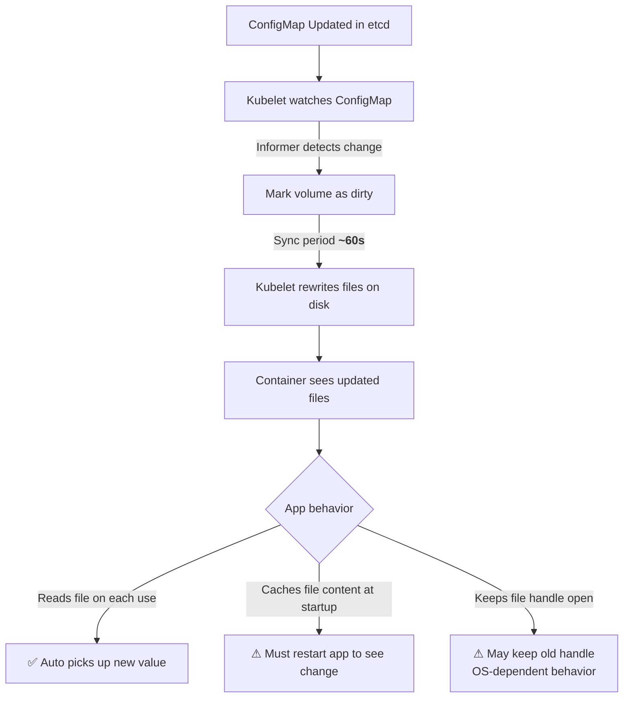

# ConfigMaps & Secrets - ConfigMap Behavior

## Overview

ConfigMaps are Kubernetes objects designed to store non-confidential configuration data in key-value pairs. They decouple configuration from container images, enabling the same image to be configured differently across environments (dev, staging, production) without rebuilding. Understanding how ConfigMaps are stored, consumed, and updated is essential for reliable Kubernetes operations.

## Data Storage Format

ConfigMaps store data in two fields:

- **`data`**: Key-value pairs where both keys and values must be strings. Values are stored as-is and can contain any text content.
- **`binaryData`**: A map where values are base64-encoded strings. Used for binary data that cannot be represented as UTF-8 strings (e.g., certificates, compiled binaries).

```yaml
apiVersion: v1
kind: ConfigMap
metadata:
  name: app-config
  namespace: production
data:
  # Simple key-value pairs
  APP_ENV: production
  LOG_LEVEL: info
  MAX_CONNECTIONS: "100"

  # Multi-line content
  nginx.conf: |
    worker_processes auto;
    events { worker_connections 1024; }
    http {
      upstream backend { server app:8080; }
      server { listen 80; location / { proxy_pass http://backend; } }
    }

  # Binary content (base64-encoded externally)
  # binaryData is not editable via kubectl edit in the same way
binaryData:
  # Key is the filename, value is base64-encoded binary
  app-icon.png: <base64-encoded-bytes>
```

**Limitations:**
- A single ConfigMap can be at most **1 MiB** in size
- Keys in `data` and `binaryData` must not overlap
- Keys must be valid DNS subdomain names (lowercase alphanumeric, `-`, `.`)

## Consumption Methods

### Method 1: Environment Variables

ConfigMap data can be injected into containers as environment variables.

#### Single Key Reference (`configMapKeyRef`)

```yaml
env:
  - name: APP_ENV
    valueFrom:
      configMapKeyRef:
        name: app-config
        key: APP_ENV
```

#### Bulk Injection (`envFrom`)

```yaml
envFrom:
  - configMapRef:
      name: app-config
```

This creates one environment variable for each key in the ConfigMap's `data` section. Keys become upper-case environment variable names (dots and dashes are replaced with underscores by some runtimes).

**⚠ Important:** `envFrom` does **not** inject `binaryData` keys — only `data` keys are available as environment variables.

### Method 2: Command-Line Arguments with Variable Substitution

Kubernetes performs environment variable substitution on the `command` and `args` fields of a container, but **only before the container process starts**. The shell does re-parse these after the container runtime sets up the environment.

```yaml
apiVersion: v1
kind: Pod
metadata:
  name: configmap-args-pod
spec:
  containers:
    - name: app
      image: myapp:latest
      command: ["/bin/sh", "-c"]
      args:
        - ./start.sh --port $(APP_PORT) --region $(APP_REGION)
      env:
        - name: APP_PORT
          valueFrom:
            configMapKeyRef:
              name: app-config
              key: APP_PORT
        - name: APP_REGION
          valueFrom:
            configMapKeyRef:
              name: app-config
              key: APP_REGION
```

**⚠ Gotcha:** The `$(VAR)` substitution happens at container startup time (by the container runtime), not at Pod creation time. If a ConfigMap key referenced in `args` is missing, the variable is replaced with an empty string — no error is raised. This can cause subtle startup failures.

### Method 3: Volume Mount (Files on Filesystem)

The most common and flexible consumption method. ConfigMap data is mounted as files in the container's filesystem.

```yaml
apiVersion: v1
kind: ConfigMap
metadata:
  name: app-config
data:
  database.properties: |
    db.host=db.example.com
    db.port=5432
  logback.xml: |
    <configuration>
      <appender name="STDOUT" class="ch.qos.logback.core.ConsoleAppender">
        <encoder><pattern>%d %level [%thread] %logger{10} - %msg%n</pattern></encoder>
      </appender>
    </configuration>
---
apiVersion: v1
kind: Pod
metadata:
  name: configmap-volume-pod
spec:
  containers:
    - name: app
      image: myapp:latest
      volumeMounts:
        - name: config-volume
          mountPath: /etc/app/config
          readOnly: true
  volumes:
    - name: config-volume
      configMap:
        name: app-config
```

**Behavior:**
- Each key in the ConfigMap `data` section becomes a file in the mount path
- The filename is the key name
- The file content is the value
- If a key ends with `.properties`, `.json`, `.xml`, etc., it retains that extension
- If you use `items` to remap keys, you can control filenames, paths, and file permissions

#### Using `items` to Control File Names and Paths

```yaml
volumes:
  - name: config-volume
    configMap:
      name: app-config
      items:
        - key: database.properties
          path: config/db.properties
          mode: 0644
        - key: logback.xml
          path: config/logback.xml
          mode: 0600
```

With `items`, only the explicitly listed keys are mounted (not all keys from the ConfigMap). This is useful for selective mounting.

### Method 4: Automatic Updates via Volume Mounts (Hot Reload)

When a ConfigMap value is updated and the ConfigMap is modified, Kubelet periodically syncs the mounted files (default sync period: ~1 minute). This means volume-mounted changes are eventually consistent but **not immediate**.

```bash
# Check when the mounted file was last modified
# Inside the container:
stat /etc/app/config/database.properties

# On the node, Kubelet syncs every sync-frequency (default ~1 minute)
```

**⚠ Critical Gotcha — `subPath` mounts do NOT auto-update:**

If you mount a ConfigMap key using `subPath`, Kubelet does not update the mounted file when the ConfigMap changes:

```yaml
volumeMounts:
  - name: config-volume
    mountPath: /etc/app/config/database.properties
    subPath: database.properties  # This will NOT update when ConfigMap changes!
```

**Workaround for subPath:** Restart the Pod to pick up changes.

## How Hot Reload Works Under the Hood



**Why this matters:** Some applications (e.g., Java with file handle caching) may retain stale content even after the file on disk is updated. The application may need to be restarted or signaled to reload its configuration.

## ConfigMap Usage Flowchart

```mermaid
flowchart TD
    A[Create ConfigMap] --> B{How consumed?}
    B -->|env| C[env vars set at container start]
    B -->|envFrom| D[All keys become env vars]
    B -->|volume| E[Files written to filesystem]
    B -->|args| F[$(VAR) subs at container start]

    C --> G{ConfigMap updated?}
    D --> G
    E --> G{F mounted via volume<br/>(not subPath)?}
    F --> G

    G -->|env vars| H[❌ No update until Pod restart]
    G -->|File volume| I[✅ Updates ~every 60s<br/>(Kubelet sync)]
    G -->|subPath| J[❌ No automatic update]
```

## Best Practices

1. **Use volume mounts for configuration that changes at runtime** — this allows the application to pick up updates without a pod restart.
2. **Use environment variables for bootstrap configuration** — values set once at startup that do not need to change.
3. **Avoid storing sensitive data in ConfigMaps** — they are not encrypted in etcd by default. Use Secrets for any data that should be protected.
4. **Keep ConfigMaps small** — stay well under the 1 MiB limit; large ConfigMaps cause performance issues with Kubelet sync.
5. **Use immutable ConfigMaps** (`immutable: true`) for configuration that never changes. Immutable ConfigMaps are cached more aggressively by Kubelet and cannot be accidentally modified:
   ```yaml
   apiVersion: v1
   kind: ConfigMap
   metadata:
     name: stable-config
   data:
     app.properties: |
       max.connections=100
   immutable: true
   ```
6. **Version ConfigMaps** with labels or annotations to track which configuration a pod is running:
   ```yaml
   metadata:
     labels:
       app-config-version: "v2.3"
   ```
7. **Use `items` for selective and permission-controlled mounting** — avoid exposing unnecessary keys to the container.

## Troubleshooting

| Symptom | Likely Cause | Resolution |
|---------|-------------|------------|
| App does not see new ConfigMap value | Using `subPath` mount or environment variable | Use full volume mount (not subPath); restart Pod |
| Pod stuck in `Pending`/`ContainerCreating` | ConfigMap references a key that does not exist | Verify key name matches exactly; check for typos |
| ConfigMap updates take >60s to appear | Kubelet sync period is longer than expected | Check `sync-frequency` in kubelet config; check node clock skew |
| File permissions too permissive | No `defaultMode` or `items.mode` set | Set `defaultMode: 0644` on the volume or `mode` in `items` |
| ConfigMap not found in another namespace | ConfigMaps are namespace-scoped | Create the ConfigMap in the same namespace as the Pod, or use the FQDN format |
| ConfigMap is larger than 1 MiB | Too much data in a single ConfigMap | Split across multiple ConfigMaps; consider alternative storage (e.g., Consul, Vault) |
| `$(VAR)` substitution fails silently | Variable not defined or ConfigMap key missing | Verify `configMapKeyRef` points to an existing key; check for typos |

### Common Pitfall: ConfigMap Name Mismatch

```bash
# This Pod will fail because the ConfigMap 'app-config' does not exist
# in the 'staging' namespace (it exists in 'production')
kubectl get pods configmap-volume-pod -n staging
# Error: configmaps "app-config" not found
```

**Fix:**
```bash
kubectl get configmap -A | grep app-config
# Create the ConfigMap in the correct namespace, or reference it correctly
```

## Community Knowledge

- **Kubelet sync frequency:** By default, Kubelet checks for ConfigMap/Secret updates every 60 seconds (configurable via `--sync-frequency`). This means there is an inherent delay between updating a ConfigMap and seeing the change in a mounted file.
- **Sealed Secrets** (bitnami-labs/sealed-secrets) encrypts ConfigMap/Secret data at rest and can be committed to git safely. The controller decrypts them on the cluster side.
- **External Secrets Operator (ESO):** Pulls secrets from external providers (AWS Secrets Manager, Azure Key Vault, HashiCorp Vault) and creates Kubernetes Secret objects automatically. This avoids the need to manually `kubectl create secret`.
- **ConfigMap and Secret caching:** Kubelet caches ConfigMaps and Secrets in memory. A `kubectl create` update may not be visible to Kubelet until the next sync cycle (within 60s).
- **Do not mount Secrets and ConfigMaps to the same mount path** — the Secret key files would overwrite ConfigMap files with the same key name, which is a common source of silent bugs.