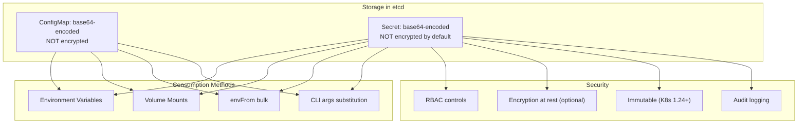
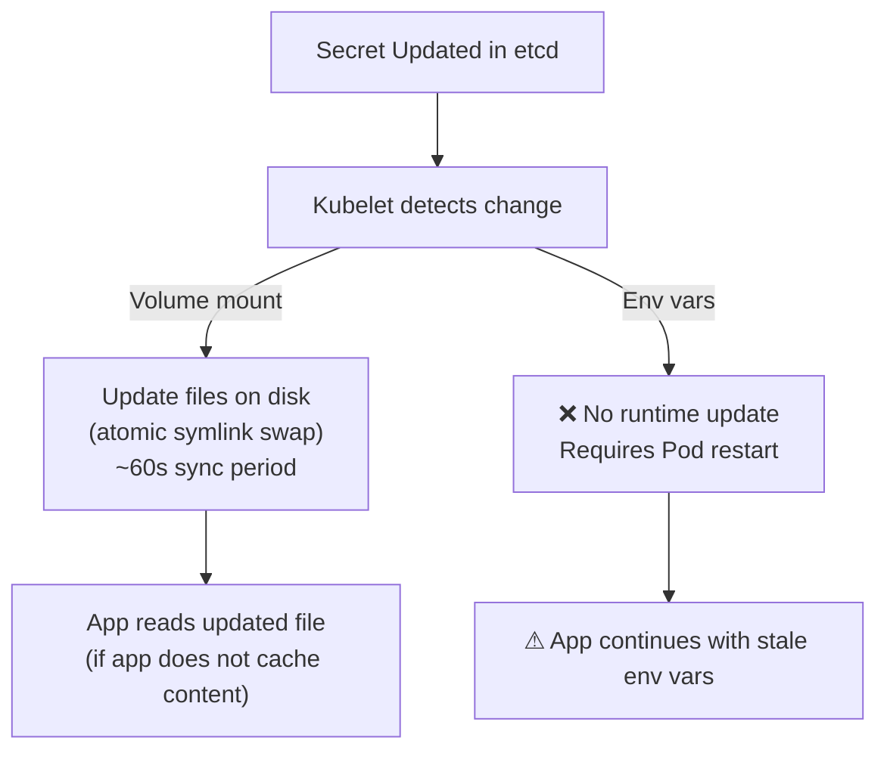

# ConfigMaps & Secrets - Secret Behavior In-Depth

## Overview

Secrets in Kubernetes are objects designed to hold sensitive data such as passwords, OAuth tokens, and SSH keys. While often described as "base64-encoded," this is a common misconception — base64 encoding is not encryption. Understanding the true behavior of Secrets, how they are stored, and how to secure them is critical for any Kubernetes administrator or developer.

## Secret Types

### Opaque (Default)

The `Opaque` type is the default and most commonly used. It stores arbitrary user-defined data as base64-encoded strings.

```yaml
apiVersion: v1
kind: Secret
metadata:
  name: app-secret
  namespace: production
type: Opaque
data:
  DATABASE_PASSWORD: UEBzc3cwcmQh
  API_KEY: YXBpLWtleS12ZXJ5LWtleQ==
  JWT_SECRET: c2VjcmV0LWp3dC1iYWNrZ3JvdW5k
```

**Creating a Secret from literal values:**
```bash
# kubectl creates the Secret, base64-encoding the values automatically
kubectl create secret generic app-secret \
  --from-literal=DATABASE_PASSWORD='P@ssw0rd!' \
  --from-literal=API_KEY='api-key-very-key' \
  -n production
```

**Creating a Secret from files:**
```bash
# Reads file contents and base64-encodes them
kubectl create secret generic tls-secret \
  --from-file=tls.crt=./server.crt \
  --from-file=tls.key=./server.key \
  -n production
```

**Creating a Secret from environment file:**
```bash
# Reads key=value pairs from a file
kubectl create secret generic env-secret \
  --from-env-file=./config.env \
  -n production
```

### kubernetes.io/service-account-token

Automatically created by the ServiceAccount controller. Contains a JWT token used for authenticating with the API server.

```bash
kubectl get secret -n default | grep serviceaccount
# You typically do not need to create these manually
```

These secrets contain three keys: `ca.crt`, `namespace`, and `token`. They are used by Pods to authenticate as the ServiceAccount they are running under.

### kubernetes.io/dockerconfigjson

Used to authenticate docker clients with container registries. This is how `ImagePullSecrets` work.

```bash
# Create from existing docker config
kubectl create secret docker-registry registry-credentials \
  --docker-server=https://index.docker.io/v1/ \
  --docker-username=myuser \
  --docker-password=mypassword \
  --docker-email=user@example.com
```

**Usage in a Pod:**
```yaml
spec:
  imagePullSecrets:
    - name: registry-credentials
  containers:
    - name: app
      image: myregistry.io/myapp:latest
```

### kubernetes.io/basic-auth

Contains username and password for HTTP Basic authentication.

```bash
kubectl create secret generic basic-auth-secret \
  --from-literal=username=admin \
  --from-literal=password='s3cur3-p4ssw0rd'
```

### kubernetes.io/ssh-auth

Contains an SSH private key for authentication with SSH servers.

```bash
kubectl create secret generic ssh-key-secret \
  --from-file=ssh-privatekey=~/.ssh/id_rsa \
  --from-file=ssh-publickey=~/.ssh/id_rsa.pub
```

### kubernetes.io/tls

Contains TLS certificate and private key for TLS termination.

```bash
kubectl create secret tls tls-secret \
  --cert=./tls.crt \
  --key=./tls.key
```

## Storage and Security Model

### How Secrets are Stored

Secrets are stored in `etcd` as base64-encoded strings. **Base64 encoding is NOT encryption.** Anyone with access to `etcd` can decode Secret values trivially:

```bash
# Get the raw Secret and decode it
kubectl get secret app-secret -o jsonpath='{.data.DATABASE_PASSWORD}' | base64 -d
# Output: P@ssw0rd!
```

### Encryption at Rest

Kubernetes supports encryption at rest for Secrets (and ConfigMaps) via the EncryptionConfiguration API resource. When enabled, `etcd` stores data in encrypted form rather than plaintext.

**Example EncryptionConfiguration:**
```yaml
apiVersion: apiserver.config.k8s.io/v1
kind: EncryptionConfiguration
resources:
  - resources:
      - secrets
    providers:
      - aescbc:
          keys:
            - name: key1
              secret: <base64-of-32-byte-key>
      - identity: {}  # Fallback: no encryption
```

**To enable encryption at rest:**
1. Edit the API server configuration (e.g., `--encryption-provider-config` flag)
2. Restart the API server
3. **Existing secrets are NOT automatically encrypted** — you must re-encrypt them:
   ```bash
   # This forces a write-back that triggers re-encryption
   kubectl get secrets --all-namespaces -o json | kubectl replace -f -
   ```

**⚠ Important:** Encryption at rest protects against someone gaining access to `etcd` data files directly (e.g., snapshot backup). It does NOT protect against someone with API server access — Kubernetes must decrypt data to serve it to authorized users.

### RBAC and Secret Access Control

Secrets are namespaced resources and follow standard RBAC controls:

```yaml
apiVersion: rbac.authorization.k8s.io/v1
kind: Role
metadata:
  name: secret-reader
  namespace: production
rules:
  - apiGroups: [""]
    resources: ["secrets"]
    verbs: ["get", "list"]
    # NOT "create", "update", or "delete"
---
apiVersion: rbac.authorization.k8s.io/v1
kind: RoleBinding
metadata:
  name: app-secret-reader
  namespace: production
roleRef:
  apiGroup: rbac.authorization.k8s.io
  kind: Role
  name: secret-reader
subjects:
  - kind: ServiceAccount
    name: app-service-account
    namespace: production
```

**Best Practice:** Never grant `watch`, `list`, or `get` on Secrets to ServiceAccounts or Roles unless absolutely necessary. Use separate ServiceAccounts for different workloads.

## Consumption Methods (Same as ConfigMaps)

Secrets can be consumed in exactly the same ways as ConfigMaps:

### As Environment Variables

```yaml
env:
  - name: DB_PASSWORD
    valueFrom:
      secretKeyRef:
        name: db-secret
        key: password
```

### As Volume Mounts

```yaml
volumes:
  - name: secret-volume
    secret:
      secretName: db-secret
volumeMounts:
  - name: secret-volume
    mountPath: /etc/secrets
    readOnly: true
```

When mounted as a volume, each key becomes a file. The file contains the **decoded** value (not base64).

### As `envFrom` (bulk injection)

```yaml
envFrom:
  - secretRef:
      name: db-secret
```

This injects all keys from the Secret's `data` (and `stringData`) as environment variables.

## Secret vs ConfigMap Comparison



## Immutable Secrets

Since Kubernetes 1.21, Secrets can be marked as immutable. Immutable Secrets cannot be modified after creation (you must delete and recreate them).

```yaml
apiVersion: v1
kind: Secret
metadata:
  name: immutable-secret
type: Opaque
immutable: true
data:
  API_KEY: YXBpLWtleS12ZXJ5LXZlcnk=
```

**Why Immutability is Valuable:**
1. **Prevents accidental overrides** — a misconfigured `kubectl apply` cannot corrupt a Secret
2. **Better performance** — immutably-marked Secrets are cached more aggressively by the API server and Kubelet
3. **Deterministic behavior** — the Secret content is guaranteed to not change, making debugging and auditing easier
4. **Required for some CSI drivers** — some CSI drivers require Secrets to be immutable for correct operation (e.g., certain secret stores)

## Secret Update Propagation

When a Secret is updated in etcd:
- **Volume mounts**: Kubelet syncs the updated content to the mounted files within the sync period (~60s). The files are updated atomically (via symlink swap on Linux).
- **Environment variables**: Do **NOT** update until the Pod is restarted. New pods will get the current value, but existing running pods continue with the old value.
- **`envFrom`**: Same behavior as explicit `env` — no runtime update.



## Best Practices for Secret Management

1. **Enable encryption at rest** for etcd — it is the minimum baseline for secret protection.
2. **Use external secret management** for production workloads:
   - **HashiCorp Vault** with the Vault Agent Sidecar or CSI provider
   - **AWS Secrets Manager / Systems Manager Parameter Store** with External Secrets Operator
   - **Azure Key Vault** with the Azure Key Vault Provider for Secrets Store CSI Driver
    - **Sealed Secrets** (bitnami-labs/sealed-secrets) for gitOps workflows — encrypts secrets client-side
3. **Never commit Secrets to version control**, even base64-encoded — they are trivially decoded.
4. **Use `stringData` for ease of use** when creating/updating Secrets — Kubernetes automatically base64-encodes the values:
   ```yaml
   apiVersion: v1
   kind: Secret
   metadata:
     name: db-secret
   stringData:
     password: P@ssw0rd!    # No need to manually base64-encode
   ```
5. **Rotate Secrets regularly** and ensure your application supports secret rotation (e.g., reconnects to the database on credential change).
6. **Use `immutable: true`** for Secrets that do not change frequently.
7. **Restrict RBAC** — do not grant `list` or `get` on Secrets to ServiceAccounts that do not need them. A compromised container with access to secrets via `envFrom` is a serious breach.
8. **Avoid `envFrom` for Secrets** when possible — environment variables can be leaked via `/proc/<pid>/environ`, crash logs, or application error reporting.
9. **Set `defaultMode` on Secret volumes** to restrict file permissions to the pod user.
10. **Use `opt-out` mountPropagation** if running on a compromised node to prevent Secret files from leaking to host-proc:
    ```yaml
    volumeMounts:
      - name: secret-volume
        mountPath: /etc/secrets
        readOnly: true
    ```

## Troubleshooting

| Symptom | Likely Cause | Resolution |
|---------|-------------|------------|
| Pod crashes with `Secret not found` | Secret name typo or wrong namespace | `kubectl get secret -n <ns>` to verify location and name |
| Secret value shows as empty or wrong | Using `subPath` with immutable Secret | Avoid subPath; use full volume mount |
| `Error from server (NotFound)` for Secret | Secret not created in namespace | Check `kubectl get secrets --all-namespaces` |
| Application cannot read Secret file | File permissions too restrictive | Set `defaultMode` on the Secret volume (e.g., `0400`) |
| Secret update not reflected | Using `env` or `subPath` mount | Switch to full volume mount (not subPath); restart Pod for env vars |
| Decoding error when using `kubectl get secret -o json` | Binary data in Secret | Use `kubectl get secret -o jsonpath` with proper path |
| Image pull fails with authentication error | ImagePullSecret not referenced or wrong registry credentials | Verify `imagePullSecrets` name matches the Secret name; check registry credentials |

### Common Pitfall: Secret Size Limits

Secrets are limited to **1 MiB** in the API object. If your secret is larger than this (e.g., a large PEM bundle or a multi-line certificate chain), you will get an error:

```bash
kubectl create secret generic big-tls-secret --from-file=tls.crt=./big.crt
# Error: ... exceeds the limit (1048576 bytes)
```

**Solutions:**
- Split the certificate chain into multiple Secrets
- Store large secrets in an external secrets manager (Vault, AWS Secrets Manager)
- Use a CSI provider that supports large secrets natively

### Common Pitfall: Secret Base64 "Obfuscation" Myth

Many developers believe base64-encoding a Secret is sufficient protection. It is not:

```bash
# This decodes any Secret value trivially
echo "UQBzc3cwcmQh" | base64 -d
# Output: P@ssw0rd!
```

Base64 is an encoding, not an encryption. Anyone with `get` permissions on Secrets (which is typically all developers with namespace access) can decode the values.

## Community Knowledge

- **External Secrets Operator (ESO)** is the de facto standard for integrating Kubernetes with external secret stores. It syncs secrets from AWS, GCP, Azure Vault, HashiCorp Vault, and others into Kubernetes Secret objects automatically.
- **Sealed Secrets** (bitnami-labs/sealed-secrets) is ideal for GitOps workflows — it encrypts secrets on the client side so only the Sealed Secrets controller on the cluster can decrypt them. Encrypted secrets can be safely committed to git.
- **SOPS (Secrets OPerationS)** by Mozilla integrates with Kubernetes and supports encrypted YAML files that can be applied directly to the cluster.
- **Vault CSI Provider** allows Pods to mount secret values directly from Vault without creating Kubernetes Secret objects at all — the secret never touches etcd.
- **Audit logging** (GA since Kubernetes 1.11) enables cluster administrators to track Secret access in audit logs, providing visibility into who accessed what secrets and when.
- **Avoid storing Kubernetes service account tokens in Secrets** for application access — use Workload Identity (GKE) or IRSA (EKS) instead, which assign short-lived tokens scoped to specific AWS/GCP permissions.