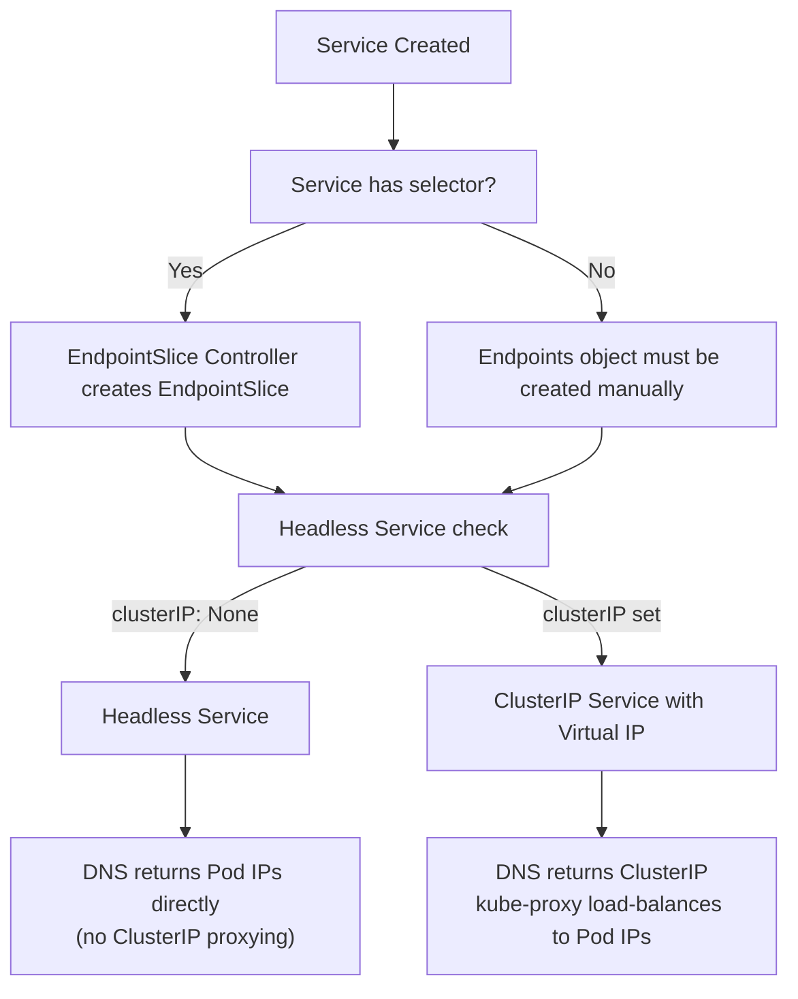
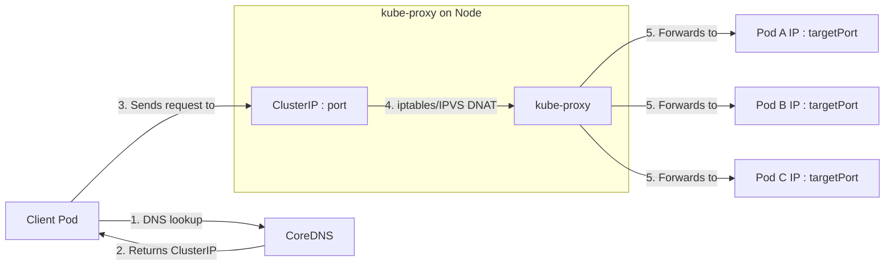

# Services - ClusterIP - Common CKAD Patterns

## Overview

ClusterIP is the default Kubernetes Service type. It exposes a set of Pods on an internal cluster IP, providing stable network identity and load balancing for internal communication. Understanding the patterns and DNS conventions that ClusterIP relies on is essential for the CKAD exam and for building reliable microservice architectures.

## DNS-Based Service Discovery

Kubernetes provides built-in DNS resolution for Services via CoreDNS. Every Service gets a DNS record that other Pods can use to reach it.

### DNS Naming Convention

```
<service-name>.<namespace>.svc.cluster.local
```

- `<service-name>`: The name of the Service
- `<namespace>`: The namespace where the Service resides
- `.svc.cluster.local`: The default Kubernetes DNS domain

### DNS Resolution Shortcuts

| Form | Example | Resolves To | Scope |
|------|---------|-------------|-------|
| **Short name** | `web-service` | `web-service.<current-namespace>.svc.cluster.local` | Same namespace only |
| **Namespace-qualified** | `web-service.api` | `web-service.api.svc.cluster.local` | Any namespace |
| **Fully qualified** | `web-service.api.svc.cluster.local` | `web-service.api.svc.cluster.local` | Any namespace |
| **Cluster-local** | `web-service.api.svc` | `web-service.api.svc.cluster.local` | Any namespace |

**CKAD Exam Tip:** If a Pod in namespace `default` needs to reach a Service in namespace `api`, it must use the namespace-qualified form `web-service.api` (or the FQDN). Using just `web-service` will attempt DNS resolution in the `default` namespace and fail.

### Example: DNS Resolution in Practice

```yaml
apiVersion: v1
kind: Service
metadata:
  name: user-service
  namespace: api
spec:
  selector:
    app: user-api
  ports:
    - name: http
      port: 80
      targetPort: 8080
  type: ClusterIP
---
apiVersion: v1
kind: Pod
metadata:
  name: frontend
  namespace: default
spec:
  containers:
    - name: app
      image: my-frontend:latest
      env:
        - name: API_URL
          value: "http://user-service.api.svc.cluster.local"
```

### Verifying DNS Resolution

```bash
# Test DNS from within a Pod
kubectl run dns-test --image=busybox:1.36 --rm -it --restart=Never -- \
  nslookup user-service.api

# Expected output:
# Server:    10.96.0.10
# Address 1: 10.96.0.10 kube-dns.kube-system.svc.cluster.local
#
# Name:      user-service.api.svc.cluster.local
# Address 1: 10.96.45.12

# Test with curl from another Pod
kubectl exec -it frontend -- curl -s http://user-service.api.svc.cluster.local/health
```

### Important Namespaces for Services

- `default`: The default namespace where untagged resources go
- `kube-system`: System components (CoreDNS, kube-proxy, etc.)
- `kube-public`: Publicly readable resources
- **Any custom namespace**: Services are namespace-scoped; DNS only works across namespace boundaries when using the FQDN or namespace-qualified form

### Multiple Ports and DNS SRV Records

When a Service exposes multiple ports with named ports, Kubernetes creates SRV (Service) DNS records:

```yaml
apiVersion: v1
kind: Service
metadata:
  name: multi-port-svc
spec:
  selector:
    app: my-app
  ports:
    - name: http
      port: 80
      targetPort: 8080
      protocol: TCP
    - name: grpc
      port: 50051
      targetPort: 50051
      protocol: TCP
```

```bash
# SRV record for the 'grpc' port
nslookup -type=SRV _grpc._tcp.multi-port-svc
# Output:
# _grpc._tcp.multi-port-svc.service.ns.svc.cluster.local
#   port 50051, target my-app-pod-xxx.default.pod.cluster.local
```

**CKAD Exam Tip:** Always name your Service ports when a Service exposes multiple ports. Named ports are required for DNS SRV records and are good practice for readability.

```yaml
# ❌ Named port not specified — ambiguous with multiple ports
ports:
  - port: 80
    targetPort: 8080
  - port: 50051
    targetPort: 50051  %comment i think names are mandatory when multiple ports are used

# ✅ Named ports — clear and DNS-friendly
ports:
  - name: http
    port: 80
    targetPort: 8080
  - name: grpc
    port: 50051
    targetPort: 50051
```

## Endpoints and EndpointSlices

A ClusterIP Service with a selector automatically creates EndpointSlices (or the legacy Endpoints object) that list the IP addresses of all matching ready Pods.

### EndpointSlice Example

```bash
kubectl get endpointslices -l kubernetes.io/service-name=user-service -o wide
# NAME              PORTS   ADDRESSES                        READY   AGE
# user-service      80/TCP  10.244.1.5,10.244.2.7,10.244.3.2  True    10m
```

### EndpointSlice vs Legacy Endpoints



### Common CKAD Patterns with Endpoints

#### Pattern 1: No Selector (Manual Endpoints)

When a Service has no selector, Kubernetes does not create EndpointSlices automatically. You must manually create an Endpoints object:

```yaml
apiVersion: v1
kind: Service
metadata:
  name: external-db
spec:
  ports:
    - port: 5432
      targetPort: 5432
---
apiVersion: v1
kind: Endpoints
metadata:
  name: external-db
subsets:
  - addresses:
      - ip: 10.0.1.50  # External database IP
    ports:
      - port: 5432
```

**Use cases:**
- Connecting to an external database outside the cluster
- Routing to a Service in another cluster via mesh
- Pointing a Service to a NodePort or LoadBalancer endpoint

#### Pattern 2: ExternalName Service (CNAME record)

```yaml
apiVersion: v1
kind: Service
metadata:
  name: external-api
spec:
  type: ExternalName
  externalName: api.example.com
```

This returns a CNAME record pointing to `api.example.com`. No ClusterIP, no Endpoints — just a DNS CNAME.

#### Pattern 3: Headless Service (Direct Pod IPs)

```yaml
apiVersion: v1
kind: Service
metadata:
  name: headless-svc
spec:
  clusterIP: None  # Headless
  selector:
    app: stateful-app
  ports:
    - port: 8080
```

A headless Service does not allocate a ClusterIP. DNS returns the individual Pod IPs directly (one A record per Pod). This is used by StatefulSets for stable network identities.

## Traffic Flow Summary Diagram



## Best Practices

1. **Always name your Service ports** when there are multiple ports — required for DNS SRV records and CKAD exam clarity.
2. **Use FQDN for cross-namespace calls** (`service.namespace.svc.cluster.local`) — short names only work within the same namespace.
%comment with final dot i think, explain the 5dots linux serch
Why should i use FQSN when servicename.namespace is always enough
While servicename.namespace (or even just a short name within the same namespace) is usually enough for day-to-day functionality, using the full Fully Qualified Service Name (FQSN/FQDN) like servicename.namespace.svc.cluster.local offers critical advantages in performance, security, and strict environment management:
1. Performance and DNS Optimization (ndots)
Inside a Kubernetes pod, the /etc/resolv.conf file is configured with a search path and an ndots setting (typically ndots:5).
 * When you use a short name or servicename.namespace, the Linux DNS resolver doesn't immediately know it's an absolute address.
 * It sequentially appends every search domain in the pod's list (e.g., trying servicename.namespace.svc.cluster.local, then servicename.namespace.svc., then cluster domains) until it gets a hit.
 * This results in multiple hidden DNS lookups (traffic overhead) for every single request. Using a true FQSN with a trailing dot (servicename.namespace.svc.cluster.local.) tells the resolver it's an absolute path, cutting straight to 1 single DNS query. At scale, this drastically reduces CoreDNS latency and load.
2. Preventing Multi-Cluster and Ambiguity Bugs
If you ever implement multi-cluster architectures (like Kubernetes federation, Cluster API, or hybrid setups with customized CoreDNS forwarders), short names can resolve unpredictably depending on which cluster context or fallback resolver handles the request. An FQSN explicitly locks the target to a specific cluster and namespace layout.
3. Strict Security and Preventing Namespace Hijacking
In large organizations sharing a cluster, relying on short names or loose naming conventions can occasionally lead to unexpected collision risks if search paths are misconfigured. An explicit FQSN ensures that code explicitly declares where a dependency lives, making security audits and network policies much easier to reason about.
4. Code Portability and Config Maps
When writing configuration files or environment variables for applications that might need to talk to services across different environments (or even external mock services mapped via ExternalName), enforcing a strict FQDN standard means your configuration parser treats internal and external dependencies uniformly.

Why would it search first svcname.ns.svc. if svcname.ns is unique and svc.cluster.local. is a constant suffix?
When you type a short name or a name like servicename.namespace, it contains only 1 dot.
Under standard Linux DNS resolver (glibc) configuration in Kubernetes, the ndots:5 setting dictates how lookups are handled:
 * The Relative Name Check: Because your query has fewer dots than the ndots threshold (1 is less than 5), the Linux resolver treats the name as relative, not absolute.
 * Appending the Search Path: Instead of querying servicename.namespace directly, the resolver takes your text and sequentially appends every domain in the pod's search list:
   * Attempt 1: servicename.namespace.current-namespace.svc.cluster.local (Results in NXDOMAIN)
   * Attempt 2: servicename.namespace.svc.cluster.local (Results in a match)
   * Attempt 3: servicename.namespace.cluster.local (If needed)
Even though servicename.namespace feels unique and intuitive to you, the underlying operating system resolver does not inherently know that ns is a Kubernetes namespace—it just sees a string with one dot and blindly follows the search path rules.
Using an absolute FQSN with a trailing dot (servicename.namespace.svc.cluster.local.) bypasses the search path entirely, forcing the resolver to make 1 direct query.

Difference between 
​Attempt 2: servicename.namespace.svc.cluster.local (Results in a match)
​Attempt 3: servicename.namespace.cluster.local (If needed)

The difference between Attempt 2 and Attempt 3 comes down to the exact structure of the pod's DNS search path (search list) and how the Linux resolver steps through it.
Here is what the standard search path looks like inside a Kubernetes Pod's /etc/resolv.conf:
search <current-namespace>.svc.cluster.local svc.cluster.local cluster.local

When you query servicename.namespace (which has 1 dot and triggers ndots:5), the resolver appends each item from that search list one by one:
1. Attempt 2: servicename.namespace.svc.cluster.local
 * What it represents: This is formed by taking your query (servicename.namespace) and appending the second item in the search list (svc.cluster.local).
 * Why it matters: This matches the standard format of a Service inside a different namespace. If you are in namespace alpha and you look up my-service.beta, Attempt 2 tests my-service.beta.svc.cluster.local, which correctly resolves to the service in namespace beta.
2. Attempt 3: servicename.namespace.cluster.local
 * What it represents: This is formed by appending the third item in the search list (cluster.local).
 * Why it matters: This is a fallback search domain for the cluster base. For most standard Kubernetes deployments, this attempt will fail (NXDOMAIN) because cluster.local alone isn't a valid namespace-level routing pattern for a service, but the Linux resolver runs through it anyway because it is in the search block.
Summary
 * Attempt 2 checks if you meant a service inside another namespace (.svc.cluster.local).
 * Attempt 3 checks against the root cluster domain (.cluster.local).


4. **Use `clusterIP: None` intentionally** — headless Services are for StatefulSets or custom service discovery, not for regular load balancing.
5. **Use ExternalName for external services** — avoid creating manual Endpoints when a simple CNAME will do.
6. **Verify Endpoints after creating a Service:**
   ```bash
   kubectl get endpoints <service-name>
   # If empty, the selector does not match any ready Pods
   ```
7. **Use `sessionAffinity: ClientIP`** only when needed (e.g., stateful protocols that require sticky connections). It adds overhead and does not survive Pod restarts. %comment this is never explained before, add it to yaml structure
8. **Do not use ClusterIP Services for external traffic** — use NodePort, LoadBalancer, or Ingress instead. ClusterIP is only reachable from within the cluster.

## Common CKAD Exam Mistakes

| Mistake | Why It Fails | Correct Approach |
|---------|-------------|------------------|
| Using short DNS name for cross-namespace calls | DNS search suffix does not include the other namespace | Use FQDN or `service.other-namespace` |
| Forgetting to name ports in multi-port Service | DNS SRV records not created; confusing `kubectl describe svc` output | Always add `name` to multi-port Services |
| Assuming ClusterIP is reachable externally | ClusterIP is a virtual IP only routable inside the cluster | Use NodePort, LoadBalancer, or Ingress for external access |
| Creating a Service without Endpoints for a non-selector Service | No EndpointSlice created → connection refused | Manually create `Endpoints` object for non-selector Services |
| Using headless Service expecting load balancing | DNS returns all Pod IPs; client must load-balance itself | Use ClusterIP Services for automatic load balancing |

## Troubleshooting

| Symptom | Diagnosis | Fix |
|---------|-----------|-----|
| DNS resolution fails for Service | Service does not exist or is in a different namespace | `kubectl get svc` in the correct namespace; use FQDN |
| DNS resolves but connection refused | Endpoints are empty (selector mismatch, no ready Pods) | `kubectl get endpoints <svc-name>`; check Pod labels vs Service selector |
| DNS resolves to correct ClusterIP but timeout | NetworkPolicy blocking or kube-proxy not functioning | Check NetworkPolicy rules; verify kube-proxy is running |
| `kubectl describe svc` shows empty Endpoints | Service selector does not match any Pods | Verify label selectors match Pod labels |
| Connection works from same node but not remote nodes | CNI or network policy issue | Check CNI plugin status; audit NetworkPolicy |
